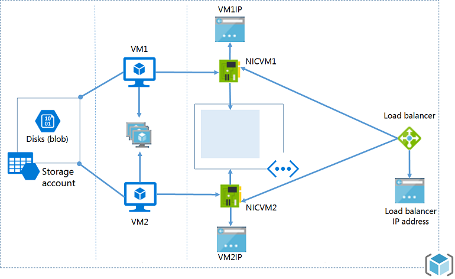

<properties
   pageTitle="Create a complete Linux environment using the Azure CLI | Microsoft Azure"
   description="Create storage, a Linux VM, a virtual network and subnet, a load balancer, an NIC, a public IP, and a network security group, all from the ground up by using the Azure CLI."
   services="virtual-machines-linux"
   documentationCenter="virtual-machines"
   authors="iainfoulds"
   manager="timlt"
   editor=""
   tags="azure-resource-manager"/>

<tags
   ms.service="virtual-machines-linux"
   ms.devlang="na"
   ms.topic="article"
   ms.tgt_pltfrm="vm-linux"
   ms.workload="infrastructure"
   ms.date="06/10/2016"
   ms.author="iainfou"/>

# Create a complete Linux environment by using the Azure CLI

In this article, we'll build a simple network with a load balancer and a pair of VMs that are useful for development and simple computing. We'll walk through the process command by command, until you have two working, secure Linux VMs to which you can connect from anywhere on the Internet. Then you can move on to more complex networks and environments.

Along the way, you'll learn about the dependency hierarchy that the Resource Manager deployment model gives you, and about how much power it provides. After you see how the system is built, you can rebuild it much more quickly by using [Azure Resource Manager templates](../resource-group-authoring-templates.md). Also, after you learn how the parts of your environment fit together, creating templates to automate them becomes easier.

The environment contains:

- Two VMs inside an availability set.
- A load balancer with a load-balancing rule on port 80.
- Network security group (NSG) rules to protect your VM from unwanted traffic.



To create this custom environment, you need the latest [Azure CLI](../xplat-cli-install.md) in Resource Manager mode (`azure config mode arm`). You also need a JSON parsing tool. This example uses [jq](https://stedolan.github.io/jq/).

## Quick commands
You can use the following quick commands to build out your custom environment. For more information about what each command is doing as you build out the environment, read the [detailed walkthrough steps below](#detailed-walkthrough).

Create the resource group:

```bash
azure group create TestRG -l westeurope
```

Verify the resource group by using the JSON parser:

```bash
azure group show TestRG --json | jq '.'
```

Create the storage account:

```bash
azure storage account create -g TestRG -l westeurope --kind Storage --sku-name GRS computeteststore
```

Verify the storage account by using the JSON parser:

```bash
azure storage account show -g TestRG computeteststore --json | jq '.'
```

Create the virtual network:

```bash
azure network vnet create -g TestRG -n TestVNet -a 192.168.0.0/16 -l westeurope
```

Create the subnet:

```bash
azure network vnet subnet create -g TestRG -e TestVNet -n FrontEnd -a 192.168.1.0/24
```

Verify the virtual network and subnet by using the JSON parser:


```bash
azure network vnet show TestRG TestVNet --json | jq '.'
```

Create a public IP:

```bash
azure network public-ip create -g TestRG -n TestLBPIP -l westeurope -d testlb -a static -i 4
```

Create the load balancer:

```bash
azure network lb create -g TestRG -n TestLB -l westeurope
```

Create a front-end IP pool for the load balancer, and associate the public IP:

```bash
azure network lb frontend-ip create -g TestRG -l TestLB -n TestFrontEndPool -i TestLBPIP
```

Create the back-end IP pool for the load balancer:

```bash
azure network lb address-pool create -g TestRG -l TestLB -n TestBackEndPool
```

Create SSH inbound NAT rules for the load balancer:

```bash
azure network lb inbound-nat-rule create -g TestRG -l TestLB -n VM1-SSH -p tcp -f 4222 -b 22
azure network lb inbound-nat-rule create -g TestRG -l TestLB -n VM2-SSH -p tcp -f 4223 -b 22
```

Create the web inbound NAT rules for the load balancer:

```bash
azure network lb rule create -g TestRG -l TestLB -n WebRule -p tcp -f 80 -b 80 \
     -t TestFrontEndPool -o TestBackEndPool
```

Create the load balancer health probe:

```bash
azure network lb probe create -g TestRG -l TestLB -n HealthProbe -p "http" -f healthprobe.aspx -i 15 -c 4
```

Verify the load balancer, IP pools, and NAT rules by using the JSON parser:

```bash
azure network lb show -g TestRG -n TestLB --json | jq '.'
```

Create the first network interface card (NIC):

```bash
azure network nic create -g TestRG -n LB-NIC1 -l westeurope --subnet-vnet-name TestVNet --subnet-name FrontEnd \
    -d "/subscriptions/########-####-####-####-############/resourceGroups/TestRG/providers/Microsoft.Network/loadBalancers/TestLB/backendAddressPools/TestBackEndPool" \
    -e "/subscriptions/########-####-####-####-############/resourceGroups/TestRG/providers/Microsoft.Network/loadBalancers/TestLB/inboundNatRules/VM1-SSH"
```

Create the second NIC:

```bash
azure network nic create -g TestRG -n LB-NIC2 -l westeurope --subnet-vnet-name TestVNet --subnet-name FrontEnd \
    -d "/subscriptions/########-####-####-####-############/resourceGroups/TestRG/providers/Microsoft.Network/loadBalancers/TestLB/backendAddressPools/TestBackEndPool" \
    -e "/subscriptions/########-####-####-####-############/resourceGroups/TestRG/providers/Microsoft.Network/loadBalancers/TestLB/inboundNatRules/VM2-SSH"
```

Verify the NICs by using the JSON parser:

```bash
azure network nic show TestRG LB-NIC1 --json | jq '.'
azure network nic show TestRG LB-NIC2 --json | jq '.'
```

Create the NSG:

```bash
azure network nsg create -g TestRG -n TestNSG -l westeurope
```

Add the inbound rules for the NSG:

```bash
azure network nsg rule create --protocol tcp --direction inbound --priority 1000 \
    --destination-port-range 22 --access allow -g TestRG -a TestNSG -n SSHRule
azure network nsg rule create --protocol tcp --direction inbound --priority 1001 \
    --destination-port-range 80 --access allow -g TestRG -a TestNSG -n HTTPRule
```

Verify the NSG and inbound rules by using the JSON parser:

```bash
azure network nsg show -g TestRG -n TestNSG --json | jq '.'
```

Bind the NSG to the NICs:

```bash
azure network nic set -g TestRG -n LB-NIC1 -o TestNSG
azure network nic set -g TestRG -n LB-NIC2 -o TestNSG
```

Create the availability set:

```bash
azure availset create -g TestRG -n TestAvailSet -l westeurope
```

Create the first Linux VM:

```bash
azure vm create \
    --resource-group TestRG \
    --name TestVM1 \
    --location westeurope \
    --os-type linux \
    --availset-name TestAvailSet \
    --nic-name LB-NIC1 \
    --vnet-name TestVnet \
    --vnet-subnet-name FrontEnd \
    --storage-account-name computeteststore \
    --image-urn canonical:UbuntuServer:14.04.4-LTS:latest \
    --ssh-publickey-file ~/.ssh/id_rsa.pub \
    --admin-username ops
```

Create the second Linux VM:

```bash
azure vm create \
    --resource-group TestRG \
    --name TestVM2 \
    --location westeurope \
    --os-type linux \
    --availset-name TestAvailSet \
    --nic-name LB-NIC2 \
    --vnet-name TestVnet \
    --vnet-subnet-name FrontEnd \
    --storage-account-name computeteststore \
    --image-urn canonical:UbuntuServer:14.04.4-LTS:latest \
    --ssh-publickey-file ~/.ssh/id_rsa.pub \
    --admin-username ops
```

Use the JSON parser to verify that everything that was built:

```bash
azure vm show -g TestRG -n TestVM1 --json | jq '.'
azure vm show -g TestRG -n TestVM2 --json | jq '.'
```

Export the environment that you built to a template to quickly re-create new instances:

```bash
azure resource export TestRG
```

## Detailed walkthrough
The detailed steps that follow explain what each command is doing as you build out your environment. These concepts will help you when you build your own custom environments for development or production.

## Create resource groups and choose deployment locations

Azure resource groups are logical deployment entities that contain configuration information and metadata to enable the logical management of resource deployments.

```bash
azure group create TestRG westeurope
```

Output:

```bash                        
info:    Executing command group create
+ Getting resource group TestRG
+ Creating resource group TestRG
info:    Created resource group TestRG
data:    Id:                  /subscriptions/<yoursub>/resourceGroups/TestRG
data:    Name:                TestRG
data:    Location:            westeurope
data:    Provisioning State:  Succeeded
data:    Tags: null
data:
info:    group create command OK
```

## Create a storage account

You need storage accounts for your VM disks and for any additional data disks that you want to add. You create storage accounts almost immediately after you create resource groups.

Here we use the `azure storage account create` command, passing the location of the account, the resource group that controls it, and the type of storage support you want.

```bash
azure storage account create \  
--location westeurope \
--resource-group TestRG \
--kind Storage --sku-name GRS \
computeteststore
```

Output:

```bash
info:    Executing command storage account create
+ Creating storage account
info:    storage account create command OK
ahmet•~/workspace/keygen» azure group show testrg
info:    Executing command group show
+ Listing resource groups
+ Listing resources for the group
data:    Id:                  /subscriptions/<guid>/resourceGroups/TestRG
data:    Name:                TestRG
data:    Location:            westeurope
data:    Provisioning State:  Succeeded
data:    Tags: null
data:    Resources:
data:
data:      Id      : /subscriptions/<guid>/resourceGroups/TestRG/providers/Microsoft.Storage/storageAccounts/computeteststore
data:      Name    : computeteststore
data:      Type    : storageAccounts
data:      Location: westeurope
data:      Tags    :
data:
data:    Permissions:
data:      Actions: *
data:      NotActions:
data:
info:    group show command OK
```

Let's use the [jq](https://stedolan.github.io/jq/) tool along with the `--json` Azure CLI option to examine our resource group by using the `azure group show` command. (You can use **jsawk** or any language library you prefer to parse the JSON.)

```bash
azure group show TestRG --json | jq                                                                                      
```


Output:

```bash
{
  "tags": {},
  "id": "/subscriptions/<guid>/resourceGroups/TestRG",
  "name": "TestRG",
  "provisioningState": "Succeeded",
  "location": "westeurope",
  "properties": {
    "provisioningState": "Succeeded"
  },
  "resources": [
    {
      "id": "/subscriptions/<guid>/resourceGroups/TestRG/providers/Microsoft.Storage/storageAccounts/computeteststore",
      "name": "computeteststore",
      "type": "storageAccounts",
      "location": "westeurope",
      "tags": null
    }
  ],
  "permissions": [
    {
      "actions": [
        "*"
      ],
      "notActions": []
    }
  ]
}
```

To investigate the storage account by using the CLI, you first need to set the account names and keys by using a variation of the following command. Replace the name of the storage account in the following example with a name that you choose:

```
AZURE_STORAGE_CONNECTION_STRING="$(azure storage account connectionstring show computeteststore --resource-group testrg --json | jq -r '.string')"
```

Then you can view your storage information easily:

```bash
azure storage container list
```

Output:

```bash
info:    Executing command storage container list
+ Getting storage containers
data:    Name  Public-Access  Last-Modified
data:    ----  -------------  -----------------------------
data:    vhds  Off            Sun, 27 Sep 2015 19:03:54 GMT
info:    storage container list command OK
```

## Create a virtual network and subnet

Next you're going to need to create a virtual network running in Azure and a subnet in which you can install your VMs.

```bash
azure network vnet create -g TestRG -n TestVNet -a 192.168.0.0/16 -l westeurope
```

Output:

```bash
info:    Executing command network vnet create
+ Looking up virtual network "TestVNet"
+ Creating virtual network "TestVNet"
+ Loading virtual network state
data:    Id                              : /subscriptions/<guid>/resourceGroups/TestRG/providers/Microsoft.Network/virtualNetworks/TestVNet
data:    Name                            : TestVNet
data:    Type                            : Microsoft.Network/virtualNetworks
data:    Location                        : westeurope
data:    ProvisioningState               : Succeeded
data:    Address prefixes:
data:      192.168.0.0/16
info:    network vnet create command OK
```

Again, let's use the --json option of `azure group show` and **jq** to see how we're building our resources. We now have a `storageAccounts` resource and a `virtualNetworks` resource.  

```bash
azure group show TestRG --json | jq '.'
```

Output:

```bash
{
  "tags": {},
  "id": "/subscriptions/<guid>/resourceGroups/TestRG",
  "name": "TestRG",
  "provisioningState": "Succeeded",
  "location": "westeurope",
  "properties": {
    "provisioningState": "Succeeded"
  },
  "resources": [
    {
      "id": "/subscriptions/<guid>/resourceGroups/TestRG/providers/Microsoft.Network/virtualNetworks/TestVNet",
      "name": "TestVNet",
      "type": "virtualNetworks",
      "location": "westeurope",
      "tags": null
    },
    {
      "id": "/subscriptions/<guid>/resourceGroups/TestRG/providers/Microsoft.Storage/storageAccounts/computeteststore",
      "name": "computeteststore",
      "type": "storageAccounts",
      "location": "westeurope",
      "tags": null
    }
  ],
  "permissions": [
    {
      "actions": [
        "*"
      ],
      "notActions": []
    }
  ]
}
```

Now let's create a subnet in the `TestVnet` virtual network into which the VMs will be deployed. We'll use the `azure network vnet subnet create` command, along with the resources we've already created: the `TestRG` resource group and the `TestVNet` virtual network. We'll add the subnet name `FrontEnd` and the subnet address prefix `192.168.1.0/24`, as follows:

```bash
azure network vnet subnet create -g TestRG -e TestVNet -n FrontEnd -a 192.168.1.0/24
```

Output:

```bash
info:    Executing command network vnet subnet create
+ Looking up the subnet "FrontEnd"
+ Creating subnet "FrontEnd"
+ Looking up the subnet "FrontEnd"
data:    Id                              : /subscriptions/<guid>/resourceGroups/TestRG/providers/Microsoft.Network/virtualNetworks/TestVNet/subnets/FrontEnd
data:    Type                            : Microsoft.Network/virtualNetworks/subnets
data:    ProvisioningState               : Succeeded
data:    Name                            : FrontEnd
data:    Address prefix                  : 192.168.1.0/24
data:
info:    network vnet subnet create command OK
```

Because the subnet is logically inside the virtual network, we'll look for the subnet information with a slightly different command. The command we'll use is `azure network vnet show`, but we'll continue to examine the JSON output by using **jq**.

```bash
azure network vnet show TestRG TestVNet --json | jq '.'
```

Output:

```bash
{
  "subnets": [
    {
      "ipConfigurations": [],
      "addressPrefix": "192.168.1.0/24",
      "provisioningState": "Succeeded",
      "name": "FrontEnd",
      "etag": "W/\"974f3e2c-028e-4b35-832b-a4b16ad25eb6\"",
      "id": "/subscriptions/<guid>/resourceGroups/TestRG/providers/Microsoft.Network/virtualNetworks/TestVNet/subnets/FrontEnd"
    }
  ],
  "tags": {},
  "addressSpace": {
    "addressPrefixes": [
      "192.168.0.0/16"
    ]
  },
  "dhcpOptions": {
    "dnsServers": []
  },
  "provisioningState": "Succeeded",
  "etag": "W/\"974f3e2c-028e-4b35-832b-a4b16ad25eb6\"",
  "id": "/subscriptions/<guid>/resourceGroups/TestRG/providers/Microsoft.Network/virtualNetworks/TestVNet",
  "name": "TestVNet",
  "location": "westeurope"
}
```

## Create a public IP address (PIP)

Now let's create the public IP address (PIP) that we'll assign to your load balancer. It enables you to connect to your VMs from the Internet by using the `azure network public-ip create` command. Because the default address is dynamic, we'll create a named DNS entry in the **cloudapp.azure.com** domain by using the `-d testsubdomain` option.

```bash
azure network public-ip create -d testsubdomain TestRG TestPIP westeurope
```

Output:

```bash
info:    Executing command network public-ip create
+ Looking up the public ip "TestPIP"
+ Creating public ip address "TestPIP"
+ Looking up the public ip "TestPIP"
data:    Id                              : /subscriptions/guid/resourceGroups/TestRG/providers/Microsoft.Network/publicIPAddresses/TestPIP
data:    Name                            : TestPIP
data:    Type                            : Microsoft.Network/publicIPAddresses
data:    Location                        : westeurope
data:    Provisioning state              : Succeeded
data:    Allocation method               : Dynamic
data:    Idle timeout                    : 4
data:    Domain name label               : testsubdomain
data:    FQDN                            : testsubdomain.westeurope.cloudapp.azure.com
info:    network public-ip create command OK
```

This is also a top-level resource, so you can see it with `azure group show`.

```bash
azure group show TestRG --json | jq '.'
```

Output:

```bash
{
"tags": {},
"id": "/subscriptions/guid/resourceGroups/TestRG",
"name": "TestRG",
"provisioningState": "Succeeded",
"location": "westeurope",
"properties": {
    "provisioningState": "Succeeded"
},
"resources": [
    {
    "id": "/subscriptions/guid/resourceGroups/TestRG/providers/Microsoft.Network/networkInterfaces/TestNIC",
    "name": "TestNIC",
    "type": "networkInterfaces",
    "location": "westeurope",
    "tags": null
    },
    {
    "id": "/subscriptions/guid/resourceGroups/testrg/providers/Microsoft.Network/publicIPAddresses/testpip",
    "name": "testpip",
    "type": "publicIPAddresses",
    "location": "westeurope",
    "tags": null
    },
    {
    "id": "/subscriptions/guid/resourceGroups/TestRG/providers/Microsoft.Network/virtualNetworks/TestVNet",
    "name": "TestVNet",
    "type": "virtualNetworks",
    "location": "westeurope",
    "tags": null
    },
    {
    "id": "/subscriptions/guid/resourceGroups/TestRG/providers/Microsoft.Storage/storageAccounts/computeteststore",
    "name": "computeteststore",
    "type": "storageAccounts",
    "location": "westeurope",
    "tags": null
    }
],
"permissions": [
    {
    "actions": [
        "*"
    ],
    "notActions": []
    }
]
}
```

You can investigate more resource details, including the fully qualified domain name (FQDN) of the subdomain, by using the more complete `azure network public-ip show` command. Note that the public IP address resource has been allocated logically, but a specific address has not yet been assigned. For that, you're going to need a load balancer, which we have not yet created.

```bash
azure network public-ip show TestRG TestPIP --json | jq '.'
```

Output:

```bash
{
"tags": {},
"publicIpAllocationMethod": "Dynamic",
"dnsSettings": {
    "domainNameLabel": "testsubdomain",
    "fqdn": "testsubdomain.westeurope.cloudapp.azure.com"
},
"idleTimeoutInMinutes": 4,
"provisioningState": "Succeeded",
"etag": "W/\"c63154b3-1130-49b9-a887-877d74d5ebc5\"",
"id": "/subscriptions/guid/resourceGroups/testrg/providers/Microsoft.Network/publicIPAddresses/testpip",
"name": "testpip",
"location": "westeurope"
}
```

## Create a load balancer and IP pools
When you create a load balancer, it enables you to distribute traffic across multiple VMs. You can do this when running web applications, for example. It also provides redundancy to your application by running multiple VMs that respond to user requests in the event of maintenance or heavy loads.

We create our load balancer with:

```bash
azure network lb create -g TestRG -n TestLB -l westeurope
```

```bash
azure network lb create -g TestRG -n TestLB -l westeurope
```

Output:

```bash
info:    Executing command network lb create
+ Looking up the load balancer "TestLB"
+ Creating load balancer "TestLB"
data:    Id                              : /subscriptions/guid/resourceGroups/TestRG/providers/Microsoft.Network/loadBalancers/TestLB
data:    Name                            : TestLB
data:    Type                            : Microsoft.Network/loadBalancers
data:    Location                        : westeurope
data:    Provisioning state              : Succeeded
info:    network lb create command OK
```
Our load balancer is fairly empty, so let's create some IP pools. We want to create two IP pools for our load balancer--one for the front end and one for the back end. The front-end IP pool will be publicly visible. It's also the location to which we'll assign the PIP that we created earlier. Then we'll use the back-end pool as a location for our VMs to connect to. That way, the traffic can flow through the load balancer to the VMs.

First, let's create our front-end IP pool:

```bash
azure network lb frontend-ip create -g TestRG -l TestLB -n TestFrontEndPool -i TestLBPIP
```

Output:

```bash
info:    Executing command network lb frontend-ip create
+ Looking up the load balancer "TestLB"
+ Looking up the public ip "TestLBPIP"
+ Updating load balancer "TestLB"
data:    Name                            : TestFrontEndPool
data:    Provisioning state              : Succeeded
data:    Private IP allocation method    : Dynamic
data:    Public IP address id            : /subscriptions/guid/resourceGroups/TestRG/providers/Microsoft.Network/publicIPAddresses/TestLBPIP
info:    network lb frontend-ip create command OK
```

Note how we used the `--public-ip-name` switch to pass in the TestLBPIP that we created earlier. This assigns the public IP address to the load balancer so we can reach our VMs across the Internet.

Next, let's create our second IP pool, this time for our back-end traffic:

```bash
azure network lb address-pool create -g TestRG -l TestLB -n TestBackEndPool
```

Output:

```bash
info:    Executing command network lb address-pool create
+ Looking up the load balancer "TestLB"
+ Updating load balancer "TestLB"
data:    Name                            : TestBackEndPool
data:    Provisioning state              : Succeeded
info:    network lb address-pool create command OK
```

We can see how our load balancer is doing by looking with `azure network lb show` and examining the JSON output:

```bash
azure network lb show TestRG TestLB --json | jq '.'
```

Output:

```bash
{
  "etag": "W/\"29c38649-77d6-43ff-ab8f-977536b0047c\"",
  "provisioningState": "Succeeded",
  "resourceGuid": "f1446acb-09ba-44d9-b8b6-849d9983dc09",
  "outboundNatRules": [],
  "inboundNatPools": [],
  "inboundNatRules": [],
  "id": "/subscriptions/guid/resourceGroups/TestRG/providers/Microsoft.Network/loadBalancers/TestLB",
  "name": "TestLB",
  "type": "Microsoft.Network/loadBalancers",
  "location": "westeurope",
  "frontendIPConfigurations": [
    {
      "etag": "W/\"29c38649-77d6-43ff-ab8f-977536b0047c\"",
      "name": "TestFrontEndPool",
      "provisioningState": "Succeeded",
      "publicIPAddress": {
        "id": "/subscriptions/guid/resourceGroups/TestRG/providers/Microsoft.Network/publicIPAddresses/TestLBPIP"
      },
      "privateIPAllocationMethod": "Dynamic",
      "id": "/subscriptions/guid/resourceGroups/TestRG/providers/Microsoft.Network/loadBalancers/TestLB/frontendIPConfigurations/TestFrontEndPool"
    }
  ],
  "backendAddressPools": [
    {
      "etag": "W/\"29c38649-77d6-43ff-ab8f-977536b0047c\"",
      "name": "TestBackEndPool",
      "provisioningState": "Succeeded",
      "id": "/subscriptions/guid/resourceGroups/TestRG/providers/Microsoft.Network/loadBalancers/TestLB/backendAddressPools/TestBackEndPool"
    }
  ],
  "loadBalancingRules": [],
  "probes": []
}
```

## Create load balancer NAT rules
To get traffic flowing through our load balancer, we need to create NAT rules that specify either inbound or outbound actions. You can specify the protocol to use, then map external ports to internal ports as desired. For our environment, let's create some rules that allow SSH through our load balancer to our VMs. We'll set up TCP ports 4222 and 4223 to direct to TCP port 22 on our VMs (which we'll create later):

```bash
azure network lb inbound-nat-rule create -g TestRG -l TestLB -n VM1-SSH -p tcp -f 4222 -b 22
```

Output:

```bash
info:    Executing command network lb inbound-nat-rule create
+ Looking up the load balancer "TestLB"
warn:    Using default enable floating ip: false
warn:    Using default idle timeout: 4
warn:    Using default frontend IP configuration "TestFrontEndPool"
+ Updating load balancer "TestLB"
data:    Name                            : VM1-SSH
data:    Provisioning state              : Succeeded
data:    Protocol                        : Tcp
data:    Frontend port                   : 4222
data:    Backend port                    : 22
data:    Enable floating IP              : false
data:    Idle timeout in minutes         : 4
data:    Frontend IP configuration id    : /subscriptions/guid/resourceGroups/TestRG/providers/Microsoft.Network/loadBalancers/TestLB/frontendIPConfigurations/TestFrontEndPool
info:    network lb inbound-nat-rule create command OK
```

Repeat the procedure for your second NAT rule for SSH:

```bash
azure network lb inbound-nat-rule create -g TestRG -l TestLB -n VM2-SSH -p tcp -f 4223 -b 22
```

Let's also go ahead and create a NAT rule for TCP port 80, hooking the rule up to our IP pools. If we do this, instead of hooking up the rule to our VMs individually, we can simply add or remove VMs from the IP pool. Then the load balancer automatically adjusts the flow of traffic:

```bash
azure network lb rule create -g TestRG -l TestLB -n WebRule -p tcp -f 80 -b 80 \
     -t TestFrontEndPool -o TestBackEndPool
```

Output:

```bash
info:    Executing command network lb rule create
+ Looking up the load balancer "TestLB"
warn:    Using default idle timeout: 4
warn:    Using default enable floating ip: false
warn:    Using default load distribution: Default
+ Updating load balancer "TestLB"
data:    Name                            : WebRule
data:    Provisioning state              : Succeeded
data:    Protocol                        : Tcp
data:    Frontend port                   : 80
data:    Backend port                    : 80
data:    Enable floating IP              : false
data:    Load distribution               : Default
data:    Idle timeout in minutes         : 4
data:    Frontend IP configuration id    : /subscriptions/guid/resourceGroups/TestRG/providers/Microsoft.Network/loadBalancers/TestLB/frontendIPConfigurations/TestFrontEndPool
data:    Backend address pool id         : /subscriptions/guid/resourceGroups/TestRG/providers/Microsoft.Network/loadBalancers/TestLB/backendAddressPools/TestBackEndPool
info:    network lb rule create command OK
```

## Create a load balancer health probe

A health probe periodically checks on the VMs that are behind our load balancer to make sure they're operating and responding to requests as defined. If not, they're removed from operation to ensure that users aren't being directed to them. You can define custom checks for the health probe, along with intervals and timeout values. For more information about health probes, see [Load Balancer probes](../load-balancer/load-balancer-custom-probe-overview.md).

```bash
azure network lb probe create -g TestRG -l TestLB -n HealthProbe -p "http" -f healthprobe.aspx -i 15 -c 4
```

Output:

```bash
info:    Executing command network lb probe create
warn:    Using default probe port: 80
+ Looking up the load balancer "TestLB"
+ Updating load balancer "TestLB"
data:    Name                            : HealthProbe
data:    Provisioning state              : Succeeded
data:    Protocol                        : Http
data:    Port                            : 80
data:    Interval in seconds             : 15
data:    Number of probes                : 4
info:    network lb probe create command OK
```

Here, we specified an interval of 15 seconds for our health checks, and we can miss a maximum of four probes (one minute) before the load balancer considers that the host is no longer functioning.

## Verify the load balancer
Now the load balancer configuration is done. Here are the steps you took:

1. First you created a load balancer.
2. Then you created a front-end IP pool and assigned a public IP to it.
3. Next you created a back-end IP pool that VMs can connect to.
4. After that, you created NAT rules that allow SSH to the VMs for management, along with a rule that allows TCP port 80 for our web app.
5. Finally you added a health probe to periodically check the VMs. This ensures that users don't try to access a VM that is no longer functioning or serving content.

Let's review what your load balancer looks like now:

```bash
azure network lb show -g TestRG -n TestLB --json | jq '.'
```

Output:

```bash
{
  "etag": "W/\"62a7c8e7-859c-48d3-8e76-5e078c5e4a02\"",
  "provisioningState": "Succeeded",
  "resourceGuid": "f1446acb-09ba-44d9-b8b6-849d9983dc09",
  "outboundNatRules": [],
  "inboundNatPools": [],
  "inboundNatRules": [
    {
      "etag": "W/\"62a7c8e7-859c-48d3-8e76-5e078c5e4a02\"",
      "name": "VM1-SSH",
      "id": "/subscriptions/guid/resourceGroups/TestRG/providers/Microsoft.Network/loadBalancers/TestLB/inboundNatRules/VM1-SSH",
      "frontendIPConfiguration": {
        "id": "/subscriptions/guid/resourceGroups/TestRG/providers/Microsoft.Network/loadBalancers/TestLB/frontendIPConfigurations/TestFrontEndPool"
      },
      "protocol": "Tcp",
      "frontendPort": 4222,
      "backendPort": 22,
      "idleTimeoutInMinutes": 4,
      "enableFloatingIP": false,
      "provisioningState": "Succeeded"
    },
    {
      "etag": "W/\"62a7c8e7-859c-48d3-8e76-5e078c5e4a02\"",
      "name": "VM2-SSH",
      "id": "/subscriptions/guid/resourceGroups/TestRG/providers/Microsoft.Network/loadBalancers/TestLB/inboundNatRules/VM2-SSH",
      "frontendIPConfiguration": {
        "id": "/subscriptions/guid/resourceGroups/TestRG/providers/Microsoft.Network/loadBalancers/TestLB/frontendIPConfigurations/TestFrontEndPool"
      },
      "protocol": "Tcp",
      "frontendPort": 4223,
      "backendPort": 22,
      "idleTimeoutInMinutes": 4,
      "enableFloatingIP": false,
      "provisioningState": "Succeeded"
    }
  ],
  "id": "/subscriptions/guid/resourceGroups/TestRG/providers/Microsoft.Network/loadBalancers/TestLB",
  "name": "TestLB",
  "type": "Microsoft.Network/loadBalancers",
  "location": "westeurope",
  "frontendIPConfigurations": [
    {
      "etag": "W/\"62a7c8e7-859c-48d3-8e76-5e078c5e4a02\"",
      "name": "TestFrontEndPool",
      "provisioningState": "Succeeded",
      "publicIPAddress": {
        "id": "/subscriptions/guid/resourceGroups/TestRG/providers/Microsoft.Network/publicIPAddresses/TestLBPIP"
      },
      "privateIPAllocationMethod": "Dynamic",
      "loadBalancingRules": [
        {
          "id": "/subscriptions/guid/resourceGroups/TestRG/providers/Microsoft.Network/loadBalancers/TestLB/loadBalancingRules/WebRule"
        }
      ],
      "inboundNatRules": [
        {
          "id": "/subscriptions/guid/resourceGroups/TestRG/providers/Microsoft.Network/loadBalancers/TestLB/inboundNatRules/VM1-SSH"
        },
        {
          "id": "/subscriptions/guid/resourceGroups/TestRG/providers/Microsoft.Network/loadBalancers/TestLB/inboundNatRules/VM2-SSH"
        }
      ],
      "id": "/subscriptions/guid/resourceGroups/TestRG/providers/Microsoft.Network/loadBalancers/TestLB/frontendIPConfigurations/TestFrontEndPool"
    }
  ],
  "backendAddressPools": [
    {
      "etag": "W/\"62a7c8e7-859c-48d3-8e76-5e078c5e4a02\"",
      "name": "TestBackEndPool",
      "provisioningState": "Succeeded",
      "loadBalancingRules": [
        {
          "id": "/subscriptions/guid/resourceGroups/TestRG/providers/Microsoft.Network/loadBalancers/TestLB/loadBalancingRules/WebRule"
        }
      ],
      "id": "/subscriptions/guid/resourceGroups/TestRG/providers/Microsoft.Network/loadBalancers/TestLB/backendAddressPools/TestBackEndPool"
    }
  ],
  "loadBalancingRules": [
    {
      "etag": "W/\"62a7c8e7-859c-48d3-8e76-5e078c5e4a02\"",
      "name": "WebRule",
      "provisioningState": "Succeeded",
      "enableFloatingIP": false,
      "id": "/subscriptions/guid/resourceGroups/TestRG/providers/Microsoft.Network/loadBalancers/TestLB/loadBalancingRules/WebRule",
      "frontendIPConfiguration": {
        "id": "/subscriptions/guid/resourceGroups/TestRG/providers/Microsoft.Network/loadBalancers/TestLB/frontendIPConfigurations/TestFrontEndPool"
      },
      "backendAddressPool": {
        "id": "/subscriptions/guid/resourceGroups/TestRG/providers/Microsoft.Network/loadBalancers/TestLB/backendAddressPools/TestBackEndPool"
      },
      "protocol": "Tcp",
      "loadDistribution": "Default",
      "frontendPort": 80,
      "backendPort": 80,
      "idleTimeoutInMinutes": 4
    }
  ],
  "probes": [
    {
      "etag": "W/\"62a7c8e7-859c-48d3-8e76-5e078c5e4a02\"",
      "id": "/subscriptions/guid/resourceGroups/TestRG/providers/Microsoft.Network/loadBalancers/TestLB/probes/HealthProbe",
      "protocol": "Http",
      "port": 80,
      "intervalInSeconds": 15,
      "numberOfProbes": 4,
      "requestPath": "healthprobe.aspx",
      "provisioningState": "Succeeded",
      "name": "HealthProbe"
    }
  ]
}
```

## Create an NIC to use with the Linux VM

 NICs are programmatically available because you can apply rules to their use. You can also have more than one. Note that in the following `azure network nic create` command, you hook up the NIC to the load back-end IP pool and associate it with the NAT rule to permit SSH traffic. To do this, you need to specify the subscription ID of your Azure subscription in place of `<GUID>`:

```bash
azure network nic create -g TestRG -n LB-NIC1 -l westeurope --subnet-vnet-name TestVNet --subnet-name FrontEnd \
     -d /subscriptions/<GUID>/resourceGroups/TestRG/providers/Microsoft.Network/loadBalancers/TestLB/backendAddressPools/TestBackEndPool \
     -e /subscriptions/<GUID>/resourceGroups/TestRG/providers/Microsoft.Network/loadBalancers/TestLB/inboundNatRules/VM1-SSH
```

Output:

```bash
info:    Executing command network nic create
+ Looking up the subnet "FrontEnd"
+ Looking up the network interface "LB-NIC1"
+ Creating network interface "LB-NIC1"
data:    Id                              : /subscriptions/guid/resourceGroups/TestRG/providers/Microsoft.Network/networkInterfaces/LB-NIC1
data:    Name                            : LB-NIC1
data:    Type                            : Microsoft.Network/networkInterfaces
data:    Location                        : westeurope
data:    Provisioning state              : Succeeded
data:    Enable IP forwarding            : false
data:    IP configurations:
data:      Name                          : Nic-IP-config
data:      Provisioning state            : Succeeded
data:      Private IP address            : 192.168.1.4
data:      Private IP allocation method  : Dynamic
data:      Subnet                        : /subscriptions/guid/resourceGroups/TestRG/providers/Microsoft.Network/virtualNetworks/TestVNet/subnets/FrontEnd
data:      Load balancer backend address pools:
data:        Id                          : /subscriptions/guid/resourceGroups/TestRG/providers/Microsoft.Network/loadBalancers/TestLB/backendAddressPools/TestBackEndPool
data:      Load balancer inbound NAT rules:
data:        Id                          : /subscriptions/guid/resourceGroups/TestRG/providers/Microsoft.Network/loadBalancers/TestLB/inboundNatRules/VM1-SSH
data:
info:    network nic create command OK
```

You can see the details by examining the resource directly. You do this by using the `azure network nic show` command:

```bash
azure network nic show TestRG LB-NIC1 --json | jq '.'
```

Output:

```bash
{
  "etag": "W/\"fc1eaaa1-ee55-45bd-b847-5a08c7f4264a\"",
  "provisioningState": "Succeeded",
  "id": "/subscriptions/guid/resourceGroups/TestRG/providers/Microsoft.Network/networkInterfaces/LB-NIC1",
  "name": "LB-NIC1",
  "type": "Microsoft.Network/networkInterfaces",
  "location": "westeurope",
  "ipConfigurations": [
    {
      "etag": "W/\"fc1eaaa1-ee55-45bd-b847-5a08c7f4264a\"",
      "id": "/subscriptions/guid/resourceGroups/TestRG/providers/Microsoft.Network/networkInterfaces/LB-NIC1/ipConfigurations/Nic-IP-config",
      "loadBalancerBackendAddressPools": [
        {
          "id": "/subscriptions/guid/resourceGroups/TestRG/providers/Microsoft.Network/loadBalancers/TestLB/backendAddressPools/TestBackEndPool"
        }
      ],
      "loadBalancerInboundNatRules": [
        {
          "id": "/subscriptions/guid/resourceGroups/TestRG/providers/Microsoft.Network/loadBalancers/TestLB/inboundNatRules/VM1-SSH"
        }
      ],
      "privateIPAddress": "192.168.1.4",
      "privateIPAllocationMethod": "Dynamic",
      "subnet": {
        "id": "/subscriptions/guid/resourceGroups/TestRG/providers/Microsoft.Network/virtualNetworks/TestVNet/subnets/FrontEnd"
      },
      "provisioningState": "Succeeded",
      "name": "Nic-IP-config"
    }
  ],
  "dnsSettings": {
    "appliedDnsServers": [],
    "dnsServers": []
  },
  "enableIPForwarding": false,
  "resourceGuid": "a20258b8-6361-45f6-b1b4-27ffed28798c"
}
```

Now we'll create the second NIC, hooking in to our back-end IP pool again. This time the second NAT rule permits SSH traffic:

```bash
azure network nic create -g TestRG -n LB-NIC2 -l westeurope --subnet-vnet-name TestVNet --subnet-name FrontEnd \
    -d  /subscriptions/<GUID>/resourceGroups/TestRG/providers/Microsoft.Network/loadBalancers/TestLB/backendAddressPools/TestBackEndPool \
    -e /subscriptions/<GUID>/resourceGroups/TestRG/providers/Microsoft.Network/loadBalancers/TestLB/inboundNatRules/VM2-SSH
```

## Create a network security group and rules

Now we create your NSG and the inbound rules that govern access to the NIC.

```bash
azure network nsg create TestRG TestNSG westeurope
```

Let's add the inbound rule for the NSG to allow inbound connections on port 22 (to support SSH):

```bash
azure network nsg rule create --protocol tcp --direction inbound --priority 1000 \
    --destination-port-range 22 --access allow TestRG TestNSG SSHRule
```

```bash
azure network nsg rule create --protocol tcp --direction inbound --priority 1001 \
    --destination-port-range 80 --access allow -g TestRG -a TestNSG -n HTTPRule
```

> [AZURE.NOTE] The inbound rule is a filter for inbound network connections. In this example, we bind the NSG to the VMs virtual NIC, which means that any request to port 22 will be passed through to the NIC on our VM. This is a rule about a network connection, and not about an endpoint, which is what it would be about in classic deployments. This means that to open a port, you must leave the `--source-port-range` set to '\*' (the default value) to accept inbound requests from **any** requesting port. Ports are typically dynamic.

## Bind to the NIC

Bind the NSG to the NICs:

```bash
azure network nic set -g TestRG -n LB-NIC1 -o TestNSG
```

```bash
azure network nic set -g TestRG -n LB-NIC2 -o TestNSG
```

## Create an availability set
Availability sets help spread your VMs across fault domains and upgrade domains. Let's create an availability set for your VMs:

```bash
azure availset create -g TestRG -n TestAvailSet -l westeurope
```

Fault domains define a grouping of virtual machines that share a common power source and network switch. By default, the virtual machines that are configured within your availability set are separated across up to three fault domains. The idea is that a hardware issue in one of these fault domains will not affect every VM that is running your app. Azure automatically distributes VMs across the fault domains when placing them in an availability set.

Upgrade domains indicate groups of virtual machines and underlying physical hardware that can be rebooted at the same time. The order in which upgrade domains are rebooted might not be sequential during planned maintenance, but only one upgrade will be rebooted at a time. Again, Azure automatically distributes your VMs across upgrade domains when placing them in an availability site.

Read more about [managing the availability of VMs](./virtual-machines-linux-manage-availability.md).

## Create the Linux VMs

You've created the storage and network resources to support Internet-accessible VMs. Now let's create those VMs and secure them with an SSH key that doesn't have a password. In this case, we're going to create an Ubuntu VM based on the most recent LTS. We'll locate that image information by using `azure vm image list`, as described in [finding Azure VM images](virtual-machines-linux-cli-ps-findimage.md).

We selected an image by using the command `azure vm image list westeurope canonical | grep LTS`. In this case, we'll use `canonical:UbuntuServer:14.04.4-LTS:14.04.201604060`. For the last field we'll pass `latest` so that in the future we always get the most recent build. (The string we use will be `canonical:UbuntuServer:14.04.4-LTS:14.04.201604060`).

This next step is familiar to anyone who has already created an ssh rsa public and private key pair on Linux or Mac by using **ssh-keygen -t rsa -b 2048**. If you do not have any certificate key pairs in your `~/.ssh` directory, you can create them:

- Automatically, by using the `azure vm create --generate-ssh-keys` option.
- Manually, by using [the instructions to create them youself](virtual-machines-linux-ssh-from-linux.md).

Alternatively, you can use the --admin-password method to authenticate your SSH connections after the VM is created. This method is typically less secure.

We create the VM by bringing all of our resources and information together with the `azure vm create` command:

```bash
azure vm create \            
    --resource-group TestRG \
    --name TestVM1 \
    --location westeurope \
    --os-type linux \
    --availset-name TestAvailSet \
    --nic-name LB-NIC1 \
    --vnet-name TestVnet \
    --vnet-subnet-name FrontEnd \
    --storage-account-name computeteststore \
    --image-urn canonical:UbuntuServer:14.04.4-LTS:latest \
    --ssh-publickey-file ~/.ssh/id_rsa.pub \
    --admin-username ops
```

Output:

```bash
info:    Executing command vm create
+ Looking up the VM "TestVM1"
info:    Verifying the public key SSH file: /home/ifoulds/.ssh/id_rsa.pub
info:    Using the VM Size "Standard_A1"
info:    The [OS, Data] Disk or image configuration requires storage account
+ Looking up the storage account computeteststore
+ Looking up the availability set "TestAvailSet"
info:    Found an Availability set "TestAvailSet"
+ Looking up the NIC "LB-NIC1"
info:    Found an existing NIC "LB-NIC1"
info:    Found an IP configuration with virtual network subnet id "/subscriptions/guid/resourceGroups/TestRG/providers/Microsoft.Network/virtualNetworks/TestVNet/subnets/FrontEnd" in the NIC "LB-NIC1"
info:    This is an NIC without publicIP configured
info:    The storage URI 'https://computeteststore.blob.core.windows.net/' will be used for boot diagnostics settings, and it can be overwritten by the parameter input of '--boot-diagnostics-storage-uri'.
info:    vm create command OK
```

You can connect to your VM immediately by using your default SSH keys. Make sure that you specify the appropriate port since we're passing through the load balancer. (For our first VM, we set up the NAT rule to forward port 4222 to our VM):

```bash
 ssh ops@testlb.westeurope.cloudapp.azure.com -p 4222
```

Output:

```bash
The authenticity of host '[testlb.westeurope.cloudapp.azure.com]:4222 ([xx.xx.xx.xx]:4222)' can't be established.
ECDSA key fingerprint is 94:2d:d0:ce:6b:fb:7f:ad:5b:3c:78:93:75:82:12:f9.
Are you sure you want to continue connecting (yes/no)? yes
Warning: Permanently added '[testlb.westeurope.cloudapp.azure.com]:4222,[xx.xx.xx.xx]:4222' (ECDSA) to the list of known hosts.
Welcome to Ubuntu 14.04.4 LTS (GNU/Linux 3.19.0-58-generic x86_64)

 * Documentation:  https://help.ubuntu.com/

  System information as of Wed Apr 27 23:44:06 UTC 2016

  System load: 0.37              Memory usage: 5%   Processes:       81
  Usage of /:  37.3% of 1.94GB   Swap usage:   0%   Users logged in: 0

  Graph this data and manage this system at:
    https://landscape.canonical.com/

  Get cloud support with Ubuntu Advantage Cloud Guest:
    http://www.ubuntu.com/business/services/cloud

0 packages can be updated.
0 updates are security updates.


The programs included with the Ubuntu system are free software;
the exact distribution terms for each program are described in the
individual files in /usr/share/doc/*/copyright.

Ubuntu comes with ABSOLUTELY NO WARRANTY, to the extent permitted by
applicable law.

ops@TestVM1:~$
```

Go ahead and create your second VM in the same manner:

```bash
azure vm create \            
    --resource-group TestRG \
    --name TestVM2 \
    --location westeurope \
    --os-type linux \
    --availset-name TestAvailSet \
    --nic-name LB-NIC2 \
    --vnet-name TestVnet \
    --vnet-subnet-name FrontEnd \
    --storage-account-name computeteststore \
    --image-urn canonical:UbuntuServer:14.04.4-LTS:latest \
    --ssh-publickey-file ~/.ssh/id_rsa.pub \
    --admin-username ops
```

And you can now use the `azure vm show testrg testvm` command to examine what you've created. At this point, you're running your Ubuntu VMs behind a load balancer in Azure that you can sign into only with your SSH key pair (because passwords are disabled). You can install nginx or httpd, deploy a web app, and see the traffic flow through the load balancer to both of the VMs.

```bash
azure vm show TestRG TestVM1
```

Output:

```bash
info:    Executing command vm show
+ Looking up the VM "TestVM1"
+ Looking up the NIC "LB-NIC1"
data:    Id                              :/subscriptions/8fa5cd83-7fbb-431a-af16-4a20dede8802/resourceGroups/testrg/providers/Microsoft.Compute/virtualMachines/TestVM1
data:    ProvisioningState               :Succeeded
data:    Name                            :TestVM1
data:    Location                        :westeurope
data:    Type                            :Microsoft.Compute/virtualMachines
data:
data:    Hardware Profile:
data:      Size                          :Standard_A1
data:
data:    Storage Profile:
data:      Image reference:
data:        Publisher                   :canonical
data:        Offer                       :UbuntuServer
data:        Sku                         :14.04.4-LTS
data:        Version                     :latest
data:
data:      OS Disk:
data:        OSType                      :Linux
data:        Name                        :cli1cca1d20a1dcf56c-os-1461800591317
data:        Caching                     :ReadWrite
data:        CreateOption                :FromImage
data:        Vhd:
data:          Uri                       :https://computeteststore.blob.core.windows.net/vhds/cli1cca1d20a1dcf56c-os-1461800591317.vhd
data:
data:    OS Profile:
data:      Computer Name                 :TestVM1
data:      User Name                     :ops
data:      Linux Configuration:
data:        Disable Password Auth       :true
data:
data:    Network Profile:
data:      Network Interfaces:
data:        Network Interface #1:
data:          Primary                   :true
data:          MAC Address               :00-0D-3A-20-F8-8B
data:          Provisioning State        :Succeeded
data:          Name                      :LB-NIC1
data:          Location                  :westeurope
data:
data:    AvailabilitySet:
data:      Id                            :/subscriptions/guid/resourceGroups/testrg/providers/Microsoft.Compute/availabilitySets/TESTAVAILSET
data:
data:    Diagnostics Profile:
data:      BootDiagnostics Enabled       :true
data:      BootDiagnostics StorageUri    :https://computeteststore.blob.core.windows.net/
data:
data:      Diagnostics Instance View:
info:    vm show command OK
```


## Export the environment as a template
Now that you have built out this environment, what if you want to create an additional development environment with the same parameters, or a production environment that matches it? Resource Manager uses JSON templates that define all the parameters for your environment. This means you can build out entire environments by referencing this JSON template. You can [build JSON templates manually](../resource-group-authoring-templates.md) or simply export an existing environment to create the JSON template for you:

```bash
azure group export TestRG
```

This creates the `TestRG.json` file in your current working directory. When you create a new environment from this template, you will prompted for all of the resource names, including the names for the load balancer, network interfaces, VMs, and so on. You can populate these in your template file by adding `-p` or `--includeParameterDefaultValue` to the `azure group export` command that was shown earlier. Edit your JSON template to specify the resource names, or [create a parameters.json file](../resource-group-authoring-templates.md#parameters) that specifies the resource names.

To create a new environment from your template:

```bash
azure group deployment create -f TestRG.json -g NewRGFromTemplate
```

You might want to read [more about how to deploy from templates](../resource-group-template-deploy-cli.md). Learn about how to incrementally update environments, use the parameters file, and access templates from a single storage location.

## Next steps

Now you're ready to begin working with multiple networking components and VMs. You can use this sample environment to build out your application by using the core components introduced here.
