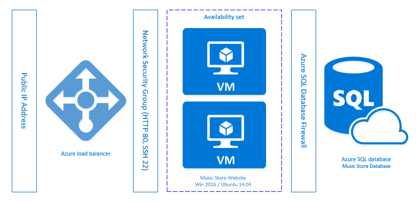

<properties
   pageTitle="Azure Virtual Machine DotNet Core Tutorial 1"
   description="Azure Virtual Machine DotNet Core Tutorial"
   services="virtual-machines-linux"
   documentationCenter="virtual-machines"
   authors="neilpeterson"
   manager="timlt"
   editor="tysonn"
   tags="azure-service-management"/>

<tags
   ms.service="virtual-machines-linux"
   ms.devlang="na"
   ms.topic="article"
   ms.tgt_pltfrm="vm-linux"
   ms.workload="infrastructure"
   ms.date="08/29/2016"
   ms.author="nepeters"/>

# Automating Application Deployments to Azure Virtual Machines

This four-part series details deploying and configuring Azure resource and applications using Azure Resource Manage templates. In this series, a sample template is deployed and the deployment template examined. The goal of this series is to educate on the relationship between Azure resources, and to provide hands on experience deploying fully integrated Azure Resource Manager templates. This document assumes a basic level of knowledge with Azure Resource Manager, before starting this tutorial familiarize yourself with basic Azure Resource Manager concepts.

## Music Store Deployment

The sample used in this series is a .Net Core application simulating a Music Store shopping experience. Before reading the four included articles, deploy the template using the included deployment button.

When fully deployed, the application / Azure architecture looks similar to the following diagram.

Each of these components, including the associate template JSON is examined in the following four articles.

- [**Application Architecture**](./virtual-machines-linux-dotnet-core-2-architecute.md) – Application components such as web sites and databases need to be hosted on Azure computer resources such as virtual machines and Azure SQL databases. This document walks through mapping compute need, to Azure resources, and deploying these resources with an Azure Resource Manager template. 

- [**Access and Security**](./virtual-machines-linux-dotnet-core-3-access-security.md) – When hosting applications in Azure, it is necessary to consider how the application is accessed, and how different application components access each other. This document details providing and securing internet access to an application and access between application components.

- [**Availability and Scale**](./virtual-machines-linux-dotnet-core-4-avalibility-scale.md) – Availability and scale refer to the applications ability to stay running during infrastructure downtime, and the ability to scale compute resources to meet application demand. This document details the components needed to deploy a load balanced and highly available application.

- [**Application Deployment**](./virtual-machines-linux-dotnet-core-5-app-deployment.md) - When deploying applications onto Azure Virtual Machines, the method by which the application binaries are installed on the Virtual Machine must be considered. This document details automating application installation using Azure Virtual Machine Custom Script Extensions.

The goal when developing Azure Resource Manager templates is to automate the deployment of Azure Infrastructure, and the installation and configuration of any applications being hosted on this Azure infrastructure. Working through these articles provides an example of this experience.

## Next Step

[Step 1 - Application Architecture and Azure Resources](./virtual-machines-linux-dotnet-core-2-architecute.md)

[Step 2 - Access and Security of Applications in Azure](./virtual-machines-linux-dotnet-core-3-access-security.md)

[Step 3 - Availability and Scale in Azure](./virtual-machines-linux-dotnet-core-4-avalibility-scale.md)

[Step 4 - Automating the Deployment and Configuration of Application in Azure](./virtual-machines-linux-dotnet-core-5-app-deployment.md)

