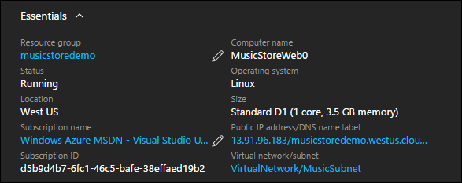
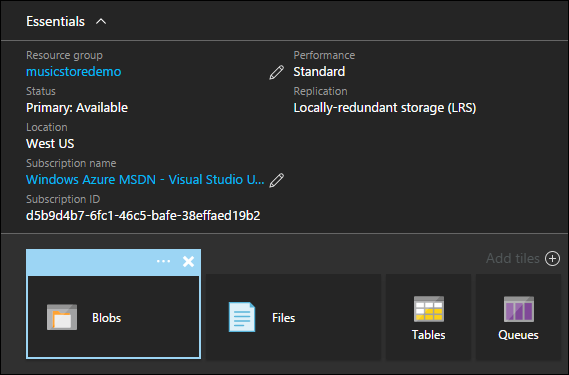
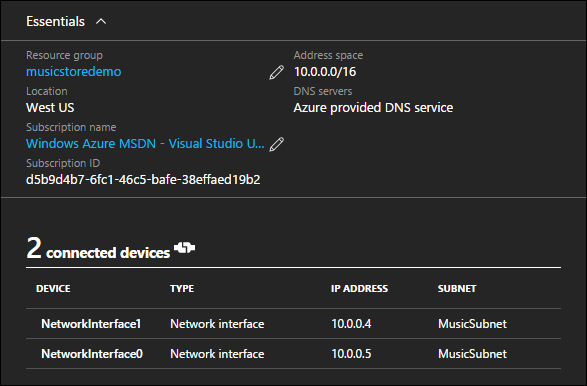
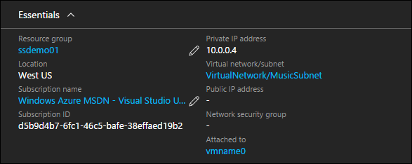
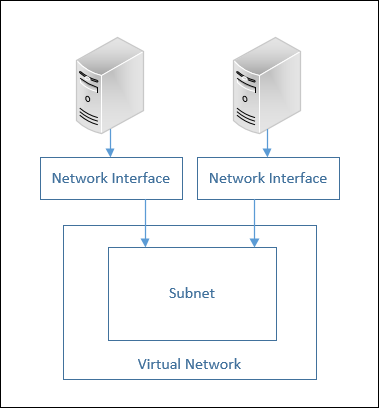
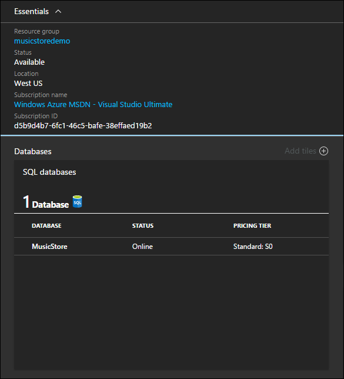

<properties
   pageTitle="Azure Virtual Machine DotNet Core Tutorial 2"
   description="Azure Virtual Machine DotNet Core Tutorial"
   services="virtual-machines-linux"
   documentationCenter="virtual-machines"
   authors="neilpeterson"
   manager="timlt"
   editor="tysonn"
   tags="azure-service-management"/>

<tags
   ms.service="virtual-machines-linux"
   ms.devlang="na"
   ms.topic="article"
   ms.tgt_pltfrm="vm-linux"
   ms.workload="infrastructure"
   ms.date="08/29/2016"
   ms.author="nepeters"/>

# Deploying Compute Resources with Azure Resource Manager Templates

When developing an Azure Resource Manager deployment, compute requirements need to be mapped to Azure resources and services. If an application consists of several http endpoints, a database, and a data caching service, the Azure resources that host each of these components needs to be rationalized. For instance, the sample Music Store application includes a web application that is hosted on a virtual machine, and a SQL database, which is hosted in Azure SQL database. 

This document details how the Music Store compute resources are configured in the sample Azure Resource Manager template. All dependencies and unique configurations are highlighted. For the best experience, pre-deploy an instance of the solution to your Azure subscription and work along with the Azure Resource Manager template. The complete template can be found here – [Music Store Deployment on Ubuntu]( https://github.com/neilpeterson/nepeters-azure-templates/blob/master/dotnet-core-music-linux-vm-sql-db/azuredeploy.json).

## Virtual Machine

The Music Store application includes a web application where customers can browse and purchase music. While there are several Azure services that can host web applications, for this example, a Virtual Machine is used. Using the sample Music Store template, a virtual machine is deployed, a web server install, and the Music Store website installed and configured. For the sake of this article, only the virtual machine deployment is detailed. The configuration of the web server and the application is detailed in a later article.

A virtual machine can be added to a template using the Visual Studio Add New Resource wizard, or by inserting valid JSON into the deployment template. When deploying a virtual machine, several related resources are also needed. If using Visual Studio to create the template, these resources are created for you. If manually constructing the template, these resources need to be inserted and configured.

The virtual machine resource is declared beginning on line [**301**](https://github.com/neilpeterson/nepeters-azure-templates/blob/master/dotnet-core-music-linux-vm-sql-db/azuredeploy.json#L301) of the sample template.

```none
{
      "apiVersion": "2015-06-15",
      "type": "Microsoft.Compute/virtualMachines",
      "name": "[concat(parameters('vmName'),copyindex())]",
      "copy": {
        "name": "virtualMachineLoop",
        "count": "[parameters('numberOfInstances')]"
      },
      "location": "[resourceGroup().location]",
      "tags": {
        "displayName": "virtual-machine"
      },
      "dependsOn": [
        "[concat('Microsoft.Storage/storageAccounts/', variables('vhdStorageName'))]",
        "nicLoop",
        "[concat('Microsoft.Compute/availabilitySets/', variables('availabilitySetName'))]"
      ],
      "properties": {
        "availabilitySet": {
          "id": "[resourceId('Microsoft.Compute/availabilitySets', variables('availabilitySetName'))]"
        },
        "hardwareProfile": {
          "vmSize": "[variables('vmSize')]"
        },
        "osProfile": {
          "computerName": "[concat(parameters('vmName'),copyindex())]",
          "adminUsername": "[parameters('adminUsername')]",
          "linuxConfiguration": {
            "disablePasswordAuthentication": "true",
            "ssh": {
              "publicKeys": [
                {
                  "path": "[variables('sshKeyPath')]",
                  "keyData": "[parameters('sshKeyData')]"
                }
              ]
            }
          }
        },
      ........<truncated>  
    }
```

Once deployed, the virtual machine properties can be seen in the Azure portal.



## Storage Account

A storage account is used to hold the virtual hard drives for each virtual machine in the deployment. In the sample Music Store template, the storage account is declared on line [**115**](https://github.com/neilpeterson/nepeters-azure-templates/blob/master/dotnet-core-music-linux-vm-sql-db/azuredeploy.json#L115) of the template.

```none
{
  "type": "Microsoft.Storage/storageAccounts",
  "name": "[variables('vhdStorageName')]",
  "apiVersion": "2015-06-15",
  "location": "[resourceGroup().location]",
  "tags": {
    "displayName": "storage-account"
  },
  "properties": {
    "accountType": "[variables('vhdStorageType')]"
  }
},
```

The storage account resource is then associated with the Virtual Machine resource on line [**347**](https://github.com/neilpeterson/nepeters-azure-templates/blob/master/dotnet-core-music-linux-vm-sql-db/azuredeploy.json#L347) of the template.

```none
"osDisk": {
  "name": "osdisk",
  "vhd": {
    "uri": "[concat('http://', variables('vhdStorageName'), '.blob.core.windows.net/vhds/', 'osdisk', copyindex(), '.vhd')]"
  },
  "caching": "ReadWrite",
  "createOption": "FromImage"
}
```

After deployment, the storage account can be viewed in the Azure portal.



Clicking into the storage account blob container, the virtual hard driver file for each virtual machine deployed with the template can be seen.


For more information on Azure Storage, see [Azure Storage documentation](https://azure.microsoft.com/documentation/services/storage/).

## Virtual Network

If networking is required, a virtual network can be created. When deployed, all virtual machines are attached to the virtual network and can communicate with each other, and other azure services. A virtual network does not make the virtual machine accessible over the internet. Public connectivity requires a public IP address, which is detailed later in this series.

The virtual network is declared on line [**142**](https://github.com/neilpeterson/nepeters-azure-templates/blob/master/dotnet-core-music-linux-vm-sql-db/azuredeploy.json#L142) of the sample Music Store template. A virtual network is divided up into subnets, which is also defined in the virtual network resource. The subnet declaration can be seen on line [**159**]( https://github.com/neilpeterson/nepeters-azure-templates/blob/master/dotnet-core-music-linux-vm-sql-db/azuredeploy.json#L159) of the Music Store template. 

```none
{
  "apiVersion": "2015-06-15",
  "type": "Microsoft.Network/virtualNetworks",
  "name": "[variables('virtualNetworkName')]",
  "location": "[resourceGroup().location]",
  "dependsOn": [
    "[concat('Microsoft.Network/networkSecurityGroups/', variables('networkSecurityGroup'))]"
  ],
  "tags": {
    "displayName": "virtual-network"
  },
  "properties": {
    "addressSpace": {
      "addressPrefixes": [
        "10.0.0.0/24"
      ]
    },
    "subnets": [
      {
        "name": "[variables('subnetName')]",
        "properties": {
          "addressPrefix": "10.0.0.0/24",
          "networkSecurityGroup": {
            "id": "[resourceId('Microsoft.Network/networkSecurityGroups', variables('networkSecurityGroup'))]"
          }
        }
      }
    ]
  }
}
```

From the Azure portal, the virtual network looks like the following image. Notice that all virtual machines deployed with the template are attached to the virtual network.



## Network Interface

 A network interface is used to connect a virtual machine to the virtual network. In the Music Store sample template, the network interface is declared on line [**172**](https://github.com/neilpeterson/nepeters-azure-templates/blob/master/dotnet-core-music-linux-vm-sql-db/azuredeploy.json#L172).

```none
{
      "apiVersion": "2015-06-15",
      "type": "Microsoft.Network/networkInterfaces",
      "name": "[concat(variables('networkInterfaceNamePrefix'), copyindex())]",
      "location": "[resourceGroup().location]",
      "tags": {
        "displayName": "network-interface"
      },
      "copy": {
        "name": "nicLoop",
        "count": "[parameters('numberOfInstances')]"
      },
     ........<truncated>
    }
```

The network interface is connected to a virtual network subnet, which can be seen on line [**196**]( https://github.com/neilpeterson/nepeters-azure-templates/blob/master/dotnet-core-music-linux-vm-sql-db/azuredeploy.json#L196) of the sample template. 

```none
"subnet": {
  "id": "[variables('subnetRef')]"
},
```

The network interface resource is also connected to the Virtual Machine. This connection can be seen on line [**356**](https://github.com/neilpeterson/nepeters-azure-templates/blob/master/dotnet-core-music-linux-vm-sql-db/azuredeploy.json#L356) of the template.

```none
"networkProfile": {
  "networkInterfaces": [
    {
      "id": "[resourceId('Microsoft.Network/networkInterfaces', concat(variables('networkInterfaceNamePrefix'), copyindex()))]"
    }
  ]
}
```

From the Azure portal, the network interface looks like the following image. The internal IP address and the virtual machine association can be seen on the network interface resource.



The complete virtual machine networking configuration looks like the following diagram.

<center></center>

For more information on Azure Virtual Networks, see [Azure Virtual Network documentation](https://azure.microsoft.com/documentation/services/virtual-network/).

## Azure SQL Database

In addition to a virtual machine hosting the Music Store website, an Azure SQL Database is deployed to host the Music Store database. The advantage of using Azure SQL Database here is that a second set of virtual machines is not required, and scale and availability is built into the service.

An Azure SQL database can be added using the Visual Studio Add New Resource wizard, or by inserting valid JSON into a template. The SQL Server resource includes a user name and password that is granted administrative rights on the SQL instance. Also, a SQL firewall resource is added. By default, applications hosted in Azure are able to connect with the SQL instance. To allow external application such a SQL Server Management studio to connect to the SQL instance, the firewall needs to be configured. For the sake of the Music Store demo, the default configuration is fine. 

The SQL Database server is declared beginning on line [**405**](https://github.com/neilpeterson/nepeters-azure-templates/blob/master/dotnet-core-music-linux-vm-sql-db/azuredeploy.json#L405) of the sample template. 

```none
{
  "name": "[variables('musicstoresqlName')]",
  "type": "Microsoft.Sql/servers",
  "location": "[resourceGroup().location]",
  "apiVersion": "2014-04-01-preview",
  "dependsOn": [ ],
  "tags": {
    "displayName": "sql-music-store"
  },
  "properties": {
    "administratorLogin": "[parameters('adminUsername')]",
    "administratorLoginPassword": "[parameters('adminPassword')]"
  },
  "resources": [
    {
      "name": "firewall-allow-azure",
      "type": "firewallrules",
      "location": "[resourceGroup().location]",
      "apiVersion": "2014-04-01-preview",
      "dependsOn": [
        "[concat('Microsoft.Sql/servers/', variables('musicstoresqlName'))]"
      ],
      "properties": {
        "startIpAddress": "0.0.0.0",
        "endIpAddress": "0.0.0.0"
      }
    }
  ]
}
```

A view of the SQL server and MusicStore database as seen in the Azure portal.



For more information on deploying Azure SQL Database, see [Azure SQL Database documentation](https://azure.microsoft.com/documentation/services/sql-database/).

## Next Step

<hr>

[Step 2 - Access and Security of Applications in Azure](./virtual-machines-linux-dotnet-core-3-access-security.md)
