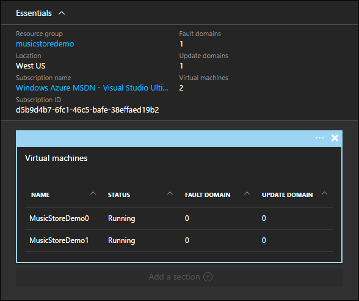
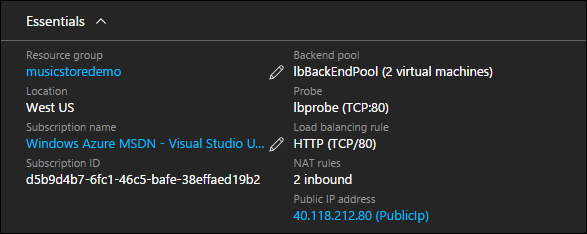

<properties
   pageTitle="Availability and Scale in Azure Resource Manager Templates"
   description="Azure Virtual Machine DotNet Core Tutorial"
   services="virtual-machines-linux"
   documentationCenter="virtual-machines"
   authors="neilpeterson"
   manager="timlt"
   editor="tysonn"
   tags="azure-service-management"/>

<tags
   ms.service="virtual-machines-linux"
   ms.devlang="na"
   ms.topic="article"
   ms.tgt_pltfrm="vm-linux"
   ms.workload="infrastructure"
   ms.date="09/12/2016"
   ms.author="nepeters"/>

# Availability and Scale in Azure Resource Manager Templates

Availability and scale refer to uptime and the ability to meet demand. If an application must be up 99.9% of the time, it needs to have an architecture that allows for multiple concurrent compute resources. For instance, rather than having a single website, a configuration with a higher level of availability includes multiple instances of the same site, with balancing technology in front of them. In this configuration, one instance of the application can be taken down for maintenance, while the remaining continue to function. Scale on the other hand refers to an applications ability to serve demand. With a load balanced application, adding or removing instances from the pool allows an application to scale to meet demand.

This document details how the Music Store sample deployment is configured for availability and scale. All dependencies and unique configurations are highlighted. For the best experience, pre-deploy an instance of the solution to your Azure subscription and work along with the Azure Resource Manager template. The complete template can be found here – [Music Store Deployment on Ubuntu]( https://github.com/neilpeterson/nepeters-azure-templates/blob/master/dotnet-core-music-linux-vm-sql-db/azuredeploy.json).

## Availability set

An Availability Set logically spans Azure Virtual Machines across physical hosts and other infrastructural components such as power supplies and physical networking hardware. Availability sets ensure that during maintenance, device failure, or other down time, not all virtual machines are effected. An Availability Set can be added to an Azure Resource Manager template using the Visual Studio Add New Resource Wizard, or inserting valid JSON into a template.

The availability set declaration starts on line [**391**](https://github.com/neilpeterson/nepeters-azure-templates/blob/master/dotnet-core-music-linux-vm-sql-db/azuredeploy.json#L391) of the sample template.

```none
{
  "name": "[variables('availabilitySetName')]",
  "type": "Microsoft.Compute/availabilitySets",
  "location": "[resourceGroup().location]",
  "apiVersion": "2015-06-15",
  "dependsOn": [ ],
  "tags": {
    "displayName": "avalibility-set-front"
  },
  "properties": {
    "platformUpdateDomainCount": 1,
    "platformFaultDomainCount": 1
  }
},
```

An availability set is associated with a virtual machine in the virtual machine resource declaration. The association between availability set and virtual machine can be seen on line [**319**](https://github.com/neilpeterson/nepeters-azure-templates/blob/master/dotnet-core-music-linux-vm-sql-db/azuredeploy.json#L319) of the Music Store template.

```none
"availabilitySet": {
  "id": "[resourceId('Microsoft.Compute/availabilitySets', variables('availabilitySetName'))]"
},
```
The availability set as seen from the Azure portal. Each virtual machine and details about the configuration are detailed here.



For in-depth information on Availability Sets, see [Manage availability of virtual machines](./virtual-machines-linux-manage-availability.md). 

## Network Load Balancer

Whereas an availability set provides application fault tolerance, a load balancer makes many instances of the application available on a single network address. Multiple instances of an application can be hosted on many virtual machines, each one connected to a load balancer. As the application is accessed, the load balancer routes the incoming request across the attached members. A Load Balancer can be added using the Visual Studio Add New Resource Wizard, or by inserting properly formatted JSON resource into the Azure Resource Manager template.

The load Balancer declaration starts on line [**214**](https://github.com/neilpeterson/nepeters-azure-templates/blob/master/dotnet-core-music-linux-vm-sql-db/azuredeploy.json#L214) of the sample template.

```none
{
  "apiVersion": "2015-06-15",
  "type": "Microsoft.Network/loadBalancers",
  "name": "[variables('loadBalancerName')]",
  "location": "[resourceGroup().location]",
  "tags": {
    "displayName": "load-balancer-front"
  },
  ........<truncated>
}
```

Because the sample application is exposed to the internet with a public IP address, this address is associated with the load balancer. The load balancer can be seen on line [**230**](https://github.com/neilpeterson/nepeters-azure-templates/blob/master/dotnet-core-music-linux-vm-sql-db/azuredeploy.json#L230) of the sample template. 

```none
"frontendIPConfigurations": [
  {
    "properties": {
      "publicIPAddress": {
        "id": "[resourceId('Microsoft.Network/publicIPAddresses', variables('publicipaddressName'))]"
      }
    },
    "name": "LoadBalancerFrontend"
  }
],
```

From the Azure portal, the network load balancer overview shows the association with the public IP address.



## Load Balancer Rule

When using a load balancer, rules are configured that control how traffic is balanced across the intended resources. With the sample Music Store application, traffic arrives on port 80 of the public IP address and is distributed across port 80 of all virtual machines. The load balancer rule can be seen on line [**242**](https://github.com/neilpeterson/nepeters-azure-templates/blob/master/dotnet-core-music-linux-vm-sql-db/azuredeploy.json#L242) of the sample template.

```none
"loadBalancingRules": [
  {
    "name": "[variables('loadBalencerRule')]",
    "properties": {
      "frontendIPConfiguration": {
        "id": "[concat(resourceId('Microsoft.Network/loadBalancers', variables('loadBalancerName')), '/frontendIPConfigurations/LoadBalancerFrontend')]"
      },
      "backendAddressPool": {
        "id": "[variables('lbPoolID')]"
      },
      "protocol": "Tcp",
      "frontendPort": 80,
      "backendPort": 80,
      "enableFloatingIP": false,
      "idleTimeoutInMinutes": 5,
      "probe": {
        "id": "[variables('lbProbeID')]"
      }
    }
  }
],
```

A view of the network load balancer rule from the portal.


## Load Balancer Probe

The load balancer also needs to monitor each virtual machine so that requests are served only to running systems. This monitoring takes place by constant probing of a pre-defined port. The Music Store deployment is configured to probe port 80 on all included virtual machines. The load balancer probe can be seen on line [**263**](https://github.com/neilpeterson/nepeters-azure-templates/blob/master/dotnet-core-music-linux-vm-sql-db/azuredeploy.json#L263) of the sample template. In the event port 80 is not available on a virtual machine, requests are not routed to the system.

```none
"probes": [
  {
    "properties": {
      "protocol": "Tcp",
      "port": 80,
      "intervalInSeconds": 15,
      "numberOfProbes": 2
    },
    "name": "lbprobe"
  }
]
```

The load balancer probe seen from the Azure portal.


## Inbound NAT Rules

When using a Load Balancer, rules need to be put into place that provide non-load balanced access to each Virtual Machine. For instance, when creating an SSH connection with each virtual machine, this traffic should not be load balanced, rather a pre-determined path should be configured. pre-determined paths are configured using an Inbound NAT Rule resource. Using this resource, inbound communication can be mapped to individual Virtual Machines. 

With the Music Store application, a port starting at 5000 is mapped to port 22 on each Virtual Machine for SSH access. The `copyindex()` function is used to increment the incoming port, such that the second Virtual Machine receives an incoming port of 5001, the third 5002, and so on. The inbound NAT rule can be seen on line [**276**](https://github.com/neilpeterson/nepeters-azure-templates/blob/master/dotnet-core-music-linux-vm-sql-db/azuredeploy.json#L276) of the template.

```none
{
  "apiVersion": "2015-06-15",
  "type": "Microsoft.Network/loadBalancers/inboundNatRules",
  "name": "[concat(variables('loadBalancerName'), '/', 'SSH-VM', copyIndex())]",
  "tags": {
    "displayName": "load-balancer-nat-rule"
  },
  "location": "[resourceGroup().location]",
  "copy": {
    "name": "lbNatLoop",
    "count": "[parameters('numberOfInstances')]"
  },
  "dependsOn": [
    "[concat('Microsoft.Network/loadBalancers/', variables('loadBalancerName'))]"
  ],
  "properties": {
    "frontendIPConfiguration": {
      "id": "[variables('ipConfigID')]"
    },
    "protocol": "tcp",
    "frontendPort": "[copyIndex(5000)]",
    "backendPort": 22,
    "enableFloatingIP": false
  }
},
```

One example inbound NAT rule as seen in the Azure portal. An SSH NAT rule is created for each virtual machine in the deployment.


For in-depth information on the Azure Network Load Balancer, see [Load balancing for Azure infrastructure services](./virtual-machines-linux-load-balance.md).

## Deploy Multiple VMs

Finally, for an Availability Set or Load Balancer to effectively function, multiple virtual machines are required. Multiple VMs can be deployed using the Azure Resource Manager template copy function. Using the copy function, it is not necessary to define a finite number of Virtual Machines, rather this value can be dynamically provided at the time of deployment. The copy function consumes the number of instances to created and handles deploying the proper number of virtual machines and associated resources.

In the Music Store Sample template, a parameter is defined that takes in an instance count. This number is used throughout the template when creating virtual machines and related resources.

```none
"numberOfInstances": {
  "type": "int",
  "minValue": 1,
  "defaultValue": 1,
  "metadata": {
    "description": "Number of VM instances to be created behind load balancer."
  }
},
```

On the Virtual Machine resource, the copy object can be seen on line [**305**](https://github.com/neilpeterson/nepeters-azure-templates/blob/master/dotnet-core-music-linux-vm-sql-db/azuredeploy.json#L305). Here the loop is given a name and the number of instances parameter used to control the number of resulting copies.

```none
"apiVersion": "2015-06-15",
"type": "Microsoft.Compute/virtualMachines",
"name": "[concat(parameters('vmName'),copyindex())]",
"copy": {
  "name": "virtualMachineLoop",
  "count": "[parameters('numberOfInstances')]"
},
```

The current iteration of the copy function can be accessed with the `copyIndex()` function. The value of the copy index function can be used to name virtual machines and other resources. For instance, if two instances of a virtual machine are deployed, they need different names. The `copyIndex()` function can be used as part of the virtual machine name to create a unique name. An example of the `copyindex()` function used for naming purposes can be seen in the Virtual Machine resource. Here, the computer name is a concatenation of the `vmName` parameter, and the `copyIndex()` function. This example can be seen in more detail on line [**326**](https://github.com/neilpeterson/nepeters-azure-templates/blob/master/dotnet-core-music-linux-vm-sql-db/azuredeploy.json#L326) of the Music Store demo template.

```none
"osProfile": {
  "computerName": "[concat(parameters('vmName'),copyindex())]",
  "adminUsername": "[parameters('adminUsername')]",
  "linuxConfiguration": {
    "disablePasswordAuthentication": "true",
    "ssh": {
      "publicKeys": [
        {
          "path": "[variables('sshKeyPath')]",
          "keyData": "[parameters('sshKeyData')]"
        }
      ]
    }
  }
},
```

The `copyIndex` function is used several times in the Music Store sample template. Resources and functions utilizing `copyIndex` include anything specific to a single instance of the virtual machine such and network interface, load balancer rules, and any depends on functions. 

For more information on the copy function, see [Create multiple instances of resources in Azure Resource Manager](../resource-group-create-multiple.md).

## Next Step

<hr>

[Step 4 - Automating the Deployment and Configuration of Application in Azure](./virtual-machines-linux-dotnet-core-5-app-deployment.md)