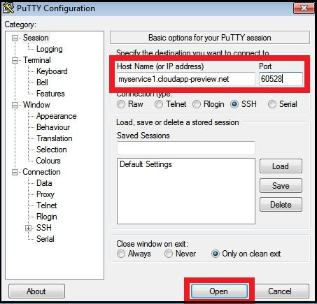
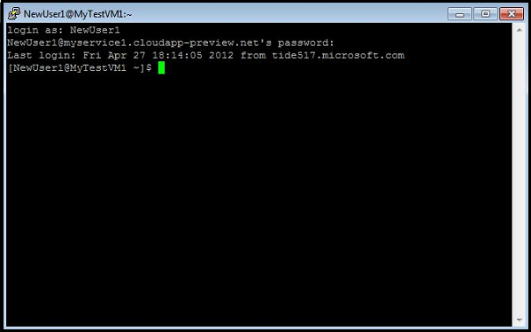

<properties
	pageTitle="Log on to a virtual machine running Linux in Azure"
	description="Learn how to log on to an Azure virtual machine running Linux by using a Secure Shell (SSH) client."
	services="virtual-machines"
	documentationCenter=""
	authors="squillace"
	manager="timlt"
	editor=""/>

<tags
	ms.service="virtual-machines"
	ms.workload="infrastructure-services"
	ms.tgt_pltfrm="vm-linux"
	ms.devlang="na"
	ms.topic="article"
	ms.date="08/25/2015"
	ms.author="rasquill"/>

#How to Log on to a Virtual Machine Running Linux #

For a virtual machine running a Linux operating system, you use a Secure Shell (SSH) client to log on.

You'll need to install an SSH client on the computer you want to use to log on to the virtual machine. There are many SSH client programs that you can choose from. The following are possible choices:

- On a computer running a Windows operating system, you might want to use an SSH client such as PuTTY. For more information, see the [PuTTY Download Page](http://www.chiark.greenend.org.uk/~sgtatham/putty/download.html).
- On a computer running a Linux operating system, you might want to use an SSH client such as OpenSSH. For more information, see [OpenSSH](http://www.openssh.org/).

>[AZURE.NOTE] For more requirements and troubleshooting tips, see [Connect to an Azure virtual machine with RDP or SSH](http://go.microsoft.com/fwlink/p/?LinkId=398294).

This procedure shows you how to use the PuTTY program to access the virtual machine.

1. Find the **Host Name** and **Port information** from the [Management Portal](http://manage.windowsazure.com). You can find the information that you need from the dashboard of the virtual machine. Click the virtual machine name and look for the **SSH Details** in the **Quick Glance** section of the dashboard.

	

2. Open the PuTTY program.

3. Enter the Host Name and the Port information that you collected from the dashboard, and then click **Open**.

	

4. Log on to the virtual machine using the account that you specified when the machine was created. For more details on how to create a virtual machine with user name and password, see [Create a Virtual Machine Running Linux](virtual-machines-linux-tutorial.md).

	

>[AZURE.NOTE] The VMAccess extension can help you reset the SSH key or password if you've forgotten it. If you've forgotten the user name, you can use the extension to create a new one with sudo authority. For instructions, see the [How to Reset a Password or SSH for Linux Virtual Machines].

You can now work with the virtual machine just as you would with any other server.

<!-- LINKS -->
[How to Reset a Password or SSH for Linux Virtual Machines]: http://go.microsoft.com/fwlink/p/?LinkId=512138
