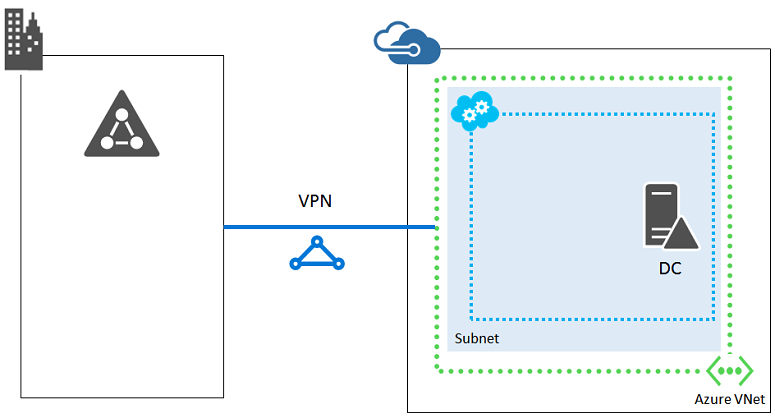

<properties
	pageTitle="Azure Networking Infrastructure Guidelines"
	description="Learn about the key design and implementation guidelines for deploying virtual networking in Azure infrastructure services."
	documentationCenter=""
	services="virtual-machines-linux"
	authors="vlivech"
	manager="timlt"
	editor=""
	tags="azure-service-management,azure-resource-manager"/>

<tags
	ms.service="virtual-machines-linux"
	ms.workload="infrastructure-services"
	ms.tgt_pltfrm="vm-linux"
	ms.devlang="na"
	ms.topic="article"
	ms.date="05/05/2016"
	ms.author="v-livech"/>

# Azure Networking Infrastructure Guidelines

This guidance identifies many areas for which planning is vital to the success of an IT workload in Azure. In addition, planning provides an order to the creation of the necessary resources. Although there is some flexibility, we recommend that you apply the order in this article to your planning and decision-making.

## 5. Virtual networks

The next logical step is to create the virtual networks necessary to support the communications across the virtual machines in the solution. Although it is possible to host multiple virtual machines of an IT workload within just one cloud service, virtual networks are recommended.

Virtual networks are a container for virtual machines for which you can also specify subnets, custom addressing, and DNS configuration options. Virtual machines within the same virtual network can communicate directly with other computers within the same virtual network, regardless of which cloud service they are a member of. Within the virtual network, this communication remains private, without the need for the communication to go through the public endpoints. This communication can occur via IP address, or by name, using a DNS server installed in the virtual network, or on-premises, if the virtual machine is connected to the corporate network.

### Site connectivity
If on-premises users and computers do not require ongoing connectivity to virtual machines in an Azure virtual network, create a cloud-only virtual network.

This is typically for Internet-facing workloads, such as an Internet-based web server. You can manage these virtual machines using Remote Desktop connections, remote PowerShell sessions, Secure Shell (SSH) connections, and point-to-site VPN connections.

Because they do not connect to your on-premises network, cloud-only virtual networks can use any portion of the private IP address space.

If on-premises users and computers require ongoing connectivity to virtual machines in an Azure virtual network, create a cross-premises virtual network and connect it to your on-premises network with an ExpressRoute or site-to-site VPN connection.

In this configuration, the Azure virtual network is essentially a cloud-based extension of your on-premises network.

Because they connect to your on-premises network, cross-premises virtual networks must use a portion of the address space used by your organization that is unique, and the routing infrastructure must support routing traffic to that portion by forwarding it to your on-premises VPN device.

To allow packets to travel from your cross-premises virtual network to your on-premises network, you must configure the set of relevant on-premises address prefixes as part of the local network definition for the virtual network. Depending on the address space of the virtual network and the set of relevant on-premises locations, there can be many address prefixes in the local network.

You can convert a cloud-only virtual network to a cross-premises virtual network, but it will most likely require you to renumber your virtual network address space, your subnets, and the virtual machines that use static Azure-assigned IP addresses, known as Dynamic IPs (DIPs). Therefore, carefully consider the type of virtual networks you need (cloud-only versus cross-premises) before you create them.

### Subnets
Subnets allow you to organize resources that are related, either logically (for example, one subnet for virtual machines associated to the same application), or physically (for example, one subnet per cloud service), or to employ subnet isolation techniques for added security.

For cross-premises virtual networks, you should design subnets with the same conventions that you use for on-premises resources, keeping in mind that **Azure always uses the first three IP addresses of the address space for each subnet**. To determine the number of addresses needed for the subnet, count the number of virtual machines that you need now, estimate for future growth, and then use the following table to determine the size of the subnet.

Number of virtual machines needed | Number of host bits needed | Size of the subnet
--- | --- | ---
1–3 | 3 | /29
4–11	 | 4 | /28
12–27 | 5 | /27
28–59 | 6 | /26
60–123 | 7 | /25

> [AZURE.NOTE] For normal on-premises subnets, the maximum number of host addresses for a subnet with n host bits is 2n – 2. For an Azure subnet, the maximum number of host addresses for a subnet with n host bits is 2n – 5 (2 plus 3 for the addresses that Azure uses on each subnet).

If you choose a subnet size that is too small, you will have to renumber and redeploy the virtual machines in the subnet.

### Implementation guidelines recap for virtual networks

Decisions:

- What type of virtual network do you need to host your IT workload or infrastructure (cloud-only or cross-premises)?
- For cross-premises virtual networks, how much address space do you need to host the subnets and virtual machines now and for reasonable expansion in the future?

Tasks:

- Define the address space for the virtual network.
- Define the set of subnets and the address space for each.
- For cross-premises virtual networks, define the set of local network address spaces for the on-premises locations that the virtual machines in the virtual network need to reach.
- Create the virtual network using your naming convention. You can use the Azure portal or the Azure classic portal.
