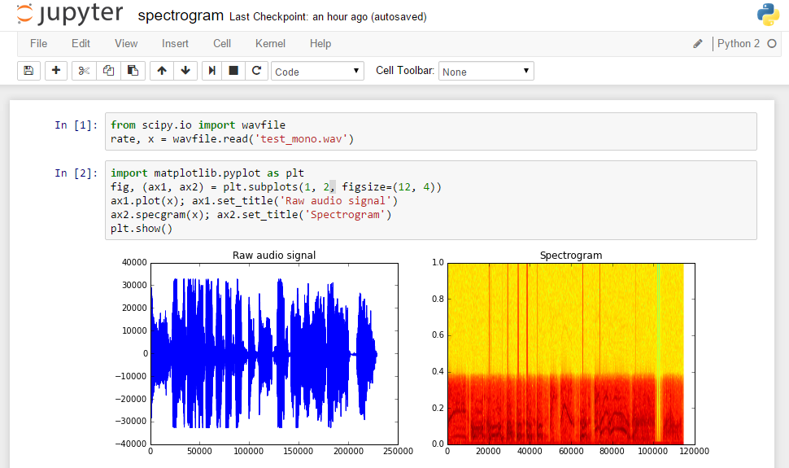
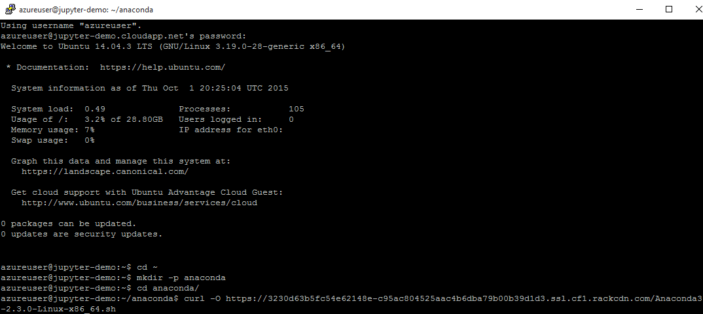

<properties
	pageTitle="Create an Jupyter/IPython Notebook | Microsoft Azure"
	description="Learn how to deploy the Jupyter/IPython Notebook on a Linux virtual machine created with the resource manager deployment model in Azure."
	services="virtual-machines-linux"
	documentationCenter="python"
	authors="crwilcox"
	manager="wpickett"
	editor=""
	tags="azure-service-management,azure-resource-manager"/>

<tags
	ms.service="virtual-machines-linux"
	ms.workload="infrastructure-services"
	ms.tgt_pltfrm="vm-linux"
	ms.devlang="python"
	ms.topic="article"
	ms.date="11/10/2015"
	ms.author="crwilcox"/>

# Jupyter Notebook on Azure

The [Jupyter project](http://jupyter.org), formerly the [IPython project](http://ipython.org), provides a collection of tools for scientific computing using powerful interactive shells that combine code execution with the creation of a live computational document. These notebook files can contain arbitrary text, mathematical formulas, input code, results, graphics, videos and any other kind of media that a modern web browser is capable of displaying. Whether you're absolutely new to Python and want to learn it in a fun, interactive environment or do some serious parallel/technical computing, the Jupyter Notebook is a great choice.

Using SciPy and Matplotlib packages to analyze the structure of a sound recording.

## Jupyter Two Ways: Azure Notebooks or Custom Deployment
Azure provides a service that you can use to [quickly start using Jupyter
](http://blogs.technet.com/b/machinelearning/archive/2015/07/24/introducing-jupyter-notebooks-in-azure-ml-studio.aspx).  By using the Azure Notebook Service, you can easily gain access to Jupyter's web-accessible interface to
scalable computational resources with all the power of Python and its many
libraries.  Since the installation is handled by the service, users can access these
resources without the need for administration and configuration by the user.

If the notebook service does not work for your scenario please continue to read this article which will will show you how to deploy the Jupyter Notebook on Microsoft Azure, using Linux virtual machines (VMs).

[AZURE.INCLUDE [create-account-and-vms-note](../../includes/create-account-and-vms-note.md)]

## Create and configure a VM on Azure

The first step is to create a virtual machine (VM)  running on Azure.
This VM is a complete operating system in the cloud and will be used to
run the Jupyter Notebook. Azure is capable of running both Linux and Windows
virtual machines, and we will cover the setup of Jupyter on both types of virtual machines.

### Create a Linux VM and open a port for Jupyter

Follow the instructions given [here][portal-vm-linux] to create a virtual machine of the *Ubuntu* distribution. This tutorial uses Ubuntu Server 14.04 LTS. We'll assume the user name *azureuser*.

After the virtual machine deploys we need to open up a security rule on the network security group.  From the Azure portal, go to **Network Security Groups** and open the tab for the Security Group corresponding to your VM. You need to add an Inbound Security rule with the following settings:
**TCP** for the protocol, **\*** for the source (public) port and **9999** for the destination (private) port.

While in your Network Security Group, click on **Network Interfaces** and note the **Public IP Address** as it will be needed to connect to your VM in the next step.

## Install required software on the VM

To run the Jupyter Notebook on our VM, we must first install Jupyter and
its dependencies. Connect to your linux vm using ssh and the username/password pair you chose when you created the vm. In this tutorial we will use PuTTY and connect from Windows.

### Installing Jupyter on Ubuntu
Install Anaconda, a popular data science python distribution, using one of the links provided from [Continuum Analytics](https://www.continuum.io/downloads).  As of the writing of this document, the below links are the most up to date versions.

#### Anaconda Installs for Linux
<table>
  <th>Python 3.4</th>
  <th>Python 2.7</th>
  <tr>
    <td>
		<a href='https://3230d63b5fc54e62148e-c95ac804525aac4b6dba79b00b39d1d3.ssl.cf1.rackcdn.com/Anaconda3-2.3.0-Linux-x86_64.sh'>64 bit</href>
	</td>
    <td>
		<a href='https://3230d63b5fc54e62148e-c95ac804525aac4b6dba79b00b39d1d3.ssl.cf1.rackcdn.com/Anaconda-2.3.0-Linux-x86_64.sh'>64 bit</href>
	</td>
  </tr>
  <tr>
    <td>
		<a href='https://3230d63b5fc54e62148e-c95ac804525aac4b6dba79b00b39d1d3.ssl.cf1.rackcdn.com/Anaconda3-2.3.0-Linux-x86.sh'>32 bit</href>
	</td>
    <td>
		<a href='https://3230d63b5fc54e62148e-c95ac804525aac4b6dba79b00b39d1d3.ssl.cf1.rackcdn.com/Anaconda-2.3.0-Linux-x86.sh'>32 bit</href>
	</td>  
  </tr>
</table>

#### Installing Anaconda3 2.3.0 64-bit on Ubuntu
As an example, this is how you can install Anaconda on Ubuntu

	# install anaconda
	cd ~
	mkdir -p anaconda
	cd anaconda/
	curl -O https://3230d63b5fc54e62148e-c95ac804525aac4b6dba79b00b39d1d3.ssl.cf1.rackcdn.com/Anaconda3-2.3.0-Linux-x86_64.sh
	sudo bash Anaconda3-2.3.0-Linux-x86_64.sh -b -f -p /anaconda3

	# clean up home directory
	cd ..
	rm -rf anaconda/

	# Update Jupyter to the latest install and generate its config file
	sudo /anaconda3/bin/conda install jupyter -y
	/anaconda3/bin/jupyter-notebook --generate-config

### Configuring Jupyter and using SSL
After installing we need to take a moment to setup the configuration files for Jupyter. If you experience troubles with configuring Jupyter it may be helpful to look at the [Jupyter Documentation for Running a Notebook Server](http://jupyter-notebook.readthedocs.org/en/latest/public_server.html).

Next we `cd` to the profile directory to create our SSL certificate and edit
the profiles configuration file.

On Linux use the following command.

    cd ~/.jupyter

Use the following command to create the SSL certificate(Linux and Windows).

    openssl req -x509 -nodes -days 365 -newkey rsa:1024 -keyout mycert.pem -out mycert.pem

Note that since we are creating a self-signed SSL certificate, when connecting
to the notebook your browser will give you a security warning.  For long-term
production use, you will want to use a properly signed certificate associated
with your organization.  Since certificate management is beyond the scope of
this demo, we will stick to a self-signed certificate for now.

In addition to using a certificate, you must also provide a password to protect
your notebook from unauthorized use.  For security reasons Jupyter uses
encrypted passwords in its configuration file, so you'll need to encrypt your
password first.  IPython provides a utility to do so; at a command prompt run the following command.

    /anaconda3/bin/python -c "import IPython;print(IPython.lib.passwd())"

This will prompt you for a password and confirmation, and will then print the password. Note this for the following step.

    Enter password:
    Verify password:
    sha1:b86e933199ad:a02e9592e59723da722.. (elided the rest for security)

Next, we will edit the profile's configuration file, which is the
`jupyter_notebook_config.py` file in the directory you are in.  Note that this file may not exist -- just create it if that is the case.  This
file has a number of fields and by default all are commented out.  You can open
this file with any text editor of your liking, and you should ensure that it
has at least the following content. **Be sure to replace the c.NotebookApp.password in the config with the sha1 from the previous step**.

    c = get_config()

    # You must give the path to the certificate file.
    c.NotebookApp.certfile = u'/home/azureuser/.jupyter/mycert.pem'

    # Create your own password as indicated above
    c.NotebookApp.password = u'sha1:b86e933199ad:a02e9592e5 etc... '

    # Network and browser details. We use a fixed port (9999) so it matches
    # our Azure setup, where we've allowed traffic on that port
    c.NotebookApp.ip = '*'
    c.NotebookApp.port = 9999
    c.NotebookApp.open_browser = False

### Run the Jupyter Notebook

At this point we are ready to start the Jupyter Notebook. To do this,
navigate to the directory you want to store notebooks in and start
the Jupyter Notebook server with the following command.

    /anaconda3/bin/jupyter-notebook

You should now be able to access your Jupyter Notebook at the address
`https://[PUBLIC-IP-ADDRESS]:9999`.

When you first access your notebook, the login page asks for your password. And
once you log in, you will see the "Jupyter Notebook Dashboard", which is the
ontrol center for all notebook operations.  From this page you can create
new notebooks and open existing ones.

### Using the Jupyter Notebook

If you click the **New** button, you will see the following opening page.

The area marked with an `In []:` prompt is the input area, and here you can
type any valid Python code and it will execute when you hit `Shift-Enter` or
click on the "Play" icon (the right-pointing triangle in the toolbar).

## A powerful paradigm: live computational documents with rich media

The notebook itself should feel very natural to anyone who has used Python and
a word processor, because it is in some ways a mix of both: you can execute
blocks of Python code, but you can also keep notes and other text by changing
the style of a cell from "Code" to "Markdown" using the drop-down menu in the
toolbar.

Jupyter is much more than a word processor as it allows the
mixing of computation and rich media (text, graphics, video and virtually
anything a modern web browser can display). You can mix, text, code, videos and more!

And with the power of Python's many excellent libraries for scientific and
technical computing, in the following screenshot, a simple calculation can be performed with the same ease
as a complex network analysis, all in one environment.

This paradigm of mixing the power of the modern web with live computation
offers many possibilities, and is ideally suited for the cloud; the Notebook
can be used:

* As a computational scratchpad to record exploratory work on a problem.

* To share results with colleagues, either in 'live' computational form or in
  hardcopy formats (HTML, PDF).

* To distribute and present live teaching materials that involve computation,
  so students can immediately experiment with the real code, modify it and
  re-execute it interactively.

* To provide "executable papers" that present the results of research in a way
  that can be immediately reproduced, validated and extended by others.

* As a platform for collaborative computing: multiple users can log in to the
  same notebook server to share a live computational session.

If you go to the IPython source code [repository][], you will find an entire
directory with notebook examples which you can download and then experiment with on your own Azure Jupyter VM.  Simply download the `.ipynb` files from the site and upload them onto the dashboard of your notebook Azure VM (or download them directly into the VM).

## Conclusion

The Jupyter Notebook provides a powerful interface for accessing interactively
the power of the Python ecosystem on Azure.  It covers a wide range of
usage cases including simple exploration and learning Python, data analysis and
visualization, simulation and parallel computing. The resulting Notebook
documents contain a complete record of the computations that are performed and
can be shared with other Jupyter users.  The Jupyter Notebook can be used as a
local application, but it is ideally suited for cloud deployments on Azure

The core features of Jupyter are also available inside Visual Studio via the
[Python Tools for Visual Studio][] (PTVS). PTVS is a free and open-source plug-in
from Microsoft that turns Visual Studio into an advanced Python development
environment that includes an advanced editor with IntelliSense, debugging,
profiling and parallel computing integration.

## Next steps

For more information, see the [Python Developer Center](/develop/python/).

[portal-vm-linux]: https://azure.microsoft.com/en-us/documentation/articles/virtual-machines-linux-tutorial-portal-rm/
[repository]: https://github.com/ipython/ipython
[Python Tools for Visual Studio]: http://aka.ms/ptvs
