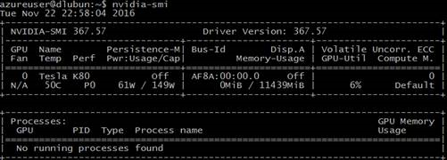

# Set up GPU drivers for N-series VMs running Linux

To take advantage of the GPU capabilities of Azure N-series VMs running a supported Linux distribution, you must install NVIDIA graphics drivers on each VM after deployment. Driver setup information is also available for [Windows VMs](virtual-machines-windows-n-series-driver-setup.md?toc=%2fazure%2fvirtual-machines%2fwindows%2ftoc.json).


> [!IMPORTANT]
> Currently, Linux GPU support is only available on Azure NC VMs.
> 

For N-series VM specs, storage capacities, and disk details, see [Sizes for virtual machines](virtual-machines-linux-sizes.md?toc=%2fazure%2fvirtual-machines%2flinux%2ftoc.json). See also [General considerations for N-series VMs](#general-considerations-for-n-series-vms).


## Supported distributions for NC VMs

NVIDIA GPU drivers can be installed on NC VMs running one of the following Linux distributions from the Azure Marketplace.

* Ubuntu 16.04 LTS
* CentOS-based 7.3 (NC6, NC12, and NC24 VM sizes only)
* Red Hat Enterprise Linux 7.3 (NC6, NC12, and NC24 VM sizes only)

> [!WARNING] 
> Installation of third-party software on Red Hat products affects the Red Hat support terms. See the [Red Hat Knowledgebase article](https://access.redhat.com/articles/1067).
>


## Install NVIDIA CUDA drivers

Here are steps to involve NVIDIA drivers on Linux NC VMs from the NVIDIA CUDA Toolkit 8.0. C and C++ developers can optionally install the full Toolkit to build GPU-accelerated applications. For more information, see the [CUDA Installation Guide](http://docs.nvidia.com/cuda/cuda-installation-guide-linux/index.html).


> [!NOTE]
> Driver download links provided here are current at time of publication. For the latest drivers, visit the [NVIDIA](http://www.nvidia.com/) website.

To install CUDA Toolkit, make an SSH connection to each VM. To verify that the system has a CUDA-capable GPU, run the following command:

```bash
lspci | grep -i NVIDIA
```
You will see output similar to the following example (showing an NVIDIA Tesla K80 card):


Then run commands specific for your distribution.

### Ubuntu 16.04 LTS

```bash
CUDA_REPO_PKG=cuda-repo-ubuntu1604_8.0.61-1_amd64.deb

wget -O /tmp/${CUDA_REPO_PKG} http://developer.download.nvidia.com/compute/cuda/repos/ubuntu1604/x86_64/${CUDA_REPO_PKG} 

sudo dpkg -i /tmp/${CUDA_REPO_PKG}

rm -f /tmp/${CUDA_REPO_PKG}

sudo apt-get update

sudo apt-get install cuda-drivers

```
The installation can take several minutes.

To optionally install the complete CUDA toolkit, type:

```bash
sudo apt-get install cuda
```

Reboot the VM and proceed to verify the installation.

### CentOS 7.3 or Red Hat Enterprise Linux 7.3

> [!IMPORTANT] 
> Because of a known issue, NVIDIA CUDA driver installation fails on NC24r VMs running CentOS 7.3 or Red Hat Enterprise Linux 7.3.
>

First, get updates. 

```bash
sudo yum update

sudo reboot
```

Reconnect to the VM and install Linux Integration Services 4.1.3.1, which is available for [download](https://www.microsoft.com/en-us/download/details.aspx?id=51612) from the Microsoft Download Center. Transfer the tarball to the VM (for example, using `scp`), and run the following commands:

```bash
tar xvzf lis-rpms-4.1.3-1.tar.gz

cd LISISO

sudo ./install.sh 

sudo reboot
```

Run the following command to verify the installation of Linux Integration Services:


```bash
modinfo hv_vmbus
```

Continue installation with the following commands:

```
sudo yum install kernel-devel

sudo rpm -Uvh https://dl.fedoraproject.org/pub/epel/epel-release-latest-7.noarch.rpm

sudo yum install dkms

CUDA_REPO_PKG=cuda-repo-rhel7-8.0.61-1.x86_64.rpm

wget http://developer.download.nvidia.com/compute/cuda/repos/rhel7/x86_64/${CUDA_REPO_PKG} -O /tmp/${CUDA_REPO_PKG}

sudo rpm -ivh /tmp/${CUDA_REPO_PKG}

rm -f /tmp/${CUDA_REPO_PKG}

sudo yum install cuda-drivers

```
The installation can take several minutes. To optionally install the complete CUDA toolkit, type:

```bash
sudo yum install cuda
```

Reboot the VM and proceed to verify the installation.


## Verify driver installation


To query the GPU device state, SSH to the VM and run the [nvidia-smi](https://developer.nvidia.com/nvidia-system-management-interface) command-line utility installed with the driver. 



## CUDA driver updates

We recommend that you manually update CUDA drivers after deployment.

### Ubuntu 16.04 LTS:

```bash
sudo apt-get update

sudo apt-get upgrade -y

sudo apt-get dist-upgrade -y

sudo apt-get install cuda-drivers
```

After the update completes, restart the VM.

### CentOS 7.3 or Red Hat Enterprise Linux 7.3

```bash
sudo yum update
```

[!INCLUDE [virtual-machines-n-series-considerations](../../includes/virtual-machines-n-series-considerations.md)]

* We don't recommend installing X server or other systems that use the nouveau driver on Ubuntu NC VMs. Before installing NVIDIA GPU drivers, you need to disable the nouveau driver.

* We don't recommend installing NVIDIA CUDA drivers on NV VMs.

* You can script the installation steps by running commands with options to run silently.     

* If you want to capture an image of a Linux VM on which you installed NVIDIA drivers, see [How to generalize and capture a Linux virtual machine](virtual-machines-linux-capture-image.md?toc=%2fazure%2fvirtual-machines%2flinux%2ftoc.json).

## Next steps

* For more information about the NVIDIA GPUs on the N-series VMs, see:
    * [NVIDIA Tesla K80](http://www.nvidia.com/object/tesla-k80.html) (for Azure NC VMs)
    * [NVIDIA Tesla M60](http://www.nvidia.com/object/tesla-m60.html) (for Azure NV VMs)

