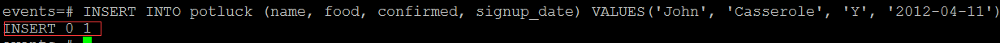
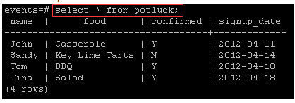

<properties
	pageTitle="Install and configure PostgreSQL on a Microsoft Azure virtual machine running Linux | Microsoft Azure"
	description="Learn how to install and configure PostgreSQL on a Linux virtual machine in Azure."
	services="virtual-machines"
	documentationCenter=""
	authors="SuperScottz"
	manager="timlt"
	editor=""
  tags=""/>

<tags
	ms.service="virtual-machines"
	ms.devlang="na"
	ms.topic="article"
	ms.tgt_pltfrm="linux"
	ms.workload="infrastructure-services"
	ms.date="08/10/2015"
	ms.author="mingzhan"/>

#Install and configure PostgreSQL on Azure

PostgreSQL is an advanced open-source database similar to Oracle and DB2. It includes enterprise-ready features such as full ACID compliance, reliable transactional processing, and multi-version concurrency control. It also supports standards such as ANSI SQL and SQL/MED (including foreign data wrappers for Oracle, MySQL, MongoDB, and many others). It is highly extensible with support for over 12 procedural languages, GIN and GiST indexes, spatial data support, and multiple NoSQL-like features for JSON or key-value-based applications.

In this article, you will learn how to install and configure PostgreSQL on an Azure virtual machine running Linux.

> [AZURE.NOTE] You must already have an Azure virtual machine running Linux in order to complete this tutorial. To create and set up a Linux VM before proceeding, see the
[Azure Linux VM tutorial](virtual-machines-linux-tutorial.md).

In this case, use port 1999 as the PostgreSQL port.  

## Install PostgreSQL

Connect to the Linux VM you created via PuTTY. If this is the first time you're using an Azure Linux VM, see [How to Use SSH with Linux on Azure](virtual-machines-linux-use-ssh-key.md) to learn how to use PuTTY to connect to a Linux VM.

1. Run the following command to switch to the root (admin):

		# sudo su -

2. Some distributions have dependencies that you must install before installing PostgreSQL. Check for your distro in this list and run the appropriate command:

	- Red Hat base Linux:

			# yum install readline-devel gcc make zlib-devel openssl openssl-devel libxml2-devel pam-devel pam  libxslt-devel tcl-devel python-devel -y  

	- Debian base Linux:

 			# apt-get install readline-devel gcc make zlib-devel openssl openssl-devel libxml2-devel pam-devel pam libxslt-devel tcl-devel python-devel -y  

	- SUSE Linux:

			# zypper install readline-devel gcc make zlib-devel openssl openssl-devel libxml2-devel pam-devel pam  libxslt-devel tcl-devel python-devel -y  

3. Download PostgreSQL into the root directory, and then unzip the package:

		# wget https://ftp.postgresql.org/pub/source/v9.3.5/postgresql-9.3.5.tar.bz2 -P /root/

		# tar jxvf  postgresql-9.3.5.tar.bz2

	The above is an example. You can find the more detailed download address in the [Index of /pub/source/](https://ftp.postgresql.org/pub/source/).

4. To start the build, run these commands:

		# cd postgresql-9.3.5

		# ./configure --prefix=/opt/postgresql-9.3.5

5. If  you want to build everything that can be built, including the documentation (HTML and man pages) and additional modules (contrib), run the following command instead:

		# gmake install-world

	You should receive the following confirmation message:

		PostgreSQL, contrib, and documentation successfully made. Ready to install.

## Configure PostgreSQL

1. (Optional) Create a symbolic link to shorten the PostgreSQL reference to not include the version number:

		# ln -s /opt/pgsql9.3.5 /opt/pgsql

2. Create a directory for the database:

		# mkdir -p /opt/pgsql_data

3. Create a non-root user and modify that user’s profile. Then, switch to this new user (called *postgres* in our example):

		# useradd postgres

		# chown -R postgres.postgres /opt/pgsql_data

		# su - postgres

   > [AZURE.NOTE] For security reasons, PostgreSQL uses a non-root user to initialize, start, or shut down the database.

4. Edit the *bash_profile* file by entering the commands below. These lines will be added to the end of the *bash_profile* file:

		cat >> ~/.bash_profile <<EOF
		export PGPORT=1999
		export PGDATA=/opt/pgsql_data
		export LANG=en_US.utf8
		export PGHOME=/opt/pgsql
		export PATH=\$PATH:\$PGHOME/bin
		export MANPATH=\$MANPATH:\$PGHOME/share/man
		export DATA=`date +"%Y%m%d%H%M"`
		export PGUSER=postgres
		alias rm='rm -i'
		alias ll='ls -lh'
		EOF

5. Execute the *bash_profile* file:

		$ source .bash_profile

6. Validate your installation by using the following command:

		$ which psql

	If your installation is successful, you will see the following response:

		/opt/pgsql/bin/psql

7. You can also check the PostgreSQL version:

		$ psql -V

8. Initialize the database:

		$ initdb -D $PGDATA -E UTF8 --locale=C -U postgres -W

	You should receive the following output:

## Set up PostgreSQL

<!--	[postgres@ test ~]$ exit -->

Run the following commands:

	# cd /root/postgresql-9.3.5/contrib/start-scripts

	# cp linux /etc/init.d/postgresql

Modify two variables in the /etc/init.d/postgresql file. The prefix is set to the installation path of PostgreSQL: **/opt/pgsql**. PGDATA is set to the data storage path of PostgreSQL: **/opt/pgsql_data**.

	# sed -i '32s#usr/local#opt#' /etc/init.d/postgresql

	# sed -i '35s#usr/local/pgsql/data#opt/pgsql_data#' /etc/init.d/postgresql

Change the file to make it executable:

	# chmod +x /etc/init.d/postgresql

Start PostgreSQL:

	# /etc/init.d/postgresql start

Check if the endpoint of PostgreSQL is on:

	# netstat -tunlp|grep 1999

You should see the following output:

## Connect to the Postgres database

Switch to the postgres user once again:

	# su - postgres

Create a Postgres database:

	$ createdb events

Connect to the events database that you just created:

	$ psql -d events

## Create and delete a Postgres table

Now that you have connected to the database, you can create tables in it.

For example, create a new example Postgres table by using the following command:

	CREATE TABLE potluck (name VARCHAR(20),	food VARCHAR(30),	confirmed CHAR(1), signup_date DATE);

You have now set up a four-column table with the following column names and restrictions:

1. The “name” column has been limited by the VARCHAR command to be under 20 characters long.
2. The “food” column indicates the food item that each person will bring. VARCHAR limits this text to be under 30 characters.
3. The “confirmed” column records whether the person has RSVP’d to the potluck. The acceptable values are "Y" and "N".
4. The “date” column shows when they signed up for the event. Postgres requires that dates be written as yyyy-mm-dd.

You should see the following if your table has been successfully created:

You can also check the table structure by using the following command:

### Add data to a table

First, insert information into a row:

	INSERT INTO potluck (name, food, confirmed, signup_date) VALUES('John', 'Casserole', 'Y', '2012-04-11');

You should see this output:

You can add a couple more people to the table as well. Here are some options, or you can create your own:

	INSERT INTO potluck (name, food, confirmed, signup_date) VALUES('Sandy', 'Key Lime Tarts', 'N', '2012-04-14');

	INSERT INTO potluck (name, food, confirmed, signup_date) VALUES ('Tom', 'BBQ','Y', '2012-04-18');

	INSERT INTO potluck (name, food, confirmed, signup_date) VALUES('Tina', 'Salad', 'Y', '2012-04-18');

### Show tables

Use the following command to show a table:

	select * from potluck;

The output is:

### Delete data in a table

Use the following command to delete data in a table:

	delete from potluck where name=’John’;

This deletes all the information in the "John" row. The output is:

### Update data in a table

Use the following command to update data in a table. For this one, Sandy has confirmed that she is attending, so we will change her RSVP from "N" to "Y":

 	UPDATE potluck set confirmed = 'Y' WHERE name = 'Sandy';

##Get more information about PostgreSQL
Now that you have completed the installation of PostgreSQL in an Azure Linux VM, you can enjoy using it in Azure. To learn more about PostgreSQL, visit the [PostgreSQL website](http://www.postgresql.org/).
