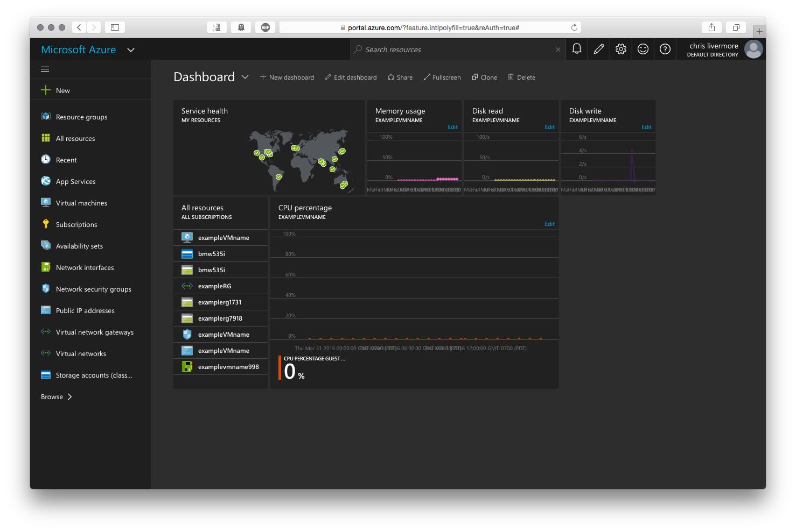
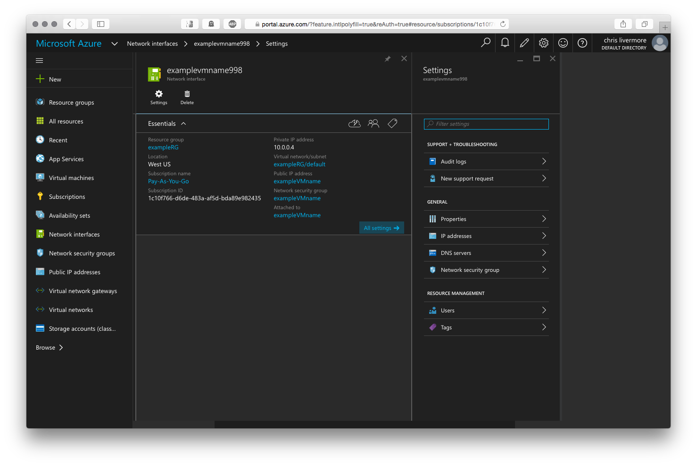
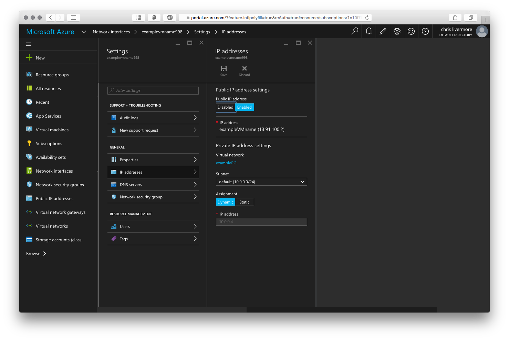

<properties
    pageTitle="Create a Linux VM using the Azure Portal | Microsoft Azure"
    description="Create a Linux VM using the Azure Portal."
    services="virtual-machines-linux"
    documentationCenter=""
    authors="vlivech"
    manager="timlt"
    editor=""
    tags="azure-resource-manager"
/>

<tags
    ms.service="virtual-machines-linux"
    ms.workload="infrastructure-services"
    ms.tgt_pltfrm="vm-linux"
    ms.devlang="na"
    ms.topic="article"
    ms.date="04/05/2016"
    ms.author="v-livech"
/>

# Create a Linux VM using the Azure Portal

This article shows how to use the [Azure Portal](https://portal.azure.com/) to create a Linux VM right now without installing anything. The only requirements are [an Azure account](https://azure.microsoft.com/pricing/free-trial/) and [SSH public and private key files](virtual-machines-linux-mac-create-ssh-keys.md).


1. Signed into the Azure Portal with your Azure account identity, click **+ New** in the upper left corner:

    

2. Click **Virtual Machines** in the **Marketplace** categories:

    

3. Click **Ubuntu Server 14.04 LTS** from the **Featured Apps** images list, and you should see the following screen:

    

4. Verify at the bottom that the deployment model is `Resource Manager` and then click **Create**.

5. On the **Basics** page, enter:
    - a name for the VM
    - a username for the Admin User
    - the Authentication Type set to **SSH public key**
    - your SSH public Key as a string (by default, from your `~/.ssh/` directory)
    - a resource group name (to create a new deployment group) or select an existing group

    and Click **OK** to continue and choose the VM size; it should look something like the following:

    

7. Choose the **DS1** size, which installs Ubuntu on a Premium SSD, and click **Select** to configure settings.

    

9. In **Settings**, leave the defaults for Storage and Network values, and click **OK** to view the summary.

    

11. Confirm the settings for your new Ubuntu VM, and click **OK**.

    

13. Open the Portal Dashboard

    

14. Add exampleVMname tiles to the Azure Dashboard

    

15. Click the Network interfaces menu item to load the exampleVMname NIC

    

16. Open the IP addresses menu under the NIC settings

    

17. SSH into the public IP using your SSH public key

```
user@slackware$ ssh -i ~/.ssh/azure_id_rsa ubuntu@13.91.100.2
```

## Next Steps

If you want, go ahead and [add a disk](virtual-machines-linux-add-disk.md).
