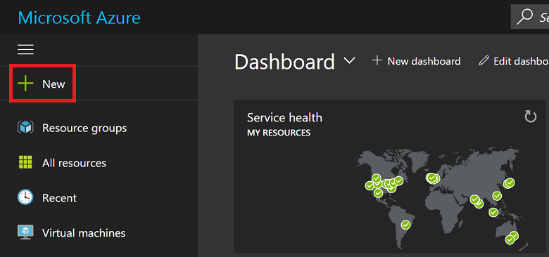
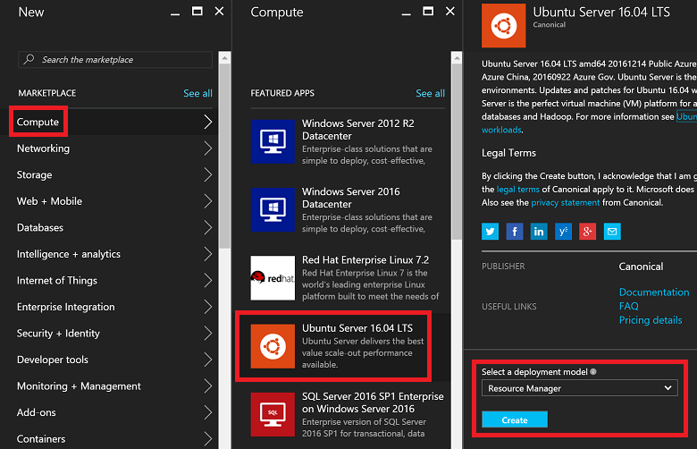
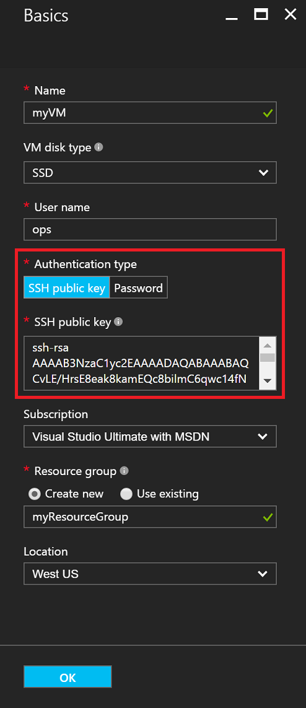
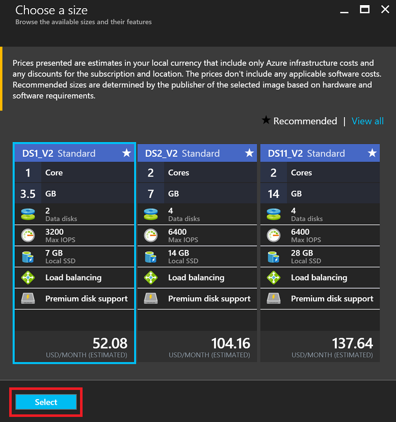
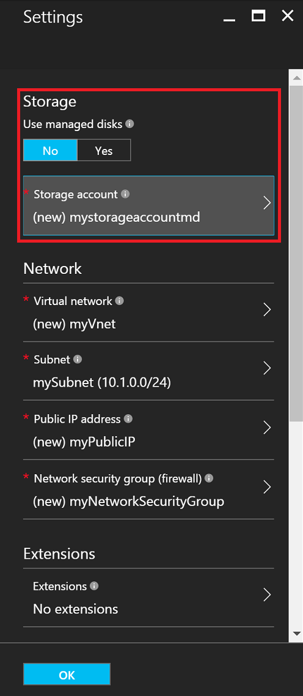
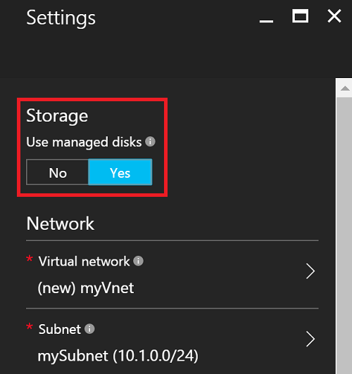
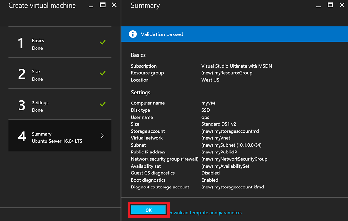
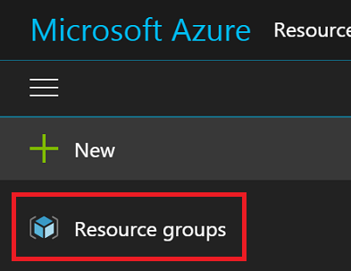
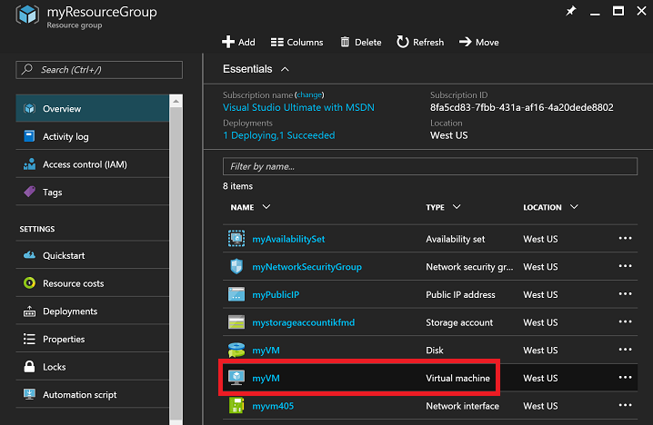
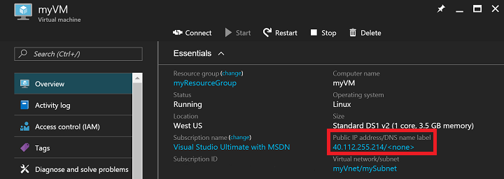

# Create a Linux VM on Azure using the Portal
This article shows you how to use the [Azure portal](https://portal.azure.com/) to create a Linux Virtual Machine.

The requirements are:

* [an Azure account](https://azure.microsoft.com/pricing/free-trial/)
* [SSH public and private key files](virtual-machines-linux-mac-create-ssh-keys.md?toc=%2fazure%2fvirtual-machines%2flinux%2ftoc.json)

## Sign in
Sign into the Azure portal with your Azure account identity. Click **+ New** in the upper left corner:



## Choose VM
Click **Compute** in the **Marketplace** then select **Ubuntu Server 16.04 LTS** from the **Featured Apps** images list.  Verify at the bottom that the deployment model is `Resource Manager` and then click **Create**.



## Enter VM options
On the **Basics** page, enter:

* a name for the VM
* the VM disk type (SSD by default, or HDD)
* a username for the admin user
* set the **Authentication Type** to **SSH public key**
* your SSH public key as a string (from your `~/.ssh/` directory)
* a resource group name, or select an existing resource group

and click **OK** to continue. The blade should look something like the following screenshot:



## Choose VM size
Choose a VM size. The following examples chooses **DS1_V2 Standard** which installs Ubuntu on a Premium SSD. The **S** in the VM size notates SSD support. Click **Select** to configure settings.



## Storage and network
In the **Settings** blade, you can elect to use Azure Managed Disks for your VM. The current default setting is to use non-managed (native) disks. Azured Managed Disks are handled by the Azure platform and do not require any preparation or location to store them. For more information about Azure Managed Disks, see [insert link to overview doc](). For non-managed disks, you need to create or select a storage for your virtual hard disks:



If you choose to use Azure Managed Disks, there are no additional storage options to configure, as shown in the following example:



Leave the remainder of the networking settings as default.

## Confirm VM settings and launch
Confirm the settings for your new Ubuntu VM, and click **OK**.



## Select the VM resource
Open the Portal home page, and select **Resource groups** from the menu in the upper left corner. If needed, click the three bars at the top of the menu to expand out the list as follows:



Select your resource group, then click on your new VM:



## Find the public IP
View the **Public IP address** assigned to your VM:



## SSH to the VM
SSH into the public IP using your SSH public key.  From a Mac or Linux workstation, you can SSH directly from the Terminal. If you are on a Windows workstation, you need to use PuTTY, MobaXTerm or Cygwin to SSH to Linux.  If you have not already, here is a doc that gets your Windows workstation ready to SSH to Linux.

[How to Use SSH keys with Windows on Azure](virtual-machines-linux-ssh-from-windows.md?toc=%2fazure%2fvirtual-machines%2flinux%2ftoc.json)

```
ssh -i ~/.ssh/azure_id_rsa ubuntu@13.91.99.206
```

## Next Steps
Now you've created a Linux VM quickly to use for testing or demonstration purposes. To create a Linux VM customized for your infrastructure, you can follow any of these articles.

* [Create a Linux VM on Azure using Templates](virtual-machines-linux-cli-deploy-templates.md?toc=%2fazure%2fvirtual-machines%2flinux%2ftoc.json)
* [Create an SSH Secured Linux VM on Azure using Templates](virtual-machines-linux-create-ssh-secured-vm-from-template.md?toc=%2fazure%2fvirtual-machines%2flinux%2ftoc.json)
* [Create a Linux VM using the Azure CLI](virtual-machines-linux-create-cli-complete.md?toc=%2fazure%2fvirtual-machines%2flinux%2ftoc.json)

