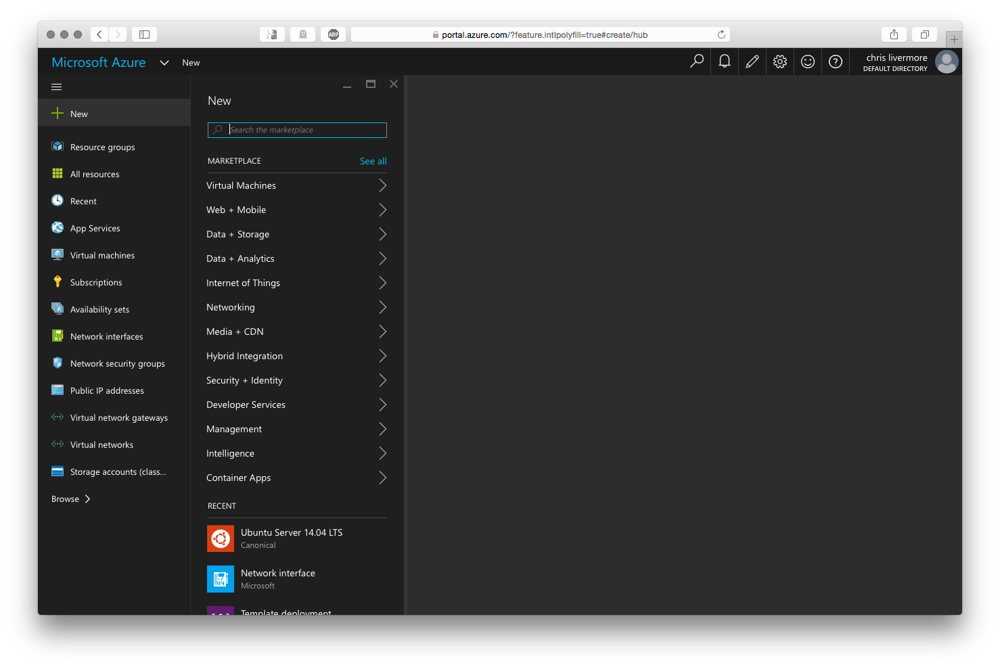
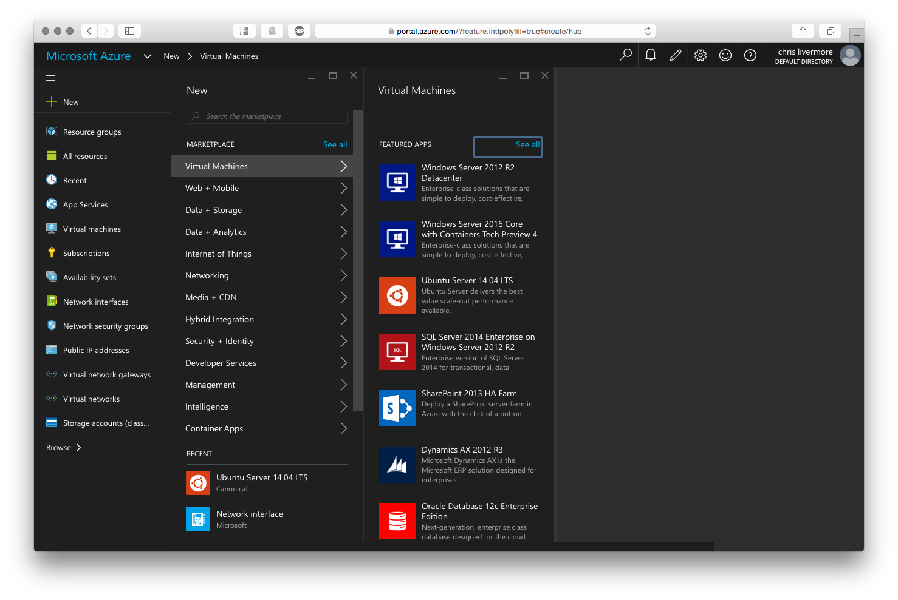
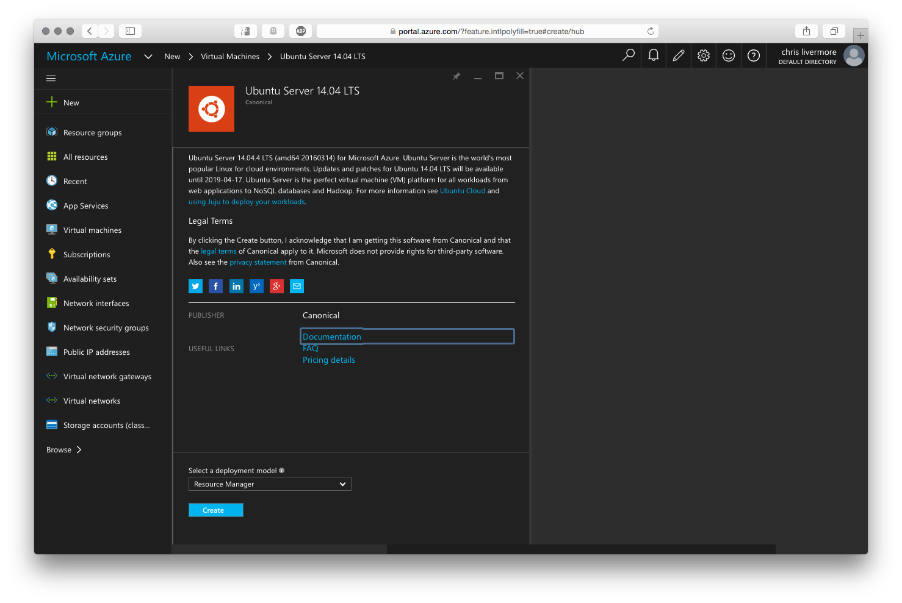
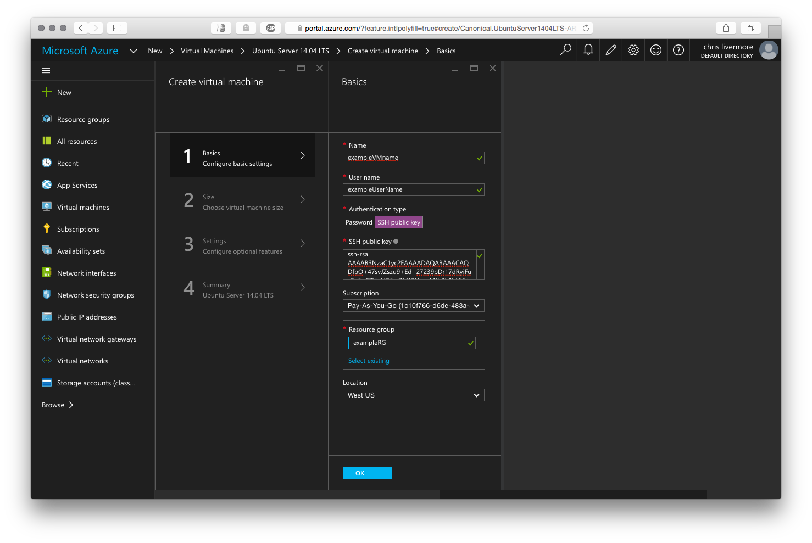
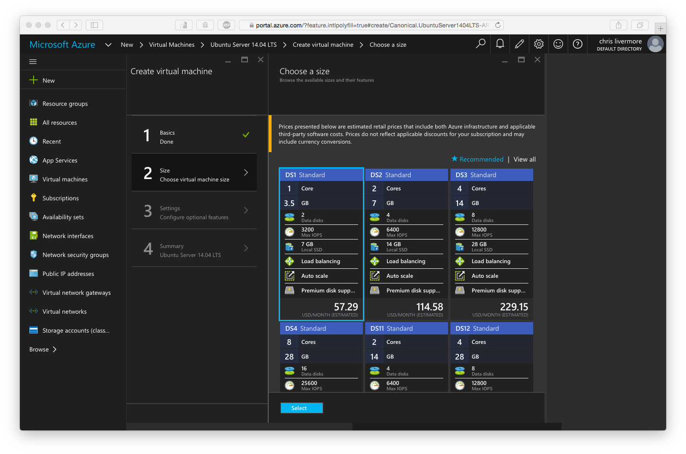
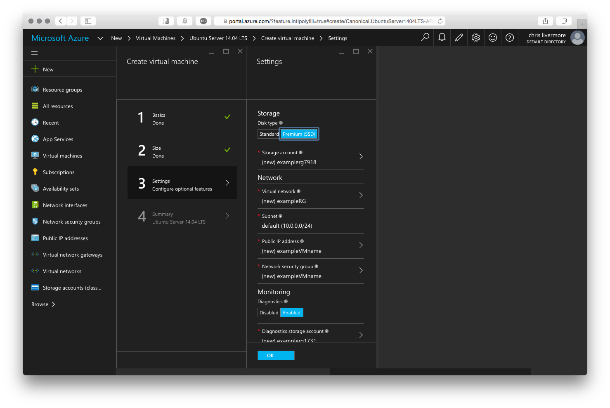
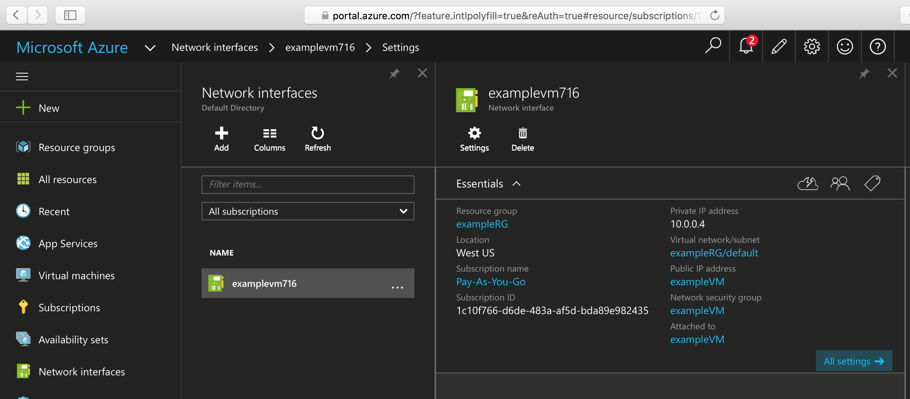
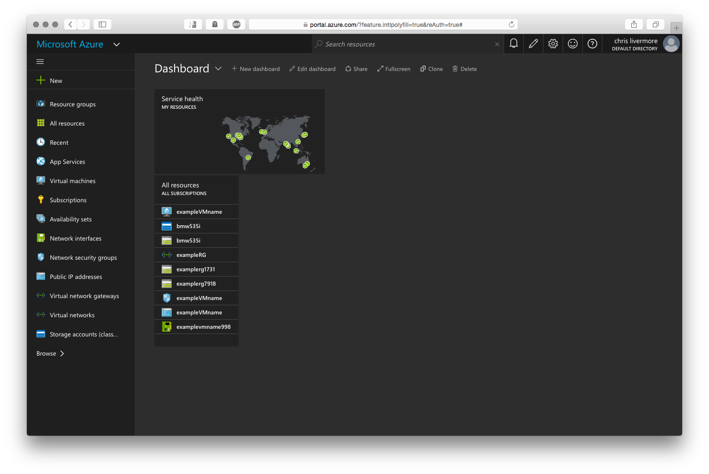

<properties
    pageTitle="Create a Linux VM using the Azure Portal | Microsoft Azure"
    description="Create a Linux VM using the Azure Portal."
    services="virtual-machines-linux"
    documentationCenter=""
    authors="vlivech"
    manager="timlt"
    editor=""
    tags="azure-resource-manager"
/>

<tags
    ms.service="virtual-machines-linux"
    ms.workload="infrastructure-services"
    ms.tgt_pltfrm="vm-linux"
    ms.devlang="na"
    ms.topic="hero-article"
    ms.date="04/29/2016"
    ms.author="v-livech"
/>

# Create a Linux VM on Azure using the Portal

This article shows how to use the [Azure Portal](https://portal.azure.com/) to create a Linux Virtual Machine quickly. The only requirements are [an Azure account](https://azure.microsoft.com/pricing/free-trial/) and [SSH public and private key files](virtual-machines-linux-mac-create-ssh-keys.md).

> [AZURE.NOTE] If you choose to use a password to secure access to your VM, the password must be greater than 12 characters, and have at least one upper case character, at least one lowercase character, at least one special character, and at least one number. 


1. Signed into the Azure Portal with your Azure account identity, click **+ New** in the upper left corner:

    

2. Click **Virtual Machines** in the **Marketplace** then **Ubuntu Server 14.04 LTS** from the **Featured Apps** images list.  Verify at the bottom that the deployment model is `Resource Manager` and then click **Create**.

    

3. On the **Basics** page, enter:
    - a name for the VM
    - a username for the Admin User
    - the Authentication Type set to **SSH public key**
    - your SSH public Key as a string (by default, from your `~/.ssh/` directory)
    - a resource group name (to create a new deployment group) or select an existing group

    and Click **OK** to continue and choose the VM size; it should look something like the following:

    

4. Choose the **DS1** size, which installs Ubuntu on a Premium SSD, and click **Select** to configure settings.

    

5. In **Settings**, leave the defaults for Storage and Network values, and click **OK** to view the summary.  Notice the disk type has been set to Premium SSD by choosing DS1, the **S** notates SSD.

    

6. Confirm the settings for your new Ubuntu VM, and click **OK**.

    

7. Open the Portal Dashboard and in **Network interfaces** choose your NIC

    

8. Open the Public IP addresses menu under the NIC settings

    

9. SSH into the public IP using your SSH public key

```
ssh -i ~/.ssh/azure_id_rsa ubuntu@13.91.99.206
```

## Next Steps

Now you've created a Linux VM quickly to use for testing or demonstration purposes. To create a Linux VM customized for your infrastructure you can follow any of the articles below.

- [Create a Linux VM on Azure using Templates](virtual-machines-linux-cli-deploy-templates.md)
- [Create a SSH Secured Linux VM on Azure using Templates](virtual-machines-linux-create-ssh-secured-vm-from-template.md)
- [Create a Linux VM using the Azure CLI](virtual-machines-linux-create-cli-complete.md)

Those articles will get you started in building an Azure infrastructure as well as any number of proprietary and open-source infrastructure deployment, configuration, and orchestration tools.
