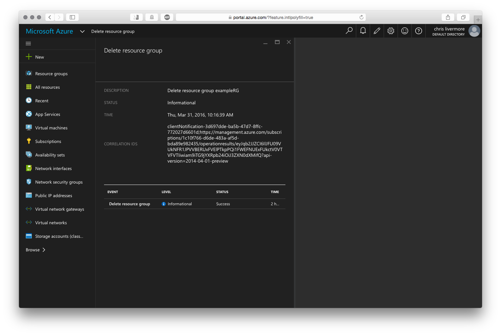

<properties
    pageTitle="Quick Create a Linux VM using the Azure Portal | Microsoft Azure"
    description="Quick Create a Linux VM using the Azure Portal."
    services="virtual-machines-linux"
    documentationCenter=""
    authors="vlivech"
    manager="timlt"
    editor=""
    tags="azure-resource-manager"
/>

<tags
    ms.service="virtual-machines-linux"
    ms.workload="infrastructure-services"
    ms.tgt_pltfrm="vm-linux"
    ms.devlang="na"
    ms.topic="article"
    ms.date="03/15/2016"
    ms.author="v-livech"
/>

# Create a Linux VM using the Azure Portal

In this article we are going to "Quick Create" a Linux VM using the [Azure Portal](https://portal.azure.com/).

Prerequisites are: [an Azure account](https://azure.microsoft.com/pricing/free-trial/) and [SSH public and private keys](virtual-machines-linux-mac-create-ssh-keys.md).

## Introduction

One of the most basic and most common task with Azure is creating a VM.  This article will walk you through creating an Ubuntu VM using just the Azure Portal. We are following security best practices by using SSH keys to login.

## Detailed Walk Through

  1. Click New

    

  2. Click Virtual Machines

    

  3. Click Ubuntu Server 14.04 LTS

    

  4. Verify the deployment model is `Resource Manager` and then click Create

  5. Fill out:
    - Name of the VM    
    - Username for the Admin User
    - Authentication Type set to `SSH public key`
    - Copy and paste the Public Key from your `~/.ssh/` directory
    - Resource Group Name or select an existing RG

  6. Click OK

    

  7. Choose the DS1 size which allows for a Premium SSD to install Ubuntu on

  8. Click select

    

  9. Leave the defaults for Storage and Network naming

  10. Click OK

    

  11.  Verify the settings for the new Ubuntu VM

  12. Click OK

    

  13. Open the Portal Dashboard

    

  14. Add exampleVMname tiles to the Azure Dashboard

    

  15. Click the Network interfaces menu item to load the exampleVMname NIC

    

  16. Open the IP addresses menu under the NIC settings

    

  17. SSH into the public IP using your SSH public key

    ```
    user@slackware$ ssh -i ~/.ssh/azure_id_rsa ubuntu@13.91.100.2
    ```
