<properties
   pageTitle="Quickstart Guide for manual installation of SAP HANA on Azure VMs | Microsoft Azure"
   description="Quickstart Guide for manual installation of SAP HANA on Azure VMs"
   services="virtual-machines,virtual-network,storage"
   documentationCenter="saponazure"
   authors="hermanndms"
   manager="juergent"
   editor=""
   tags="azure-resource-manager"
   keywords=""/>
<tags
   ms.service="virtual-machines"
   ms.devlang="NA"
   ms.topic="campaign-page"
   ms.tgt_pltfrm="vm-linux"
   ms.workload="na"
   ms.date="07/26/2016"
   ms.author="hermannd"/>

# Introduction

This quickstart guide will help to set up a single-instance SAP HANA prototype/demo system on 
Azure VMs by a manual installation of SAP NetWeaver 7.5 and SAP HANA SP12.
The guide presumes that the reader is familiar with Azure IaaS basics like how to deploy
virtual machines or virtual networks either via the Azure portal or Powershell/CLI 
including the option to use json templates. Furthermore it's expected that the reader is
familiar with SAP HANA, SAP NetWeaver and how to install it on-premises.

It's expected that the reader is aware of the general SAP-Azure documentation mentioned in
the general information section at the end of the article.

Due to the restriction to non-production systems this guide will not cover topics like HA, 
backup, DR, high performance or special security considerations.

The sample setup was done using two virtual machines to accomplish a distributed SAP NetWeaver
installation using the Azure Resource Manager model ( ARM ) as SAP-Linux-Azure is only supported 
on ARM and not the classic model. Links to further information about ARM can be also found in the
general information section at the end of this article.

These were the two test VMs used for the sample installation :

* hana-appsrv ( type DS3 V2 ) to host the NW 7.5 ASCS instance + PAS
* hana-dbsrv  ( type GS4 ) to host HANA SP12
* both VMs belonged to one Azure virtual network ( azure-hana-test-vnet )
* OS in both cases was SLES 12 SP1

Here are two screenshots from the Azure portal to show the two test VMs :

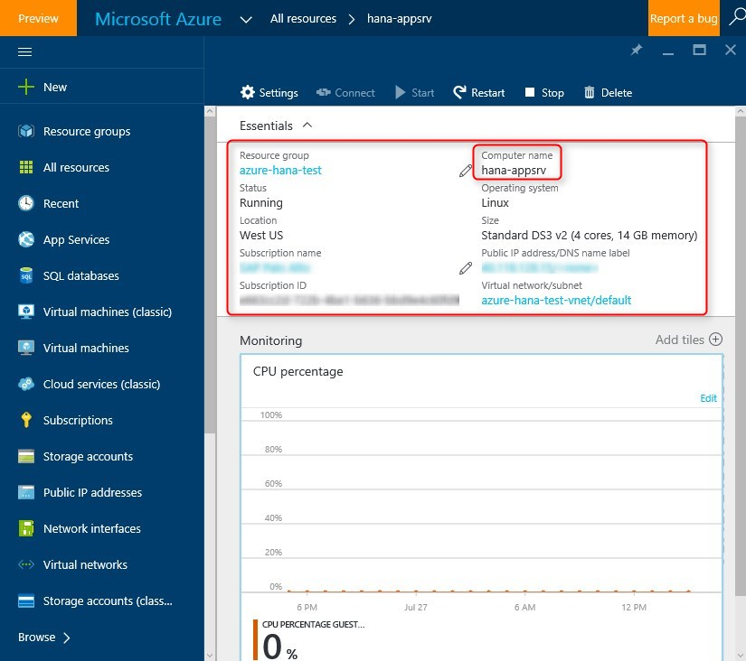

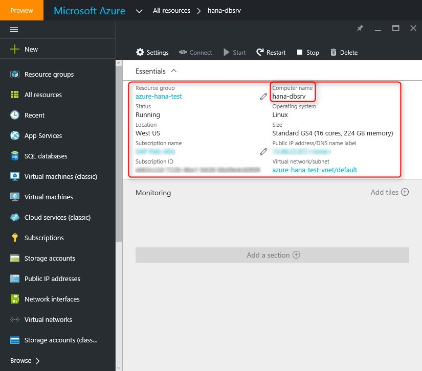

Be aware of the fact though that as of July 2016 SAP HANA is only fully supported for
OLAP ( BW ) production systems on Azure VM type GS5. For testing purposes where one is
not expecting official SAP support it's fine to use something smaller like e.g. GS4.
What should always be used for SAP HANA on Azure is Azure premium storage for HANA data
and log files - see the "Disk Setup" section further down. Regarding further details about 
which SAP products are supported on Azure please check the general information section at 
the end of this article.

The guide describes two different ways to manually install SAP HANA on Azure VMs :

* install SAP HANA via SAP Software Provisioning Manager ( SWPM ) as part of a distributed installation in the "database instance" step
* install SAP HANA using the HANA Life Cycle Manager tool hdblcm

Before starting an installation the next section about setting up the Azure test VMs should be read 
to avoid several basic mistakes which will happen when using only a default Azure VM configuration.

# Prepare Azure VMs for installation of SAP HANA and NetWeaver 7.5

## Disk Setup

The root filesystem in a Linux VM on Azure is of limited size. Therefore it's necessary to attach
additional disk space to a VM for running SAP. In the case of a SAP app server VM used in a pure
prototype/demo environment it's fine to use Azure standard storage disks. Whereas for the SAP 
HANA DB data and log files - Azure Premium storage disks should be used even in a non-production landscape.

Depending on the size of the system and throughput requirements it might be necessary to attach multiple
disks instead of one and later on create a stripe set across those disks on OS level. These are the two
aspects why one would create a stripe set across multiple Azure disks :

* increase throughput
* need a single filesystem > 1TB as the current Azure disk size limit is 1TB

More information regarding the two main tools to configure striping can be found here :

Blog which describes how to configure Linux software raid using mdadm :

[https://azure.microsoft.com/documentation/articles/virtual-machines-linux-configure-raid/](https://azure.microsoft.com/documentation/articles/virtual-machines-linux-configure-raid/)

Blog which describes hwo to configure Logical Volume Manager on a Linux VM in Azure :

[https://azure.microsoft.com/documentation/articles/virtual-machines-linux-configure-lvm/](https://azure.microsoft.com/documentation/articles/virtual-machines-linux-configure-lvm/)

In the test environment two Azure standard storage disks were attached to the SAP app server VM. One
was used to store all the SAP software for installation ( e.g. NetWeaver 7.5, SAP GUI, SAP HANA .... ) 
and the other one to have enough space for whatever might be required ( e.g. backup, test data ) as
well as the sapmnt directory ( e.g. SAP profiles ) to be shared among all VMs which belong to the same 
SAP landscape.

Contrary to the app server VM four disks were attached to the SAP HANA server VM. Like before two disks
were used for keeping the SAP software ( one could also share the SAP software disk via NFS ) and 
having enough space e.g. for backup. The additional two disks were Azure Premium storage disks to keep
SAP HANA data and log files as well as the /usr/sap directory.

## Kernel parameters

SAP HANA requires specific Linux kernel settings which are not part of the standard Azure gallery images
and have to be set manually. There is a specific SAP note which describes the settings. 

SAP Note SAP HANA DB : Recommended OS settings for SLES 12 / SLE for SAP Applications 12 :
[https://launchpad.support.sap.com/\#/notes/2205917](https://launchpad.support.sap.com/#/notes/2205917)

SLES 12 has a new tool which replaces the old sapconf utility. It's "tuned-adm" and there is a special
SAP HANA profile to be used. One can find more details about this tool following the two links below.

SLES documentation about tuned-adm profile sap-hana :
[https://www.suse.com/documentation/sles-for-sap-12/book_s4s/data/sec_s4s_configure_sapconf.html](https://www.suse.com/documentation/sles-for-sap-12/book_s4s/data/sec_s4s_configure_sapconf.html)

SLES documentation about tuned-adm profile sap-hana - chapter 6.2 Tuning Systems for SAP Workloads with tuned-adm 
[https://www.suse.com/documentation/sles-for-sap-12/pdfdoc/book_s4s/book_s4s.pdf](https://www.suse.com/documentation/sles-for-sap-12/pdfdoc/book_s4s/book_s4s.pdf)

Here one can see how "tuned-adm" changed the transparent_hugepage as well as the numa_balancing values
according to the required SAP HANA settings.

To make the SAP HANA kernel settings permanent one has to use grub2 on SLES 12. Here is a link to the
SLES documentation describing grub2 :

[https://www.suse.com/documentation/sled-12/book_sle_admin/data/sec_grub2_file_structure.html](https://www.suse.com/documentation/sled-12/book_sle_admin/data/sec_grub2_file_structure.html)

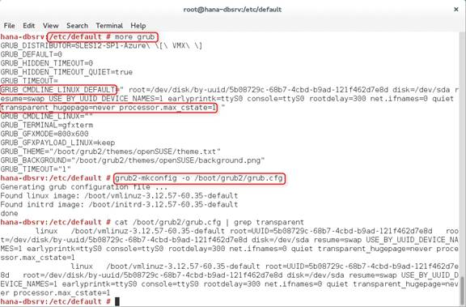

This screenshot shows how the kernel settings were changed in the config file and then "compiled" via
grub2-mkconfig

Another option would be to change the settings via Yast and the Boot Loader kernel parameter settings.

## Filesystems 

Here one can see the two file systems which were created on the SAP app server VM on top of the two
attached Azure standard storage disks. Both filesystems are of type XFS and mounted to /sapdata and
/sapsoftware.

It is not mandatory to do it this way. There are different options how to sturcture the disk space.
The most important aspect is to avoid that the root filesystem runs out of space. 

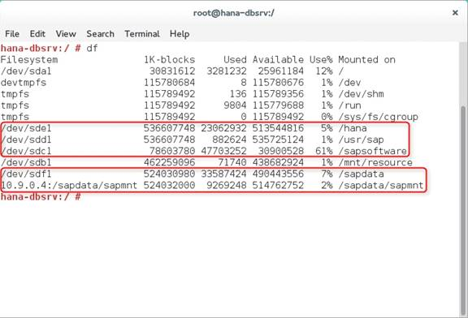

Regarding the SAP HANA DB VM it's important to know that during a database installation via sapinst
( swpm ) and just using the simple "typical" installation option it will install stuff by default
under /hana and /usr/sap. The default setting for SAP HANA log backup is e.g. under /usr/sap.
Like before it's key to avoid that the root filesystem runs out of space. Therefore one should make
sure that there is enough free space under /hana and /usr/sap before installing SAP HANA via swpm.

This article from SAP describes the standard filesystem layout of SAP HANA :

[http://help.sap.com/saphelp_hanaplatform/helpdata/en/4c/24d332a37b4a3caad3e634f9900a45/frameset.htm](http://help.sap.com/saphelp_hanaplatform/helpdata/en/4c/24d332a37b4a3caad3e634f9900a45/frameset.htm)

When installing SAP NetWeaver on a standard SLES 12 Azure gallery image there will be a message that
there is no swap space. To get rid of this message one could e.g. manually add a swap file as
described in this document via dd, mkswap and swapon :

[https://www.suse.com/documentation/sled-12/book_sle_deployment/data/sec_yast2_i_y2_part_expert.html](https://www.suse.com/documentation/sled-12/book_sle_deployment/data/sec_yast2_i_y2_part_expert.html)

Another option is to configure swap space via the Linux VM agent. More information can be found here :

[https://azure.microsoft.com/en-us/documentation/articles/virtual-machines-linux-agent-user-guide/](https://azure.microsoft.com/en-us/documentation/articles/virtual-machines-linux-agent-user-guide/)

## /etc/hosts

Another important aspect before starting to install SAP is to include host names and IP addresses of the
SAP VMs in the /etc/hosts file. One should deploy all the SAP VMs within one Azure virtual network and then
use the internal IP addresses.

## /etc/fstab

During the testing phase it turned out to be a good idea to add the nofail parameter to fstab. If something
goes wrong with the disks then the VM would still come up and not hang in the boot process. But one has to
watch out as in this case the additional disk space might not be available and processes could fill up the
root filesystem. In case /hana would be missing SAP HANA wouldn't start though at all.

## Graphical desktop

### Installation of Gnome desktop and xrdp on SLES 12

Especially for those who have Microsoft Windows background and would like to use a graphical desktop directly
within the SAP Linux VMs to run Firefox, Sapinst, SAP GUI, SAP MC or HANA Studio and maybe connect to the VM 
via RDP from a Microsoft Windows computer there is a simple way to achieve this. While this might not be 
appropriate e.g. for a production database server it's ok for a pure prototype/demo environment. Here
are the steps to install the Gnome desktop on an Azure SLES 12 VM :

install the gnome desktop by the following command ( e.g. in a putty window ) :

   zypper in -t pattern gnome-basic

then install xrdp to allow connection to the VM via RDP :

   zypper in xrdp

edit /etc/sysconfig/windowmanager and set the default windows manager to Gnome :

   DEFAULT_WM="gnome"

run chkconfig to make sure that xrdp starts automatically after a reboot : 

  chkconfig -level 3 xrdp on

in case there should be an issue with the RDP connection try to restart ( maybe out of a putty window ) :

  /etc/xrdp/xrdp.sh restart

in case the xrdp restart as mentioned above doesn't work check if there is a .pid file and remove it :

  check /var/run  and look for xrdp.pid   
  remove it and then try the restart again

### SAP MC

To start the graphical Java-based SAP MC out of Firefox running in an Azure SLES 12 VM after installing
the Gnome dekstop as described in the previous section one will get an error due to missing Java-browser
plugin.

The URL to start the SAP MC is <server>:5<instance_number>13

More details can be found here :

[https://help.sap.com/saphelp_nwce10/helpdata/en/48/6b7c6178dc4f93e10000000a42189d/frameset.htm](https://help.sap.com/saphelp_nwce10/helpdata/en/48/6b7c6178dc4f93e10000000a42189d/frameset.htm)

On the screenshot above one can see how the error message could look like when the Java-Browser plugin
is missing. 

One option to solve the problem is simply to install the missing plugin via Yast.

Repeating the SAP MC URL will bring up a little dialog the first time asking to activate the plugin.

One additional issue which might pop up is an error message regarding a missing file :  javafx.properties
This is very likely related to the installation of Java 1.8 which is required for SAP GUI 7.4

The IBM Java version seen via Yast doesn't include this file. The solution is a Java download from Oracle.
Here is an article which talks about this specific issue :

[https://scn.sap.com/thread/3908306](https://scn.sap.com/thread/3908306)

# Manual SAP HANA installation on Azure VMs

## SAP HANA installation via SWPM as part of a NetWeaver 7.5 installation

The following list of screenshots shows the key steps of installing SAP NetWeaver 7.5 and SAP HANA SP12
via SWPM ( sapinst ). As part of a NW 7.5 installation SWPM has the capabilities to also install the HANA
database as a single instance.
 

For the sample test environment just an ABAP app server was installed. The option "Distributed System"
was used to install the ASCS instance and the Primary App server instance in one Azure VM and SAP HANA
as the database system in an another Azure VM.

Once the ASCS instance is installed on the app server VM and is set to "green" in the SAP MC the sapmnt
directory which includes e.g. the SAP profile directory has to shared with the SAP HANA DB server VM.
The DB installation step needs access to this information. The best way is to use NFS which can be
configured using Yast.

On the app server VM the sapmnt directory should be shared via NFS by using the options "rw" as well as
"no_root_squash". Default is "ro" and "root_squash" which could lead to problems when installing the 
database instance.

On the SAP HANA DB server VM the sapmnt share from the app server VM has to be configured via "NFS client"
( e.g. with the help of Yast )

Then one has to login to the SAP HANA DB server VM and start SWPM to accomplish the next step of a
distributed NW 7.5 installation - "Database Instance".

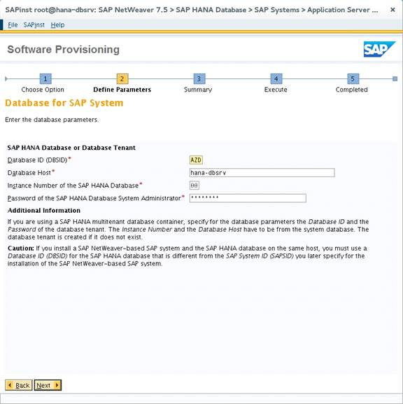

Related to the SAP HANA installation there isn't in fact too much to enter after selecting a "typical"
installation. Besides the path to the installatiom media one has to enter a DB SID, the host name, the
instance number and the DB Sys Admin password.

 

Next step is to enter the password for the DBACOCKPIT schema.

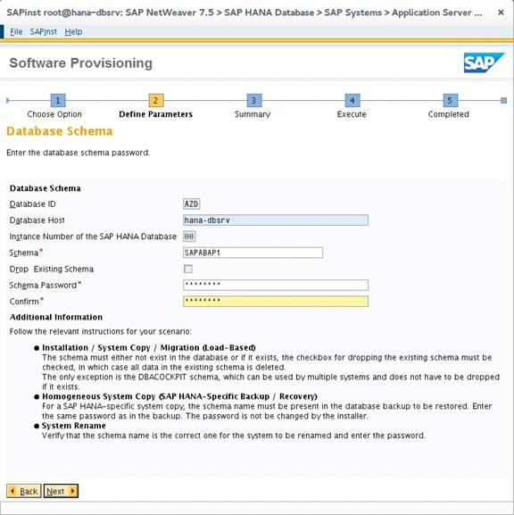

Then comes the question for the SAPABAP1 schema password.

At the end there should be only green checkmarks in front of every phase of the DB installation process
and the little message box which pops up should say "Execution of ..... Database Instance has completed".

 

After successful installation the SAP MC should also show the DB instance as "green" and the full list
of SAP HANA processes ( e.g. hdbindexserver, hdbcompileserver )

This screenshot shows parts of the file structure under /hana/shared which SWPM created during the HANA
installation. There was no option to specify a different path. Therefore it's so important to mount 
additional disk space under /hana before the SAP HANA installation via SWPM to avoid that the root
filesystem runs out of free space.

Here one can see the same thing as described before for the /usr/sap directory.

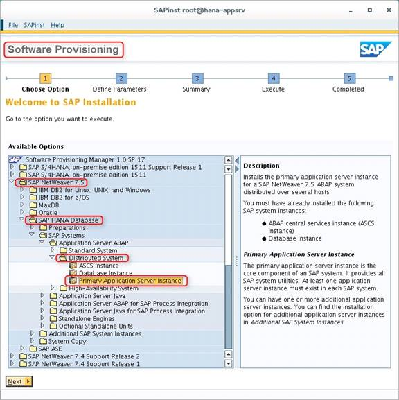

The last step of the distributed ABAP installation is the "Primary Application Server Instance"

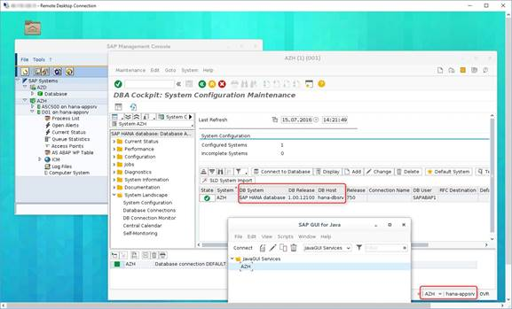

Once the PAS as well as SAP GUI got installed one can check via the transaction "dbacockpit" that
everything looks right with the SAP HANA installation.

 
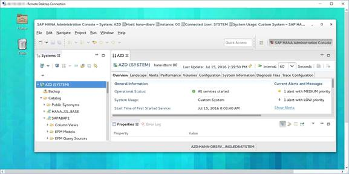

As a last step one could install SAP HANA Studio in the SAP app server VM and connect to the SAP HANA
instance running on the DB server VM.

## Manual HANA installation via HANA Life Cycle Manager hdblcm

Besides installing SAP HANA as part of a distributed installation via SWPM it's also possibe to first 
install HANA standalone using hdblcm and then install e.g. SAP NetWeaver 7.5 afterwards. The list of
screenshots below shows how this works.

Here are three sources of information about the HANA hdblcm tool :

[https://help.sap.com/saphelp_hanaplatform/helpdata/en/68/5cff570bb745d48c0ab6d50123ca60/content.htm](https://help.sap.com/saphelp_hanaplatform/helpdata/en/68/5cff570bb745d48c0ab6d50123ca60/content.htm)

[http://saphanatutorial.com/sap-hana-lifecycle-management-tools/](http://saphanatutorial.com/sap-hana-lifecycle-management-tools/)

[http://help.sap.com/hana/SAP_HANA_Server_Installation_Guide_en.pdf](http://help.sap.com/hana/SAP_HANA_Server_Installation_Guide_en.pdf)

To avoid running into problems later on with a default group id setting for the \<HANA SID\>adm user ( created
by the hdblcm tool ) one should define a new group called "sapsys" with group id 1001 before installing SAP HANA 
using hdblcm.

Starting hdblcm the first time there will be a simple start menu where one has to select item 1
"Install new System"

On this screenshot one can see all the key options which were entered before. Important - directories 
which were named for HANA log and data volumes as well as the installation path ( /hana/shared in this
sample ) and /usr/sap should NOT be part of the root filesystem but belong to Azure data disks which
were attached to the VM as described in the Azure VM setup section. This will avoid the risk that the
root filesystem might run out of space.
One can also see that the HANA admin user has user id 1005 and is part of the sapsys group ( id 1001 ) 
which was defined before the installation.

One can check the HANA \<HANA SID\>adm ( azdadm in this sample ) user details in /etc/passwd

After installing SAP HANA using hdblcm it can be seen in SAP HANA Studio. The SAPABAP1 schema which
includes e.g. all the SAP NetWeaver tables isn"t available yet.

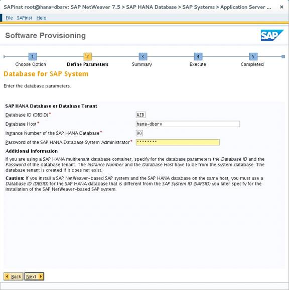

After installing SAP HANA one can install SAP NetWeaver on top of it. In this sample it was done
using a "distributed installation" via SWPM as described in the corresponding section above.
When installing the database instance via SWPM one just has to enter the same data as before
with hdblcm ( e.g. hostname, HANA SID, instance number ). SWPM will then use the existing HANA
installation and add additional schemas.

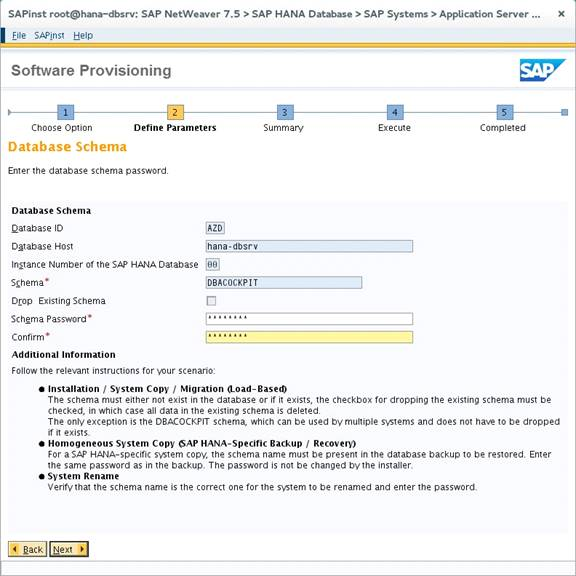

This is the picture of the SWPM installation step where one has to enter data regarding the
DBACOCKPIT schema.

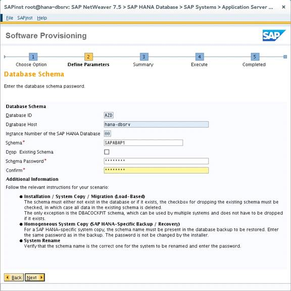

Then SWPM expects to enter data about the SAPABAP1 schema.

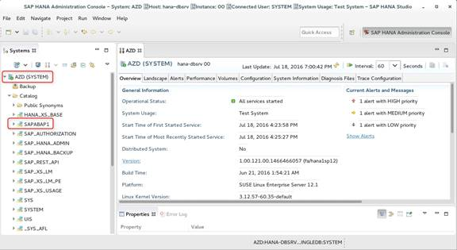

Once the SWPM database instance installation is finished one can see the SAPABAP1 schema in
HANA Studio.

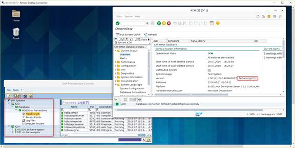

And finally after installation of the SAP app server and SAP GUI one should be able to verify 
the HANA DB instance with transaction "dbacockpit".

# Checklist SAP HANA installation via SAP SWPM

This is a simple checklist of the key items related to a manual single-instance SAP HANA installation 
for demo or prototyping pursposes via SAP SWPM doing a distributed SAP NW 7.5 install. The individual 
items are explained and shown in form of screenshots in more details throughout the article :

* create an Azure virtual network which will include the two ARM test VMs later on
* deploy two Azure VMs with OS SLES 12 SP1 via Azure Resource Manager model ( ARM )
* attach two standard storage disks to the app server VM ( e.g. 75GB and 500GB )
* attach four disks to the HANA DB server VM - 2 standard storage like for the app server VM + 
  2 premium storage disks ( e.g. 2x512GB depending on the requirements )
* create XFS file systems on the attached disks
* mount the new XFS file systems on OS level. Use one filesystem to keep all the SAP software and the
  other one e.g. for the sapmnt directory and maybe backups. On the SAP HANA DB server mount the XFS 
  file systems on the premium storage disks as /hana and /usr/sap

# Checklist SAP HANA installation via hdblcm

# General information related to SAP Azure certifications, running SAP HANA on Azure and SAP software download

general SAP Azure docu about running SAP on Azure with Windows OS in classic mode :
[https://azure.microsoft.com/en-us/documentation/articles/virtual-machines-windows-classic-sap-get-started/](https://azure.microsoft.com/en-us/documentation/articles/virtual-machines-windows-classic-sap-get-started/)

general SAP Azure docu about running SAP on Azure with Linux OS in classic mode :
[https://azure.microsoft.com/en-us/documentation/articles/virtual-machines-linux-classic-sap-get-started/](https://azure.microsoft.com/en-us/documentation/articles/virtual-machines-linux-classic-sap-get-started/)

information about existing SAP templates for usage by customers :
[https://blogs.msdn.microsoft.com/saponsqlserver/2016/05/16/azure-quickstart-templates-for-sap/](https://blogs.msdn.microsoft.com/saponsqlserver/2016/05/16/azure-quickstart-templates-for-sap/)

general SAP Azure docu about running SAP on Azure with Linux OS in ARM mode :
[https://azure.microsoft.com/en-us/documentation/articles/virtual-machines-linux-sap-get-started/](https://azure.microsoft.com/en-us/documentation/articles/virtual-machines-linux-sap-get-started/)

certified SAP HANA hardware directory which lists which Azure VM types are supported for production :
[https://global.sap.com/community/ebook/2014-09-02-hana-hardware/enEN/iaas.html](https://global.sap.com/community/ebook/2014-09-02-hana-hardware/enEN/iaas.html)

information about virtual machine sizes especially for Linux workloads :
[https://azure.microsoft.com/en-us/documentation/articles/virtual-machines-linux-sizes/](https://azure.microsoft.com/en-us/documentation/articles/virtual-machines-linux-sizes/)

SAP Note which lists all supported SAP products on Azure and supported Azure VM types for SAP :
[https://launchpad.support.sap.com/#/notes/1928533/E](https://launchpad.support.sap.com/#/notes/1928533/E)

SAP Note about SAP "enhanced monitoring" with Linux VMs on Azure :
[https://launchpad.support.sap.com/#/notes/2191498/E](https://launchpad.support.sap.com/#/notes/2191498/E)

SAP HANA offering on Azure "Large Instances". It's important to understand that this is not about running
SAP HANA on Azure VMs but in a hybrid environment where the SAP app servers run in Azure VMs but SAP HANA
runs on bare-metal servers : 
[https://launchpad.support.sap.com/#/notes/2316233/E](https://launchpad.support.sap.com/#/notes/2316233/E)

SAPOSCOL on Linux :
[https://launchpad.support.sap.com/#/notes/1102124/E](https://launchpad.support.sap.com/#/notes/1102124/E)

Key Monitoring Metrics for SAP on Microsoft Azure :
[https://launchpad.support.sap.com/#/notes/2178632/E](https://launchpad.support.sap.com/#/notes/2178632/E)

Information about Azure Resource Manager - ARM :
[https://azure.microsoft.com/documentation/articles/resource-group-overview/](https://azure.microsoft.com/documentation/articles/resource-group-overview/)

Comparison of deployment models between ARM and classic :
[https://azure.microsoft.com/documentation/articles/resource-manager-deployment-model/](https://azure.microsoft.com/documentation/articles/resource-manager-deployment-model/)

Download NetWeaver 7.5 for Linux/HANA from the SAP Service Marketplace :
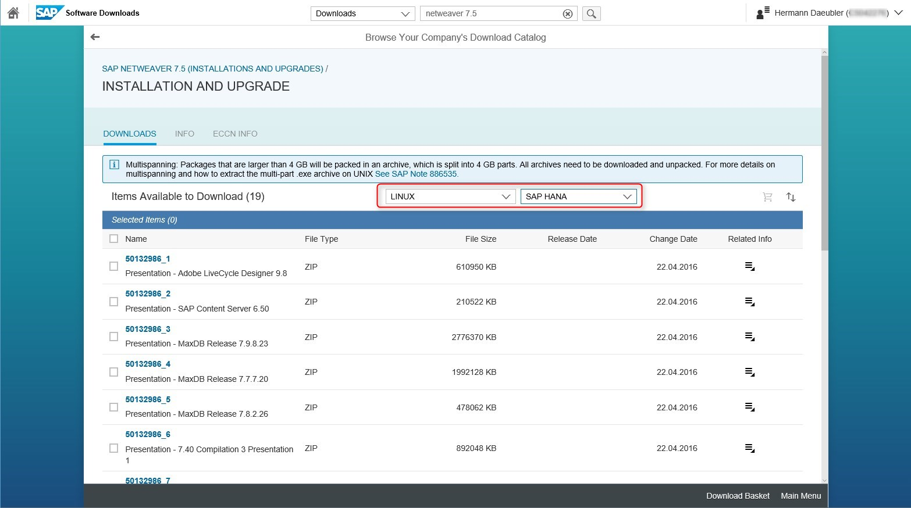

Download HANA SP12 Platform Edition from the SAP Service Marketplace :

