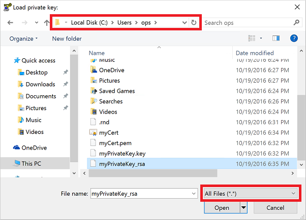
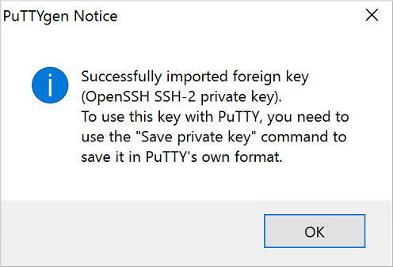
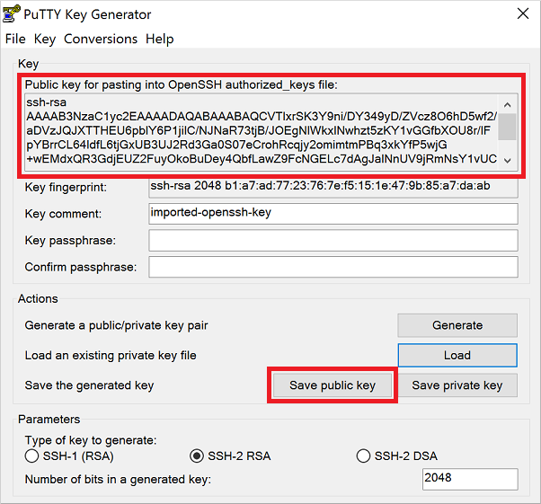
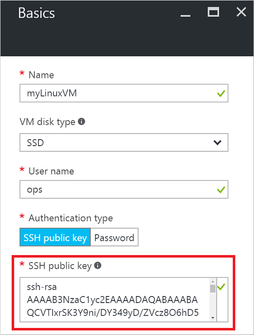
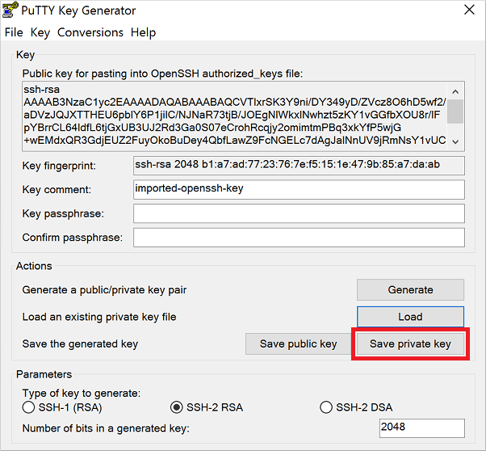
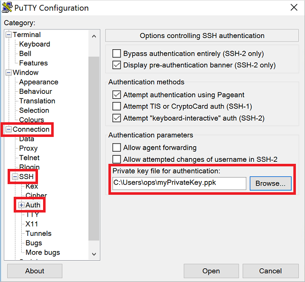

<properties 
	pageTitle="Use SSH keys with Windows for Linux VMs | Microsoft Azure" 
    description="Learn how to generate and use SSH keys on a Windows computer to connect to a Linux virtual machine on Azure." 
	services="virtual-machines-linux" 
	documentationCenter="" 
	authors="squillace" 
	manager="timlt" 
	editor=""
	tags="azure-service-management,azure-resource-manager" />

<tags 
	ms.service="virtual-machines-linux" 
	ms.workload="infrastructure-services" 
	ms.tgt_pltfrm="vm-linux" 
	ms.devlang="na" 
	ms.topic="article" 
	ms.date="10/18/2016" 
	ms.author="rasquill"/>

# How to Use SSH keys with Windows on Azure

> [AZURE.SELECTOR]
- [Windows](virtual-machines-linux-ssh-from-windows.md)
- [Linux/Mac](virtual-machines-linux-mac-create-ssh-keys.md)

When you connect to Linux virtual machines (VMs) in Azure, you can use secure shell (SSH) keys to authenticate yourself rather than a username and password. [Public-key cryptography](https://wikipedia.org/wiki/Public-key_cryptography) provides a more secure way to log in to your Linux VM in Azure than Azure. Passwords are vulnerable to brute-force attacks, especially on Internet-facing VMs such as web servers. This article provides an overview of SSH keys and how to generate the appropriate keys on a Windows computer.


## Overview of SSH keys

SSH is an encrypted connection protocol that allows secure logins over unsecured connections. It is the default connection protocol for Linux VMs hosted in Azure. Although SSH itself provides an encrypted connection, using passwords with SSH connections still leaves the VM vulnerable to brute-force attacks or guessing of passwords. A more secure, and preferred, method of connecting to a VM using SSH is through the use crytographic keys, also known as SSH keys.

You can securely log in to your Linux VM by using public and private keys:

- The **public key** is placed on your Linux VM, or any other service that you wish to use with public-key cryptography.
- The **private key** is what you present to your Linux VM when you log in, to verify your credentials.

For a more detailed overview, see [public-key cryptography](https://wikipedia.org/wiki/Public-key_cryptography).

You connect to and manage Linux VMs in Azure using an **ssh** client. Windows computers do not typically have an **ssh** client installed. Common Windows clients you can install are included in the following packages:

- [puTTY](http://www.chiark.greenend.org.uk/~sgtatham/putty/)
- [Git For Windows](https://git-for-windows.github.io/)
- [MobaXterm](http://mobaxterm.mobatek.net/)
- [Cygwin](https://cygwin.com/)

> [AZURE.INFO] The latest Windows 10 Anniversary Update includes Bash for Windows. This feature allows you to run the Windows Subsystem for Linux and access utilities such as an SSH client. Bash for Windows is still under development, and is considered a beta release. For more information about Bash for Windows, see [Bash on Ubuntu on Windows](https://msdn.microsoft.com/commandline/wsl/about).


## Which key files do you need to create?

Azure requires at least 2048-bit, **ssh-rsa** format public and private keys. If you are managing resources using the Classic deployment model, you also need to generate a PEM (`.pem` file).

Here are the deployment scenarios, and the types of files you use in each:

1. **ssh-rsa** keys are required for any deployment using the [Azure portal](https://portal.azure.com), and Resource Manager deployments using the [Azure CLI](../xplat-cli-install.md).
    - These keys are usually all most people need.
2. `.pem` file is required to create VMs using the [Classic portal](https://manage.windowsazure.com). These keys are also supported in Classic deployments that use the [Azure CLI](../xplat-cli-install.md).
    - You only need to create these additional keys and certificates if you are managing resources created using the Classic deployment model.


## Install Git for Windows

The preceding section listed several utilities that include an `ssh-keygen` and `openssl` for Windows. The following example details how to install Git for Windows, though you can choose whichever package you prefer:

1. Download and install **Git for Windows** from the following location: [https://git-for-windows.github.io/](https://git-for-windows.github.io/).
    - Accept the default options during the install process unless you specifically need to change them.
2. Run **Git Bash** from the **Start Menu** > **Git** > **Git Bash**. The console looks similar to the following example:

    


## Create a private key using Git for Windows

1. In your **Git Bash** window, use `openssl.exe` to create a private key. The following example creates a key named `myPrivateKey` and certificate named `myCert.pem`:

    ```bash
    openssl.exe req -x509 -nodes -days 365 -newkey rsa:2048 \
        -keyout myPrivateKey.key -out myCert.pem
    ```

    The output looks similar to the following example:

    ```bash
    Generating a 2048 bit RSA private key
    .......................................+++
    .......................+++
    writing new private key to 'myPrivateKey.key'
    -----
    You are about to be asked to enter information that will be incorporated
    into your certificate request.
    What you are about to enter is what is called a Distinguished Name or a DN.
    There are quite a few fields but you can leave some blank
    For some fields there will be a default value,
    If you enter '.', the field will be left blank.
    -----
    Country Name (2 letter code) [AU]:
    ```

2. Answer the prompts for country name, location, organization name, etc.

3. Your new private key and certificate are created in your current working directory. For security best practices, you should also set permissions on your private key so that only you can access it:

    ```bash
    chmod 0600 myPrivateKey
    ```

4. If you also need to manage Classic resources, convert the `myCert.pem` to `myCert.cer` (DER encoded X509 certificate). Perform this optional step only if you need to specifically manage older Classic resources. 

    Convert the certificate using the following command:

    ```bash
    openssl.exe  x509 -outform der -in myCert.pem -out myCert.cer
    ```

## Create a private key for PuTTY ##

PuTTY is a common SSH client for Windows. You are free to use any SSH client that you wish. In order to use PuTTY, you create an additional type of key - a PuTTY Private Key (PPK). If you do not wish to use PuTTY, skip this section.

The following example creates this additional private key specifically for PuTTY to use:

1. PuTTYgen may not be able to read the private key that you created in the previous section. Use **Git Bash** to convert the key into an RSA private key that PuTTYgen can understand. The following example creates a key named `myPrivateKey_rsa` from the existing key named `myPrivateKey`:

    ```bash
    openssl rsa -in ./myPrivateKey.key -out myPrivateKey_rsa
    ```

    For security best practices, you should also set permissions on your private key so that only you can access it:

    ```bash
    chmod 0600 myPrivateKey_rsa
    ```

2. Download and run PuTTYgen from the following location: [http://www.chiark.greenend.org.uk/~sgtatham/putty/download.html](http://www.chiark.greenend.org.uk/~sgtatham/putty/download.html)

3. Click the menu: **File** > **Load a Private Key**

4. Locate your private key (`myPrivateKey_rsa` in the previous example). The default directory when you start **Git Bash** is `C:\Users\<username>`. Change the file filter to show **All Files (\*.\*)**:

    

5. Click **Open**. A prompt indicates that the key has been successfully imported:

    

6. Click **OK** to close the prompt.

7. The public key is displayed at the top of the **PuTTYgen** window. You copy and paste this key in to the Azure portal or Azure Resource Manager template when you create a Linux VM. You can also click **Save public key** to save a copy to your computer:

    

    The following example shows how you would copy and paste this public key in to the Azure portal when you create a Linux VM. The public key is typically stored in `~/.ssh/authorized_keys` on your new VM.

    

7. Back in **PuTTYgen**, Click **Save private Key**:

    

    A prompt asks if you wish to continue without entering a passphrase for your key. A passphrase is like a password attached to your private key. Even if someone were to obtain your private key, they still would not be able to authenticate using just the key. They would also need the passphrase. 

    If you wish to enter a passphrase, click **No**, enter a passphrase in the main PuTTYgen window, and then click **Save private key** again. Otherwise, click **Yes** to continue without providing the optional passphrase.

8. Enter a name and location to save your PPK file.


## Use Putty to Connect to a Linux Machine

Again, PuTTY is a common SSH client for Windows. You are free to use any SSH client that you wish. The following steps detail how to use your private key to authenciate with your Azure VM using SSH. The steps are similar in other SSH key clients in terms of needing to load your private key in order to authenticate the SSH connection.

1. Download and run putty from the following location: [http://www.chiark.greenend.org.uk/~sgtatham/putty/download.html](http://www.chiark.greenend.org.uk/~sgtatham/putty/download.html)

2. Fill in the host name or IP address of your VM from the Azure portal:

    ![Open new PuTTY connection]](./media/virtual-machines-linux-ssh-from-windows/putty-new-connection.png)

3. Before selecting **Open**, click **Connection** > **SSH** > **Auth** tab. Browse to and select your private key:

    

4. Click **Open** to connect to your virtual machine
 
