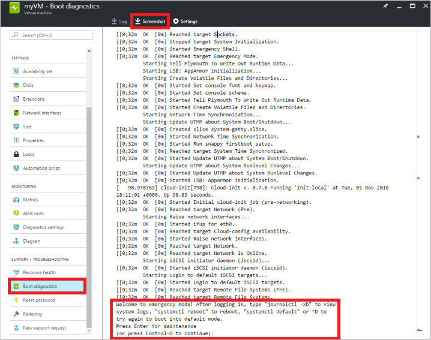
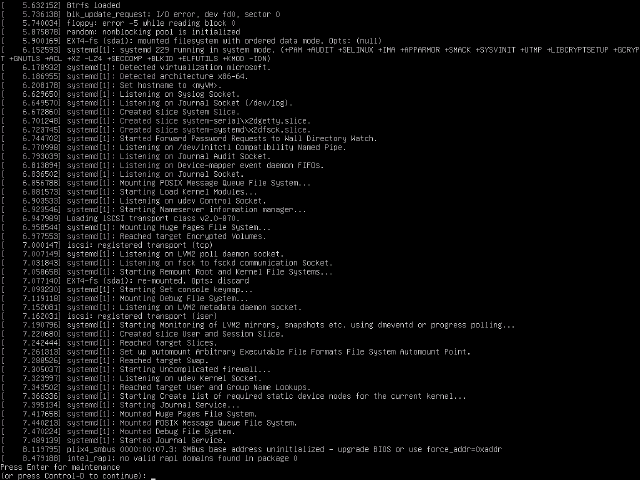

---

title: Linux disk troubleshooting using the portal | Microsoft Azure
description: Learn how to troubleshoot Linux VM issues by connecting the OS disk to a recovery VM using the Azure portal
services: virtual-machines-linux
documentationCenter: ''
authors: iainfoulds
manager: timlt
editor: ''

ms.service: virtual-machines-linux
ms.devlang: na
ms.topic: article
ms.tgt_pltfrm: vm-linux
ms.workload: infrastructure
ms.date: 11/14/2016
ms.author: iainfou

---

# Troubleshoot a Linux VM by attaching the OS disk to a recovery VM using the Azure portal
If your Linux virtual machine (VM) encounters a boot or disk error, you may need to perform troubleshooting steps on the virtual hard disk itself. A common example would be an invalid entry in `/etc/fstab` that prevents the VM from being able to boot successfully. This article details how to connect your virtual hard disk to another Linux VM in order to fix any errors, then re-create your original VM.

## Recovery process overview
The troubleshooting process is as follows:

1. Delete the VM encountering issues, keeping the virtual hard disks.
2. Attach and mount the virtual hard disk to another Linux VM, the troubleshooting VM.
3. Connect to the troubleshooting VM, edit files or run any tools to fix issues on the original virtual hard disk.
4. Unmount and detach the virtual hard disk from the troubleshooting VM.
5. Create a VM using the original virtual hard disk that should now boot correctly.


## Determine boot issues
You can examine the boot diagnostics and VM screenshot to determine why your VM may not be booting correctly. A common example would be an invalid entry in `/etc/fstab`, or an underlying virtual hard disk being deleted or moved.

Select your VM in the portal and then scroll down to the **Support + Troubleshooting** section. Click **Boot diagnostics** to view the console messages streamed from your VM. Review the console logs to see if you can determine why the VM is encountering an issue. The example below shows a VM stuck in maintenance mode that requires manual interaction:



You can also click on 'Screenshot` across the top of the boot diagnostics log to download a capture of the VM screenshot. The following example confirms that the VM is at a recovery console waiting for user interaction:




## View existing virtual hard disk details
Before you can attach your virtual hard disk to another VM, you need to identify the name of the virtual hard disk (VHD) file. 

Select your resource group from the portal, then select your storage account. Click on **Blobs**, as in the following screenshot:


Typically you will have a container named **vhds** that lists your virtual hard disks. Select the container to view a list of virtual hard disks. Note the name of your VHD (the prefix is usually the name of your VM):


Select your existing virtual hard disk from the list and copy the URL for use in one of the following steps:


## Delete existing VM
Virtual hard disks and VMs are two distinct resources in Azure. A virtual hard disk is where there OS itself, applications, and configurations are stored. The VM itself is just metadata that defines the VM size or location, and references resources such as the virtual hard disk or virtual network interface card (NIC). Each virtual hard disk has a lease assigned when attached to a VM. Although data disks can be attached and detached even while the VM is running, the OS disk cannot be detached from a VM unless the VM resource is deleted. The lease continues to associate the virtual hard disk with a VM even when that VM is in a stoppped and deallocated state.

The first step to recover your VM is to delete the VM resource itself. Again, deleting the VM leaves the virtual hard disks in your storage account. After the VM is deleted, you attach the virtual hard disk to another VM to troubleshoot and resolve the errors.

Select your VM in the portal, then click on **Delete**:


Wait until the VM has finished deleting before trying to attach the virtual hard disk to another VM. The lease on the virtual hard disk that associates it with the VM needs to be released before you can attach the virtual hard disk to another VM.


## Attach existing virtual hard disk to another VM
For the next few steps, you use another VM for troubleshooting purposes. You attach the existing virtual hard disk to this troubleshooting VM to be able to browse and edit the disk's content. This process allows you correct any configuration errors, or review additional application or system log files, for example. Choose or create another VM to use for troubleshooting purposes.

1. Select your resource group from the portal, then select your troubleshooting VM. Select **Disks** and then click **Attach existing**:

    

2. To select your existing virtual hard disk, click on **VHD File**:

    

3. Select your storage account and container, then click your existing VHD. Click the **Select** button to confirm your choice:

    

4. With your VHD now selected, click **OK** to attach the existing virtual hard disk:

    

5. After a few seconds, the **Disks** pane for your VM lists your existing virtual hard disk connected as a data disk:

    


## Mount the attached data disk

1. SSH to your troubleshooting VM using the appropriate credentials. If this is the first data disk attached to your troubleshooting VM, it is likely connected to `/dev/sdc`. Use `dmseg` to list attached disks:

    ```bash
    dmesg | grep SCSI
    ```

    In the preceding example, the OS disk is at `/dev/sda` and the temporary disk provided for each VM is at `/dev/sdb`. If you had multiple data adisks, they should be at `/dev/sdd`, `/dev/sde`, and so.

2. Create a directory to mount your existing virtual hard disk. The following example creates a directory named `troubleshootingdisk`:

    ```bash
    sudo mkdir /mnt/troubleshootingdisk
    ```

3. If you have multiple partitions on your existing virtual hard disk, mount the required partition. The following example mounts the first primary partition at `/dev/sdc1`:

    ```bash
    sudo mount /dev/sdc1 /mnt/troubleshootingdisk
    ```

    Best practice is to mount data disks on VMs in Azure using the universally unique identifier (UUID) of the virtual hard disk. For this short troubleshooting scenario, mounting the virtual hard disk using the UUID is not necessary. However, under normal use, editing `/etc/fstab` to mount virtual hard disks using device name rather than UUID may cause the VM to fail to boot.


## Fix issues on original virtual hard disk
With the existing virtual hard disk mounted, you can now perform any maintenance and troubleshooting steps as needed. Once you have addressed the issues, continue with the following steps.

## Unmount and detach original virtual hard disk
With your errors resolved, detach the existing virtual hard disk from your troubleshooting VM. Remember, you cannot use your virtual hard disk with any other VM until the lease attaching the virtual hard disk to the troubleshooting VM is released.

1. From SSH session to your troubleshooting VM, unmount the existing virtual hard disk. Change out of the parent directory for your mount point first:

    ```bash
    cd /
    ```

2. Next, unmount the existing virtual hard disk. The following example unmounts the device at `/dev/sdc1`:

    ```bash
    umount /dev/sdc1
    ```

3. Now you can detach the virtual hard disk from the VM. Select your VM in the portal and click on **Disks**. Select your existing virtual hard disk and then click on **Detach**:

    

    Wait until the VM has successfully detached the data disk before continuing.

## Create VM from original hard disk
To create a VM from your original virtual hard disk, use [this Azure Resource Manager template](https://github.com/Azure/azure-quickstart-templates/tree/master/201-specialized-vm-in-existing-vnet). This template deploys a VM in to an existing virtual network, using the VHD URL from the earlier command. Click the **Deploy to Azure** button as follows:


The template is loaded in to the Azure portal for deployment. Enter the names for your new VM and existing Azure resources, and paste the URL to your existing virtual hard disk. Click on **Purchase** to begin the deployment:


## Re-enable boot diagnostics
When you create your VM from the existing virtual hard disk, boot diagnostics may not automatically be enabled. To check the status of boot diagnostics and turn on if needed, select your VM in the portal. Under **Monitoring**, click on **Diagnostics settings**. Ensure the status is **On**, and the check mark next to **Boot diagnostics** is selected. If you make any changes, click **Save**:


## Next steps

