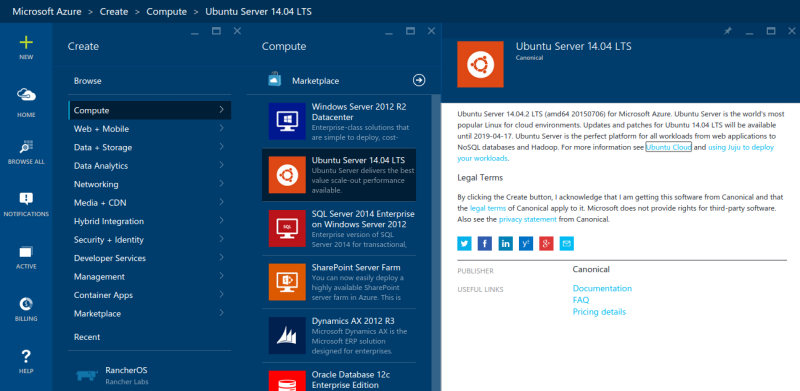
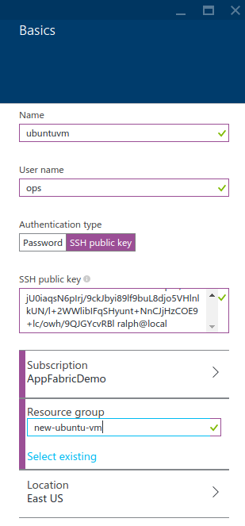
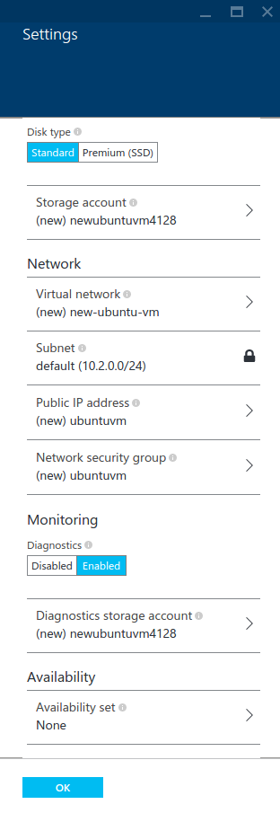
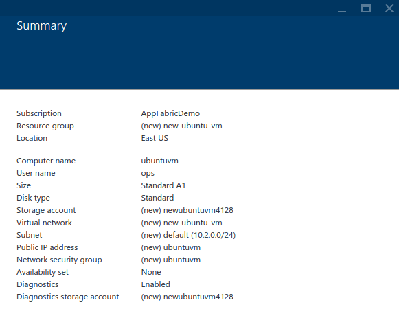
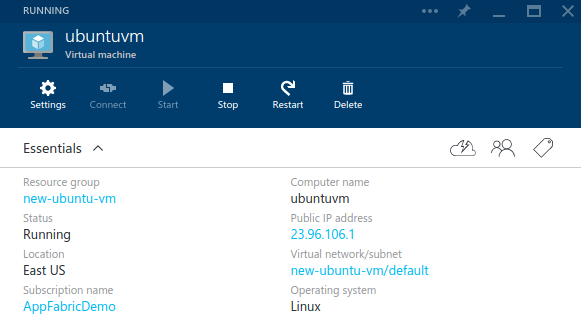

<properties
	pageTitle="Create an Azure virtual machine running Linux in the Azure Portal"
	description="Use the Azure Portal to create an Azure virtual machine (VM) running Linux with the Azure resource groups."
	services="virtual-machines"
	documentationCenter=""
	authors="squillace"
	manager="timlt"
	editor="tysonn"
	tags="azure-resource-management"/>

<tags
	ms.service="virtual-machines"
	ms.workload="infrastructure-services"
	ms.tgt_pltfrm="vm-linux"
	ms.devlang="na"
	ms.topic="article"
	ms.date="07/13/2015"
	ms.author="rasquill"/>

# Create a Virtual Machine Running Linux using the Azure Preview Portal

> [AZURE.SELECTOR]
- [Azure CLI](virtual-machines-linux-tutorial.md)
- [Azure Preview Portal](virtual-machines-linux-tutorial-portal-rm.md)

Creating an Azure virtual machine (VM) that runs Linux is easy to do. This tutorial shows you how to use the Azure Preview portal to create one quickly, and uses the `~/.ssh/id_rsa.pub` public key file to secure your **SSH** connection to the VM. You can also create Linux VMs using [your own images as templates](virtual-machines-linux-create-upload-vhd.md).

> [AZURE.NOTE] This tutorial creates an Azure virtual machine that is managed by the Azure resource group API. For details, see [Azure resource group overview](resource-group-overview.md).

[AZURE.INCLUDE [free-trial-note](../../includes/free-trial-note.md)]

## Select the image

Go to the Azure Marketplace in the Preview portal to find the Windows Server VM image you want.

1. Sign in to the [Preview portal](https://portal.azure.com).

2. On the Hub menu, click **New** > **Compute** > **Ubuntu Server 14.04 LTS**.

	

	> [AZURE.TIP] To find additional images, click **Marketplace** and then search or filter for available items.

3. At the bottom of the **Ubuntu Server 14.04 LTS** page, select **Use the Resource Manager stack** to create the VM in Azure Resource Manager. Note that for most new workloads, we recommend the Resource Manager stack. For considerations, see [Azure Compute, Network and Storage Providers under the Azure Resource Manager](virtual-machines-azurerm-versus-azuresm.md).

4. Next, click .

	

## Create the virtual machine

After you select the image, you can use Azure's default settings for most of the configuration and quickly create the VM.

1. On the **Create virtual machine** blade, click **Basics**. Enter a **Name** you want for the VM, and a public key file (in **ssh-rsa** format, in this case from the `~/.ssh/id_rsa.pub` file). If you have more than one subscription, specify the one for the new VM, as well as a new or existing **Resource group** and an Azure datacenter **Location**.

	

	> [AZURE.NOTE] You may also choose username/password authentication here and enter that information if you do not want to secure your **ssh** session with a public and private key exchange.

2. Click **Size** and select an appropriate VM size for your needs. Each size specifies the number of compute cores, memory, and other features, such as support for Premium Storage, which will affect the price. Azure recommends certain sizes automatically depending on the image you choose. When done, click .

	>[AZURE.NOTE] Premium storage is available for DS-series virtual machines in certain regions. Premium storage is the best storage option for data intensive workloads such as a database. For details, see [Premium Storage: High-Performance Storage for Azure Virtual Machine Workloads](storage-premium-storage-preview-portal.md).

3. Click **Settings** to see storage and networking settings for the new VM. For a first VM you can generally accept the default settings. If you selected a VM size that supports it, you can try out Premium Storage by selecting **Premium (SSD)** under **Disk type**. When done, click .

	

6. Click **Summary** to review your configuration choices. When you're done reviewing or updating the settings, click  .

	

8. While Azure creates the VM, you can track the progress in **Notifications**, in the Hub menu. After Azure creates the VM, you'll see it on your Startboard unless you cleared **Pin to Startboard** in the **Create virtual machine** blade.

	> [AZURE.NOTE] Note that the summary does not contain a public DNS name the way it does when a VM is created inside a Cloud Service using the service management compute stack.

## Connect to your Azure Linux VM using **ssh**

Now you can connect to your Ubuntu VM using **ssh** in the standard way. However, you're going to need to discover the IP address allocated to the Azure VM by opening the tile for the VM and its resources. You can either do this by clicking **Browse**, then selecting **Recent** and looking for the VM you created, or clicking the tile created for you on the Startboard. In either case, locate and copy the **Public IP Address** value, shown in the following graphic.

Now you can **ssh** into your Azure VM, and you're ready to go.

	ssh ops@23.96.106.1 -p 22
	The authenticity of host '23.96.106.1 (23.96.106.1)' can't be established.
	ECDSA key fingerprint is bc:ee:50:2b:ca:67:b0:1a:24:2f:8a:cb:42:00:42:55.
	Are you sure you want to continue connecting (yes/no)? yes
	Warning: Permanently added '23.96.106.1' (ECDSA) to the list of known hosts.
	Welcome to Ubuntu 14.04.2 LTS (GNU/Linux 3.16.0-43-generic x86_64)

	 * Documentation:  https://help.ubuntu.com/

	  System information as of Mon Jul 13 21:36:28 UTC 2015

	  System load: 0.31              Memory usage: 5%   Processes:       208
	  Usage of /:  42.1% of 1.94GB   Swap usage:   0%   Users logged in: 0

	  Graph this data and manage this system at:
	    https://landscape.canonical.com/

	  Get cloud support with Ubuntu Advantage Cloud Guest:
	    http://www.ubuntu.com/business/services/cloud

	0 packages can be updated.
	0 updates are security updates.

	The programs included with the Ubuntu system are free software;
	the exact distribution terms for each program are described in the
	individual files in /usr/share/doc/*/copyright.

	Ubuntu comes with ABSOLUTELY NO WARRANTY, to the extent permitted by
	applicable law.

	ops@ubuntuvm:~$

> [AZURE.NOTE] You can also configure a fully qualified domain name (FQDN) for your virtual machine in the portal. Read more about FQDN [here](virtual-machines-create-fqdn-on-portal.md).

## Next Steps

To learn more about Linux on Azure, see:

- [Linux and Open-Source Computing on Azure](virtual-machines-linux-opensource.md)

- [How to use the Azure Command-Line Tools for Mac and Linux](virtual-machines-command-line-tools.md)

- [Deploy a LAMP app using the Azure CustomScript Extension for Linux](virtual-machines-linux-script-lamp.md)

- [The Docker Virtual Machine Extension for Linux on Azure](virtual-machines-docker-vm-extension.md)
