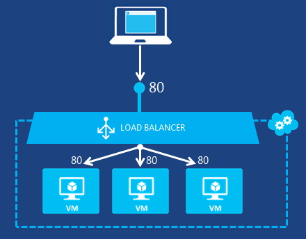

<properties
	pageTitle="Load balancing for Azure infrastructure services"
	description="Describes the two different types of load balancing supported by Azure: Load balancer for cloud services and Azure Traffic Manager for client traffic."
	services="virtual-machines"
	documentationCenter=""
	authors="joaoma"
	manager="adinah"
	editor=""/>

<tags
	ms.service="virtual-machines"
	ms.workload="infrastructure-services"
	ms.tgt_pltfrm="na"
	ms.devlang="na"
	ms.topic="article"
	ms.date="07/21/2015"
	ms.author="joaoma"/>

# Load balancing for Azure infrastructure services#

There are two levels of load balancing available for Azure infrastructure services:

- **DNS Level**:  Load balancing for traffic to different cloud services located in different data centers, to different Azure websites located in different data centers, or to external endpoints. This is done with Azure Traffic Manager and the Round Robin load balancing method.
- **Network Level**:  Load balancing of incoming Internet traffic to different virtual machines of a cloud service, or load balancing of traffic between virtual machines in a cloud service or virtual network. This is done with the Azure load balancer.

## Traffic Manager load balancing for cloud services and websites##

Traffic Manager allows you to control the distribution of user traffic to endpoints, which can include cloud services, websites, external sites, and other Traffic Manager profiles. Traffic Manager works by applying an intelligent policy engine to Domain Name System (DNS) queries for the domain names of your Internet resources. Your cloud services or websites can be running in different datacenters across the world.

You must use either REST or Windows PowerShell to configure external endpoints or Traffic Manager profiles as endpoints.

Traffic Manager uses three load-balancing methods to distribute traffic:

- **Failover**:  Use this method when you want to use a primary endpoint for all traffic, but provide backups in case the primary becomes unavailable.
- **Performance**:  Use this method when you have endpoints in different geographic locations and you want requesting clients to use the "closest" endpoint in terms of the lowest latency.
- **Round Robin:**  Use this method when you want to distribute load across a set of cloud services in the same datacenter or across cloud services or websites in different datacenters.

For more information, see [About Traffic Manager Load Balancing Methods](../traffic-manager/traffic-manager-load-balancing-methods.md).

The following diagram shows an example of the Round Robin load balancing method for distributing traffic between different cloud services.

The basic process is the following:

1.	An Internet client queries a domain name corresponding to a web service.
2.	DNS forwards the name query request to Traffic Manager.
3.	Traffic Manager chooses the next cloud service in the Round Robin list and sends back the DNS name. The Internet client's DNS server resolves the name to an IP address and sends it to the Internet client.
4.	The Internet client connects with the cloud service chosen by Traffic Manager.

For more information, see [Traffic Manager](../traffic-manager/traffic-manager-overview.md).

## Azure load balancing for virtual machines ##

Virtual machines in the same cloud service or virtual network can communicate with each other directly using their private IP addresses. Computers and services outside the cloud service or virtual network can only communicate with virtual machines in a cloud service or virtual network with a configured endpoint. An endpoint is a mapping of a public IP address and port to that private IP address and port of a virtual machine or web role within an Azure cloud service.

The Azure Load Balancer randomly distributes a specific type of incoming traffic across multiple virtual machines or services in a configuration known as a load-balanced set. For example, you can spread the load of web request traffic across multiple web servers or web roles.

The following diagram shows a load-balanced endpoint for standard (unencrypted) web traffic that is shared among three virtual machines for the public and private TCP port of 80. These three virtual machines are in a load-balanced set.

For more information, see [Azure Load Balancer](../load-balancer/load-balancer-overview.md). For the steps to create a load-balanced set, see [Configure a load-balanced set](../load-balancer/load-balancer-internet-getstarted.md).

Azure can also load balance within a cloud service or virtual network. This is known as internal load balancing and can be used in the following ways:

- To load balance between servers in different tiers of a multi-tier application (for example, between web and database tiers).
- To load balance line-of-business (LOB) applications hosted in Azure without requiring additional load balancer hardware or software.
- To include on-premises servers in the set of computers whose traffic is load balanced.

Similar to Azure load balancing, internal load balancing is facilitated by configuring an internal load-balanced set.

The following diagram shows an example of an internal load-balanced endpoint for a line of business (LOB) application that is shared among three virtual machines in a cross-premises virtual network.

## Next steps

For the steps to create a load-balanced set, see [Configure an internal load-balanced set](../load-balancer/load-balancer-internal-getstarted.md).

For more information about load balancer, see [Internal load balancing](../load-balancer/load-balancer-internal-overview.md).

<!-- LINKS -->
