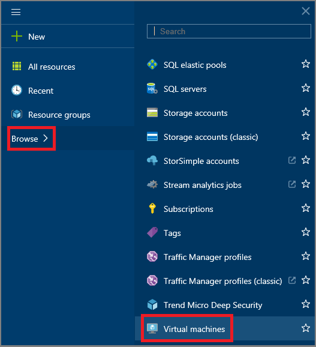

<properties
	pageTitle="Log on to a virtual machine running Windows Server"
	description="Learn to use the Azure preview portal to log on to a virtual machine running Windows Server."
	services="virtual-machines"
	documentationCenter=""
	authors="KBDAzure"
	manager="timlt"
	editor="tysonn"
	tags="azure-resource-manager"/>

<tags
	ms.service="virtual-machines"
	ms.workload="infrastructure-services"
	ms.tgt_pltfrm="vm-windows"
	ms.devlang="na"
	ms.topic="article"
	ms.date="09/14/2015"
	ms.author="kathydav"/>

# How to Log on to a virtual machine running Windows Server#

You'll use the **Connect** button in the Azure preview portal to start a Remote Desktop session. (Want to connect to a Linux VM? See [How to log on to a virtual machine running Linux](virtual-machines-linux-how-to-log-on.md).)

## How to log on

1. If you haven't already done so, sign in to the [Azure preview portal](https://portal.azure.com/).

2.	On the Hub menu, click **Browse**.  

3.	On the search blade, scroll down and click **Virtual Machines**.

	

4.	Select the virtual machine from the list.

5. On the blade for the virtual machine, click **Connect**.

	

[AZURE.INCLUDE [virtual-machines-log-on-win-server](../../includes/virtual-machines-log-on-win-server.md)]

## Troubleshooting

If following the tips for user name and password don't help, you'll need to do more extensive troubleshooting. For instructions, see [Troubleshoot Remote Desktop connections to a Windows-based Azure Virtual Machine](virtual-machines-troubleshoot-remote-desktop-connections.md).
