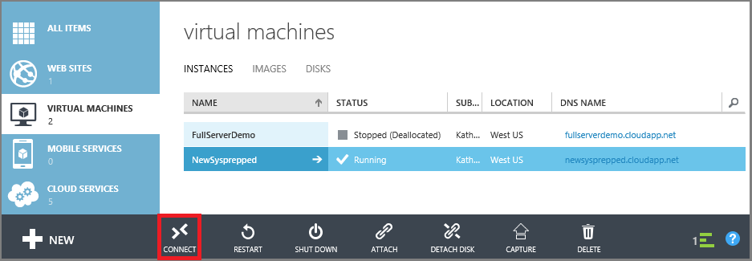

<properties
	pageTitle="Log on to a VM | Microsoft Azure"
	description="Use the portal to log on to a Windows virtual machine created with the classic deployment model."
	services="virtual-machines"
	documentationCenter=""
	authors="cynthn"
	manager="timlt"
	editor="tysonn"
	tags="azure-service-management"/>

<tags
	ms.service="virtual-machines"
	ms.workload="infrastructure-services"
	ms.tgt_pltfrm="vm-windows"
	ms.devlang="na"
	ms.topic="article"
	ms.date="10/05/2015"
	ms.author="cynthn"/>

# Log on to a Windows virtual machine created with the classic deployment model

In the Azure portal, you use the **Connect** button to start a Remote Desktop session and log on to a Windows VM.

Do you want to connect to a Linux VM? See [How to log on to a virtual machine running Linux](virtual-machines-linux-how-to-log-on.md).

[AZURE.INCLUDE [learn-about-deployment-models](../../includes/learn-about-deployment-models-include.md)] This article covers managing resources with the classic deployment model.

## Video walkthrough

Here's a video walkthrough of the steps in this tutorial. It also covers endpoints and public and private ports used for connecting to a Windows VM in Azure.

[AZURE.VIDEO logging-on-to-vm-running-windows-server-on-azure]

## Connect to the virtual machine

1. Sign in to the [Azure portal](http://manage.windowsazure.com).

2. Click **Virtual Machines**, and then select the virtual machine.

3. On the command bar at the bottom of the page, click **Connect**.

	
	
> [AZURE.TIP] If the Connect button isn't available, see the troubleshooting tips at the end of this article.

## Log on to the virtual machine

[AZURE.INCLUDE [virtual-machines-log-on-win-server](../../includes/virtual-machines-log-on-win-server.md)]

## Troubleshooting tips

Here are a few things to try:

-	If the **Connect** button is inactive or you are having other problems with the Remote Desktop connection, try resetting the configuration. From the virtual machine dashboard, under **Quick Glance**, click **Reset remote configuration**.
-	For problems with your password, try resetting it. From the virtual machine dashboard, under **Quick Glance**, click **Reset password**.

If those tips don't work or aren't what you need, see [Troubleshoot Remote Desktop connections to a Windows-based Azure Virtual Machine](virtual-machines-troubleshoot-remote-desktop-connections.md). This article walks you through diagnosing and resolving common problems.

