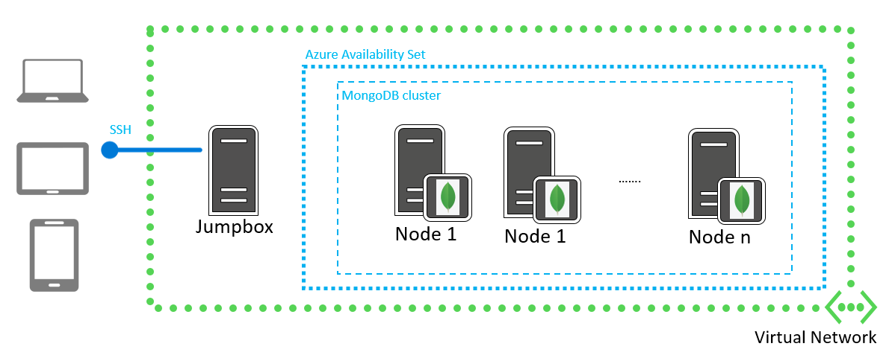
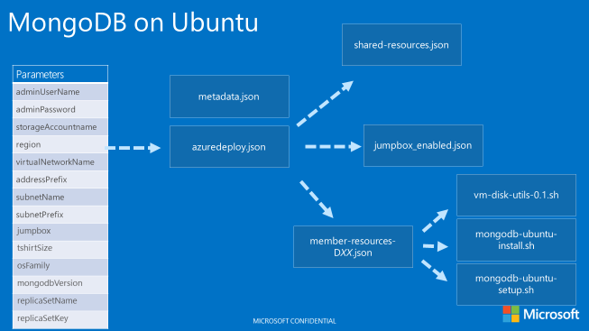
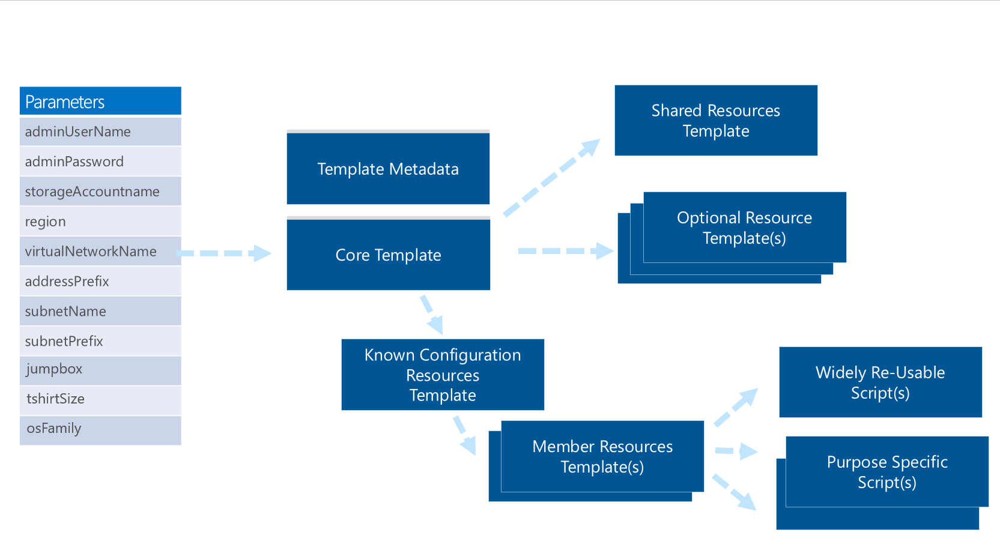

<properties
  pageTitle="Create a MongoDB cluster on Ubuntu using a Azure Resource Manager template"
  description="Create a MongoDB cluster on Ubuntu using a Azure Resource Manager template via Azure PowerShell or the Azure CLI"
  services="virtual-machines"
  documentationCenter=""
  authors="karthmut"
  manager="timlt"
  editor="tysonn"/>

<tags
  ms.service="virtual-machines"
  ms.workload="multiple"
  ms.tgt_pltfrm="vm-windows"
  ms.devlang="na"
  ms.topic="article"
  ms.date="04/29/2015"
  ms.author="karthmut"/>

# Create a MongoDB cluster on Ubuntu using a Azure Resource Manager template

MongoDB is an open-source document database that provides high performance, high availability, and automatic scaling. MongoDB can be installed as a stand-alone database or within a cluster, leveraging built-in replication capabilities. In some cases, you can use replication to increase read capacity. Clients have the ability to send read and write operations to different servers. You can also maintain copies in different data centers to increase the locality and availability of data for distributed applications. With MongoDB, replication also provides redundancy and increases data availability. With multiple copies of data on different database servers, replication protects a database from the loss of a single server. Replication also allows you to recover from hardware failure and service interruptions. With additional copies of the data, you can dedicate one to disaster recovery, reporting, or backup.

In addition to the various flavors that were already available in the Azure Marketplace, now you can also easily deploy a new MongoDB cluster on Ubuntu VMs using a Azure Resource Manager template deployed through [Azure PowerShell](../powershell-install-configure.md) or the [Azure CLI](../xplat-cli.md).

Newly deployed clusters based on this template will have the topology described in the following diagram, although other topologies can be easily achieved by customizing the template presented in this article.

Through a parameter you can define the number of nodes that will be deployed in the new MongoDB cluster and, based on another parameter, a VM instance (Jumpbox) with a public IP address may be also deployed within the same VNET, giving you the ability to connect to the cluster from public Internet and perform any sort of administrative task related that cluster. Another option available as a parameter, is the ability to add an Arbiter node to the replica set, that is typically suggested when that has an even number of members. For more information on MongoDB replication topologies and details, see the official [MongoDB documentation](http://docs.mongodb.org/manual/core/replication-introduction/).

Once the deployment is complete you can access the Jumpbox using the configured DNS address on SSH port 22.

Before diving into more details related to the Azure Resource Manager and the template we will use for this deployment, make sure you have Azure PowerShell or the Azure CLI configured correctly.

[AZURE.INCLUDE [arm-getting-setup-powershell](../../includes/arm-getting-setup-powershell.md)]

[AZURE.INCLUDE [xplat-getting-set-up-arm](../../includes/xplat-getting-set-up-arm.md)]

## Create a MongoDB cluster with a Resource Manager template

Follow these steps to create a MongoDB cluster using a Resource Manager template from the Github template repository. Each step will include directions for both Azure PowerShell and the Azure CLI.

### Step 1-a: Download the template files using PowerShell

Create a local folder for the JSON template and other associated files (for example, C:\Azure\Templates\MongoDB).

In the following example, substitute the folder name of your local folder and run the commands.

    $folderName="C:\Azure\Templates\MongoDB"
    $webclient = New-Object System.Net.WebClient
    $url = "https://raw.githubusercontent.com/azure/azure-quickstart-templates/master/mongodb-high-availability/azuredeploy.json"
    $filePath = $folderName + "\azuredeploy.json"
    $webclient.DownloadFile($url,$filePath)
    $url = "https://raw.githubusercontent.com/azure/azure-quickstart-templates/master/mongodb-high-availability/azuredeploy-parameters.json"
    $filePath = $folderName + "\azuredeploy-parameters.json"
    $webclient.DownloadFile($url,$filePath)
    $url = "https://raw.githubusercontent.com/azure/azure-quickstart-templates/master/mongodb-high-availability/arbiter-resources.json"
    $filePath = $folderName + "\arbiter-resources.json"
    $webclient.DownloadFile($url,$filePath)
    $url = "https://raw.githubusercontent.com/azure/azure-quickstart-templates/master/mongodb-high-availability/empty-resources.json"
    $filePath = $folderName + "\empty-resources.json"
    $webclient.DownloadFile($url,$filePath)
    $url = "https://raw.githubusercontent.com/azure/azure-quickstart-templates/master/mongodb-high-availability/jumpbox-resources.json"
    $filePath = $folderName + "\jumpbox-resources.json"
    $webclient.DownloadFile($url,$filePath)
    $url = "https://raw.githubusercontent.com/azure/azure-quickstart-templates/master/mongodb-high-availability/member-resources-D1.json"
    $filePath = $folderName + "\member-resources-D1.json"
    $webclient.DownloadFile($url,$filePath)
    $url = "https://raw.githubusercontent.com/azure/azure-quickstart-templates/master/mongodb-high-availability/member-resources-D2.json"
    $filePath = $folderName + "\member-resources-D2.json"
    $webclient.DownloadFile($url,$filePath)
    $url = "https://raw.githubusercontent.com/azure/azure-quickstart-templates/master/mongodb-high-availability/member-resources-D3.json"
    $filePath = $folderName + "\member-resources-D3.json"
    $webclient.DownloadFile($url,$filePath)
    $url = "https://raw.githubusercontent.com/azure/azure-quickstart-templates/master/mongodb-high-availability/member-resources-D4.json"
    $filePath = $folderName + "\member-resources-D4.json"
    $webclient.DownloadFile($url,$filePath)
    $url = "https://raw.githubusercontent.com/azure/azure-quickstart-templates/master/mongodb-high-availability/member-resources-D11.json"
    $filePath = $folderName + "\member-resources-D11.json"
    $webclient.DownloadFile($url,$filePath)
    $url = "https://raw.githubusercontent.com/azure/azure-quickstart-templates/master/mongodb-high-availability/member-resources-D12.json"
    $filePath = $folderName + "\member-resources-D12.json"
    $webclient.DownloadFile($url,$filePath)
    $url = "https://raw.githubusercontent.com/azure/azure-quickstart-templates/master/mongodb-high-availability/member-resources-D13.json"
    $filePath = $folderName + "\member-resources-D13.json"
    $webclient.DownloadFile($url,$filePath)
    $url = "https://raw.githubusercontent.com/azure/azure-quickstart-templates/master/mongodb-high-availability/member-resources-D14.json"
    $filePath = $folderName + "\member-resources-D14.json"
    $webclient.DownloadFile($url,$filePath)
    $url = "https://raw.githubusercontent.com/azure/azure-quickstart-templates/master/mongodb-high-availability/mongodb-ubuntu-install.sh"
    $filePath = $folderName + "\mongodb-ubuntu-install.sh"
    $webclient.DownloadFile($url,$filePath)
    $url = "https://raw.githubusercontent.com/azure/azure-quickstart-templates/master/mongodb-high-availability/metadata.json"
    $filePath = $folderName + "\metadata.json"
    $webclient.DownloadFile($url,$filePath)
    $url = "https://raw.githubusercontent.com/azure/azure-quickstart-templates/master/mongodb-high-availability/shared-resources.json"
    $filePath = $folderName + "\shared-resources.json"
    $webclient.DownloadFile($url,$filePath)  

### Step 1-b: Download the template files using the Azure CLI

The following example shows how to clone the entire template repository using a Git client of your choice.

    git clone https://github.com/Azure/azure-quickstart-templates C:\Azure\Templates

When completed, look for the mongodb-high-availability folder in your C:\Azure\Templates directory.

### Step 2: (optional) Understand the template parameters

When you deploy non-trivial solutions like a MongoDB cluster, you must specify a set of configuration parameters to deal with a number of required settings. By declaring these parameters in the template definition, it’s possible to specify values during deployment through an external file or in the command line.

In the parameters section at the top of the azuredeploy.json file, you’ll find the set of parameters that are required by the template to configure a MongoDB cluster. The following example shows the parameters section from this template's azuredeploy.json file.

    "parameters": {
      "adminUsername": {
          "type": "string",
          "metadata": {
            "Description": "Administrator user name used when provisioning virtual machines (which also becomes a system user administrator in MongoDB)"
          }
        },
        "adminPassword": {
          "type": "securestring",
          "metadata": {
            "Description": "Administrator password used when provisioning virtual machines (which is also a password for the system administrator in MongoDB)"
          }
        },
        "storageAccountName": {
          "type": "string",
          "defaultValue": "",
          "metadata": {
            "Description": "Unique namespace for the storage account where the Virtual Machine's disks will be placed (this name will be used as a prefix to create one or more storage accounts as per t-shirt size)"
          }
        },
        "region": {
          "type": "string",
          "metadata": {
            "Description": "Location where resources will be provisioned"
          }
        },
        "virtualNetworkName": {
          "type": "string",
          "defaultValue": "mongodbVnet",
          "metadata": {
            "Description": "The arbitrary name of the virtual network provisioned for the MongoDB deployment"
          }
        },
        "subnetName": {
          "type": "string",
          "defaultValue": "mongodbSubnet",
          "metadata": {
            "Description": "Subnet name for the virtual network that resources will be provisioned in to"
          }
        },
        "addressPrefix": {
          "type": "string",
          "defaultValue": "10.0.0.0/16",
          "metadata": {
            "Description": "The network address space for the virtual network"
          }
        },
        "subnetPrefix": {
          "type": "string",
          "defaultValue": "10.0.0.0/24",
          "metadata": {
            "Description": "The network address space for the virtual subnet"
          }
        },
        "nodeAddressPrefix": {
          "type": "string",
          "defaultValue": "10.0.0.1",
          "metadata": {
            "Description": "The IP address prefix that will be used for constructing a static private IP address for each node in the cluster"
          }
        },
        "jumpbox": {
          "type": "string",
          "defaultValue": "Disabled",
          "allowedValues": [
          "Enabled",
          "Disabled"
          ],
          "metadata": {
            "Description": "The flag allowing to enable or disable provisioning of the jumpbox VM that can be used to access the MongoDB environment"
          }
        },
        "tshirtSize": {
          "type": "string",
          "defaultValue": "XSmall",
          "allowedValues": [
          "XSmall",
          "Small",
          "Medium",
          "Large",
          "XLarge",
          "XXLarge"
          ],
          "metadata": {
            "Description": "T-shirt size of the MongoDB deployment"
          }
        },
        "osFamily": {
          "type": "string",
          "defaultValue": "Ubuntu",
          "allowedValues": [
          "Ubuntu"
          ],
          "metadata": {
            "Description": "The target OS for the virtual machines running MongoDB"
          }
        },
        "mongodbVersion": {
          "type": "string",
          "defaultValue": "3.0.2",
          "metadata": {
            "Description": "The version of the MongoDB packages to be deployed"
          }
        },
        "replicaSetName": {
          "type": "string",
          "defaultValue": "rs0",
          "metadata": {
            "Description": "The name of the MongoDB replica set"
          }
        },
        "replicaSetKey": {
          "type": "string",
          "metadata": {
            "Description": "The shared secret key for the MongoDB replica set"
          }
        }
      },

Each parameter has details such as data type and allowed values. This allows for validation of parameters passed during template execution in an interactive mode (for example, PowerShell or Azure CLI), as well as a self-discovery UI that could be dynamically-built by parsing the list of required parameters and their descriptions.

### Step 3-a: Deploy a MongoDB cluster with a template using PowerShell

Prepare a parameters file for your deployment by creating a JSON file containing runtime values for all parameters. This file will then be passed as a single entity to the deployment command. If you do not include a parameters file, PowerShell will use any default values specified in the template, and then prompt you to fill in the remaining values.

The following example shows the set of parameters from the azuredeploy-parameters.json file.

    {
      "adminUsername": {
          "value": "MongoAdmin"
      },
      "adminPassword": {
          "value": ""
      },
      "storageAccountName": {
          "value": ""
      },
      "region": {
          "value": "West US"
      },
      "virtualNetworkName": {
          "value": "mongodbVnet"
      },
      "subnetName": {
          "value": "mongodbSubnet"
      },
      "addressPrefix": {
          "value": "10.0.0.0/16"
      },
      "subnetPrefix": {
          "value": "10.0.0.0/24"
      },
      "nodeAddressPrefix": {
          "value": "10.0.0.1"
      },
      "jumpbox": {
          "value": "Disabled"
      },
      "tshirtSize": {
          "value": "XSmall"
      },
      "osFamily": {
          "value": "Ubuntu"
      },
      "mongodbVersion": {
          "value": "3.0.2"
      },
      "replicaSetName": {
          "value": "rs0"
      },
      "replicaSetKey":  {
          "value": ""
      }
    }

Fill in an Azure deployment name, resource group name, Azure location, and the folder of your saved JSON deployment file. Then run the following commands.

    $deployName="<deployment name>"
    $RGName="<resource group name>"
    $locName="<Azure location, such as West US>"
    $folderName="<folder name, such as C:\Azure\Templates\MongoDB>"
    $templateFile= $folderName + "\azuredeploy.json"
    $templateParameterFile= $folderName + "\azuredeploy-parameters.json"

    New-AzureResourceGroup –Name $RGName –Location $locName

    New-AzureResourceGroupDeployment -Name $deployName -ResourceGroupName $RGName -TemplateParameterFile $templateParameterFile -TemplateFile $templateFile

When you run the **New-AzureResourceGroupDeployment** command, this will extract parameter values from the JSON parameters file, and will start executing the template accordingly. Defining and using multiple parameter files with your different environments (for example, Test, Production, etc.) will promote template reuse and simplify complex multi-environment solutions.

When deploying, keep in mind that a new Azure storage account needs to be created so the name you provide as the storage account parameter must be unique and meet all requirements for an Azure storage account (lowercase letters and numbers only).

During and after deployment, you can check all the requests that were made during provisioning, including any errors that occurred.

To do that, go to the [Azure portal](https://portal.azure.com) and do the following:

- Click **Browse** on the left navigation bar, scroll down and then click **Resource Groups**.
- After clicking the resource group that you just created, it will bring up the Resource group blade.
- By clicking the "Events” bar graph in the "Monitoring” part of the Resource group blade, you can see the events for your deployment.
Clicking an individual event lets you drill further down into the details of each individual operation made on behalf of the template.

After your tests, if you need to remove this resource group and all of its resources (the storage account, virtual machine, and virtual network), use the following command.

    Remove-AzureResourceGroup –Name "<resource group name>" -Force

### Step 3-b: Deploy a MongoDB cluster with a template using the Azure CLI

To deploy a MongoDB cluster via the Azure CLI, first create a resource group by specifying a name and a location with the following command.

    azure group create mdbc "West US"

Pass this resource group name, the location of the JSON template file, and the location of the parameters file (see the earlier PowerShell section for details) into the following command.

    azure group deployment create mdbc -f .\azuredeploy.json -e .\azuredeploy-parameters.json

You can check the status of individual resources deployments with the following command.

    azure group deployment list mdbc

## A tour of the MongoDB template structure and file organization

To design a robust and reusable Azure Resource Manager template, additional thinking is needed to organize the series of complex and interrelated tasks required during the deployment of a complex solution like MongoDB. Leveraging Azure Resource Manager *template linking* and *resource looping* in addition to script execution through related extensions, it’s possible to implement a modular approach that can be reused with virtually any complex template-based deployment.

The following diagram describes the relationships between all the files downloaded from GitHub for this deployment.

This section steps you through the structure of the azuredeploy.json file for the MongoDB cluster.

### Parameters section

The parameters section of azuredeploy.json specifies modifiable parameters that are used in this template. The  azuredeploy-parameters.json file described earlier in this article is used to pass values into the parameters section of azuredeploy.json during template execution.

### Variables section

The variables section specifies variables that can be used throughout this template. This contains a number of fields (JSON data types or fragments) that will be set to constants or calculated values at execution time. The following example shows the variables section for this MongoDB template.

    "variables": {
          "_comment0": "/* T-shirt sizes may vary for different reasons, and some customers may want to modify these - so feel free to go ahead and define your favorite t-shirts */",
          "tshirtSizeXSmall": {
              "vmSizeMember": "Standard_D1",
              "vmSizeArbiter": "Standard_A1",
              "numberOfMembers": 1,
              "totalMemberCount": 2,
              "arbiter": "Enabled",
              "vmTemplate": "[concat(variables('templateBaseUrl'), 'member-resources-D1.json')]",
              "storageAccountCount": 1,
              "dataDiskSize": 100
          },
          "tshirtSizeSmall": {
              "vmSizeMember": "Standard_D1",
              "vmSizeArbiter": "Standard_A1",
              "numberOfMembers": 2,
              "totalMemberCount": 3,
              "arbiter": "Disabled",
              "vmTemplate": "[concat(variables('templateBaseUrl'), 'member-resources-D1.json')]",
              "storageAccountCount": 1,
              "dataDiskSize": 100
          },
          "tshirtSizeMedium": {
              "vmSizeMember": "Standard_D2",
              "vmSizeArbiter": "Standard_A1",
              "numberOfMembers": 3,
              "totalMemberCount": 4,
              "arbiter": "Enabled",
              "vmTemplate": "[concat(variables('templateBaseUrl'), 'member-resources-D2.json')]",
              "storageAccountCount": 2,
              "dataDiskSize": 250
          },
          "tshirtSizeLarge": {
              "vmSizeMember": "Standard_D2",
              "vmSizeArbiter": "Standard_A1",
              "numberOfMembers": 7,
              "totalMemberCount": 8,
              "arbiter": "Enabled",
              "vmTemplate": "[concat(variables('templateBaseUrl'), 'member-resources-D2.json')]",
              "storageAccountCount": 4,
              "dataDiskSize": 250
          },
          "tshirtSizeXLarge": {
              "vmSizeMember": "Standard_D3",
              "vmSizeArbiter": "Standard_A1",
              "numberOfMembers": 7,
              "totalMemberCount": 8,
              "arbiter": "Enabled",
              "vmTemplate": "[concat(variables('templateBaseUrl'), 'member-resources-D3.json')]",
              "storageAccountCount": 4,
              "dataDiskSize": 500
          },
          "tshirtSizeXXLarge": {
              "vmSizeMember": "Standard_D3",
              "vmSizeArbiter": "Standard_A1",
              "numberOfMembers": 15,
              "totalMemberCount": 16,
              "arbiter": "Disabled",
              "vmTemplate": "[concat(variables('templateBaseUrl'), 'member-resources-D3.json')]",
              "storageAccountCount": 8,
              "dataDiskSize": 500
          },
          "osFamilyUbuntu": {
              "osName": "ubuntu",
              "installerBaseUrl": "http://repo.mongodb.org/apt/ubuntu",
              "installerPackages": "mongodb-org",
              "imagePublisher": "Canonical",
              "imageOffer": "UbuntuServer",
              "imageSKU": "14.04.2-LTS"
          },
          "vmStorageAccountContainerName": "vhd-mongodb",
          "vmStorageAccountDomain": ".blob.core.windows.net",
          "vnetID": "[resourceId('Microsoft.Network/virtualNetworks', parameters('virtualNetworkName'))]",
          "sharedScriptUrl": "[concat('https://raw.githubusercontent.com/Azure/azure-quickstart-templates/master/shared_scripts/', variables('osFamilySpec').osName, '/')]",
          "scriptUrl": "https://raw.githubusercontent.com/Azure/azure-quickstart-templates/master/mongodb-high-availability/",
          "templateBaseUrl": "[variables('scriptUrl')]",
          "jumpboxTemplateEnabled": "jumpbox-resources.json",
          "jumpboxTemplateDisabled": "empty-resources.json",
          "arbiterTemplateEnabled": "arbiter-resources.json",
          "arbiterTemplateDisabled": "empty-resources.json",
          "sharedTemplateUrl": "[concat(variables('templateBaseUrl'), 'shared-resources.json')]",
          "jumpboxTemplateUrl": "[concat(variables('templateBaseUrl'), variables(concat('jumpboxTemplate', parameters('jumpbox'))))]",
          "arbiterTemplateUrl": "[concat(variables('templateBaseUrl'), variables(concat('arbiterTemplate', variables('clusterSpec').arbiter)))]",
          "commonSettings": {
              "availabilitySetName": "mongodbAvailSet",
              "region": "[parameters('region')]"
          },
          "storageSettings": {
              "vhdStorageAccountName": "[parameters('storageAccountName')]",
              "vhdContainerName": "[variables('vmStorageAccountContainerName')]",
              "destinationVhdsContainer": "[concat('https://', parameters('storageAccountName'), variables('vmStorageAccountDomain'), '/', variables('vmStorageAccountContainerName'), '/')]",
              "storageAccountCount": "[variables('clusterSpec').storageAccountCount]"
          },
          "networkSettings": {
              "virtualNetworkName": "[parameters('virtualNetworkName')]",
              "addressPrefix": "[parameters('addressPrefix')]",
              "subnetName": "[parameters('subnetName')]",
              "subnetPrefix": "[parameters('subnetPrefix')]",
              "subnetRef": "[concat(variables('vnetID'), '/subnets/', parameters('subnetName'))]",
              "machineIpPrefix": "[parameters('nodeAddressPrefix')]"
          },
          "machineSettings": {
              "adminUsername": "[parameters('adminUsername')]",
              "adminPassword": "[parameters('adminPassword')]",
              "machineNamePrefix": "mongodb-",
              "osImageReference": {
                  "publisher": "[variables('osFamilySpec').imagePublisher]",
                  "offer": "[variables('osFamilySpec').imageOffer]",
                  "sku": "[variables('osFamilySpec').imageSKU]",
                  "version": "latest"
              }
          },
          "clusterSpec": "[variables(concat('tshirtSize', parameters('tshirtSize')))]",
          "osFamilySpec": "[variables(concat('osFamily', parameters('osFamily')))]",
          "installCommand": "[concat('bash mongodb-', variables('osFamilySpec').osName, '-install.sh', ' -i ', variables('osFamilySpec').installerBaseUrl, ' -b ', variables('osFamilySpec').installerPackages, ' -r ', parameters('replicaSetName'), ' -k ', parameters('replicaSetKey'), ' -u ', parameters('adminUsername'), ' -p ', parameters('adminPassword'), ' -x ', variables('networkSettings').machineIpPrefix, ' -n ', variables('clusterSpec').totalMemberCount)]",
          "vmScripts": {
              "scriptsToDownload": [
                  "[concat(variables('scriptUrl'), 'mongodb-', variables('osFamilySpec').osName, '-install.sh')]",
                  "[concat(variables('sharedScriptUrl'), 'vm-disk-utils-0.1.sh')]"
              ],
              "regularNodeInstallCommand": "[variables('installCommand')]",
              "lastNodeInstallCommand": "[concat(variables('installCommand'), ' -l')]",
              "arbiterNodeInstallCommand": "[concat(variables('installCommand'), ' -a')]"
          },
          "_comment1": "/* The list of values below helps partition VM disks across multiple storage accounts to achieve a better throughput */",
          "_comment2": "/* Feel free to modify the default allocations if you are comfortable and understand what you are doing */",
          "storageAccountForXSmall_0": "0",
          "storageAccountForXSmall_1": "0",
          "storageAccountForSmall_0": "0",
          "storageAccountForSmall_1": "0",
          "storageAccountForSmall_2": "0",
          "storageAccountForMedium_0": "0",
          "storageAccountForMedium_1": "0",
          "storageAccountForMedium_2": "0",
          "storageAccountForMedium_3": "0",
          "storageAccountForLarge_0": "0",
          "storageAccountForLarge_1": "1",
          "storageAccountForLarge_2": "2",
          "storageAccountForLarge_3": "3",
          "storageAccountForLarge_4": "0",
          "storageAccountForLarge_5": "1",
          "storageAccountForLarge_6": "2",
          "storageAccountForLarge_7": "3",
          "storageAccountForXLarge_0": "0",
          "storageAccountForXLarge_1": "1",
          "storageAccountForXLarge_2": "2",
          "storageAccountForXLarge_3": "3",
          "storageAccountForXLarge_4": "0",
          "storageAccountForXLarge_5": "1",
          "storageAccountForXLarge_6": "2",
          "storageAccountForXLarge_7": "3",
          "storageAccountForXXLarge_0": "0",
          "storageAccountForXXLarge_1": "1",
          "storageAccountForXXLarge_2": "2",
          "storageAccountForXXLarge_3": "3",
          "storageAccountForXXLarge_4": "4",
          "storageAccountForXXLarge_5": "5",
          "storageAccountForXXLarge_6": "6",
          "storageAccountForXXLarge_7": "7",
          "storageAccountForXXLarge_8": "0",
          "storageAccountForXXLarge_9": "1",
          "storageAccountForXXLarge_10": "2",
          "storageAccountForXXLarge_11": "3",
          "storageAccountForXXLarge_12": "4",
          "storageAccountForXXLarge_13": "5",
          "storageAccountForXXLarge_14": "6",
          "storageAccountForXXLarge_15": "7"
      },

In the previous example, you can see two different approaches. In this first fragment, the "osFamilyUbuntu" variable will be set to a JSON element containing 6 key value pairs.

    "osFamilyUbuntu": {
      "osName": "ubuntu",
      "installerBaseUrl": "http://repo.mongodb.org/apt/ubuntu",
      "installerPackages": "mongodb-org",
      "imagePublisher": "Canonical",
      "imageOffer": "UbuntuServer",
      "imageSKU": "14.04.2-LTS"
    },

In this second fragment, the "vmScripts" variable is assigned to a JSON array where single elements will be calculated at runtime using a template language function (concat) and the value of another variable plus string constants.

    "vmScripts": {
      "scriptsToDownload": [
      "[concat(variables('scriptUrl'), 'mongodb-', variables('osFamilySpec').osName, '-install.sh')]",
      "[concat(variables('sharedScriptUrl'), 'vm-disk-utils-0.1.sh')]"
    ],

One important concept in this template is the way different “t-shirt sizes” for MongoDB clusters are defined. Looking at one of those “tshirtSizeXXXX” variables, you can notice that it describes important characteristics of how a cluster is deployed. In the following example, let’s take the Medium size as an example.

    "tshirtSizeMedium": {
      "vmSizeMember": "Standard_D2",
      "vmSizeArbiter": "Standard_A1",
      "numberOfMembers": 3,
      "totalMemberCount": 4,
      "arbiter": "Enabled",
      "vmTemplate": "[concat(variables('templateBaseUrl'), 'member-resources-D2.json')]",
      "storageAccountCount": 2,
      "dataDiskSize": 250
    },

A “Medium” MongoDB cluster will use D2 as VM Size for the three MongoDB nodes hosting data, plus a fourth A1 VM that will be used as arbiter for replication purposes. The corresponding sub-template invoked to deploy data nodes will be `member-resources-D2.json` and data files (250 GB each) will be stored in two storage accounts. This variables will be used within the resources section to orchestrate node deployments and other tasks.

### Resources section

The resources section is where most of the action is happening. Looking carefully inside this section, you can immediately identify two different cases: the first one is an element defined of type `Microsoft.Resources/deployments` that basically means the invocation of a nested deployment within the main one. Through the "templateLink" element (and related version property), it’s possible to specify a linked template file that will be invoked passing a set of parameters as input, as shown in the next example.

    {
      "name": "shared-resources",
      "type": "Microsoft.Resources/deployments",
      "apiVersion": "2015-01-01",
      "properties": {
        "mode": "Incremental",
        "templateLink": {
          "uri": "[variables('sharedTemplateUrl')]",
          "contentVersion": "1.0.0.0"
        },
        "parameters": {
          "commonSettings": {
            "value": "[variables('commonSettings')]"
          },
          "storageSettings": {
            "value": "[variables('storageSettings')]"
          },
          "networkSettings": {
            "value": "[variables('networkSettings')]"
          }
        }
      }
    },

From the previous example, it is clear how azuredeploy.json in this scenario has been organized as a sort of orchestration mechanism, invoking a number of other template files, each one responsible for part of the required deployment activities.

In particular, the following linked templates will be used for this deployment:

-	**Shared-resource.json**: Contains the definition of all resources that will be shared across the deployment. Examples are storage accounts used to store VM’s OS disks and virtual networks.
-	**Jumpbox-resources.json**: When enabled, is responsible for deploying all resources related to the Jumpbox VM, the one with a public IP address that can be used to access MongoDB cluster from public network.
-	**Arbiter-resources.json**: When enabled, this template deploys an arbiter member in the MongoDB cluster. An arbiter doesn’t contain data, but is used when a replica set contains an even number of nodes to manage primary elections.
-	**Member-resources-Dx.json**: Specifies resource templates that are effectively deploying MongoDB nodes. A specific file will be used based on the selected t-shirt size definition, where each file will only differ by the number of attached disks for each node.
-	**Mongodb-ubuntu-install.sh**: A bash script file invoked by CustomScriptForLinux extension on every node in the cluster. Responsible for mounting and formatting data disks, and installing MongoDB bits on the node.

To deploy a MongoDB cluster, a specific logic is required to be able to correctly set up a replica set. The following example shows the specific sequence you have to use during the deployment.

DEPLOY DATA MEMBERS (in parallel) => DEPLOY LAST DATA MEMBER => (optional) DEPLOY ARBITER

In this sequence, deploying multiple data nodes will happen in parallel, with the exception of the last node. This is where the cluster will be formed and new replica set will be deployed, so all previous nodes will need to be up and running before that moment in time. Last step will be to deploy the optional Arbiter node (only for those t-shirt sizes where this is required).

Looking again inside our main template (azuredeploy.json), let’s see how this logic is implemented, starting from all data members in the following example.

    {
      "type": "Microsoft.Resources/deployments",
      "name": "[concat('member-resources', copyindex())]",
      "apiVersion": "2015-01-01",
      "dependsOn": [
        "[concat('Microsoft.Resources/deployments/', 'shared-resources')]"
      ],
      "copy": {
        "name": "memberNodesLoop",
        "count": "[variables('clusterSpec').numberOfMembers]"
      },
      "properties": {
        "mode": "Incremental",
        "templateLink": {
          "uri": "[variables('clusterSpec').vmTemplate]",
          "contentVersion": "1.0.0.0"
        },
        "parameters": {
          "commonSettings": {
            "value": "[variables('commonSettings')]"
          },
          "storageSettings": {
            "value": {
              "vhdStorageAccountName": "[concat(variables('storageSettings').vhdStorageAccountName, variables(concat('storageAccountFor', parameters('tshirtSize'), '_', copyindex())))]",
                              "vhdContainerName": "[variables('storageSettings').vhdContainerName]",
                              "destinationVhdsContainer": "[concat('https://', variables('storageSettings').vhdStorageAccountName, variables(concat('storageAccountFor', parameters('tshirtSize'), '_', copyindex())), variables('vmStorageAccountDomain'), '/', variables('storageSettings').vhdContainerName, '/')]"
            }
          },
          "networkSettings": {
            "value": "[variables('networkSettings')]"
          },
          "machineSettings": {
            "value": {
              "adminUsername": "[variables('machineSettings').adminUsername]",
                              "adminPassword": "[variables('machineSettings').adminPassword]",
                              "machineNamePrefix": "[variables('machineSettings').machineNamePrefix]",
                              "osImageReference": "[variables('machineSettings').osImageReference]",
                              "vmSize": "[variables('clusterSpec').vmSizeMember]",
                              "dataDiskSize": "[variables('clusterSpec').dataDiskSize]",
                              "machineIndex": "[copyindex()]",
                              "vmScripts": "[variables('vmScripts').scriptsToDownload]",
                              "commandToExecute": "[variables('vmScripts').regularNodeInstallCommand]"
            }
          }
        }
      }
    },

One important concept to highlight is how it is possible to deploy multiple copies of a single resource type, and for each instance can set unique values for required settings. This concept is known as *Resource Looping*.

In the previous example, a parameter (number of nodes to deploy in the cluster) will be used to set a variable (“numberOfMembers”) which is then passed to the **“copy”** element to trigger a number (loop) of child deployments, each one will result in the instantiation of the template for each member in the cluster. To be able to set all settings where unique values between instances are required, the **copyindex()** function can be used to obtain a numeric value indicating the current index in that particular resource loop creation.

Another important concept in resource creation is the ability to specify dependencies and precedencies between resources, as you can notice in the **dependsOn** JSON array. In this particular template, deploying each node depends on the previous successful deployment of **shared resources**.

Attached disks are formatted as part of the node preparation activities triggered by the execution of the mongodb-ubuntu-install.sh script file. Inside that file, in fact you’ll find an instance of the following call.

    bash ./vm-disk-utils-0.1.sh -b $DATA_DISKS -s

vm-disk-utils-0.1.sh is part of the shared_scripts\ubuntu folder, within the azure-quickstart-tempates Github repository, and contains very useful functions for disk mounting, formatting, and striping that can be reused every time you need to execute similar tasks as part of your template creation.

Another interesting fragment to explore, is the one related to CustomScriptForLinux VM extensions. These are installed as a separate type of resource, with a dependency on each cluster node deployment template. For example, see the following fragment at the end of each member-resources-Dx.json file.

    {
      "type": "Microsoft.Compute/virtualMachines/extensions",
      "name": "[concat('vmMember', parameters('machineSettings').machineIndex, '/installmongodb')]",
      "apiVersion": "2015-05-01-preview",
      "location": "[parameters('commonSettings').region]",
      "dependsOn": [
        "[concat('Microsoft.Compute/virtualMachines/', 'vmMember', parameters('machineSettings').machineIndex)]"
      ],
      "properties": {
        "publisher": "Microsoft.OSTCExtensions",
        "type": "CustomScriptForLinux",
        "typeHandlerVersion": "1.2",
        "settings": {
          "fileUris": "[parameters('machineSettings').vmScripts]", "commandToExecute":"[parameters('machineSettings').commandToExecute]"
        }
      }
    }

By familiarizing yourself with the other files included in this deployment, you will be able to understand all the details and best practices required to organize and orchestrate complex deployment strategies for multi-node solutions, based on any technology, leveraging Azure Resource Manager templates. While not mandatory, a recommended approach is to structure your template files as shown in the following diagram.

In essence, this approach suggests that you:

-	Define your core template file as a central orchestration point for all specific deployment activities, leveraging template linking to invoke sub template executions.
-	Create specific template files that will deploy all resources shared across all other specific deployment tasks (for example, storage accounts, vnet configuration, etc.). This can be heavily reused between deployments that have similar requirements in terms of common infrastructure.
-	Include optional resource templates for spot requirements specific of a given resource.
-	For identical members of a group of resources (nodes in a cluster, etc.), create specific templates that leverage resource looping in order to deploy multiple instances with unique properties.
-	For all post deployment tasks (for example, product installation, configurations, etc.), leverage script deployment extensions and create scripts specific to each technology.

For more information, see [Azure Resource Manager Template Language](../resource-group-authoring-templates.md).
