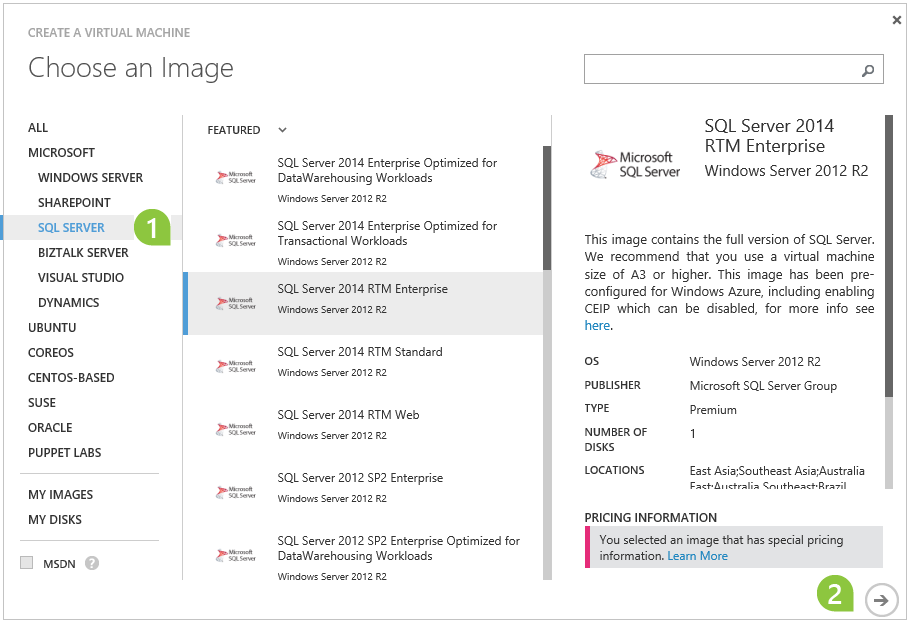
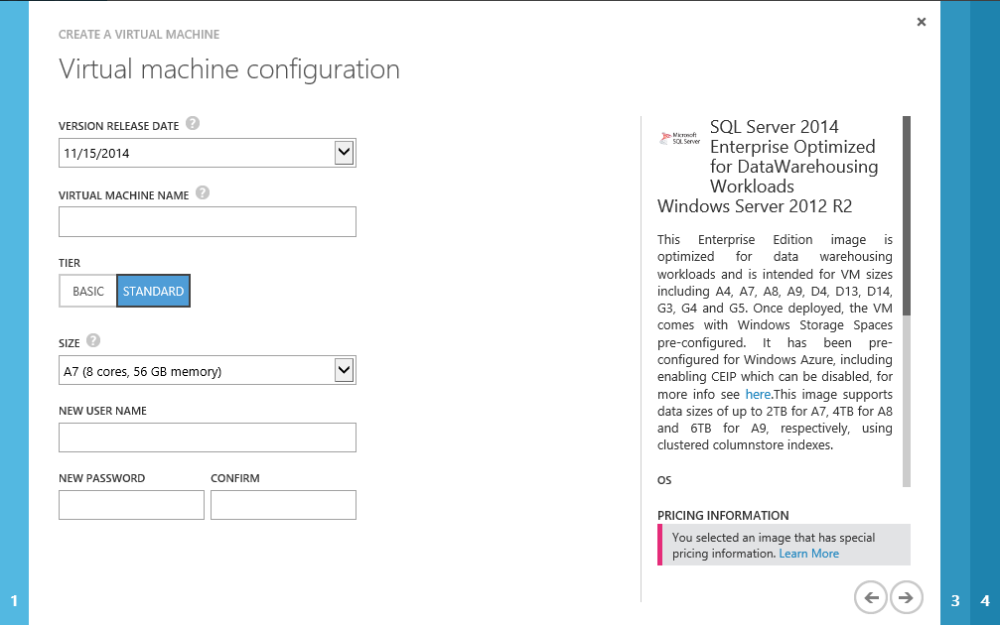

<properties 
	pageTitle="Provision a SQL Server virtual machine | Microsoft Azure" 
	description="This tutorial teaches you how to create and configure a SQL Server VM on Azure." 
	services="virtual-machines" 
	documentationCenter="" 
	authors="rothja" 
	manager="jeffreyg" 
	editor="monicar"
	tags="azure-service-management"
	/>

<tags 
	ms.service="virtual-machines" 
	ms.workload="infrastructure-services" 
	ms.tgt_pltfrm="vm-windows-sql-server" 
	ms.devlang="na" 
	ms.topic="article" 
	ms.date="08/26/2015" 
	ms.author="jroth"/>

# Provision a SQL Server virtual machine in Azure

> [AZURE.SELECTOR]
- [Portal](virtual-machines-provision-sql-server.md)
- [PowerShell](virtual-machines-sql-server-create-vm-with-powershell.md)

## Overview

[AZURE.INCLUDE [learn-about-deployment-models](../../includes/learn-about-deployment-models-include.md)] This article covers creating a resource with the classic deployment model. 

The Azure virtual machine gallery includes several images that contain Microsoft SQL Server. You can select one of the virtual machine images from the gallery and with a few clicks you can provision the virtual machine to your Azure environment.

In this tutorial, you will:

* [Connect to the Azure management portal and provision a virtual machine from the gallery](#Provision)
* [Open the virtual machine using Remote Desktop and complete setup](#RemoteDesktop)
* [Complete configuration steps to connect to the virtual machine using SQL Server Management Studio on another computer](#SSMS)
* [Next steps](#Optional)

>[AZURE.NOTE] This article describes how to provision a SQL Server VM with the existing Azure Management Portal. However, it is also possible to create and manage SQL Server VMs in the [new Portal](https://manage.windowsazure.com). There are some advantages to the new portal, such as defaulting to the use of Premium Storage, Automated Patching, Automated Backup, and AlwaysOn configurations. Future content will cover step-by-step instructions.

##<a id="Provision">Provision a SQL Server virtual machine from the gallery</a>

1. Log in to the [Azure Management Portal](http://manage.windowsazure.com) using your account. If you do not have an Azure account, visit [Azure free trial](http://azure.microsoft.com/pricing/free-trial/).

2. On the Azure Management Portal, at the bottom left of the web page, click **+NEW**, click **COMPUTE**, click **VIRTUAL MACHINE**, and then click **FROM GALLERY**.

3. On the **Choose an Image** page, click **SQL SERVER**. Then select a SQL Server image. Click the next arrow at the bottom right of the page. 

	

For the most up-to-date information on the supported SQL Server images on Azure, see [SQL Server on Azure Virtual Machines Overview](virtual-machines-sql-server-infrastructure-services.md).

>[AZURE.NOTE] If you have a virtual machine created by using the platform image SQL Server Evaluation edition, you cannot upgrade it to a per-minute paid edition image in the gallery. You can choose one of the following two options:
>
> - You can create a new virtual machine by using the per-minute paid SQL Server edition from the gallery and migrate your database files to this new virtual machine by following the steps at [Migrating a Database to SQL Server on an Azure VM](virtual-machines-migrate-onpremises-database)
> - Or, you can upgrade an existing instance of SQL Server Evaluation edition to a different edition of SQL Server under the [License Mobility through Software Assurance on Azure](http://azure.microsoft.com/pricing/license-mobility/) agreement by following the steps at [Upgrade to a Different Edition of SQL Server](https://msdn.microsoft.com/library/cc707783.aspx). For information on how to purchase the licensed copy of SQL Server, see [How to Buy SQL Server](http://www.microsoft.com/sqlserver/get-sql-server/how-to-buy.aspx).

4. On the first **Virtual Machine Configuration** page, provide the following information:
	- A **VERSION RELEASE DATE**. If multiple images are available, select the latest.
	- A unique **VIRTUAL MACHINE NAME**.
	- In the **NEW USER NAME** box, a unique user name for the machine's local administrator account.
	- In the **NEW PASSWORD** box, type a strong password. 
	- In the **CONFIRM PASSWORD** box, retype the password.
	- Select the appropriate **SIZE** from the drop down list. 

	

	>[AZURE.NOTE] The size of the virtual machine is specified during provisioning:
 	>
	> - For production workloads, we recommend using **DS2** for SQL Server Standard edition or **DS3** for SQL Server Enterprise edition with Premium Storage. For more information, see [Performance Best Practices for SQL Server in Azure Virtual Machines](virtual-machines-sql-server-performance-best-practices.md).
	> - The size selected limits the number of data disks you can configure. For most up-to-date information on available virtual machine sizes and the number of data disks that you can attach to a virtual machine, see [Virtual Machine Sizes for Azure](virtual-machines-size-specs.md).

5. After entering your VM configuration details, click the next arrow on the bottom right to continue.

5. On the second **Virtual machine configuration** page, configure resources for networking, storage, and availability:
	- In the **Cloud Service** box, choose **Create a new cloud service**.
	- In the **Cloud Service DNS Name** box, provide the first portion of a DNS name of your choice, so that it completes a name in the format **TESTNAME.cloudapp.net** 
	- Select a **SUBSCRIPTION**, if you have multiple subscriptions to choose from. The choice determines which **storage accounts **are available.
	- In the **REGION/AFFINITY GROUP/VIRTUAL NETWORK** box, select a region where this virtual image will be hosted.
	- In the **Storage Account**, automatically generate an account, or select one from the list. Change the **SUBSCRIPTION** to see more accounts. 
	- In the **AVAILABILITY SET** box, select **(none)**.
	- Read and accept the legal terms.
	

6. Click the next arrow to continue.

7. Click the check mark in the bottom right corner to continue.

8. Wait while Azure prepares your virtual machine. Expect the virtual machine status to proceed through:

	- **Starting (Provisioning)**
	- **Stopped**
	- **Starting (Provisioning)**
	- **Running (Provisioning)**
	- **Running**
	

##<a id="RemoteDesktop">Open the VM using Remote Desktop to complete setup</a>

1. When provisioning completes, click on the name of your virtual machine to go to the DASHBOARD page. At the bottom of the page, click **Connect**.

2. Click the **Open** button.

	

3. At the **Windows Security** dialog box, click **Use another account**.

	 

4. Use the name of the machine as the domain name, followed by your administrator name in this format: `machinename\username`. Type your password and connect to the machine.

4. The first time you log on, several processes will complete, including setup of your desktop, Windows updates, and completion of the Windows initial configuration tasks (sysprep). After Windows sysprep completes, SQL Server setup  completes configuration tasks. These tasks make cause a delay of a few minutes while they complete. `SELECT @@SERVERNAME` may not return the correct name until SQL Server setup completes, and SQL Server Management Studio may not be visable on the start page.

Once you are connected to the virtual machine with Windows Remote Desktop, the virtual machine works much like any other computer. Connect to the default instance of SQL Server with SQL Server Management Studio (running on the virtual machine) in the normal way. 

##<a id="SSMS">Connect to the SQL Server VM instance from SSMS on another computer</a>

[AZURE.INCLUDE [Connect to SQL Server in a VM](../../includes/virtual-machines-sql-server-connection-steps.md)]

## <a id="cdea">Connect to the Database Engine from your application</a>

If you can connect to an instance of SQL Server running on an Azure virtual machine by using Management Studio, you should be able to connect by using a connection string similar to the following.

	connectionString = "Server=tutorialtestVM.cloudapp.net,57500;Integrated Security=false;User ID=<login_name>;Password=<your_password>"

For more information, see [How to Troubleshoot Connecting to the SQL Server Database Engine](http://social.technet.microsoft.com/wiki/contents/articles/how-to-troubleshoot-connecting-to-the-sql-server-database-engine.aspx).

##<a id="Optional">Next Steps</a>

You've seen how to create and configure a SQL Server on an Azure virtual machine using the platform image. In many cases, the next step is to migrate your databases to this new SQL Server VM. For database migration guidance, see [Migrating a Database to SQL Server on an Azure VM](virtual-machines-migrate-onpremises-database.md).

The following list provides additional resources for SQL Server in Azure virtual machines.

### Recommended resources for SQL Server on Azure VMs:
- [SQL Server on Azure Virtual Machines Overview](virtual-machines-sql-server-infrastructure-services.md)

- [Connect to a SQL Server Virtual Machine on Azure](virtual-machines-sql-server-connectivity.md)

- [Performance Best Practices for SQL Server in Azure Virtual Machines](virtual-machines-sql-server-performance-best-practices.md)

- [Security Considerations for SQL Server in Azure Virtual Machines](virtual-machines-sql-server-security-considerations.md)

### High Availability and Disaster Recovery:
- [High Availability and Disaster Recovery for SQL Server in Azure Virtual Machines](virtual-machines-sql-server-high-availability-and-disaster-recovery-solutions.md)

- [Backup and Restore for SQL Server in Azure Virtual Machines](virtual-machines-sql-server-backup-and-restore.md)

### SQL Server Workloads in Azure:
- [SQL Server Business Intelligence in Azure Virtual Machines](virtual-machines-sql-server-business-intelligence.md)

### Whitepapers:
- [Understand Azure SQL Database and SQL Server in Azure Virtual Machines](sql-database/data-management-azure-sql-database-and-sql-server-iaas.md)

- [Application Patterns and Development Strategies for SQL Server in Azure Virtual Machines](virtual-machines-sql-server-application-patterns-and-development-strategies.md)
