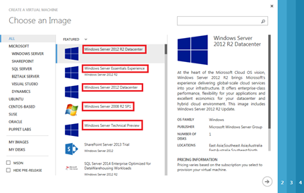

<properties
	pageTitle="Use Azure PowerShell to create and preconfigure Windows-based Virtual Machines"
	description="Learn how to use Azure PowerShell to create and preconfigure Windows-based virtual machines in Azure."
	services="virtual-machines"
	documentationCenter=""
	authors="KBDAzure"
	manager="timlt"
	editor=""
	tags="azure-service-management"/>

<tags
	ms.service="virtual-machines"
	ms.workload="infrastructure-services"
	ms.tgt_pltfrm="na"
	ms.devlang="na"
	ms.topic="article"
	ms.date="06/10/2015"
	ms.author="kathydav"/>

# Use Azure PowerShell to create and preconfigure Windows-based Virtual Machines

> [AZURE.SELECTOR]
- [Azure preview portal](virtual-machines-windows-tutorial.md)
- [Azure portal](virtual-machines-windows-tutorial-classic-portal.md)
- [PowerShell: Resource Manager deployment](virtual-machines-deploy-rmtemplates-powershell.md)
- [PowerShell: Classic deployment](virtual-machines-ps-create-preconfigure-windows-vms.md)

These steps show you how to customize a set of Azure PowerShell commands that create and preconfigure a Windows-based Azure virtual machine by using a building block approach. You can use this process to quickly create a command set for a new Windows-based virtual machine and expand an existing deployment or to create multiple command sets that quickly build out a custom dev/test or IT pro environment.

These steps follow a fill-in-the-blanks approach for creating Azure PowerShell command sets. This approach can be useful if you are new to PowerShell or you just want to know what values to specify for successful configuration. Advanced PowerShell users can take the commands and substitute their own values for the variables (the lines beginning with "$").

For the companion topic to configure Linux-based virtual machines, see [Use Azure PowerShell to create and preconfigure Linux-based Virtual Machines](virtual-machines-ps-create-preconfigure-windows-resource-manager-vms.md).

[AZURE.INCLUDE [service-management-pointer-to-resource-manager](../../includes/service-management-pointer-to-resource-manager.md)]

- [Create and preconfigure a Windows Virtual Machine with Resource Manager and Azure PowerShell](virtual-machines-ps-create-preconfigure-windows-resource-manager-vms.md)

## Step 1: Install Azure PowerShell

If you haven't done so already, use the instructions in [How to install and configure Azure PowerShell](../install-configure-powershell.md) to install Azure PowerShell on your local computer. Then, open an Azure PowerShell command prompt.

## Step 2: Set your subscription and storage account

Set your Azure subscription and storage account by running these commands at the Azure PowerShell command prompt. Replace everything within the quotes, including the < and > characters, with the correct names.

	$subscr="<subscription name>"
	$staccount="<storage account name>"
	Select-AzureSubscription -SubscriptionName $subscr –Current
	Set-AzureSubscription -SubscriptionName $subscr -CurrentStorageAccountName $staccount

You can get the correct subscription name from the SubscriptionName property of the output of the **Get-AzureSubscription** command. You can get the correct storage account name from the Label property of the output of the **Get-AzureStorageAccount** command after you run the **Select-AzureSubscription** command.

## Step 3: Determine the ImageFamily

Next, you need to determine the ImageFamily or Label value for the specific image corresponding to the Azure virtual machine you want to create. Here are some examples from the Gallery in the Azure Management Portal.

You can get the list of available ImageFamily values with this command.

	Get-AzureVMImage | select ImageFamily -Unique

Here are some examples of ImageFamily values for Windows-based computers:

- Windows Server 2012 R2 Datacenter
- Windows Server 2008 R2 SP1
- Windows Server Technical Preview
- SQL Server 2012 SP1 Enterprise on Windows Server 2012

If you find the image you are looking for, open a fresh instance of the text editor of your choice or the PowerShell Integrated Scripting Environment (ISE). Copy the following into the new text file or the PowerShell ISE, substituting the ImageFamily value.

	$family="<ImageFamily value>"
	$image=Get-AzureVMImage | where { $_.ImageFamily -eq $family } | sort PublishedDate -Descending | select -ExpandProperty ImageName -First 1

In some cases, the image name is in the Label property instead of the ImageFamily value. If you didn't find the image that you are looking for using the ImageFamily property, list the images by their Label property with this command.

	Get-AzureVMImage | select Label -Unique

If you find the right image with this command, open a fresh instance of the text editor of your choice or the PowerShell ISE. Copy the following into the new text file or the PowerShell ISE, substituting the Label value.

	$label="<Label value>"
	$image = Get-AzureVMImage | where { $_.Label -eq $label } | sort PublishedDate -Descending | select -ExpandProperty ImageName -First 1

## Step 4: Build your command set

Build the rest of your command set by copying the appropriate set of blocks below into your new text file or the ISE and then filling in the variable values and removing the < and > characters. See the two [examples](#examples) at the end of this article for an idea of the final result.

Start your command set by choosing one of these two command blocks (required).

Option 1: Specify a virtual machine name and a size.

	$vmname="<machine name>"
	$vmsize="<Specify one: Small, Medium, Large, ExtraLarge, A5, A6, A7, A8, A9>"
	$vm1=New-AzureVMConfig -Name $vmname -InstanceSize $vmsize -ImageName $image

Option 2: Specify a name, size, and availability set name.

	$vmname="<machine name>"
	$vmsize="<Specify one: Small, Medium, Large, ExtraLarge, A5, A6, A7, A8, A9>"
	$availset="<set name>"
	$vm1=New-AzureVMConfig -Name $vmname -InstanceSize $vmsize -ImageName $image -AvailabilitySetName $availset

For the InstanceSize values for D-, DS-, or G-series virtual machines, see [Virtual Machine and Cloud Service Sizes for Azure](https://msdn.microsoft.com/library/azure/dn197896.aspx).

Optionally, for a standalone Windows computer, specify the local administrator account and password.

	$cred=Get-Credential -Message "Type the name and password of the local administrator account."
	$vm1 | Add-AzureProvisioningConfig -Windows -AdminUsername $cred.GetNetworkCredential().Username -Password $cred.GetNetworkCredential().Password

 Choose a strong password. To check its strength, see [Password Checker: Using Strong Passwords](https://www.microsoft.com/security/pc-security/password-checker.aspx).

Optionally, to add the Windows computer to an existing Active Directory domain, specify the local administrator account and password, the domain, and the name and password of a domain account.

	$cred1=Get-Credential –Message "Type the name and password of the local administrator account."
	$cred2=Get-Credential –Message "Now type the name (not including the domain) and password of an account that has permission to add the machine to the domain."
	$domaindns="<FQDN of the domain that the machine is joining>"
	$domacctdomain="<domain of the account that has permission to add the machine to the domain>"
	$vm1 | Add-AzureProvisioningConfig -AdminUsername $cred1.GetNetworkCredential().Username -Password $cred1.GetNetworkCredential().Password -WindowsDomain -Domain $domacctdomain -DomainUserName $cred2.GetNetworkCredential().Username -DomainPassword $cred2.GetNetworkCredential().Password -JoinDomain $domaindns

For additional pre-configuration options for Windows-based virtual machines, see the syntax for the **Windows** and **WindowsDomain** parameter sets in [Add-AzureProvisioningConfig](https://msdn.microsoft.com/library/azure/dn495299.aspx).

Optionally, assign the virtual machine a specific IP address, known as a static DIP.

	$vm1 | Set-AzureStaticVNetIP -IPAddress <IP address>

You can verify that a specific IP address is available with:

	Test-AzureStaticVNetIP –VNetName <VNet name> –IPAddress <IP address>

Optionally, assign the virtual machine to a specific subnet in an Azure virtual network.

	$vm1 | Set-AzureSubnet -SubnetNames "<name of the subnet>"

Optionally, add a single data disk to the virtual machine.

	$disksize=<size of the disk in GB>
	$disklabel="<the label on the disk>"
	$lun=<Logical Unit Number (LUN) of the disk>
	$hcaching="<Specify one: ReadOnly, ReadWrite, None>"
	$vm1 | Add-AzureDataDisk -CreateNew -DiskSizeInGB $disksize -DiskLabel $disklabel -LUN $lun -HostCaching $hcaching

For an Active Directory domain controller, set $hcaching to "None".

Optionally, add the virtual machine to an existing load-balanced set for external traffic.

	$port="<Specify one: tcp, udp>"
	$localport=<port number of the internal port>
	$pubport=<port number of the external port>
	$endpointname="<name of the endpoint>"
	$lbsetname="<name of the existing load-balanced set>"
	$probeprotocol="<Specify one: tcp, udp>"
	$probeport=<TCP or UDP port number of probe traffic>
	$probepath="<URL path for probe traffic>"
	$vm1 | Add-AzureEndpoint -Name $endpointname -Protocol $prot -LocalPort $localport -PublicPort $pubport -LBSetName $lbsetname -ProbeProtocol $probeprotocol -ProbePort $probeport -ProbePath $probepath

Finally, choose one of these required command blocks for creating the virtual machine.

Option 1: Create the virtual machine in an existing cloud service.

	New-AzureVM –ServiceName "<short name of the cloud service>" -VMs $vm1

The short name of the cloud service is the name that appears in the list of Cloud Services in the Azure Management Portal or in the list of Resource Groups in the Azure Preview Portal.

Option 2: Create the virtual machine in an existing cloud service and virtual network.

	$svcname="<short name of the cloud service>"
	$vnetname="<name of the virtual network>"
	New-AzureVM –ServiceName $svcname -VMs $vm1 -VNetName $vnetname

## Step 5: Run your command set

Review the Azure PowerShell command set you built in your text editor or the PowerShell ISE consisting of multiple blocks of commands from step 4. Ensure that you have specified all the needed variables and that they have the correct values. Also make sure that you have removed all the < and > characters.

If you are using a text editor, copy the command set to the clipboard and then right-click your open Azure PowerShell command prompt. This will issue the command set as a series of PowerShell commands and create your Azure virtual machine. Alternately, run the command set in the PowerShell ISE.

If you will be creating this virtual machine again or a similar one, you can:

- Save this command set as a PowerShell script file (*.ps1).
- Save this command set as an Azure automation runbook in the **Automation** section of the Azure Management Portal.

## Examples

Here are two examples of using the steps above to build Azure PowerShell command sets that create Windows-based Azure virtual machines.

### Example 1

I need a PowerShell command set to create the initial virtual machine for an Active Directory domain controller that:

- Uses the Windows Server 2012 R2 Datacenter image.
- Has the name AZDC1.
- Is a standalone computer.
- Has an additional data disk of 20 GB.
- Has the static IP address 192.168.244.4.
- Is in the BackEnd subnet of the AZDatacenter virtual network.
- Is in the Azure-TailspinToys cloud service.

Here is the corresponding Azure PowerShell command set to create this virtual machine, with blank lines between each block for readability.

	$family="Windows Server 2012 R2 Datacenter"
	$image=Get-AzureVMImage | where { $_.ImageFamily -eq $family } | sort PublishedDate -Descending | select -ExpandProperty ImageName -First 1
	$vmname="AZDC1"
	$vmsize="Medium"
	$vm1=New-AzureVMConfig -Name $vmname -InstanceSize $vmsize -ImageName $image

	$cred=Get-Credential -Message "Type the name and password of the local administrator account."
	$vm1 | Add-AzureProvisioningConfig -Windows -AdminUsername $cred.GetNetworkCredential().Username -Password $cred.GetNetworkCredential().Password

	$vm1 | Set-AzureSubnet -SubnetNames "BackEnd"

	$vm1 | Set-AzureStaticVNetIP -IPAddress 192.168.244.4

	$disksize=20
	$disklabel="DCData"
	$lun=0
	$hcaching="None"
	$vm1 | Add-AzureDataDisk -CreateNew -DiskSizeInGB $disksize -DiskLabel $disklabel -LUN $lun -HostCaching $hcaching

	$svcname="Azure-TailspinToys"
	$vnetname="AZDatacenter"
	New-AzureVM –ServiceName $svcname -VMs $vm1 -VNetName $vnetname

### Example 2

I need a PowerShell command set to create a virtual machine for a line-of-business server that:

- Uses the Windows Server 2012 R2 Datacenter image.
- Has the name LOB1.
- Is a member of the corp.contoso.com domain.
- Has an additional data disk of 200 GB.
- Is in the FrontEnd subnet of the AZDatacenter virtual network.
- Is in the Azure-TailspinToys cloud service.

Here is the corresponding Azure PowerShell command set to create this virtual machine.

	$family="Windows Server 2012 R2 Datacenter"
	$image=Get-AzureVMImage | where { $_.ImageFamily -eq $family } | sort PublishedDate -Descending | select -ExpandProperty ImageName -First 1
	$vmname="LOB1"
	$vmsize="Large"
	$vm1=New-AzureVMConfig -Name $vmname -InstanceSize $vmsize -ImageName $image

	$cred1=Get-Credential –Message "Type the name and password of the local administrator account."
	$cred2=Get-Credential –Message "Now type the name (not including the domain) and password of an account that has permission to add the machine to the domain."
	$domaindns="corp.contoso.com"
	$domacctdomain="CORP"
	$vm1 | Add-AzureProvisioningConfig -AdminUsername $cred1.GetNetworkCredential().Username -Password $cred1.GetNetworkCredential().Password -WindowsDomain -Domain $domacctdomain -DomainUserName $cred2.GetNetworkCredential().Username -DomainPassword $cred2.GetNetworkCredential().Password -JoinDomain $domaindns

	$vm1 | Set-AzureSubnet -SubnetNames "FrontEnd"

	$disksize=200
	$disklabel="LOBData"
	$lun=0
	$hcaching="ReadWrite"
	$vm1 | Add-AzureDataDisk -CreateNew -DiskSizeInGB $disksize -DiskLabel $disklabel -LUN $lun -HostCaching $hcaching

	$svcname="Azure-TailspinToys"
	$vnetname="AZDatacenter"
	New-AzureVM –ServiceName $svcname -VMs $vm1 -VNetName $vnetname

## Additional resources

[Virtual machines documentation](http://azure.microsoft.com/documentation/services/virtual-machines/)

[Azure virtual machines FAQ](http://msdn.microsoft.com/library/azure/dn683781.aspx)

[Overview of Azure Virtual Machines](http://msdn.microsoft.com/library/azure/jj156143.aspx)

[How to install and configure Azure PowerShell](../install-configure-powershell.md)

[Use Azure PowerShell to create and preconfigure Linux-based Virtual Machines](virtual-machines-ps-create-preconfigure-linux-vms.md)

[Create and preconfigure a Windows Virtual Machine with Resource Manager and Azure PowerShell](virtual-machines-ps-create-preconfigure-windows-resource-manager-vms.md)
