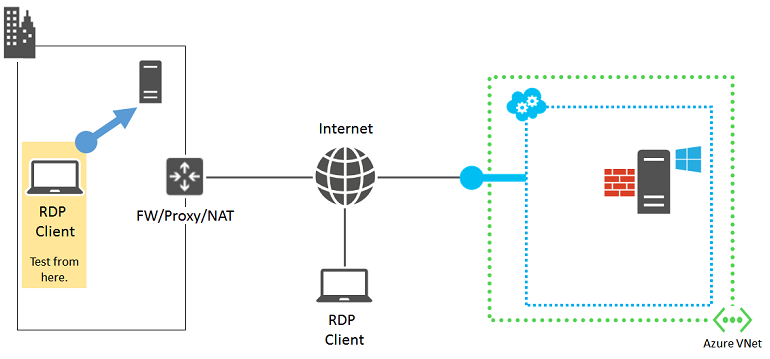

<properties
	pageTitle="Detailed Remote Desktop troubleshooting | Microsoft Azure"
	description="Detailed troubleshooting steps for RDP connections to an Azure virtual machine running Windows."
	services="virtual-machines"
	documentationCenter=""
	authors="dsk-2015"
	manager="timlt"
	editor=""
	tags="top-support-issue,azure-service-management,azure-resource-manager"/>

<tags
	ms.service="virtual-machines"
	ms.workload="infrastructure-services"
	ms.tgt_pltfrm="vm-windows"
	ms.devlang="na"
	ms.topic="article"
	ms.date="09/16/2015"
	ms.author="dkshir"/>

# Detailed troubleshooting for Remote Desktop connections to Windows based Azure virtual machines

This article provides detailed troubleshooting steps for complex Remote Desktop errors.

> [AZURE.IMPORTANT] To eliminate the more common Remote Desktop errors, make sure to read [the basic troubleshooting for Remote Desktop](virtual-machines-troubleshoot-remote-desktop-connections.md) before proceeding.

## Contact Azure Customer Support

If you need more help at any point in this article, you can contact the Azure experts on [the MSDN Azure and the Stack Overflow forums](http://azure.microsoft.com/support/forums/).

Alternatively, you can also file an Azure support incident. Go to the [Azure Support site](http://azure.microsoft.com/support/options/) and click on **Get Support**. For information about using Azure Support, read the [Microsoft Azure Support FAQ](http://azure.microsoft.com/support/faq/).

## Generic Remote Desktop error message

Sometimes you might see this error message in the Remote Desktop Connection message window: _Remote Desktop cannot connect to the remote computer for one of these reasons…_

This error happens when the Remote Desktop client cannot reach the Remote Desktop service on the virtual machine. There can be various reasons for this error.

Here is the set of components involved.

Before diving into a step-by-step troubleshooting process, it is helpful to mentally review what has changed since you were able to successfully create Remote Desktop connections and use that change as a basis for correcting the problem. For example:

- If you were able to create Remote Desktop connections and you changed the public IP address of the virtual machine or the cloud service containing your virtual machine (also known as the virtual IP address [VIP]), your DNS client cache might have an entry for the DNS name and the *old IP address*. Flush your DNS client cache and try again. Alternately, try making the connection by using the new VIP.
- If you changed from using the Azure portal or the Azure preview portal to using an application to manage your Remote Desktop connections, ensure that the application configuration includes the randomly determined TCP port for the Remote Desktop traffic.

The following sections step through isolating and determining the various root causes for this problem and providing solutions and workarounds.

## Preliminary steps

Perform these steps before proceeding to the detailed troubleshooting.

- Check the status of the virtual machine in the Azure portal or the Azure preview portal
- Restart the virtual machine
- [Resize the virtual machine](virtual-machines-size-specs.md)

After these steps, try the Remote Desktop connection again.

## Detailed troubleshooting

The Remote Desktop client may not be able to reach the Remote Desktop service on the Azure virtual machine due to issues or misconfigurations at the following sources:

- Remote Desktop client computer
- Organization intranet edge device
- Cloud service endpoint and access control list (ACL)
- Network security groups
- Windows-based Azure virtual machine

### Source 1: Remote Desktop client computer

To eliminate your computer as being the source of issues or misconfiguration, verify that your computer can make Remote Desktop connections to another on-premises, Windows-based computer.

If you cannot, check for these on your computer:

- A local firewall setting that is blocking Remote Desktop traffic
- Locally installed client proxy software that is preventing Remote Desktop connections
- Locally installed network monitoring software that is preventing Remote Desktop connections
- Other types of security software that either monitor traffic or allow/disallow specific types of traffic that is preventing Remote Desktop connections

In all of these cases, try to temporarily disable the software and attempt a Remote Desktop connection to an on-premises computer to find out the root cause. Then, work with your network administrator to correct the software settings to allow Remote Desktop connections.

### Source 2: Organization intranet edge device

To eliminate your organization intranet edge device as being the source of issues or misconfiguration, verify that a computer directly connected to the Internet can make Remote Desktop connections to your Azure virtual machine.

If you do not have a computer that is directly connected to the Internet, you can easily create a new Azure virtual machine in its own resource group or cloud service, and use it. For more information, see [Create a virtual machine running Windows in Azure](virtual-machines-windows-tutorial.md). Delete the resource group or the virtual machine and cloud service when you are done with your testing.

If you can create a Remote Desktop connection with a computer directly attached to the Internet, check your organization intranet edge device for:

- An internal firewall that is blocking HTTPS connections to the Internet
- Your proxy server that is preventing Remote Desktop connections
- Intrusion detection or network monitoring software running on devices in your edge network that is preventing Remote Desktop connections

Work with your network administrator to correct the settings of your organization intranet edge device to allow HTTPS-based Remote Desktop connections to the Internet.

### Source 3: Cloud service endpoint and ACL

To eliminate the cloud service endpoint and ACL as being the source of issues or misconfiguration for virtual machines created using the Service Management API, verify that another Azure virtual machine that is in the same cloud service or virtual network can make Remote Desktop connections to your Azure virtual machine.

> [AZURE.NOTE] For virtual machines created in Resource Manager, skip to [Source 4: Network Security Groups](#nsgs).

If you do not have another virtual machine in the same cloud service or virtual network, you can easily create a new one. For more information, see [Create a virtual machine running Windows in Azure](virtual-machines-windows-tutorial.md). Delete the extra virtual machine when you are done with your testing.

If you can create a Remote Desktop connection with a virtual machine in the same cloud service or virtual network, check for these:

- The endpoint configuration for Remote Desktop traffic on the target virtual machine. The private TCP port of the endpoint must match the TCP port on which the Remote Desktop Services service on the virtual machine is listening, which by default is 3389.
- The ACL for the Remote Desktop traffic endpoint on the target virtual machine. ACLs allow you to specify allowed or denied incoming traffic from the Internet based on its source IP address. Misconfigured ACLs can prevent incoming Remote Desktop traffic to the endpoint. Examine your ACLs to ensure that incoming traffic from your public IP addresses of your proxy or other edge server is allowed. For more information, see [What is a Network Access Control List (ACL)?](../virtual-network/virtual-networks-acl.md).

To eliminate the endpoint as a source of the problem, remove the current endpoint and create a new endpoint, choosing a random port in the range 49152–65535 for the external port number. For more information, see [How to set up endpoints to a virtual machine](virtual-machines-set-up-endpoints.md).

### Source 4: Network Security Groups

Network Security Groups allow more granular control of allowed inbound and outbound traffic. You can create rules that span subnets and cloud services in an Azure virtual network. Examine your Network Security Group rules to ensure that Remote Desktop traffic from the Internet is allowed.

For more information, see [What is a Network Security Group (NSG)?](../virtual-network/virtual-networks-nsg.md).

### Source 5: Windows-based Azure virtual machine

The last set of possible problems is on the Azure virtual machine itself.

The [basic Remote Desktop troubleshooting article](virtual-machines-troubleshoot-remote-desktop-connections.md) describes how to use the [Azure IaaS (Windows) diagnostics package](https://home.diagnostics.support.microsoft.com/SelfHelp?knowledgebaseArticleFilter=2976864). If this diagnostics package was unable to solve the **RDP connectivity to an Azure VM (Reboot Required)** issue, follow the instructions in [this article](virtual-machines-windows-reset-password.md) to reset the Remote Desktop Services service on the virtual machine. This will:

- Enable the "Remote Desktop" Windows Firewall default rule (TCP port 3389).
- Enable Remote Desktop connections by setting the HKLM\System\CurrentControlSet\Control\Terminal Server\fDenyTSConnections registry value to 0.

Try the connection from your computer again. If you are not successful, these are some of the possible problems:

- The Remote Desktop Services service is not running on the target virtual machine.
- The Remote Desktop Services service is not listening on TCP port 3389.
- Windows Firewall or another local firewall has an outbound rule that is preventing Remote Desktop traffic.
- Intrusion detection or network monitoring software running on the Azure virtual machine is preventing Remote Desktop connections.

To correct these possible problems for virtual machines created using the Service Management API, you can use a remote Azure PowerShell session to the Azure virtual machine. First, you will need to install a certificate for the virtual machine's hosting cloud service. Go to [Configures Secure Remote PowerShell Access to Azure Virtual Machines](http://gallery.technet.microsoft.com/scriptcenter/Configures-Secure-Remote-b137f2fe) and download the **InstallWinRMCertAzureVM.ps1** script file to a folder on your local computer.

Next, install Azure PowerShell if you haven't already. See [How to install and configure Azure PowerShell](../install-configure-powershell.md).

Next, open an Azure PowerShell command prompt and change the current folder to the location of the **InstallWinRMCertAzureVM.ps1** script file. To run an Azure PowerShell script, you must set the correct execution policy. Run the **Get-ExecutionPolicy** command to determine your current policy level. For information about setting the appropriate level, see [Set-ExecutionPolicy](https://technet.microsoft.com/library/hh849812.aspx).

Next, fill in your Azure subscription name, the cloud service name, and your virtual machine name (removing the < and > characters), and then run these commands.

	$subscr="<Name of your Azure subscription>"
	$serviceName="<Name of the cloud service that contains the target virtual machine>"
	$vmName="<Name of the target virtual machine>"
	.\InstallWinRMCertAzureVM.ps1 -SubscriptionName $subscr -ServiceName $serviceName -Name $vmName

You can get the correct subscription name from the _SubscriptionName_ property of the display of the **Get-AzureSubscription** command. You can get the cloud service name for the virtual machine from the _ServiceName_ column of the display of the **Get-AzureVM** command.

To prove that you have this new certificate, open a Certificates snap-in for the current user and look in the **Trusted Root Certification Authorities\Certificates** folder. You should see a certificate with the DNS name of your cloud service in the Issued To column (example: cloudservice4testing.cloudapp.net).

Next, initiate a remote Azure PowerShell session by using these commands.

	$uri = Get-AzureWinRMUri -ServiceName $serviceName -Name $vmName
	$creds = Get-Credential
	Enter-PSSession -ConnectionUri $uri -Credential $creds

After entering valid administrator credentials, you should see something like this as your Azure PowerShell prompt:

	[cloudservice4testing.cloudapp.net]: PS C:\Users\User1\Documents>

The first part of the prompt indicates that you are now issuing Azure PowerShell commands for the cloud service that contains the target virtual machine. Your cloud service name will be something different from "cloudservice4testing.cloudapp.net".

You can now issue Azure PowerShell commands to investigate the additional problems cited above and make configuration corrections.

### To manually correct the Remote Desktop Services listening TCP port

If you were unable to run the [Azure IaaS (Windows) diagnostics package](https://home.diagnostics.support.microsoft.com/SelfHelp?knowledgebaseArticleFilter=2976864) for the **RDP connectivity to an Azure VM (Reboot Required)** issue, at the remote Azure PowerShell session prompt, run this command.

	Get-ItemProperty -Path "HKLM:\System\CurrentControlSet\Control\Terminal Server\WinStations\RDP-Tcp" -Name "PortNumber"

The PortNumber property shows the current port number. If needed, change the Remote Desktop port number back to its default value (3389) by using this command.

	Set-ItemProperty -Path "HKLM:\System\CurrentControlSet\Control\Terminal Server\WinStations\RDP-Tcp" -Name "PortNumber" -Value 3389

Verify that the port has been changed to 3389 by using this command.

	Get-ItemProperty -Path "HKLM:\System\CurrentControlSet\Control\Terminal Server\WinStations\RDP-Tcp" -Name "PortNumber"

Exit the remote Azure PowerShell session by using this command.

	Exit-PSSession

Verify that the Remote Desktop endpoint for the Azure virtual machine is also using TCP port 3398 as its internal port. Then, restart the Azure virtual machine and try your Remote Desktop connection again.

## Additional resources

[Azure IaaS (Windows) diagnostics package](https://home.diagnostics.support.microsoft.com/SelfHelp?knowledgebaseArticleFilter=2976864)

[How to reset a password or the Remote Desktop service for Windows virtual machines](virtual-machines-windows-reset-password.md)

[How to install and configure Azure PowerShell](../install-configure-powershell.md)

[Troubleshoot Secure Shell (SSH) connections to a Linux-based Azure virtual machine](virtual-machines-troubleshoot-ssh-connections.md)

[Troubleshoot access to an application running on an Azure virtual machine](virtual-machines-troubleshoot-access-application.md)
