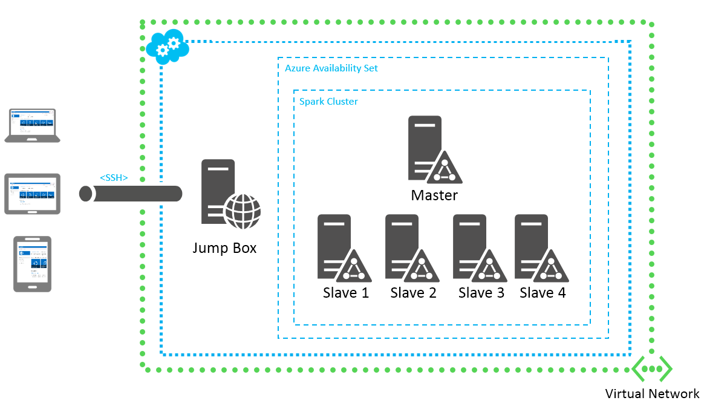
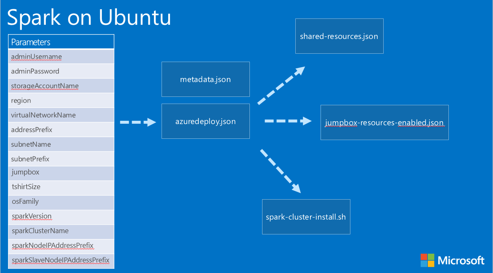
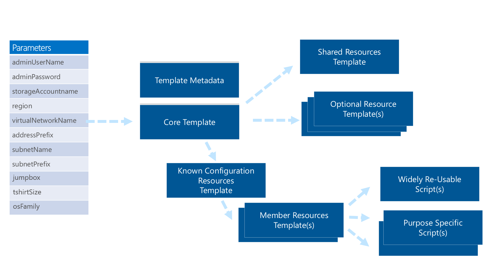

<properties
	pageTitle="Spark on Ubuntu Resource Manager Template"
	description="Learn to easily deploy a new Spark cluster on Ubuntu VMs using Azure PowerShell or the Azure CLI and a Resource Manager template"
	services="virtual-machines"
	documentationCenter=""
	authors="paolosalvatori"
	manager="timlt"
	editor="tysonn"/>

<tags
	ms.service="virtual-machines"
	ms.devlang="na"
	ms.topic="article"
	ms.tgt_pltfrm="vm-windows"
	ms.workload="multiple"
	ms.date="05/16/2015"
	ms.author="paolosalvatori"/>

# Spark on Ubuntu with a Resource Manager template

Apache Spark is a fast engine for large-scale data processing. Spark has an advanced DAG execution engine that supports cyclic data flow and in-memory computing, and it can access diverse data sources, including HDFS, Spark, HBase, and S3.

In addition to running on the Mesos or YARN cluster managers, Spark provides a simple standalone deployment mode. This tutorial will walk you through how to use a sample Azure Resource Manager template to deploy a Spark cluster on Ubuntu VMs through [Azure PowerShell](../powershell-install-configure.md) or the [Azure CLI](../xplat-cli.md).

This template deploys a Spark cluster on the Ubuntu virtual machines. This template also provisions a storage account, virtual network, availability sets, public IP addresses and network interfaces required by the installation. The Spark cluster is created behind a subnet, so there is no public IP access to the cluster.  As part of the deployment, an optional "jump box" can be deployed. This "jump box" is an Ubuntu VM deployed in the subnet as well, but it *does* expose a public IP address with an open SSH port that you can connect to. Then from the "jump box", you can SSH to all the Spark VMs in the subnet.

The template utilizes a "t-shirt size" concept in order to specify a "Small", "Medium", or "Large" Spark cluster setup.  When the template language supports more dynamic template sizing, this could be changed to specify the number of Spark cluster master nodes and slave nodes, VM size, etc. For now, you can see the VM size and the number of masters and slaves defined in the file azuredeploy.json in the variables **tshirtSizeS**, **tshirtSizeM**, and **tshirtSizeL**:

- S: 1 master, 1 slave
- M: 1 master, 4 slaves
- L: 1 master, 6 slaves

Newly deployed clusters based on this template will have the topology described in the following diagram, although other topologies can be easily achieved by customizing the template presented in this article:



As shown in the above image, the deployment topology consists of the following elements:

-	A new storage account hosting the OS disk of newly created virtual machines.
-	A virtual network with a subnet. All the virtual machines created by the template are provisioned inside this virtual network.
-	An availability set for master and slave nodes.
-	A master node in the newly created availability set.
-	Four slave nodes running in the same virtual subnet and availability set as the master node.
-	A jump-box VM located in the same virtual network and subnet that can be used to access the cluster.

Spark version 3.0.0 is the default version and can be changed to any pre-built binaries available on the Spark repository. There is also a provision in the script to uncomment the build from source. A static IP address will be assigned to each Spark master node: 10.0.0.10. A static IP address will be assigned to each Spark slave node in order to work around the current limitation of not being able to dynamically compose a list of IP addresses from within the template. (By default, the first node will be assigned the private IP address of 10.0.0.30, the second node will be assigned 10.0.0.31, and so on.) To check deployment errors, go to the new Azure portal and look under **Resource Group** > **Last deployment** > **Check Operation Details**.

Before diving into more details related to Azure Resource Manager and the template we will use for this deployment, make sure you have Azure PowerShell or the Azure CLI configured correctly.

[AZURE.INCLUDE [arm-getting-setup-powershell](../../includes/arm-getting-setup-powershell.md)]

[AZURE.INCLUDE [xplat-getting-set-up-arm](../../includes/xplat-getting-set-up-arm.md)]

## Create a Spark cluster by using a Resource Manager template

Follow these steps to create a Spark cluster by using a Resource Manager template from the GitHub template repository, via either Azure PowerShell or the Azure CLI.

### Step 1-a: Download the template files by using Azure PowerShell

Create a local folder for the JSON template and other associated files (for example, C:\Azure\Templates\Spark).

Substitute in the folder name of your local folder and run these commands:

```powershell
# Define variables
$folderName="C:\Azure\Templates\Spark\"
$baseAddress = "https://raw.githubusercontent.com/azure/azure-quickstart-templates/master/spark-on-ubuntu/"
$webclient = New-Object System.Net.WebClient
$files = $("azuredeploy.json", `
         "azuredeploy-parameters.json", `
         "jumpbox-resources-disabled.json", `
         "jumpbox-resources-enabled.json",
         "metadata.json", `
         "shared-resources.json", `
         "spark-cluster-install.sh", `
         "jumpbox-resources-enabled.json")

# Download files
foreach ($file in $files)
{
    $url = $baseAddress + $file
    $filePath = $folderName + $file
    $webclient.DownloadFile($baseAddress + $file, $folderName + $file)
    Write-Host $url "downloaded to" $filePath
}
```

### Step 1-b: Download the template files by using the Azure CLI

Clone the entire template repository by using a Git client of your choice, for example:

	git clone https://github.com/Azure/azure-quickstart-templates C:\Azure\Templates

When the cloning is completed, look for the **spark-on-ubuntu** folder in your C:\Azure\Templates directory.

### Step 2: (optional) Understand the template parameters

When you create a Spark cluster by using a template, you must specify a set of configuration parameters to deal with a number of required settings. By declaring these parameters in template definition, it's possible to specify values during deployment execution through an external file or at a command line.

In the "parameters" section at the top of the azuredeploy.json file, you'll find the set of parameters that are required by the template to configure a Spark cluster. Here is an example of the "parameters" section from this template's azuredeploy.json file:

```json
"parameters": {
	"adminUsername": {
		"type": "string",
		"metadata": {
			"Description": "Administrator user name used when provisioning virtual machines"
		}
	},
	"adminPassword": {
		"type": "securestring",
		"metadata": {
			"Description": "Administrator password used when provisioning virtual machines"
		}
	},
	"imagePublisher": {
		"type": "string",
		"defaultValue": "Canonical",
		"metadata": {
			"Description": "Image publisher"
		}
	},
	"imageOffer": {
		"type": "string",
		"defaultValue": "UbuntuServer",
		"metadata": {
			"Description": "Image offer"
		}
	},
	"imageSKU": {
		"type": "string",
		"defaultValue": "14.04.2-LTS",
		"metadata": {
			"Description": "Image SKU"
		}
	},
	"storageAccountName": {
		"type": "string",
		"defaultValue": "uniquesparkstoragev12",
		"metadata": {
			"Description": "Unique namespace for the Storage account where the virtual machine's disks will be placed"
		}
	},
	"region": {
		"type": "string",
		"defaultValue": "West US",
		"metadata": {
			"Description": "Location where resources will be provisioned"
		}
	},
	"virtualNetworkName": {
		"type": "string",
		"defaultValue": "myVNETspark",
		"metadata": {
			"Description": "The arbitrary name of the virtual network provisioned for the cluster"
		}
	},
	"dataDiskSize": {
		"type": "int",
		"defaultValue": 100,
		"metadata": {
			"Description": "Size of the data disk attached to Spark nodes (in GB)"
		}
	},
	"addressPrefix": {
		"type": "string",
		"defaultValue": "10.0.0.0/16",
		"metadata": {
			"Description": "The network address space for the virtual network"
		}
	},
	"subnetName": {
		"type": "string",
		"defaultValue": "Subnet-1",
		"metadata": {
			"Description": "Subnet name for the virtual network that resources will be provisioned into"
		}
	},
	"subnetPrefix": {
		"type": "string",
		"defaultValue": "10.0.0.0/24",
		"metadata": {
			"Description": "Address space for the virtual network subnet"
		}
	},
	"sparkVersion": {
		"type": "string",
		"defaultValue": "stable",
		"metadata": {
			"Description": "The version of the Spark package to be deployed on the cluster (or use 'stable' to pull in the latest and greatest)"
		}
	},
	"sparkClusterName": {
		"type": "string",
		"metadata": {
			"Description": "The arbitrary name of the Spark cluster (maps to cluster's configuration file name)"
		}
	},
	"sparkNodeIPAddressPrefix": {
		"type": "string",
		"defaultValue": "10.0.0.1",
		"metadata": {
			"Description": "The IP address prefix that will be used for constructing a static private IP address for each node in the cluster"
		}
	},
	"sparkSlaveNodeIPAddressPrefix": {
		"type": "string",
		"defaultValue": "10.0.0.3",
		"metadata": {
			"Description": "The IP address prefix that will be used for constructing a static private IP address for each node in the cluster"
		}
	},
	"jumpbox": {
		"type": "string",
		"defaultValue": "enabled",
		"allowedValues": [
		"enabled",
		"disabled"
		],
		"metadata": {
			"Description": "The flag allowing to enable or disable provisioning of the jump-box VM that can be used to access the Spark nodes"
		}
	},
	"tshirtSize": {
		"type": "string",
		"defaultValue": "S",
		"allowedValues": [
		"S",
		"M",
		"L"
		],
		"metadata": {
			"Description": "T-shirt size of the Spark cluster"
		}
	}
}
```

Each parameter has details such as data type and allowed values. This allows for validation of parameters passed during template execution in an interactive mode (e.g., Azure PowerShell or Azure CLI), as well as a self-discovery UI that could be dynamically built by parsing the list of required parameters and their descriptions.

### Step 3-a: Deploy a Spark cluster by using a template via Azure PowerShell

Prepare a parameters file for your deployment by creating a JSON file containing runtime values for all parameters. This file will then be passed as a single entity to the deployment command. If you do not include a parameters file, Azure PowerShell will use any default values specified in the template, and then prompt you to fill in the remaining values.

Here is an example set of parameters from the azuredeploy-parameters.json file. Note that you will need to provide valid values for the parameters **storageAccountName**, **adminUsername**, and **adminPassword**, plus any customizations to the other parameters:

```json
{
  "storageAccountName": {
    "value": "paolosspark"
  },
  "adminUsername": {
    "value": "paolos"
  },
  "adminPassword": {
    "value": "Passw0rd!"
  },
  "region": {
    "value": "West US"
  },
  "virtualNetworkName": {
    "value": "sparkClustVnet"
  },
  "subnetName": {
    "value": "Subnet1"
  },
  "addressPrefix": {
    "value": "10.0.0.0/16"
  },
  "subnetPrefix": {
    "value": "10.0.0.0/24"
  },
  "sparkVersion": {
    "value": "3.0.0"
  },
  "sparkClusterName": {
    "value": "spark-arm-cluster"
  },
  "sparkNodeIPAddressPrefix": {
		"value": "10.0.0.1"
  },
  "sparkSlaveNodeIPAddressPrefix": {
    "value": "10.0.0.3"
  },
  "jumpbox": {
    "value": "enabled"
  },
  "tshirtSize": {
    "value": "M"
  }
}
```
Fill in an Azure deployment name, resource group name, Azure location, and the folder of your saved JSON deployment file. Then run these commands:

```powershell
$deployName="<deployment name>"
$RGName="<resource group name>"
$locName="<Azure location, such as West US>"
$folderName="<folder name, such as C:\Azure\Templates\Spark>"
$templateFile= $folderName + "\azuredeploy.json"
$templateParameterFile= $folderName + "\azuredeploy-parameters.json"
New-AzureResourceGroup -Name $RGName -Location $locName
New-AzureResourceGroupDeployment -Name $deployName -ResourceGroupName $RGName -TemplateParamterFile $templateParameterFile -TemplateFile $templateFile
```
> [AZURE.NOTE] **$RGName** must be unique within your subscription.

When you run the **New-AzureResourceGroupDeployment** command, this will extract parameter values from the JSON parameters file, and will start executing the template accordingly. Defining and using multiple parameter files with your different environments (test, production, etc.) will promote template reuse and simplify complex multi-environment solutions.

When deploying, please keep in mind that a new Azure Storage account needs to be created, so the name you provide as the Storage account parameter must be unique and meet all requirements for an Azure Storage account (lowercase letters and numbers only).

During the deployment, you will see something like this:

```powershell
PS C:\> New-AzureResourceGroup -Name $RGName -Location $locName

ResourceGroupName : SparkResourceGroup
Location          : westus
ProvisioningState : Succeeded
Tags              :
Permissions       :
                    Actions  NotActions
                    =======  ==========
                    *

ResourceId        : /subscriptions/2018abc3-dbd9-4437-81a8-bb3cf56138ed/resourceGroups/sparkresourcegroup

PS C:\> New-AzureResourceGroupDeployment -Name $deployName -ResourceGroupName $RGName -TemplateParameterFile $templateParameterFile -TemplateFile $templateFile
VERBOSE: 10:08:28 AM - Template is valid.
VERBOSE: 10:08:28 AM - Create template deployment 'SparkTestDeployment'.
VERBOSE: 10:08:37 AM - Resource Microsoft.Resources/deployments 'shared-resources' provisioning status is running
VERBOSE: 10:09:11 AM - Resource Microsoft.Resources/deployments 'shared-resources' provisioning status is succeeded
VERBOSE: 10:09:13 AM - Resource Microsoft.Network/networkInterfaces 'nicsl0' provisioning status is succeeded
VERBOSE: 10:09:16 AM - Resource Microsoft.Network/networkInterfaces 'nic0' provisioning status is succeeded
VERBOSE: 10:09:16 AM - Resource Microsoft.Resources/deployments 'jumpbox-resources' provisioning status is running
VERBOSE: 10:09:24 AM - Resource Microsoft.Compute/virtualMachines 'mastervm0' provisioning status is running
VERBOSE: 10:11:04 AM - Resource Microsoft.Compute/virtualMachines/extensions 'mastervm0/installsparkmaster'
provisioning status is running
VERBOSE: 10:11:04 AM - Resource Microsoft.Compute/virtualMachines 'mastervm0' provisioning status is succeeded
VERBOSE: 10:11:11 AM - Resource Microsoft.Compute/virtualMachines 'slavevm0' provisioning status is running
VERBOSE: 10:11:42 AM - Resource Microsoft.Resources/deployments 'jumpbox-resources' provisioning status is succeeded
VERBOSE: 10:13:10 AM - Resource Microsoft.Compute/virtualMachines 'slavevm0' provisioning status is succeeded
VERBOSE: 10:13:15 AM - Resource Microsoft.Compute/virtualMachines/extensions 'slavevm0/installsparkslave' provisioning
status is running
VERBOSE: 10:16:58 AM - Resource Microsoft.Compute/virtualMachines/extensions 'mastervm0/installsparkmaster'
provisioning status is succeeded
VERBOSE: 10:19:05 AM - Resource Microsoft.Compute/virtualMachines/extensions 'slavevm0/installsparkslave' provisioning
status is succeeded


DeploymentName    : SparkTestDeployment
ResourceGroupName : SparkResourceGroup
ProvisioningState : Succeeded
Timestamp         : 5/5/2015 5:19:05 PM
Mode              : Incremental
TemplateLink      :
Parameters        :
                    Name             Type                       Value
                    ===============  =========================  ==========
                    adminUsername    String                     Paolos
                    adminPassword    SecureString
                    imagePublisher   String                     Canonical
                    imageOffer       String                     UbuntuServer
                    imageSKU         String                     14.04.2-LTS
                    storageAccountName  String                  paolosspark
                    region           String                     West US
                    virtualNetworkName  String                  sparkClustVnet
                    addressPrefix    String                     10.0.0.0/16
										subnetName       String                     Subnet1
                    subnetPrefix     String                     10.0.0.0/24
                    sparkVersion     String                     3.0.0
                    sparkClusterName  String                    spark-arm-cluster
                    sparkNodeIPAddressPrefix  String            10.0.0.1
                    sparkSlaveNodeIPAddressPrefix  String       10.0.0.3
                    jumpbox          String                     enabled
                    tshirtSize       String                     M
```

During and after deployment, you can check all the requests that were made during provisioning, including any errors that occurred.

To do that, go to the [Azure portal](https://portal.azure.com) and do the following:

- Click **Browse** on the left-hand navigation bar, and then scroll down and click **Resource Groups**.
- Click the resource group that you just created, to bring up the "Resource Group" blade.
- By clicking the **Events** bar graph in the **Monitoring** part of the "Resource Group" blade, you can see the events for your deployment.
- By clicking individual events, you can drill further down into the details of each individual operation made on behalf of the template.


After your tests, if you need to remove this resource group and all of its resources (the storage account, virtual machine, and virtual network), use this single command:

```powershell
Remove-AzureResourceGroup -Name "<resource group name>" -Force
```

### Step 3-b: Deploy a Spark cluster by using a template via the Azure CLI

To deploy a Spark cluster via the Azure CLI, first create a resource group by specifying a name and a location:

	azure group create SparkResourceGroup "West US"

Pass this resource group name, the location of the JSON template file, and the location of the parameters file (see the above Azure PowerShell section for details) into the following command:

	azure group deployment create SparkResourceGroup -f .\azuredeploy.json -e .\azuredeploy-parameters.json

You can check the status of individual resources deployments by using the following command:

	azure group deployment list SparkResourceGroup

## A tour of the Spark template structure and file organization

In order to design a robust and reusable Resource Manager template, additional thinking is needed to organize the series of complex and interrelated tasks required during the deployment of a complex solution like Spark. Leveraging Resource Manager template linking and resource looping in addition to script execution through related extensions, it's possible to implement a modular approach that can be reused with virtually any complex template-based deployment.

This diagram describes the relationships between all the files downloaded from GitHub for this deployment:



This section steps you through the structure of the azuredeploy.json file for the Spark cluster.

If you have not already downloaded a copy of the template file, designate a local folder as the location for the file and create it (for example, C:\Azure\Templates\Spark). Fill in the folder name and run these commands:

```powershell
$folderName="<folder name, such as C:\Azure\Templates\Spark>"
$webclient = New-Object System.Net.WebClient
$url = "https://raw.githubusercontent.com/Azure/azure-quickstart-templates/master/spark-on-ubuntu/azuredeploy.json"
$filePath = $folderName + "\azuredeploy.json"
$webclient.DownloadFile($url,$filePath)
```

Open the azuredeploy.json template in a text editor or tool of your choice. The following information describes the structure of the template file and the purpose of each section. Alternately, you can see the contents of this template in your browser from [here](https://raw.githubusercontent.com/Azure/azure-quickstart-templates/master/spark-on-ubuntu/azuredeploy.json).

### "parameters" section

The "parameters" section of azuredeploy.json specifies modifiable parameters that are used in this template. The aforementioned azuredeploy-parameters.json file is used to pass values into the "parameters" section of azuredeploy.json during template execution.

Here is an example of a parameter for the "t-shirt size":

```json
"tshirtSize": {
    "type": "string",
    "defaultValue": "S",
    "allowedValues": [
        "S",
        "M",
        "L"
    ],
    "metadata": {
        "Description": "T-shirt size of the Spark deployment"
    }
},
```

> [AZURE.NOTE] Notice that **defaultValue** may be specified, as well as **allowedValues**.

### "variables" section

The "variables" section specifies variables that can be used throughout this template. This contains a number of fields (JSON data types or fragments) that will be set to constants or calculated values at execution time. Here are some examples that range from simple to more complex:

```json
"variables": {
	"vmStorageAccountContainerName": "vhd",
	"vnetID": "[resourceId('Microsoft.Network/virtualNetworks',parameters('virtualNetworkName'))]",
	"subnetRef": "[concat(variables('vnetID'),'/subnets/',parameters('subnetName'))]",
	"computerNamePrefix": "sparknode",
	"scriptUrl": "https://raw.githubusercontent.com/Azure/azure-quickstart-templates/master/spark-on-ubuntu/",
	"templateUrl": "[variables('scriptUrl')]",
	"sharedTemplateName": "shared-resources",
	"jumpboxTemplateName": "jumpbox-resources-",
	"tshirtSizeS": {
		"numberOfMasterInstances": 1,
		"numberOfSlavesInstances" : 1,
		"vmSize": "Standard_A2"
	},
	"tshirtSizeM": {
		"numberOfMasterInstances": 1,
		"numberOfSlavesInstances" : 4,
		"vmSize": "Standard_A4"
	},
	"tshirtSizeL": {
		"numberOfMasterInstances": 1,
		"numberOfSlavesInstances" : 6,
		"vmSize": "Standard_A7"
	},
	"numberOfMasterInstances": "[variables(concat('tshirtSize', parameters('tshirtSize'))).numberOfMasterInstances]",
	"numberOfSlavesInstances": "[variables(concat('tshirtSize', parameters('tshirtSize'))).numberOfSlavesInstances]",
	"vmSize": "[variables(concat('tshirtSize', parameters('tshirtSize'))).vmSize]"
},
```

The **vmStorageAccountContainerName** variable is an example of a simple name/value variable.  **vnetID** is an example of a variable that is calculated at run time using the functions **resourceId** and **parameters**.  The value of the **numberOfMasterInstances** and **vmSize** variables are calculated at run time using the **concat**, **variables**, and **parameters** functions.  

If you want to customize the size of the Spark cluster deployment, then you can change the properties of the variables **tshirtSizeS**, **tshirtSizeM**, and **tshirtSizeL** in the azuredeploy.json template.  

More information regarding the template language can be found on MSDN at [Azure Resource Manager Template Language](../resource-group-authoring-templates.md).


### "resources" section

The "resources" section is where most of the action happens. Looking carefully inside this section, you can immediately identify two different cases. The first is an element defined of type `Microsoft.Resources/deployments` that essentially invokes a nested deployment within the main one. The second is the **templateLink** property (and related **contentVersion** property) that makes it possible to specify a linked template file that will be invoked, passing a set of parameters as input. These can be seen in this template fragment:

```json
"resources": [
{
	"name": "shared-resources",
	"type": "Microsoft.Resources/deployments",
	"apiVersion": "2015-01-01",
	"properties": {
		"mode": "Incremental",
		"templateLink": {
			"uri": "[concat(variables('templateUrl'), variables('sharedTemplateName'), '.json')]",
			"contentVersion": "1.0.0.0"
		},
		"parameters": {
			"region": {
				"value": "[parameters('region')]"
			},
			"storageAccountName": {
				"value": "[parameters('storageAccountName')]"
			},
			"virtualNetworkName": {
				"value": "[parameters('virtualNetworkName')]"
			},
			"addressPrefix": {
				"value": "[parameters('addressPrefix')]"
			},
			"subnetName": {
				"value": "[parameters('subnetName')]"
			},
			"subnetPrefix": {
				"value": "[parameters('subnetPrefix')]"
			}
		}
	}
},
```

From this first example, it is clear how azuredeploy.json in this scenario has been organized as a sort of orchestration mechanism, invoking a number of other template files. Each file is responsible for part of the required deployment activities.

In particular, the following linked templates will be used for this deployment:

-	**shared-resource.json**: contains the definition of all resources that will be shared across the deployment. Examples are Storage accounts used to store a VM's OS disks and virtual networks.
-	**jumpbox-resources-enabled.json**: deploys the "jump box" VM and all related resources, such as network interface, public IP address, and the input endpoint used to SSH into the environment.

After invoking these two templates, azuredeploy.json provisions all Spark cluster node VMs and connected resources (network adapters, private IPs, etc.). This template will also deploy VM extensions (custom scripts for Linux) and invoke a bash script (spark-cluster-install.sh) to physically install and set up Spark on each node.  

Let's drill down into *how* this last template, azuredeploy.json, is used, as it is one of the most interesting from a template development perspective. One important concept to highlight is how a single template file can deploy multiple copies of a single resource type, and for each instance, it can set unique values for required settings. This concept is known as **resource looping**.

A resource that uses the **copy** element will "copy" itself for the number of times specified in the **count** parameter of the **copy** element.  For all settings where it is necessary to specify unique values between different instances of the deployed resource, the **copyindex()** function can be used to obtain a numeric value indicating the current index in that particular resource loop creation. In the following fragment from azuredeploy.json, you can see this concept applied to multiple network adapters, VMs, and VM extensions being created for the Spark cluster:

```json
{
	"apiVersion": "2015-05-01-preview",
	"type": "Microsoft.Network/networkInterfaces",
	"name": "[concat('nic', copyindex())]",
	"location": "[parameters('region')]",
	"copy": {
		"name": "nicLoop",
		"count": "[variables('numberOfMasterInstances')]"
	},
	"dependsOn": [
	"[concat('Microsoft.Resources/deployments/', 'shared-resources')]"
	],
	"properties": {
		"ipConfigurations": [
		{
			"name": "ipconfig1",
			"properties": {
				"privateIPAllocationMethod": "Static",
				"privateIPAddress": "[concat(parameters('sparkNodeIPAddressPrefix'), copyindex())]",
				"subnet": {
					"id": "[variables('subnetRef')]"
				}
			}
		}
		]
	}
},
{
	"apiVersion": "2015-05-01-preview",
	"type": "Microsoft.Network/networkInterfaces",
	"name": "[concat('nicsl', copyindex())]",
	"location": "[parameters('region')]",
	"copy": {
		"name": "nicslLoop",
		"count": "[variables('numberOfSlavesInstances')]"
	},
	"dependsOn": [
	"[concat('Microsoft.Resources/deployments/', 'shared-resources')]"
	],
	"properties": {
		"ipConfigurations": [
		{
			"name": "ipconfig1",
			"properties": {
				"privateIPAllocationMethod": "Static",
				"privateIPAddress": "[concat(parameters('sparkSlaveNodeIPAddressPrefix'), copyindex())]",
				"subnet": {
					"id": "[variables('subnetRef')]"
				}
			}
		}
		]
	}
},
{
	"apiVersion": "2015-05-01-preview",
	"type": "Microsoft.Compute/virtualMachines",
	"name": "[concat('mastervm', copyindex())]",
	"location": "[parameters('region')]",
	"copy": {
		"name": "virtualMachineLoopMaster",
		"count": "[variables('numberOfMasterInstances')]"
	},
	"dependsOn": [
	"[concat('Microsoft.Resources/deployments/', 'shared-resources')]",
	"[concat('Microsoft.Network/networkInterfaces/', 'nic', copyindex())]"
	],
	"properties": {
		"availabilitySet": {
			"id": "[resourceId('Microsoft.Compute/availabilitySets', 'sparkCluserAS')]"
		},
		"hardwareProfile": {
			"vmSize": "[variables('vmSize')]"
		},
		"osProfile": {
			"computername": "[concat(variables('computerNamePrefix'), copyIndex())]",
			"adminUsername": "[parameters('adminUsername')]",
			"adminPassword": "[parameters('adminPassword')]",
			"linuxConfiguration": {
				"disablePasswordAuthentication": "false"
			}
		},
		"storageProfile": {
			"imageReference": {
				"publisher": "[parameters('imagePublisher')]",
				"offer": "[parameters('imageOffer')]",
				"sku" : "[parameters('imageSKU')]",
				"version":"latest"
			},
			"osDisk" : {
				"name": "osdisk",
				"vhd": {
					"uri": "[concat('https://',parameters('storageAccountName'),'.blob.core.windows.net/',variables('vmStorageAccountContainerName'),'/','osdisk', copyindex() ,'.vhd')]"
					},
					"caching": "ReadWrite",
					"createOption": "FromImage"
				}
			},
			"networkProfile": {
				"networkInterfaces": [
				{
					"id": "[resourceId('Microsoft.Network/networkInterfaces',concat('nic', copyindex()))]"
				}
				]
			}
		}
	},
	{
		"apiVersion": "2015-05-01-preview",
		"type": "Microsoft.Compute/virtualMachines",
		"name": "[concat('slavevm', copyindex())]",
		"location": "[parameters('region')]",
		"copy": {
			"name": "virtualMachineLoop",
			"count": "[variables('numberOfSlavesInstances')]"
		},
		"dependsOn": [
		"[concat('Microsoft.Resources/deployments/', 'shared-resources')]",
		"[concat('Microsoft.Network/networkInterfaces/', 'nicsl', copyindex())]",
		"virtualMachineLoopMaster"
		],
		"properties": {
			"availabilitySet": {
				"id": "[resourceId('Microsoft.Compute/availabilitySets', 'sparkCluserAS')]"
			},
			"hardwareProfile": {
				"vmSize": "[variables('vmSize')]"
			},
			"osProfile": {
				"computername": "[concat(variables('computerNamePrefix'),'sl', copyIndex())]",
				"adminUsername": "[parameters('adminUsername')]",
				"adminPassword": "[parameters('adminPassword')]",
				"linuxConfiguration": {
					"disablePasswordAuthentication": "false"
				}
			},
			"storageProfile": {
				"imageReference": {
					"publisher": "[parameters('imagePublisher')]",
					"offer": "[parameters('imageOffer')]",
					"sku" : "[parameters('imageSKU')]",
					"version":"latest"
				},
				"osDisk" : {
					"name": "osdisksl",
					"vhd": {
						"uri": "[concat('https://',parameters('storageAccountName'),'.blob.core.windows.net/',variables('vmStorageAccountContainerName'),'/','osdisksl', copyindex() ,'.vhd')]"
					},
					"caching": "ReadWrite",
					"createOption": "FromImage"
				}
			},
			"networkProfile": {
				"networkInterfaces": [
				{
					"id": "[resourceId('Microsoft.Network/networkInterfaces',concat('nicsl', copyindex()))]"
				}
				]
			}
		}
	},
	{
		"type": "Microsoft.Compute/virtualMachines/extensions",
		"name": "[concat('mastervm', copyindex(), '/installsparkmaster')]",
		"apiVersion": "2015-05-01-preview",
		"location": "[parameters('region')]",
		"copy": {
			"name": "virtualMachineExtensionsLoopMaster",
			"count": "[variables('numberOfMasterInstances')]"
		},
		"dependsOn": [
		"[concat('Microsoft.Compute/virtualMachines/', 'mastervm', copyindex())]",
		"[concat('Microsoft.Network/networkInterfaces/', 'nic', copyindex())]"
		],
		"properties": {
			"publisher": "Microsoft.OSTCExtensions",
			"type": "CustomScriptForLinux",
			"typeHandlerVersion": "1.2",
			"settings": {
				"fileUris": [
				"[concat(variables('scriptUrl'), 'spark-cluster-install.sh')]"
				],
				"commandToExecute": "[concat('bash spark-cluster-install.sh -k ',parameters('sparkVersion'),' -d ', reference('nic0').ipConfigurations[0].properties.privateIPAddress,' -s ',variables('numberOfSlavesInstances'),' -m ', ' 1 ')]"
			}
		}
	},
	{
		"type": "Microsoft.Compute/virtualMachines/extensions",
		"name": "[concat('slavevm', copyindex(), '/installsparkslave')]",
		"apiVersion": "2015-05-01-preview",
		"location": "[parameters('region')]",
		"copy": {
			"name": "virtualMachineExtensionsLoopSlave",
			"count": "[variables('numberOfSlavesInstances')]"
		},
		"dependsOn": [
		"[concat('Microsoft.Compute/virtualMachines/', 'slavevm', copyindex())]",
		"[concat('Microsoft.Network/networkInterfaces/', 'nicsl', copyindex())]"
		],
		"properties": {
			"publisher": "Microsoft.OSTCExtensions",
			"type": "CustomScriptForLinux",
			"typeHandlerVersion": "1.2",
			"settings": {
				"fileUris": [
				"[concat(variables('scriptUrl'), 'spark-cluster-install.sh')]"
				],
				"commandToExecute": "[concat('bash spark-cluster-install.sh -k ',parameters('sparkVersion'),' -m ', ' 0 ')]"
			}
		}
	}
```

Another important concept in resource creation is the ability to specify dependencies and precedencies between resources, as you can see in the **dependsOn** JSON array. In this particular template, you can see that the Spark cluster nodes are dependent on the shared resources and **networkInterfaces** resources being created first.

Another interesting fragment to explore is the one related to **CustomScriptForLinux** VM extensions. These are installed as a separate type of resource, with a dependency on each cluster node.  In this case, this is used to install and set up Spark on each VM node.  Let's look at a snippet from the azuredeploy.json template that uses these:

```json
{
	"type": "Microsoft.Compute/virtualMachines/extensions",
	"name": "[concat('mastervm', copyindex(), '/installsparkmaster')]",
	"apiVersion": "2015-05-01-preview",
	"location": "[parameters('region')]",
	"copy": {
		"name": "virtualMachineExtensionsLoopMaster",
		"count": "[variables('numberOfMasterInstances')]"
	},
	"dependsOn": [
		"[concat('Microsoft.Compute/virtualMachines/', 'mastervm', copyindex())]",
		"[concat('Microsoft.Network/networkInterfaces/', 'nic', copyindex())]"
	],
	"properties": {
		"publisher": "Microsoft.OSTCExtensions",
		"type": "CustomScriptForLinux",
		"typeHandlerVersion": "1.2",
		"settings": {
			"fileUris": [
				"[concat(variables('scriptUrl'), 'spark-cluster-install.sh')]"
			],
			"commandToExecute": "[concat('bash spark-cluster-install.sh -k ',parameters('sparkVersion'),' -d ', reference('nic0').ipConfigurations[0].properties.privateIPAddress,' -s ',variables('numberOfSlavesInstances'),' -m ', ' 1 ')]"
		}
	}
},
{
	"type": "Microsoft.Compute/virtualMachines/extensions",
	"name": "[concat('slavevm', copyindex(), '/installsparkslave')]",
	"apiVersion": "2015-05-01-preview",
	"location": "[parameters('region')]",
	"copy": {
		"name": "virtualMachineExtensionsLoopSlave",
		"count": "[variables('numberOfSlavesInstances')]"
	},
	"dependsOn": [
		"[concat('Microsoft.Compute/virtualMachines/', 'slavevm', copyindex())]",
		"[concat('Microsoft.Network/networkInterfaces/', 'nicsl', copyindex())]"
	],
	"properties": {
		"publisher": "Microsoft.OSTCExtensions",
		"type": "CustomScriptForLinux",
		"typeHandlerVersion": "1.2",
		"settings": {
			"fileUris": [
				"[concat(variables('scriptUrl'), 'spark-cluster-install.sh')]"
			],
			"commandToExecute": "[concat('bash spark-cluster-install.sh -k ',parameters('sparkVersion'),' -m ', ' 0 ')]"
		}
	}
}
```

Notice that the extension for the master and slave node resources executes different commands, defined in the **commandToExecute** property, as part of the provisioning process.  

If you look at the JSON snippet of the latest virtual machine extension, you can see that this resource depends on the virtual manchine resource and its network interface. This indicates that these two resources need to be already deployed before provisioning and running this VM extension. Also note the use of the **copyindex()** function to repeat this step for each slave virtual machine.

By familiarizing yourself with the other files included in this deployment, you will be able to understand all the details and best practices required to organize and orchestrate complex deployment strategies for multi-node solutions, based on any technology, leveraging Azure Resource Manager templates. While not mandatory, a recommended approach is to structure your template files as highlighted by the following diagram:



In essence, this approach suggests to:

-	Define your core template file as a central orchestration point for all specific deployment activities, leveraging template linking to invoke sub-template executions.
-	Create a specific template file that will deploy all resources shared across all other specific deployment tasks (storage accounts, virtual network configuration, etc.). This can be heavily reused between deployments that have similar requirements in terms of common infrastructure.
-	Include optional resource templates for spot requirements specific to a given resource.
-	For identical members of a group of resources (nodes in a cluster, etc.), create specific templates that leverage resource looping in order to deploy multiple instances with unique properties.
-	For all post-deployment tasks (product installation, configurations, etc.), leverage script deployment extensions and create scripts specific to each technology.

For more information, see [Azure Resource Manager Template Language](../resource-group-authoring-templates.md).

## Next steps

Read more details on [deploying a template](../resource-group-template-deploy.md).

Discover more [application frameworks](virtual-machines-app-frameworks.md).

[Troubleshoot template deployments](resource-group-deploy-debug.md).
