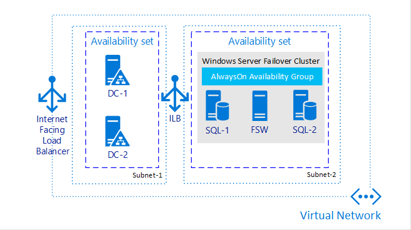
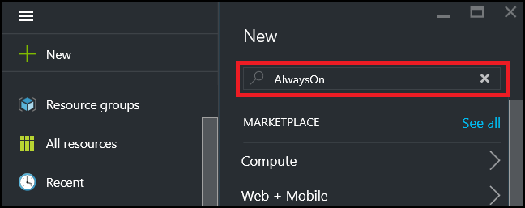
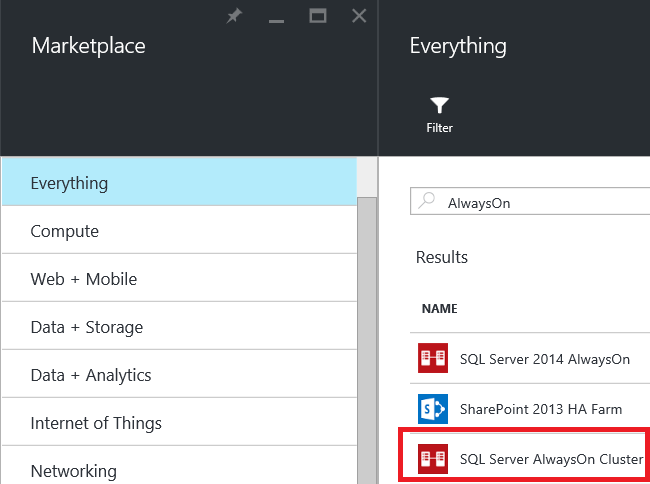
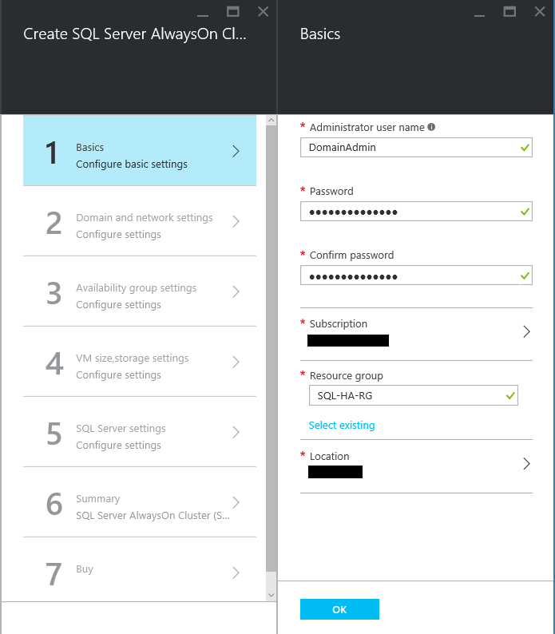
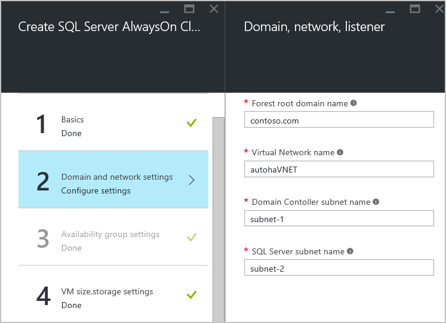
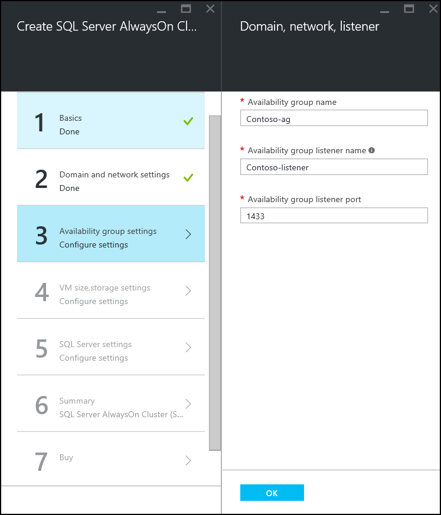
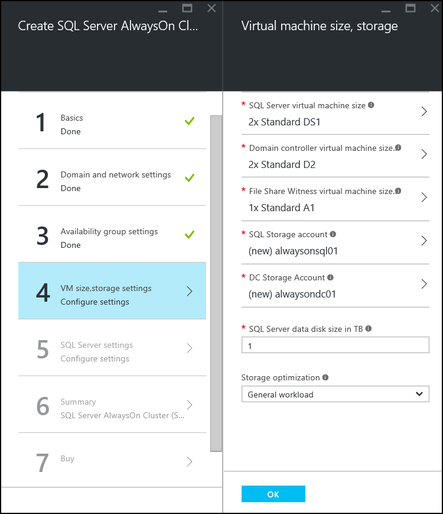
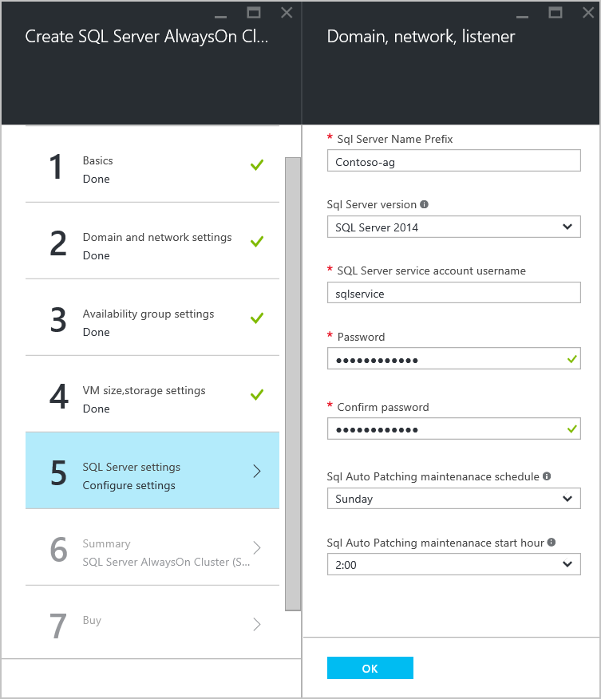
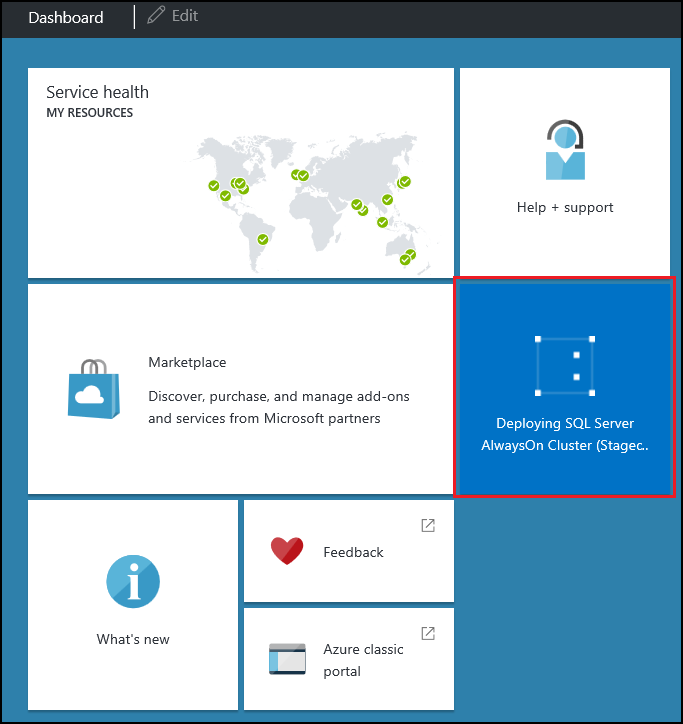
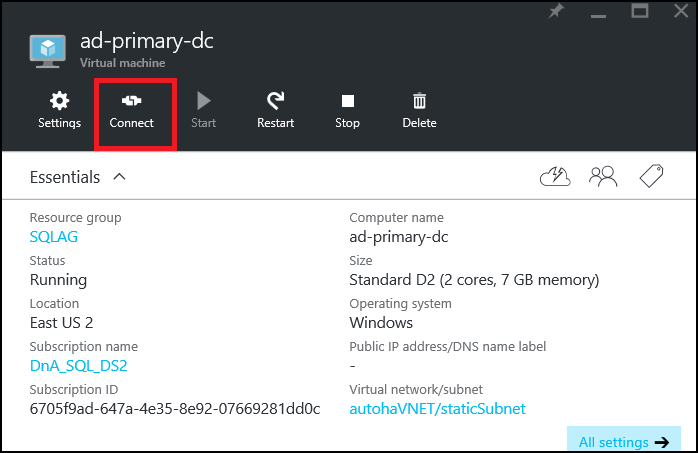

<properties
	pageTitle="Configure AlwaysOn Availability Groups Azure Resource Manager | Microsoft Azure"
	description="Create an AlwaysOn Availability Group with Azure Virtual Machines in Azure Resource Manager mode. This tutorial primarily uses the user interface to automatically create the entire solution."
	services="virtual-machines"
	documentationCenter="na"
	authors="MikeRayMSFT"
	manager="jeffreyg"
	editor="monicar"
	tags="azure-resource-manager" />
<tags
	ms.service="virtual-machines"
	ms.devlang="na"
	ms.topic="article"
	ms.tgt_pltfrm="vm-windows-sql-server"
	ms.workload="infrastructure-services"
	ms.date="12/04/2015"
	ms.author="MikeRayMSFT" />

# Configure AlwaysOn Availability Groups in Azure VM (GUI)

> [AZURE.SELECTOR]
- [Azure classic portal](virtual-machines-sql-server-alwayson-availability-groups-gui.md)
- [PowerShell](virtual-machines-sql-server-alwayson-availability-groups-powershell.md)
- [ARM portal](virtual-machines-sql-server-alwayson-availability-groups-gui-arm.md)

 

[AZURE.INCLUDE [learn-about-deployment-models](../../includes/learn-about-deployment-models-rm-include.md)] Resource Manager model.

This end-to-end tutorial shows you how to create a SQL Server Availability Group on new Azure Resource Manager model virtual machines.

>[AZURE.NOTE] In the Azure Management Portal, there is a new gallery setup for AlwaysOn Availability Groups with a Listener. This configures everything you need for AlwaysOn Availability Groups automatically. For more information, see [SQL Server AlwaysOn Offering in Microsoft Azure classic portal Gallery](http://blogs.technet.com/b/dataplatforminsider/archive/2014/08/25/sql-server-alwayson-offering-in-microsoft-azure-portal-gallery.aspx). To use PowerShell, see the tutorial of the same scenario at [Configure AlwaysOn Availability Groups in Azure with PowerShell](virtual-machines-sql-server-alwayson-availability-groups-powershell.md).

At the end of the tutorial, your SQL Server AlwaysOn solution in Azure will consist of the following elements:

- A virtual network containing multiple subnets, including a front-end and a back-end subnet

- Two domain controller with an Active Directory (AD) domain

- Two SQL Server VMs deployed to the back-end subnet and joined to the AD domain

- A 3-node WSFC cluster with the Node Majority quorum model

- An availability group with two synchronous-commit replicas of an availability database

The figure below is a graphical representation of the solution.

All of the resources in this solution belong to a single resource group.

This tutorial assumes the following:

- You already have an Azure account. If you don't have one, [sign up for a trial account](https://azure.microsoft.com/pricing/free-trial/).

- You already know how to provision a SQL Server VM from the virtual machine gallery using the GUI. For more information, see [Provisioning a SQL Server Virtual Machine on Azure](virtual-machines-provision-sql-server.md)

- You already have a solid understanding of AlwaysOn Availability Groups. For more information, see [AlwaysOn Availability Groups (SQL Server)](https://msdn.microsoft.com/library/hh510230.aspx).

>[AZURE.NOTE] If you are interested in using AlwaysOn Availability Groups with SharePoint, also see [Configure SQL Server 2012 AlwaysOn Availability Groups for SharePoint 2013](https://technet.microsoft.com/library/jj715261.aspx).

In this tutorial you will use the Azure portal to:
- Select the the new AlwaysOn Availabiltiy group template from the portal
- Review the template settings and update a few configuration settings for your environment
- Monitor Azure as it creates the entire environment
- Connect to one of the domain controllers and then to one of the SQL Servers

## Provision an AlwaysOn Availability Group from the gallery with the resource manager deployment model

Azure provides a gallery image for the entire solution. In order to locate the template: 

1. 	Log in to the Azure portal using your account.
1.	On the Azure portal click **+New.** The portal will open the New blade. 
1.	On the New blade search for **AlwaysOn**. 

1.	In the search results locate **SQL Server AlwaysOn Cluster**. 

1.	On **Select a deployment model** choose **Resource Manager**.

### Basics

Click on **Basics** and configure the following:

- **Administrator user name** is a user account with domain administrator permissions and a member of the SQL Server sysadmin fixed server role on both instances of SQL Server. For this tutorial use **DomainAdmin**. 

- **Password** is the password for the domain administrator account. Use a complex password. Confirm the password. 

- **Subscription** is the subscription that Azure will bill to run all of the resources deployed for the AlwaysOn availability group. You can specify a different subscription if your account has multiple subscriptions.
 
- **Resource group** is the name for the group that all of the Azure resources created by this tutorial will belong to. For this tutorial use **SQL-HA-RG**. For more information, see (Azure Resource Manager overview)[resource-group-overview.md/#resource-groups]. 

- **Location** is the Azure region where the resources for this tutorial will be created. Select an Azure region to host the infrastructure. 

Below is what the **Basics** blade will look like:

- Click **OK**. 

### Domain and network settings

On **Domain and network settings** blade review the preset values for the domain and network settings:

- **Forest root domain name** is the domain name that will be used for the AD domain that will host the cluster. For the tutorial use **contoso.com**. 

- **Virtual Network name** is the network name for the Azure virtual network. For this tutorial use **autohaVNET**.

- **Domain Controller subnet name** is the name of a portion of the virtual network that hosts the domain controller. For this tutorial use **subnet-1**. This subnet will use address prefix **10.0.0.0/24**. 

- **SQL Server subnet name** is the name of a portion of the virtual network that hosts the SQL Servers and the file share witness. For this tutorial use **subnet-2**. This subnet will use address prefix **10.0.1.0/26**. 

To learn more about virtual networks in [Azure see Virtual Network Overview](virtual-networks-overview.md).  

The **Domain and network settings** should look like this:

 
If necessary, you may change these values. For this tutorial we use the preset values. 
 
- Review the settings and click **OK**. 

###Availability group settings

On **Availability group settings** review the preset values for teh availability group and the listener.

- **Availablity group name** is the clustered resource name for the availability group. For this tutorial use **Contoso-ag**. 

- **Availability group listener name** is used by the cluster and the internal load balancer. Clients connecting to SQL Server can use this name to connect to the appropriate replica of the database. For this tutorial use **Contoso-listener**. 
-  **Availability group listener port** specifies the TCP port the SQL Server listener will use. For this tutorial use the default port, **1433**.

If necessary, you may change these values. For this tutorial use the preset values.  

- Click **OK**. 

###VM size, storage settings

- On **VM size, storage settings** choose a SQL Server virtual machine size and review the other settings. 

- **SQL Server virtual machine size** is the Azure virtual machine size for both SQL Servers. It is not populated automatically. Click **Configure required settings** to choose a virtual machine size.  Choose a virtual machine size appropriate for your workload. If you are building this environment for the tutorial use **DS2**. For production workloads choose a virtual machine size that can support the workload. Many production workloads will require **DS4** or larger. The template will build two virtual machines of this size and install SQL Server on each one. For more information, see [Sizes for virtual machines] (http://azure.microsoft.com/documentation/articles/virtual-machines-size-specs.md)

- **Domain controller virtual machine size** is the virtual machine size for the domain controllers. For this tutorial use **D2**.

>[AZURE.NOTE]Azure will install Enterprise Edition of SQL Server. The cost depends on the edition and the virtual machine size. For detailed information about current costs, see [Virtual Machines Pricing](http://azure.microsoft.com/pricing/details/virtual-machines/#Sql)

- **File Share Witness virtual machine size** is the virtual machine size for the file share witness. For this tutorial use **A1**.

- **SQL Storage account** is the name of the storage account to hold the SQL Server data and operating system disks. For this tutorial use **alwaysonsql01**.

- **DC Storage account** is the name of the storage account for the domain controllers. For this tutorial use **alwaysondc01**.

- **SQL Server data disk size** in TB is the size of the SQL Server data disk in TB. Specify a number from 1 through 4. This is the size of the data disk that will be attached to each SQL Server. For this tutorial use **1**. 

- **Storage optimization** sets specific storage configuration settings for the SQL Server virtual machines based on the workload type. All SQL Servers in this scenario use Premium Storage. In addition, the choices for this setting are:

    - **General workload** sets no specific configuration settings. 

    - **Transactional processing** sets trace flag 1117 and 1118.

    - **Data warehousing** sets trace flag 1117 and 610.

    >[AZURE.NOTE]Additional optimizations depend on the size of the SQL Server data disk. For each 1 TB of SQL Server data disk space, Azure adds an additional 1 TB premium storage disk. Azure creates a storage pool on each VM for these disks. Azure sets the following settings on each storage pool: 

        - Stripe Size for trasactional processing workloads is set to **64 KB** for data warehousing workloads **256 KB**.

        - Cache: Read 

        - Simple recovery (no resiliency)

        - Number of columns = number of disks

        - Place tempDB on data disks.

For this tutorial use **General workload**.

For more information about SQL Server configuration best practices, see
[Performance best practices for SQL Server in Azure Virtual Machines](virtual-machines-sql-server-performance-best-practices.md)

- Review the settings and click **OK**. 

###SQL Server settings

On **SQL Server settings** review and modify the SQL Server VM name prefix, SQL Server version, SQL Server service account and password, and the SQL auto patching maintenance schedule. 

- **SQL Server Name Prefix** is used to create a name for each SQL Server. For this tutorial use **Contoso-ag**. The SQL Server names will be *Contoso-ag-0* and *Contoso-ag-1*. 

- **SQL Server version** is the version of SQL Server . For this tutorial use **SQL Server 2014**. You can also choose **SQL Server 2012** or **SQL Server 2016**.

- **SQL Server service account user name** is the domain account name for the SQL Server service. For this tutorial use **sqlservice**.

- **Password** is the password for the SQL Server service account.  Use a complex password. Confirm the password.

- **SQL Auto Patching maintenance schedule** identifies the weekday that Azure will automatically patch the SQL Servers. For this tutorial type **Sunday**. 

- **SQL Auto Patching maintenance start hour** is the time of day for the Azure region when automatic patching will begin. 

>[AZURE.NOTE]The patching window for each VM is staggered by one hour. Only one virtual machine is patched at a time in order to prevent disruption of services. 

Review the settings and click **OK**. 

###Summary

On the summary page Azure validates the settings. You can also download the template. Review the summary. Click **OK**.

###Buy

This final blade contains **Terms of use**, and **privacy policy**. Review this information. When you are ready for Azure to start creating the virtual machines, and all of the other required resources for the AlwaysOn availability group, click **Create**.
 
The Azure portal will create the resource group and all of the resources. 

##Monitor Deployment

Monitor the deployment progress from the Azure portal. An icon representing the deployment is automatically pinned to the Azure portal dashboard.

##Connect to SQL Server

The new instances of SQL Server are running on virtual machines that do not have connections to the internet. However, the domain controllers do have an internet facing connection. In order to connect to the SQL servers with remote desktop, first RDP to one of the domain controllers. From the domain controller open a second RDP to the SQL Server. 

To RDP to the primary domain controller, follow these steps:

1.	From the Azure portal dashboard very that the deployment has succeeded. 

1.	Click **Resources**.

1.	In the **Resources** blade, click **ad-primary-dc** which is the computer name of the virtual machine for the primary domain controller. 

1.	On the blade for **ad-primary-dc** click **Connect**. Your browser will ask if you want to open or save the remote connection object. Click **Open**. 

1.	**Remote desktop connection** may warn you that the publisher of this remote connection can’t be identified. Click **Connect**.

1.	Windows security prompts you to enter your credentials to connect to the IP address of the primary domain controller. Click **Use another account**. For **User name** type **contoso\DomainAdmin**. This is the account you chose for administrator user name. Use the complex password that you chose when you configured the template.

1.	**Remote desktop** may warn you that the remote computer could not be authenticated due to problems with its security certificate. It will show you the security certificate name. If you followed the tutorial the name will be **ad-primary-dc.contoso.com**. Click **Yes**.

You are now connected to the primary domain controller. To RDP to the SQL Server, follow these steps:

1.	On the domain controller, open **Remote Desktop Connection**. 

1.	For **Computer**, type the name of one of the SQL Servers. For this tutorial, type **sqlserver-0**.

1.	Use the same user account and password that you used to RDP to the domain controller. 

You are now connected with RDP to the SQL Server. You can open SQL Server management studio, connect to the default instance of SQL Server and verify the AlwaysOn availabilty group is configured. 