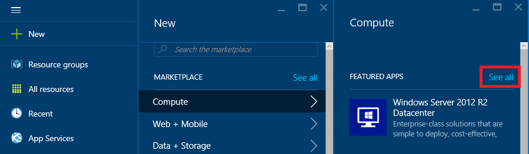

<properties
	pageTitle="Provision a SQL Server virtual machine in Azure Resource Manager (GUI) | Microsoft Azure"
	description="Create an SQL Server virtual machine in Azure Resource Manager mode. This tutorial primarily uses the user interface and tools rather than scripting."
	services="virtual-machines"
	documentationCenter="na"
	authors="rothja","mikeray","ninarn"
    editor="monicar"
	manager="jeffreyg"
	tags="azure-service-management" />

<tags
	ms.service="virtual-machines"
	ms.devlang="na"
	ms.topic="article"
	ms.tgt_pltfrm="vm-windows-sql-server"
	ms.workload="infrastructure-services"
	ms.date="12/16/2015"
	ms.author="mikeray" />

# Provision a SQL Server virtual machine in Azure Resource Manager

 

> [AZURE.INCLUDE [learn-about-deployment-models](../../includes/learn-about-deployment-models-classic-include.md)] Resource Manager model.

This end-to-end tutorial shows you how to provision an Azure virtual machine in Azure Resource Mode and configure SQL Server from a template in the Azure gallery.

The Azure virtual machine (VM) gallery includes several images that contain Microsoft SQL Server. You can select one of the VM images form the gallery and with a few clicks you can provision the VM to your azure environment.

In this tutorial, you will:
- Connect to the Azure portal and provision a SQL VM image from the gallery with the resource manager deployment model

- Configure the virtual machine and SQL Server settings

- Open the virtual machine using Remote Desktop and complete setup

- Complete configuration steps to connect to the virtual machine using SQL Server Management Studio on another computer

- Next steps

This tutorial assumes the following:

- You already have an Azure account. If you do not have an Azure account, visit [Azure free trial](http://azure.microsoft.com/en-us/pricing/free-trial/).

- You already know how to provision a SQL Server VM from the virtual machine gallery using the GUI. For more information, see [Provisioning a SQL Server Virtual Machine on Azure](virtual-machines-provision-sql-server.md)

## Connect to the Azure portal and provision a SQL VM image from the gallery with the resource manager deployment model

1. Log in to the [Azure portal](http://portal.azure.com) using your account.
1. On the Azure portal click **+New**.
 
 
The portal will open the **New** blade. The SQL Server VM templates are in the **Compute** group of the Marketplace.
1. In the **New** blade, click **Compute**.
1. To see all of the types of resources in the in the **Compute** blade, click **See all**.
 

 
1. Under **Database servers**, click **SQL Server** to see all of the templates available for SQL Server. You might have to scroll down to locate **Database servers**.
1. 	Each template identifies a SQL Server version and an operating system. Select one of these images from the list to bring up a blade containing its details.
1.	The details blade provides a description of this virtual machine image, and it allows you to select a deployment model. Under **Select a deployment model**, select **Resource Manager** and click **Create**.
 

 

## Configure the VM
In the Azure portal there are five blades for configuring a SQL Server virtual machine.
1.	Configure basic settings
1.	Choose virtual machine size
1.	Configure virtual machine settings
1.	Configure SQL Server
1.	Review the summary

## 1. Configure basic settings
On the **Create Virtual Machine** blade under **Basics** provide the following information:
* A unique virtual machine **Name**.
* In the **User name** box, a unique user name for the machine’s local administrator account. This account will also be a member of the SQL Server sysadmin fixed server role.
* In the *Password* box, type a strong password.
* If you have multiple subscriptions, verify the subscription is correct for the VM that you are about to build.
* In the *Resource group* box, type a name for the resource group. Alternatively, to use an existing resource group click **Select existing**. A resource group is a collection of related services in Azure. For more information about resource groups see [Azure Resource Manager Overview](http://azure.microsoft.com/en-us/documentation/articles/resource-group-overview).
Verify that the **Location** is correct for your requirements.
* Click **OK** to save the settings.
 

 

## 2. Choose virtual machine size
On the **Create Virtual Machine** blade under **Size** choose a virtual machine size. The Azure portal will display recommended sizes. Find more information about virtual machine sizes see, [Sizes for virtual machines](http://azure.microsoft.com/en-us/documentation/articles/virtual-machines-size-specs/). The sizes are based on the template you selected. The size estimates the monthly cost to run the VM.  Select a VM size for your server. For considerations about SQL Server VM sizes, see [Performance best practices for SQL Server in Azure Virtual Machines](http://azure.microsoft.com/en-us/documentation/articles/virtual-machines-sql-server-performance-best-practices/).

## 3. Configure virtual machine settings
On the **Create Virtual Machine** blade under **Settings**, configure Azure storage, networking and monitoring for the virtual machine.

Under **Storage** specify a disk type. Premium storage is recommended for production workloads.

Under **Storage account**, you can either accept the automatically provisioned storage account name, or you can click on **Storage account** to choose an existing account and configure the storage account type. By default, Azure creates a new storage account with locally redundant storage.

Under **Network**, you can accept the automatically populated values for features or click on each feature to configure the **Virtual network**, **Subnet**, **Public IP address**, and **Network Security Group**. By default, Azure automatically configures these values.

Azure enables **Monitoring** by default with the same storage account designated for the VM. You can change these settings here.

Under **Availability set** specify **none** for the purpose of this tutorial. For more information, see [High Availability and Disaster Recovery for SQL Server Virtual Machines](https://azure.microsoft.com/en-us/documentation/articles/virtual-machines-sql-server-high-availability-and-disaster-recovery-solutions).

## 4. Configure SQL Server
On the **Create Virtual Machine** blade under **Configure SQL Server** configure specific settings and optimizations for SQL Server. The settings that you can configure for SQL Server include:
- Connectivity
- Authentication
- Storage optimization
- Patching
- Backups
- Key Vault Integration

### Connectivity
Under **SQL connectivity**, specify one of the following
- **Local (inside VM only)** to allow connections to SQL Server only from within the VM.
- **Private (within Virtual Network)** to allow connections to SQL Server from machines or services in the same virtual network.
- **Public (internet)** to allow connections to SQL Server from machines or services on the internet.

**Port** defaults to 1433. You can specify a different port number.
For more information, see [Connect to a SQL Server Virtual Machine on Azure](http://azure.microsoft.com/en-us/documentation/articles/virtual-machines-sql-server-connectivity).

 
 

### Authentication
If you require SQL Server Authentication, click **Enable** under **SQL authentication**. If you enable SQL Server Authentication specify a **Login name** and **Password**. This user name will be a SQL Server Authentication login and member of the sysadmin fixed server role. See [Choose an Authentication Mode](http://msdn.microsoft.com/en-us/library/ms144284.aspx) for more information about Authentication Modes. By default, the SQL Server does not enable SQL Server Authentication. In that scenario, local Administrators on the virtual machine can connect to the SQL Server instance. You can see the Q
 
 
### Storage optimization
Click **Storage configuration** in order to specify the storage requirements. You can specify requirements as input/output operations per second (IOPS), throughput in MB/s, and total storage size. Configure these by using the sliding scales. The portal automatically calculates the number of disks based on these requirements.
You can also optimize storage based on workload. Under **Storage optimized for**, select one of the following
- **General** is the default setting and supports most workloads.
- **Transactional** processing optimizes the storage for traditional database OLTP workloads.
- **Data warehousing** optimizes the storage for analytic and reporting workloads.

The following image shows the Storage configuration blade.
 
 

### Patching
**SQL automated patching** is enabled by default. Automated patching allows Azure to automatically patch SQL Server and the operating system. Specify a day of the week, time, and duration for a maintenance window. Azure will perform patching in the maintenance window. The maintenance window schedule uses the VM locale for time. If you do not want Azure to automatically patch SQL Server and the operating system click **Disable**.  For more information, see [Automated Patching for SQL Server in Azure Virtual Machines](virtual-machines-sql-server-automated-patching.md).

The following image shows the SQL Automated Patching blade.
 
 

### Backups
Enable automatic database backups for all databases under **SQL automated backup**. For more information, see [Automated Backup for SQL Server in Azure Virtual Machines](virtual-machines-sql-server-automated-backup.md). When you enable SQL automated backup you can configure the following:
- Backup retention period in days
- What storage account to use for backups
- Whether or not to encrypt the backup. To encrypt the backup, click **Enable**. If the automated backups are encrypted, specify a password. Azure creates a certificate to encrypt the backups and uses the specified password to protect that certificate.

The following image shows the SQL Automated Backup blade.
 
 

### Key Vault Integration
To store security secrets in Azure for encryption, click **Azure key vault integration** and click **Enable**. For more information, see [Configure Azure Key Vault Integration for SQL Server on Azure VMs](virtual-machines-sql-server-azure-key-vault-integration.md). The following table lists the parameters required to configure Azure Key Vault Integration.

|PARAMETER|DESCRIPTION|EXAMPLE|
|----------|----------|-------|
|**Key Vault URL** | The location of the key vault.|https://contosokeyvault.vault.azure.net/ |
|**AKV Principal Name** |Azure Active Directory service principal name. This is also referred to as the Client ID.  |fde2b411-33d5-4e11-af04eb07b669ccf2|
| **AKV Principal Secret**|AKV Integration creates a credential within SQL Server, allowing the VM to have access to the key vault. Choose a name for this credential. | 9VTJSQwzlFepD8XODnzy8n2V01Jd8dAjwm/azF1XDKM=|
|**Credential name**|Choose a name to identify this credential.| mycred1|

The following image shows the Azure Key Vault Integration blade.
 
 

## 5. Review the Summary
Review the summary and click **OK** to create SQL Server, resource group, and resources specified for this VM.
You can monitor the deployment from the azure portal. The **Notifications** button at the top of the screen shows basic status of the deployment.

## Open the virtual machine using Remote Desktop and complete setup
Follow these steps to use Remote Desktop to open the virtual machine:
1.	After the Azure VM is built, and icon for the VM will appear on the Azure dashboard. Click the icon to see information about the VM.
1.	At the top of the VM blade click **Connect**. The browser will download an .rdp file for the VM. Open the .rdp file.
1.	The Remote Desktop Connection will notify you that the publisher of this remote connection can’t be identified and ask if you want to connect anyway. Click **Connect**.
1.	In the **Windows Security** dialog click **Use another account**. For **User name** type <machine name>\<user name> that you specified when you configured the VM.

## Connect to SQL Server over the Internet
The way to connect to a SQL Server instance is different depending on the connectivity options you selected during provisioning. The following screenshot shows three connectivity options from the portal.

 
**ADD IMAGE OF CONNECTIVITY DIALOG**

If you selected Public, then the network security group allows incoming TCP traffic and a firewall rule permits traffic on SQL port 1433.  If you configured SQL Server authentication you can use the user and password that you specified during setup. This allows you to connect from the internet by just using the public IP address of your virtual machine and a valid SQL authentication user name and password.

To locate the public IP from the Azure portal...**ADD CONTENT AND PICTURES**
>[AZURE.NOTE] Connections to SQL Server over the internet require SQL Server authentication.

**ADD PICTURES OF HOW TO CONNECT WITH SSMS**

## Next Steps
You have now successfully implemented SQL Server AlwaysOn by creating an availability group in Azure. To configure a listener for this availability group, see [Configure an ILB listener for AlwaysOn Availability Groups in Azure](virtual-machines-sql-server-configure-ilb-alwayson-availability-group-listener.md).

For other information about using SQL Server in Azure, see [SQL Server on Azure Virtual Machines](../articles/virtual-machines/virtual-machines-sql-server-infrastructure-services.md).
