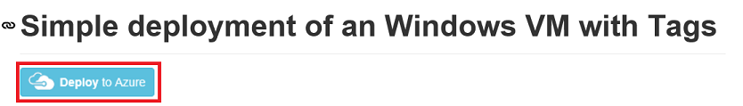
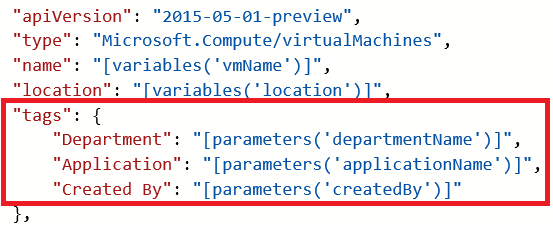
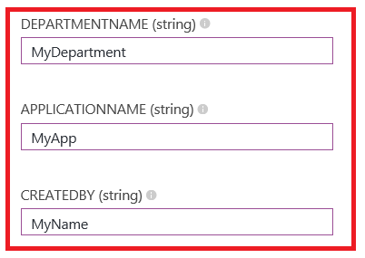
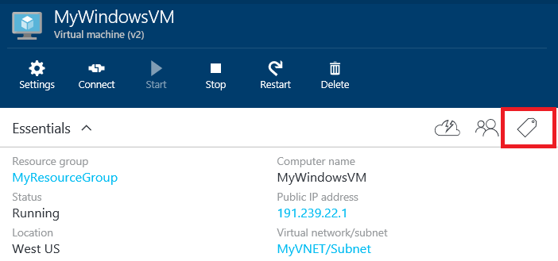
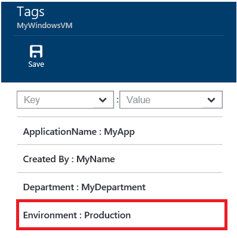
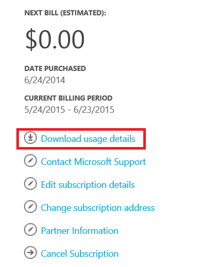
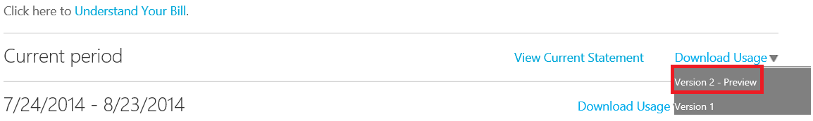
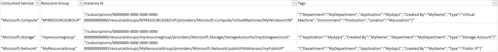

<properties
   pageTitle="How to Tag a Virtual Machine in Azure"
   description="Learn about Tagging a Virtual Machine in Azure"
   services="virtual-machines"
   documentationCenter=""
   authors="mmccrory"
   manager="timlt"
   editor="tysonn"
   tags="azure-resource-manager"/>

<tags
   ms.service="virtual-machines"
   ms.devlang="na"
   ms.topic="article"
   ms.tgt_pltfrm="vm-multiple"
   ms.workload="infrastructure-services"
   ms.date="07/23/2015"
   ms.author="dkshir;memccror"/>

# How to Tag a Virtual Machine in Azure

This article describes different ways to tag a virtual machine in Azure through the Azure Resource Manager. Tags are user-defined Key/Value pairs which can be placed directly on a resource or a resource group. Azure currently supports up to 15 tags per resource and resource group. Tags may be placed on a resource at the time of creation or added to an existing resource. Please note, tags are supported for resources created via the Azure Resource Manager only.

## Tagging a Virtual Machine through Templates

First, let’s look at tagging through templates. [This template](https://github.com/Azure/azure-quickstart-templates/tree/master/101-tags-vm) places tags on the following resources: Compute (Virtual Machine), Storage (Storage Account), and Network (Public IP Address, Virtual Network, and Network Interface).

Click the **Deploy to Azure** button from the [template link](https://github.com/Azure/azure-quickstart-templates/tree/master/101-tags-vm). This will navigate to the [Azure Preview Portal](http://portal.azure.com/) where you can deploy this template.

This template includes the following tags: *Department*, *Application*, and *Created By*. You can add/edit these tags directly in the template if you would like different tag names.

As you can see, the tags are defined as Key/Value pairs, separated by a colon (:). The tags must be defined in this format:

        “tags”: {
            “Key1” : ”Value1”,
            “Key2” : “Value2”
        }

Save the template file after you finish editing it with the tags of your choice.

Next, in the **Edit Parameters** section, you can fill out the values for your tags.

Click **Create** to deploy this template with your tag values.

## Tagging through the Portal

After creating your resources with tags, you can view, add, and delete tags in the portal.

Select the tags icon to view your tags:

Add a new tag through the portal by defining your own Key/Value pair, and save it.

Your new tag should now appear in the list of tags for your resource.

## Tagging with PowerShell

To create, add, and delete tags through PowerShell, you first need to set up your [PowerShell environment with Azure Resource Manager][]. Once you have completed the setup, you can place tags on Compute, Network, and Storage resources at creation or after the resource is created via PowerShell. This article will concentrate on viewing/editing tags placed on Virtual Machines.

First, navigate to a Virtual Machine through the `Get-AzureVM` cmdlet.

        PS C:\> Get-AzureVM -ResourceGroupName "MyResourceGroup" -Name "MyWindowsVM"

If your Virtual Machine already contains tags, you will then see all the tags on your resource:

        Tags : {
                "Application": "MyApp1",
                "Created By": "MyName",
                "Department": "MyDepartment",
                "Environment": "Production"
               }

If you would like to add tags through PowerShell, you can use the `Set-AzureResource` command. Note when updating tags through PowerShell, tags are updated as a whole. So if you are adding one tag to a resource that already has tags, you will need to include all the tags that you want to be placed on the resource. Below is an example of how to add additional tags to a resource through PowerShell Cmdlets.

This first cmdlet sets all of the tags placed on *MyWindowsVM* to the *tags* variable, using the `Get-AzureResource` and `Tags` function.

        PS C:\> $tags = (Get-AzureResource -Name MyWindowsVM -ResourceGroupName MyResourceGroup -ResourceType "Microsoft.Compute/virtualmachines" -ApiVersion 2015-05-01-preview).Tags

The second command displays the tags for the given variable.

        PS C:\> $tags

        Name		Value
        ----                           -----
        Value		MyDepartment
        Name		Department
        Value		MyApp1
        Name		Application
        Value		MyName
        Name		Created By
        Value		Production
        Name		Environment

The third command adds an additional tag to the *tags* variable. Note the use of the **+=** to append the new Key/Value pair to the *tags* list.

        PS C:\> $tags +=@{Name="Location";Value="MyLocation"}

The fourth command sets all of the tags defined in the *tags* variable to the given resource. In this case, it is MyWindowsVM.

        PS C:\> Set-AzureResource -Name MyWindowsVM -ResourceGroupName MyResourceGroup -ResourceType "Microsoft.Compute/VirtualMachines" -ApiVersion 2015-05-01-preview -Tag $tags

The fifth command displays all of the tags on the resource. As you can see, *Location* is now defined as a tag with *MyLocation* as the value.

        PS C:\> (Get-AzureResource -ResourceName "MyWindowsVM" -ResourceGroupName "MyResourceGroup" -ResourceType "Microsoft.Compute/VirtualMachines" -ApiVersion 2015-05-01-preview).Tags

        Name		Value
        ----                           -----
        Value		MyDepartment
        Name		Department
        Value		MyApp1
        Name		Application
        Value		MyName
        Name		Created By
        Value		Production
        Name		Environment
        Value		MyLocation
        Name		Location

To learn more about tagging through PowerShell, check out the [Azure Resource Cmdlets][].

## Tagging with Azure CLI

Tagging is also supported for resources that are already created through the Azure CLI. To begin, set up your [Azure CLI environment][]. Log in to your subscription through the Azure CLI and switch to ARM mode. You can view all properties for a given Virtual Machine, including the tags, using this command:

        azure vm show -g MyResourceGroup -n MyVM

Unlike PowerShell, if you are adding tags to a resource that already contains tags, you do not need to specify all tags (old and new) before using the `azure vm set` command. Instead, this command allows you to append a tag to your resource. To add a new VM tag through the Azure CLI, you can use the `azure vm set` command along with the tag parameter **-t**:

        azure vm set -g MyResourceGroup -n MyVM –t myNewTagName1=myNewTagValue1;myNewTagName2=myNewTagValue2

To remove all tags, you can use the **–T** parameter in the `azure vm set` command.

        azure vm set – g MyResourceGroup –n MyVM -T

Now that we have applied tags to our resources via PowerShell, Azure CLI, and the Portal, let’s take a look at the usage details to see the tags in the billing portal.

## Viewing your tags in the usage details

Tags placed on Compute, Network, and Storage resources through the Azure Resource Manager will be populated in your usage details in the billing portal.

Click on **Download usage details** to view the usage details in your subscription.

Select your billing statement and the **Version 2** usage details:

From the usage details, you can see all of the tags in the **Tags** column:

By analyzing these tags along with usage, organizations will be able to gain new insights into their consumption data.

## Additional resources

* [Azure Resource Manager Overview][]
* [Using Tags to organize your Azure Resources][]
* [Understanding your Azure Bill][]
* [Gain insights into your Microsoft Azure resource consumption][]

[PowerShell environment with Azure Resource Manager]: ../powershell-azure-resource-manager.md
[Azure Resource Cmdlets]: https://msdn.microsoft.com/en-us/library/azure/dn757692.aspx
[Azure CLI environment]: ./xplat-cli-azure-resource-manager.md
[Azure Resource Manager Overview]: ../resource-group-overview.md
[Using Tags to organize your Azure Resources]: ../resource-group-using-tags.md
[Understanding your Azure Bill]: ../billing-understand-your-bill.md
[Gain insights into your Microsoft Azure resource consumption]: ../billing-usage-rate-card-overview.md
