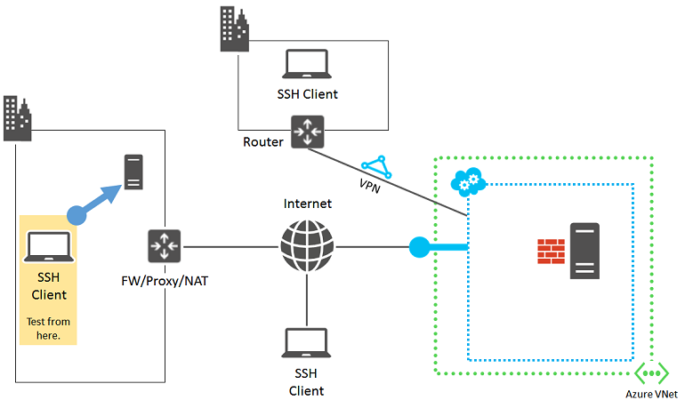

<properties
	pageTitle="Troubleshoot Secure Shell (SSH) connections to a Linux-based Azure virtual machine"
	description="If you can't connect your Linux-based Azure virtual machine, use these steps to isolate the source of the problem."
	services="virtual-machines"
	documentationCenter=""
	authors="dsk-2015"
	manager="timlt"
	editor=""
	tags="azure-service-management,azure-resource-manager"/>

<tags
	ms.service="virtual-machines"
	ms.workload="infrastructure-services"
	ms.tgt_pltfrm="vm-linux"
	ms.devlang="na"
	ms.topic="article"
	ms.date="07/07/2015"
	ms.author="dkshir"/>

# Troubleshoot Secure Shell (SSH) connections to a Linux-based Azure virtual machine

If you can't connect to Linux-based Azure virtual machines, this article describes a methodical approach for isolating and correcting the problem.

## Step 1: Reset the SSH configuration, key, or password

Follow the instructions in [How to reset a password or SSH for Linux-based virtual machines](virtual-machines-linux-use-vmaccess-reset-password-or-ssh.md) on the virtual machine. With these instructions, you can:

- Reset the password or SSH key.
- Create a new sudo user account.
- Reset the SSH configuration.

If the SSH client still cannot reach the SSH service on the virtual machine, it can be due to many causes. Here is the set of components involved.

The following sections step through isolating and determining the various causes for this problem and providing solutions and workarounds.

## Step 2: Preliminary steps before detailed troubleshooting

First, check the status of virtual machine in the Azure management portal or the Azure preview portal.

In the Azure management portal:

1. Click **Virtual machines** > *VM name*.
2. Click **Dashboard** for the virtual machine to check its status.
3. Click **Monitor** to see recent activity for compute, storage, and network resources.
4. Click **Endpoints** to ensure that there is an endpoint for SSH traffic.

In the Azure preview portal:

1. Click **Browse** > **Virtual machines** > *VM name*. For a virtual machine created in Azure Resource Manager, click **Browse** > **Virtual machines (v2)** > *VM name*. The status pane for the virtual machine should show **Running**. Scroll down to show recent activity for compute, storage, and network resources.
2. Click **Settings** to examine endpoints, IP addresses, and other settings.

To verify network connectivity, analyze the configured endpoints and determine if you can reach the virtual machine through another protocol, such as HTTP or another known service.

If needed, [Restart the virtual machine](https://msdn.microsoft.com/library/azure/dn763934.aspx) or [Resize the virtual machine](https://msdn.microsoft.com/library/dn168976.aspx).

After these steps, try the SSH connection again.

## Step 3: Detailed troubleshooting

The inability of your SSH client to reach the SSH service on the Azure virtual machine can be due to the following sources of issues or misconfigurations:

- SSH client computer
- Organization edge device
- Cloud service endpoint and access control list (ACL)
- Network Security Groups
- Linux-based Azure virtual machine

### Source 1: SSH client computer

To eliminate your computer as being the source of issues or misconfiguration, verify that your computer can make SSH connections to another on-premises, Linux-based computer.

If you cannot, check for these on your computer:

- A local firewall setting that is blocking inbound or outbound SSH traffic (TCP 22)
- Locally installed client proxy software that is preventing SSH connections
- Locally installed network monitoring software that is preventing SSH connections
- Other types of security software that either monitor traffic or allow/disallow specific types of traffic that is preventing SSH connections

In all of these cases, try to temporarily disable the software and attempt an SSH connection to an on-premises computer to determine the cause. Then, work with your network administrator to correct the settings of the software to allow SSH connections.

If you are using certificate authentication, verify that you have these permissions to the .ssh folder in your home directory:

- Chmod 700 ~/.ssh
- Chmod 644 ~/.ssh/*.pub
- Chmod 600 ~/.ssh/id_rsa (or whatever other files you might have your private keys stored in)
- Chmod 644 ~/.ssh/known_hosts (contains hosts you’ve connected to via SSH)

### Source 2: Organization edge device

To eliminate your organization edge device as being the source of issues or misconfiguration, verify that a computer directly connected to the Internet can make SSH connections to your Azure virtual machine. If you are accessing the virtual machine over a site-to-site VPN or ExpressRoute connection, skip to [Source 4: Network security groups](#nsg).

If you do not have a computer that is directly connected to the Internet, you can easily create a new Azure virtual machine in its own resource group or cloud service and use it. For more information, see [Create a virtual machine running Linux in Azure](virtual-machines-linux-tutorial.md). Delete the resource group or virtual machine and cloud service when you are done with your testing.

If you can create an SSH connection with a computer directly attached to the Internet, check your organization edge device for:

- An internal firewall that is blocking SSH traffic with the Internet
- Your proxy server that is preventing SSH connections
- Intrusion detection or network monitoring software running on devices in your edge network that is preventing SSH connections

Work with your network administrator to correct the settings of your organization edge devices to allow SSH traffic with the Internet.

### Source 3: Cloud service endpoint and ACL

To eliminate the cloud service endpoint and ACL as being the source of issues or misconfiguration for virtual machines created using the Service Management API, verify that another Azure virtual machine that is in the same virtual network can make SSH connections to your Azure virtual machine.

> [AZURE.NOTE] For virtual machines created in Azure Resource Manager, skip to [source 4: Network security groups](#nsg).

If you do not have another virtual machine in the same virtual network, you can easily create a new one. For more information, see [Create a virtual machine running Linux in Azure](virtual-machines-linux-tutorial.md). Delete the extra virtual machine when you are done with your testing.

If you can create an SSH connection with a virtual machine in the same virtual network, check:

- The endpoint configuration for SSH traffic on the target virtual machine. The private TCP port of the endpoint must match the TCP port on which the SSH service on the virtual machine is listening, which by default is 22. For virtual machines created in Azure Resource Manager using templates, verify the SSH TCP port number in the Azure preview portal with **Browse** > **Virtual machines (v2)** > *VM name* > **Settings** > **Endpoints**.
- The ACL for the SSH traffic endpoint on the target virtual machine. ACLs allow you to specify allowed or denied incoming traffic from the Internet, based on its source IP address. Misconfigured ACLs can prevent incoming SSH traffic to the endpoint. Examine your ACLs to ensure that incoming traffic from your public IP addresses of your proxy or other edge server are allowed. For more information, see [About network access control lists (ACLs)](../virtual-network/virtual-networks-acl.md).

To eliminate the endpoint as a source of the problem, remove the current endpoint and create a new endpoint, specifying the **SSH** name (TCP port 22 for the public and private port number). For more information, see [Set up endpoints on a virtual machine in Azure](virtual-machines-set-up-endpoints.md).

### Source 4: Network security groups

Network security groups allow you to have more granular control of allowed inbound and outbound traffic. You can create rules that span subnets and cloud services in an Azure virtual network. Examine your network security group rules to ensure that SSH traffic to and from the Internet is allowed.
For more information, see [About network security groups](../traffic-manager/virtual-networks-nsg.md).

### Source 5: Linux-based Azure virtual machine

The last source of possible problems is the Azure virtual machine itself.

If you have not done so already, follow the instructions in [How to reset a password or SSH for Linux-based virtual machines](virtual-machines-linux-use-vmaccess-reset-password-or-ssh.md) on the virtual machine.

Try the connection from your computer again. If you are not successful, here are some of the possible problems:

- The SSH service is not running on the target virtual machine.
- The SSH service is not listening on TCP port 22. To test this, install a telnet client on your local computer and run "telnet *cloudServiceName*.cloudapp.net 22". This will determine whether the virtual machine allows inbound and outbound communication to the SSH endpoint.
- The local firewall on the target virtual machine has rules that are preventing inbound or outbound SSH traffic.
- Intrusion detection or network monitoring software running on the Azure virtual machine is preventing SSH connections.

## Step 4: Submit your issue to the Azure support forums

To get help from Azure experts around the world, you can submit your issue to either the MSDN Azure or Stack Overflow forums. See [Microsoft Azure forums](http://azure.microsoft.com/support/forums/) for more information.

## Step 5: File an Azure support incident

If you have done steps 1 through 4 in this article and submitted your issue to the Azure support forums, but still cannot create an SSH connection, one alternative to consider is whether you can re-create the virtual machine.

If you cannot re-create the virtual machine, it might be time for you to file an Azure support incident.

To file an incident, go to the [Azure Support site](http://azure.microsoft.com/support/options/), and then click **Get Support**.

For information about using Azure Support, see the [Microsoft Azure Support FAQ](http://azure.microsoft.com/support/faq/).

## Additional resources

[How to reset a password or SSH for Linux-based virtual machines](virtual-machines-linux-use-vmaccess-reset-password-or-ssh.md)

[Troubleshoot Windows Remote Desktop connections to a Windows-based Azure virtual machine](virtual-machines-troubleshoot-remote-desktop-connections.md)

[Troubleshoot access to an application running on an Azure virtual machine](virtual-machines-troubleshoot-access-application.md)
