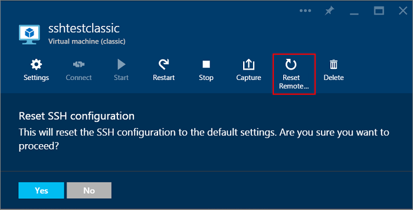

<properties
	pageTitle="Unable to connect to an Azure VM over SSH | Microsoft Azure"
	description="Troubleshoot Secure Shell (SSH) connections to an Azure virtual machine running Linux."
	services="virtual-machines"
	documentationCenter=""
	authors="dsk-2015"
	manager="timlt"
	editor=""
	tags="top-support-issue,azure-service-management,azure-resource-manager"/>

<tags
	ms.service="virtual-machines"
	ms.workload="infrastructure-services"
	ms.tgt_pltfrm="vm-linux"
	ms.devlang="na"
	ms.topic="article"
	ms.date="10/05/2015"
	ms.author="dkshir"/>

# Troubleshoot Secure Shell (SSH) connections to a Linux-based Azure virtual machine

[AZURE.INCLUDE [learn-about-deployment-models](../../includes/learn-about-deployment-models-include.md)] This article covers troubleshooting SSH connections on a virtual machine created with the classic deployment model or the Resource Manager deployment model.

There could be various causes of SSH failures to a Linux-based Azure virtual machine. This article will help you find them out and correct the failures.

> [AZURE.NOTE] This article only applies to Azure virtual machines running Linux. For troubleshooting connections to Azure virtual machines running Windows, see [this article](virtual-machines-troubleshoot-remote-desktop-connections.md).

## Contact Azure Customer Support

If you need more help at any point in this article, you can contact the Azure experts on [the MSDN Azure and the Stack Overflow forums](http://azure.microsoft.com/support/forums/).

Alternatively, you can also file an Azure support incident. Go to the [Azure Support site](http://azure.microsoft.com/support/options/) and click on **Get Support**. For information about using Azure Support, read the [Microsoft Azure Support FAQ](http://azure.microsoft.com/support/faq/).

## Basic steps

### Classic deployment model

To resolve the more common SSH connection failures in virtual machines created using the classic deployment model, try these steps:

1. Reset Remote Access from the [Azure portal](https://portal.azure.com). Click **Browse all** > **Virtual machines (classic)** > your Windows virtual machine > **Reset Remote Access**.

	

2. Restart the virtual machine similar to above. From the [Azure preview portal](https://portal.azure.com), click **Browse all** > **Virtual machines (classic)** > your Windows virtual machine > **Restart**. From the [Azure management portal](https://manage.windowsazure.com), open the **Virtual machines** > **Instances** and click **Restart**.

3. [Resize the virtual machine](https://msdn.microsoft.com/library/dn168976.aspx).

4. Follow the instructions in [How to reset a password or SSH for Linux-based virtual machines](virtual-machines-linux-use-vmaccess-reset-password-or-ssh.md) on the virtual machine, to:

	- Reset the password or SSH key.
	- Create a new sudo user account.
	- Reset the SSH configuration.

### Resource Manager deployment model

To resolve the common SSH issues for virtual machines created using the Resource Manager deployment model, try the following steps.

1. Reset SSH connection to your Linux VM on the command line. Make sure the [Microsoft Azure Linux Agent](virtual-machines-linux-agent-user-guide.md) version 2.0.5 or later is installed.

	[A] Using Azure CLI:

	Step 1: If you haven't already, [install the Azure CLI and connect to your Azure subscription](../xplat-cli-install.md) using the `azure login` command.

	Step 2: Switch to the Resource Manager mode.

		azure config mode arm

	Step 3: You can reset the SSH connection using either of the following methods.

	(i) Use the `vm reset-access` command as the following example.

		azure vm reset-access -g TestRgV2 -n TestVmV2 -r

	This will install the `VMAccessForLinux` extension on your virtual machine.

	(ii) Alternatively, you can create a file named PrivateConf.json with the following content:

		{
			"reset_ssh":"True"
		}

	And then manually run the `VMAccessForLinux` extension to reset your SSH connection.

		azure vm extension set "testRG" "testVM" VMAccessForLinux Microsoft.OSTCExtensions "1.2" --private-config-path PrivateConf.json

	[B] Using Azure PowerShell:

	Step 1: If you haven't already, [install the Azure PowerShell and connect to your Azure subscription](../powershell-install-configure.md) using the Azure AD method.

	Step 2: Switch to the Resource Manager mode.

		Switch-AzureMode -Name AzureResourceManager

	Step 3: Run the `VMAccessForLinux` extension to reset your SSH connection, as the following example.

		Set-AzureVMExtension -ResourceGroupName "testRG" -VMName "testVM" -Location "West US" -Name "VMAccessForLinux" -Publisher "Microsoft.OSTCExtensions" -ExtensionType "VMAccessForLinux" -TypeHandlerVersion "1.2" -SettingString "{}" -ProtectedSettingString '{"reset_ssh":true}'

2. Restart your Linux VM from the portal. From the [Azure preview portal](https://portal.azure.com), click **Browse all** > **Virtual machines** > your Windows virtual machine > **Restart**.

	

3. Reset your password and/or the SSH key for your Linux VM on the command line. You can also create a new username/password with sudo authority as the following example.

	[A] Using Azure CLI:

	Install and configure Azure CLI as mentioned above. Switch to Resource Manager mode and then run the extension using either of the following methods.

	(i) Run the `vm reset-access` command to set any of the SSH credentials.

		azure vm reset-access TestRgV2 TestVmV2 -u NewUser -p NewPassword

	See more information about this by typing `azure vm reset-access -h` on the command line.

	(ii) Alternatively, you can create a file named PrivateConf.json with the following contents.

		{
			"username":"NewUsername", "password":"NewPassword", "expiration":"2016-01-01", "ssh_key":"", "reset_ssh":false, "remove_user":""
		}

	Then run the Linux extension using the above file.

		$azure vm extension set "testRG" "testVM" VMAccessForLinux Microsoft.OSTCExtensions "1.2" --private-config-path PrivateConf.json

	Note that you can follow steps similar to [How to reset a password or SSH for Linux-based virtual machines](virtual-machines-linux-use-vmaccess-reset-password-or-ssh.md) to try other variations. Remember to modify the Azure CLI instructions for the Resource Manager mode.

	[B] Using Azure PowerShell:

	Install and configure Azure PowerShell as mentioned above. Switch to Resource Manager mode and then run the extension as following.

		$RGName = 'testRG'
		$VmName = 'testVM'
		$Location = 'West US'

		$ExtensionName = 'VMAccessForLinux'
		$Publisher = 'Microsoft.OSTCExtensions'
		$Version = '1.2'

		$PublicConf = '{}'
		$PrivateConf = '{"username":"NewUsername", "password":"NewPassword", "ssh_key":"", "reset_ssh":false, "remove_user":""}'

		Set-AzureVMExtension -ResourceGroupName $RGName -VMName $VmName -Location $Location -Name $ExtensionName -Publisher $Publisher -ExtensionType $ExtensionName -TypeHandlerVersion $Version -SettingString $PublicConf -ProtectedSettingString $PrivateConf

	Make sure to replace the values of $RGName, $VmName, $Location and the SSH credentials with values specific to your installation.

## Detailed troubleshooting

If the SSH client still cannot reach the SSH service on the virtual machine, it can be due to many reasons. Here are the components involved.

The following sections will help you isolate the source of the failure and figure out solutions or workarounds.

### Steps before troubleshooting

First, check the status of virtual machine in the Azure portal.

In the [Azure management portal](https://manage.windowsazure.com), for virtual machines in classic deployment model:

1. Click **Virtual machines** > *VM name*.
2. Click the VM's **Dashboard** to check its status.
3. Click **Monitor** to see recent activity for compute, storage, and network resources.
4. Click **Endpoints** to ensure that there is an endpoint for SSH traffic.

In the [Azure preview portal](https://portal.azure.com):

1. For a virtual machine created in classic deployment model, click **Browse** > **Virtual machines (classic)** > *VM name*. For a virtual machine created using the Resource Manager, click **Browse** > **Virtual machines** > *VM name*. The status pane for the virtual machine should show **Running**. Scroll down to show recent activity for compute, storage, and network resources.
2. Click **Settings** to examine endpoints, IP addresses, and other settings. To identify endpoints in virtual machines created with the Resource Manager, check if a [Network Security Group](../traffic-manager/virtual-networks-nsg.md) is defined, the rules applied to it and if they are referenced in the subnet.

To verify network connectivity, check the configured endpoints and see if you can reach the VM through another protocol, such as HTTP or another service.

After these steps, try the SSH connection again.

### Troubleshooting steps

The SSH client on your computer could fail to reach the SSH service on the Azure virtual machine due to these possible sources of issues or misconfigurations:

- SSH client computer
- Organization edge device
- Cloud service endpoint and access control list (ACL)
- Network Security Groups
- Linux-based Azure virtual machine

#### Source 1: SSH client computer

To eliminate your computer as the source of the failure, check that it can make SSH connections to another on-premises, Linux-based computer.

If this fails, check for these on your computer:

- A local firewall setting that is blocking inbound or outbound SSH traffic (TCP 22)
- Locally installed client proxy software that is preventing SSH connections
- Locally installed network monitoring software that is preventing SSH connections
- Other types of security software that either monitor traffic or allow/disallow specific types of traffic

In all of these cases, temporarily disable the software and try an SSH connection to an on-premises computer to find out the cause. Then, work with your network administrator to correct the settings of the software to allow SSH connections.

If you are using certificate authentication, verify that you have these permissions to the .ssh folder in your home directory:

- Chmod 700 ~/.ssh
- Chmod 644 ~/.ssh/\*.pub
- Chmod 600 ~/.ssh/id_rsa (or any other files that have your private keys stored in)
- Chmod 644 ~/.ssh/known_hosts (contains hosts you’ve connected to via SSH)

#### Source 2: Organization edge device

To eliminate your organization edge device as the source of failure, check that a computer directly connected to the Internet can make SSH connections to your Azure VM. If you are accessing the VM over a site-to-site VPN or ExpressRoute connection, skip to [Source 4: Network security groups](#nsg).

If you do not have a computer that is directly connected to the Internet, you can easily create a new Azure virtual machine in its own resource group or cloud service and use it. For more information, see [Create a virtual machine running Linux in Azure](virtual-machines-linux-tutorial.md). Delete the resource group or virtual machine and cloud service when you are done with your testing.

If you can create an SSH connection with a computer directly attached to the Internet, check your organization edge device for:

- An internal firewall that is blocking SSH traffic with the Internet
- Your proxy server that is preventing SSH connections
- Intrusion detection or network monitoring software running on devices in your edge network that is preventing SSH connections

Work with your network administrator to correct the settings of your organization edge devices to allow SSH traffic with the Internet.

#### Source 3: Cloud service endpoint and ACL

> [AZURE.NOTE] This source applies only for virtual machines created using classic deployment model. For virtual machines created using the Resource Manager, skip to [source 4: Network security groups](#nsg).

To eliminate the cloud service endpoint and ACL as the source of the failure, for VMs created using the [classic deployment model](../resource-manager-deployment-model.md), check that another Azure VM in the same virtual network can make SSH connections to your VM.

If you do not have another VM in the same virtual network, you can easily create a new one. For more information, see [Create a virtual machine running Linux in Azure](virtual-machines-linux-tutorial.md). Delete the extra VM when you are done with your testing.

If you can create an SSH connection with a VM in the same virtual network, check:

- The endpoint configuration for SSH traffic on the target VM. The private TCP port of the endpoint should match the TCP port on which the SSH service on the VM is listening (default is 22). For VMs created in the Resource Manager deployment model using templates, verify the SSH TCP port number in the Azure preview portal with **Browse** > **Virtual machines (v2)** > *VM name* > **Settings** > **Endpoints**.
- The ACL for the SSH traffic endpoint on the target virtual machine. ACLs allow you to specify allowed or denied incoming traffic from the Internet, based on its source IP address. Misconfigured ACLs can prevent incoming SSH traffic to the endpoint. Check your ACLs to ensure that incoming traffic from public IP addresses of your proxy or other edge server are allowed. For more information, see [About network access control lists (ACLs)](../virtual-network/virtual-networks-acl.md).

To eliminate the endpoint as a source of the problem, remove the current endpoint and create a new endpoint and specify the **SSH** name (TCP port 22 for the public and private port number). For more information, see [Set up endpoints on a virtual machine in Azure](virtual-machines-set-up-endpoints.md).

#### Source 4: Network security groups

Network security groups allow you to have more granular control of allowed inbound and outbound traffic. You can create rules that span subnets and cloud services in an Azure virtual network. Check your network security group rules to ensure that SSH traffic to and from the Internet is allowed.
For more information, see [About network security groups](../traffic-manager/virtual-networks-nsg.md).

#### Source 5: Linux-based Azure virtual machine

The last source of possible problems is the Azure virtual machine itself.

If you have not done so already, follow the instructions [to reset a password or SSH for Linux-based virtual machines](virtual-machines-linux-use-vmaccess-reset-password-or-ssh.md) on the virtual machine.

Try connecting from your computer again. If it still fails, these are some of the possible problems:

- The SSH service is not running on the target virtual machine.
- The SSH service is not listening on TCP port 22. To test this, install a telnet client on your local computer and run "telnet *cloudServiceName*.cloudapp.net 22". This will find out if the virtual machine allows inbound and outbound communication to the SSH endpoint.
- The local firewall on the target virtual machine has rules that are preventing inbound or outbound SSH traffic.
- Intrusion detection or network monitoring software running on the Azure virtual machine is preventing SSH connections.

## Additional resources

For virtual machines in classic deployment model, [How to reset a password or SSH for Linux-based virtual machines](virtual-machines-linux-use-vmaccess-reset-password-or-ssh.md)

[Troubleshoot Windows Remote Desktop connections to a Windows-based Azure virtual machine](virtual-machines-troubleshoot-remote-desktop-connections.md)

[Troubleshoot access to an application running on an Azure virtual machine](virtual-machines-troubleshoot-access-application.md)
