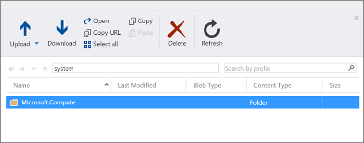
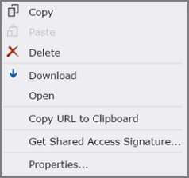

<properties
	pageTitle="Capture a Windows VM in Resource Manager | Microsoft Azure"
	description="Learn how to capture an image of a Windows-based Azure virtual machine (VM) created with the Resource Manager deployment model."
	services="virtual-machines-windows"
	documentationCenter=""
	authors="cynthn"
	manager="timlt"
	editor=""
	tags="azure-resource-manager"/>

<tags
	ms.service="virtual-machines-windows"
	ms.workload="infrastructure-services"
	ms.tgt_pltfrm="vm-windows"
	ms.devlang="na"
	ms.topic="article"
	ms.date="05/13/2016"
	ms.author="cynthn"/>

# How to capture a Windows virtual machine in the Resource Manager deployment model

This article shows you how to use Azure PowerShell to capture an Azure virtual machine (VM) that is running Windows so you can use it to create other virtual machines. This image includes the OS disk and the data disks that are attached to the virtual machine. It doesn't include the virtual network resources that you'll need to create a Windows VM, so you'll need to set those up before you create another virtual machine that uses the image. This image will also be prepared to be a [generalized Windows image](https://technet.microsoft.com/library/hh824938.aspx).

## Prerequisites

These steps assume that you've already created an Azure virtual machine in the Resource Manager deployment model and configured the operating system, including attaching any data disks and making other customizations like installing applications. If you haven't done this yet, read [How to create a Windows VM with Resource Manager and PowerShell](virtual-machines-windows-ps-create.md). You can just as easily create a Windows virtual machine using the [Azure portal](https://portal.azure.com). Read [How to create a Windows virtual machine in the Azure portal](virtual-machines-windows-hero-tutorial.md).

## Prepare the VM for image capture

This section shows you how to generalize your Windows virtual machine. This removes all your personal account information, among other things. You will typically want to do this when you want to use this VM image to quickly deploy similar virtual machines.

> [AZURE.WARNING] Please note that the virtual machine cannot be logged in via RDP once it is generalized, since the process removes all user accounts. This is an irreversible change. 

1. Sign in to your Windows virtual machine. In the [Azure portal](https://portal.azure.com), navigate through **Browse** > **Virtual machines** > Your Windows virtual machine > **Connect**.

2. Open a Command Prompt window as an administrator.

3. Change the directory to `%windir%\system32\sysprep`, and then run sysprep.exe.

4. In the **System Preparation Tool** dialog box, do the following:

	- In **System Cleanup Action**, select **Enter System Out-of-Box Experience (OOBE)** and make sure that **Generalize** is checked. For more information about using Sysprep, see [How to Use Sysprep: An Introduction](http://technet.microsoft.com/library/bb457073.aspx).

	- In **Shutdown Options**, select **Shutdown**.

	- Click **OK**.

	

   Sysprep shuts down the virtual machine. Its status changes to **Stopped** in the Azure portal.

 
## Capture the VM

You can capture the generalized Windows VM by using either Azure PowerShell or the new Azure Resource Manager Explorer tool. This section will show you the steps for both.

### Using PowerShell

This article assumes that you have installed Azure PowerShell version 1.0.x. We recommend using this version since new Resource Manager features will not be added to older PowerShell versions. If you haven't already installed PowerShell, read [How to install and configure Azure PowerShell](../powershell-install-configure.md) for installation steps.

1. Open Azure PowerShell and sign in to your Azure account.

		Login-AzureRmAccount

	This command will open a pop-up window to enter your Azure credentials.

2. If the subscription ID that is selected by default is different from the one you want to work in, use either of the following to set the right subscription.

		Set-AzureRmContext -SubscriptionId "xxxx-xxxx-xxxx-xxxx"

	or

		Select-AzureRmSubscription -SubscriptionId "xxxx-xxxx-xxxx-xxxx"

	You can find the subscriptions that your Azure account has by using the command `Get-AzureRmSubscription`.

3. Now you will need to deallocate the resources that are used by this virtual machine by using this commmand.

		Stop-AzureRmVM -ResourceGroupName YourResourceGroup -Name YourWindowsVM

	You will see that the *Status* for the VM on the Azure portal has changed from **Stopped** to **Stopped (deallocated)**.

	>[AZURE.TIP] You can also find out the status of your virtual machine in PowerShell by using: 
	`$vm = Get-AzureRmVM -ResourceGroupName YourResourceGroup -Name YourWindowsVM -status` 
	`$vm.Statuses`  The **DisplayStatus** field corresponds to the **Status** shown in the Azure portal.

4. Next, you need to set the status of the virtual machine to **Generalized**. Note that you will need to do this because the generalization step above (`sysprep`) does not do it in a way that Azure can understand.

		Set-AzureRmVm -ResourceGroupName YourResourceGroup -Name YourWindowsVM -Generalized

	>[AZURE.NOTE] The generalized state as set above will not be shown on the portal. However, you can verify it by using the Get-AzureRmVM command as shown in the tip above.

5. Capture the virtual machine image to a destination storage container by using this command.

		Save-AzureRmVMImage -ResourceGroupName YourResourceGroup -VMName YourWindowsVM -DestinationContainerName YourImagesContainer -VHDNamePrefix YourTemplatePrefix -Path Yourlocalfilepath\Filename.json

	The `-Path` variable is optional. You can use it to save the JSON template locally. The `-DestinationContainerName` variable is the name of the container that you want to hold your images in. The URL of the image that is stored will be similar to `https://YourStorageAccountName.blob.core.windows.net/system/Microsoft.Compute/Images/YourImagesContainer/YourTemplatePrefix-osDisk.xxxxxxxx-xxxx-xxxx-xxxx-xxxxxxxxxxxx.vhd`. It will be created in the same storage account as that of the original virtual machine.

	>[AZURE.NOTE] To find the location of your image, open the local JSON file template. Go to the **resources** > **storageProfile** > **osDisk** > **image** > **uri** section for the complete path of your image. You can also verify the URI on the portal; it will be copied to a blob named **system** in your storage account. 

### Using Azure Resource Explorer (Preview)

The [Azure Resource Explorer (Preview)](https://azure.microsoft.com/blog/azure-resource-explorer-a-new-tool-to-discover-the-azure-api/) is a new tool that you can use to manage Azure resources that have been created in the Resource Manager deployment model. With this tool, you can easily

- Discover the Azure Resource Management APIs.
- Get API documentation.
- Make API calls directly in your Azure subscriptions.

To learn more about what you can do with this powerful tool, view the video [Azure Resource Manager Explorer with David Ebbo](https://channel9.msdn.com/Shows/Azure-Friday/Azure-Resource-Manager-Explorer-with-David-Ebbo).

You can use the Resource Explorer to capture the virtual machine, as an alternative to the PowerShell method.

1. Open the [Resource Explorer website](https://resources.azure.com/) and sign in to your Azure account.

2. On the top right side of the tool, select **Read/Write** to allow _PUT_ and _POST_ operations. It is set to **Read Only** by default, which means you can only do _GET_ operations by default.

	

3. Next, find your Windows virtual machine. You can either type the name in the *Search box* at the top of the tool, or you can navigate through the menu on the left as **subscriptions** > *your Azure subscription* > **resourceGroups** > *your resource group* > **providers** > **Microsoft.Compute** > **virtualMachines** > *your Windows virtual machine*. When you click your virtual machine on the left navigation, you will see its template on the right side of the tool.

4. On the top right side of the template page, you should see tabs for the various operations that are available for this virtual machine. Click the tab for **Actions (POST/DELETE)**.

	

	- You will see a list of all the actions that you can perform on the virtual machine.

		

5. Deallocate the virtual machine by clicking the action button for **deallocate**. The status of your VM will change from **Stopped** to **Stopped (deallocated)**.

6. Mark the virtual machine as generalized by clicking the action button for **generalize**. You can verify the status changes by clicking the **InstanceView** menu under your virtual machine name on the left side, and navigating to the **statuses** section on the right side.

7. Under the **capture** action button, you can set the values for capturing your image. Your filled values could look like the following.

	

	Click the **capture** action button to capture your virtual machine's image. This creates a new VHD for the image, as well as a JSON template file.

8. To access the new image VHD as well as the template, download and install the Azure tool for managing storage resources, the [Azure Storage Explorer](http://storageexplorer.com/). The installer will install the Azure Storage Explorer locally on your machine.

	- Open the Storage Explorer and sign in to your Azure subscription. It should show you all the storage accounts that are available to your subscription.

	- On the left-hand side, you should see the storage account of the virtual machine that we captured in the above steps. Double-click the **system** menu underneath it. You should see the contents of the **system** folder on the right side.

		

	- Double-click **Microsoft.Compute** > **Images**, which will show you all of your image folders. Double-click the folder name that you entered for the **destinationContainerName** variable while capturing the image from Resource Explorer. It will show you both the VHD, as well as the JSON template file.

	- From here, you can either find out the URL or download the VHD/template by right-clicking it.

		

## Deploy a new VM from the captured image

Now you can use the captured image to create a new Windows VM. These steps show you how to use Azure PowerShell and the VM image that was captured in the above steps to create the VM in a new virtual network.

>[AZURE.NOTE] The VM image should be present in the same storage account as the actual virtual machine that will be created.

### Create network resources

Use the following sample PowerShell script to set up a virtual network and NIC for your new VM. Use values for the variables (represented by the **$** sign) as appropriate to your application.

	$pip = New-AzureRmPublicIpAddress -Name $pipName -ResourceGroupName $rgName -Location $location -AllocationMethod Dynamic

	$subnetconfig = New-AzureRmVirtualNetworkSubnetConfig -Name $subnet1Name -AddressPrefix $vnetSubnetAddressPrefix

	$vnet = New-AzureRmVirtualNetwork -Name $vnetName -ResourceGroupName $rgName -Location $location -AddressPrefix $vnetAddressPrefix -Subnet $subnetconfig

	$nic = New-AzureRmNetworkInterface -Name $nicname -ResourceGroupName $rgName -Location $location -SubnetId $vnet.Subnets[0].Id -PublicIpAddressId $pip.Id

### Create a new VM

The following PowerShell script shows how to set up the virtual machine configurations and use the captured VM image as the source for the new installation.
 

	#Enter a new user name and password in the pop-up for the following
	$cred = Get-Credential

	#Get the storage account where the captured image is stored
	$storageAcc = Get-AzureRmStorageAccount -ResourceGroupName $rgName -AccountName $storageAccName

	#Set the VM name and size
	$vmConfig = New-AzureRmVMConfig -VMName $vmName -VMSize "Standard_A2"

	#Set the Windows operating system configuration and add the NIC
	$vm = Set-AzureRmVMOperatingSystem -VM $vmConfig -Windows -ComputerName $computerName -Credential $cred -ProvisionVMAgent -EnableAutoUpdate

	$vm = Add-AzureRmVMNetworkInterface -VM $vm -Id $nic.Id

	#Create the OS disk URI
	$osDiskUri = '{0}vhds/{1}{2}.vhd' -f $storageAcc.PrimaryEndpoints.Blob.ToString(), $vmName.ToLower(), $osDiskName

	#Configure the OS disk to be created from image (-CreateOption fromImage) and give the URL of the captured image VHD for the -SourceImageUri parameter.
	#We found this URL in the local JSON template in the previous sections.
	$vm = Set-AzureRmVMOSDisk -VM $vm -Name $osDiskName -VhdUri $osDiskUri -CreateOption fromImage -SourceImageUri $urlOfCapturedImageVhd -Windows

	#Create the new VM
	New-AzureRmVM -ResourceGroupName $rgName -Location $location -VM $vm

You should see the newly created VM in either the [Azure portal](https://portal.azure.com) under **Browse** > **Virtual machines**, OR by using the following PowerShell commands:

	$vmList = Get-AzureRmVM -ResourceGroupName $rgName
	$vmList.Name

## Next steps

To manage your new virtual machine with Azure PowerShell, see [Manage virtual machines using Azure Resource Manager and PowerShell](virtual-machines-windows-ps-manage.md).
