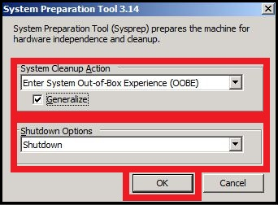
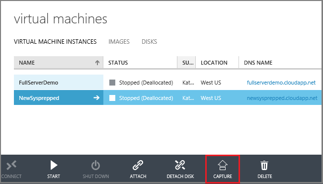

<properties
	pageTitle="Capture an image of an Azure Windows VM | Microsoft Azure"
	description="Capture an image of an Azure Windows virtual machine created with the classic deployment model."
	services="virtual-machines-windows"
	documentationCenter=""
	authors="cynthn"
	manager="timlt"
	editor="tysonn"
	tags="azure-service-management"/>

<tags
	ms.service="virtual-machines-windows"
	ms.workload="infrastructure-services"
	ms.tgt_pltfrm="vm-windows"
	ms.devlang="na"
	ms.topic="article"
	ms.date="06/16/2016"
	ms.author="cynthn"/>

#Capture an image of an Azure Windows virtual machine created with the classic deployment model.

[AZURE.INCLUDE [learn-about-deployment-models](../../includes/learn-about-deployment-models-classic-include.md)] Learn how to [perform these steps using the Resource Manager model](virtual-machines-windows-capture-image.md).

This article shows you how to capture an Azure virtual machine running Windows so you can use it as an image to create other virtual machines. This image includes the operating system disk and any data disks that are attached to the virtual machine. It doesn't include networking configurations, so you'll need to configure those when you create the other virtual machines that use the image.

Azure stores the image under **My Images**. This is the same place where any images you've uploaded are stored. For details about images, see [About images for virtual machines](virtual-machines-linux-classic-about-images.md).

##Before you begin##

These steps assume that you've already created an Azure virtual machine and configured the operating system, including attaching any data disks. If you haven't done this yet, see these instructions:

- [Create a virtual machine from an image](virtual-machines-windows-classic-createportal.md)
- [How to attach a data disk to a virtual machine](virtual-machines-windows-classic-attach-disk.md)
- Make sure the server roles are supported with Sysprep. For more information, see [Sysprep Support for Server Roles](https://msdn.microsoft.com/windows/hardware/commercialize/manufacture/desktop/sysprep-support-for-server-roles).

> [AZURE.WARNING] This process deletes the original virtual machine after it's captured. 

Prior to caputuring an image of an Azure virtual machine, it is recommended the target virtual machine be backed up. Azure virtual machines can be backed up using Azure Backup. For details, see [Back up Azure virtual machines](../backup/backup-azure-vms.md). Other solutions are available from certified partners. To find out what’s currently available, search the Azure Marketplace.

##Capture the virtual machine

1. In the [Azure classic portal](http://manage.windowsazure.com), **Connect** to the virtual machine. For instructions, see [How to sign in to a virtual machine running Windows Server] [].

2.	Open a Command Prompt window as an administrator.

3.	Change the directory to `%windir%\system32\sysprep`, and then run sysprep.exe.

4. 	The **System Preparation Tool** dialog box appears. Do the following:

	- In **System Cleanup Action**, select **Enter System Out-of-Box Experience (OOBE)** and make sure that **Generalize** is checked. For more information about using Sysprep, see [How to Use Sysprep: An Introduction][].

	- In **Shutdown Options**, select **Shutdown**.

	- Click **OK**.

	

7.	Sysprep shuts down the virtual machine, which changes the status of the virtual machine in the Azure classic portal to **Stopped**.

8.	In the Azure classic portal, click **Virtual Machines** and select the virtual machine you want to capture.

9.	On the command bar, click **Capture**.

	

	The **Capture the Virtual Machine** dialog box appears.

10.	In **Image Name**, type a name for the new image.

11.	Before you add a Windows Server image to your set of custom images, it must be generalized by running Sysprep as instructed in the previous steps. Click **I have run Sysprep on the virtual machine** to indicate you did that.

12.	Click the check mark to capture the image. The new image is now available under **Images**.

 	

##Next steps

The image is ready to be used to create virtual machines. To do this, you'll create a virtual machine by using the **From Gallery** menu item and selecting the image you just created. For instructions, see [Create a virtual machine from an image](virtual-machines-windows-classic-createportal.md).

[How to sign in to a virtual machine running Windows Server]: virtual-machines-windows-classic-connect-logon.md
[How to Use Sysprep: An Introduction]: http://technet.microsoft.com/library/bb457073.aspx
[Run Sysprep.exe]: ./media/virtual-machines-capture-image-windows-server/SysprepCommand.png
[Enter Sysprep.exe options]: ./media/virtual-machines-windows-classic-capture-image/SysprepGeneral.png
[The virtual machine is stopped]: ./media/virtual-machines-capture-image-windows-server/SysprepStopped.png
[Capture an image of the virtual machine]: ./media/virtual-machines-windows-classic-capture-image/CaptureVM.png
[Enter the image name]: ./media/virtual-machines-capture-image-windows-server/Capture.png
[Image capture successful]: ./media/virtual-machines-capture-image-windows-server/CaptureSuccess.png
[Use the captured image]: ./media/virtual-machines-capture-image-windows-server/MyImagesWindows.png
