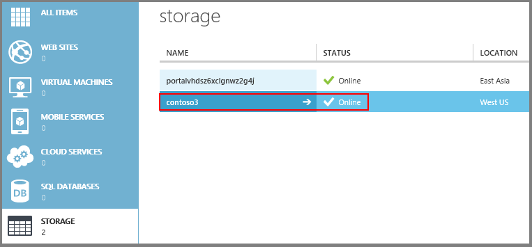
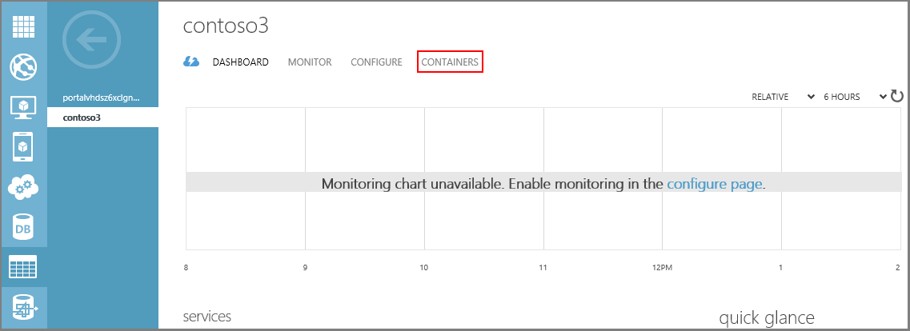
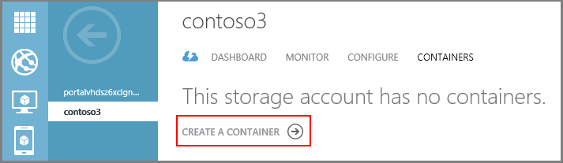
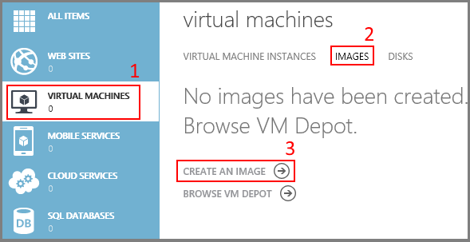
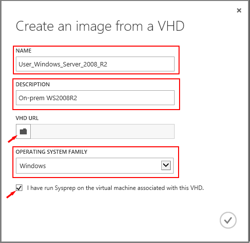
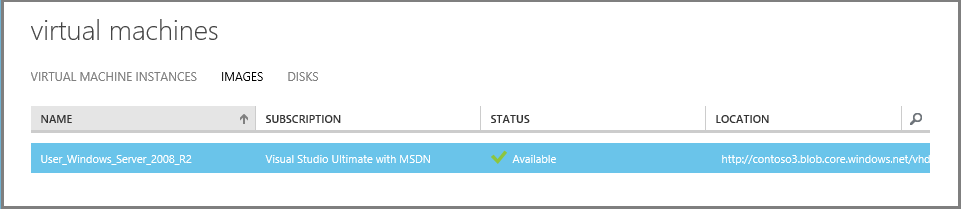

<properties
	pageTitle="Create and upload a Windows Server VHD using Powershell | Microsoft Azure"
	description="Learn to create and upload a Windows Server based virtual hard disk (VHD)  using the classic deployment model and Azure Powershell."
	services="virtual-machines-windows"
	documentationCenter=""
	authors="cynthn"
	manager="timlt"
	editor="tysonn"
	tags="azure-service-management"/>

<tags
	ms.service="virtual-machines-windows"
	ms.workload="infrastructure-services"
	ms.tgt_pltfrm="vm-windows"
	ms.devlang="na"
	ms.topic="article"
	ms.date="04/15/2016"
	ms.author="cynthn"/>

# Create and upload a Windows Server VHD to Azure

This article shows you how to upload a virtual hard disk (VHD) with an operating system so you can use it as an image to create virtual machines based on that image. For more details about disks and VHDs in Microsoft Azure, see [About Disks and VHDs for Virtual Machines](virtual-machines-linux-about-disks-vhds.md).

[AZURE.INCLUDE [learn-about-deployment-models](../../includes/learn-about-deployment-models-classic-include.md)]. You can also [capture](virtual-machines-windows-capture-image.md) and [upload](virtual-machines-windows-upload-image.md) a virtual machine using the Resource Manager model. 

## Prerequisites

This article assumes you have:

1. **An Azure subscription** - If you don't have one, you can [open an Azure account for free](/pricing/free-trial/?WT.mc_id=A261C142F): You get credits you can use to try out paid Azure services, and even after they're used up you can keep the account and use free Azure services, such as Websites. Your credit card won't be charged, unless you explicitly change your settings and ask to be charged. You also can [activate MSDN subscriber benefits](/pricing/member-offers/msdn-benefits-details/?WT.mc_id=A261C142F): Your MSDN subscription gives you credits every month that you can use for paid Azure services.

2. **Microsoft Azure PowerShell** - You have the Microsoft Azure PowerShell module installed and configured to use your subscription. To download the module, see [Microsoft Azure Downloads](https://azure.microsoft.com/downloads/). A tutorial to install and configure the module is available [here](../powershell-install-configure.md). You'll use the [Add-AzureVHD](http://msdn.microsoft.com/library/azure/dn495173.aspx) cmdlet to upload the VHD.

3. **A supported Windows operating system stored in a .vhd file and attached to a virtual machine** - Multiple tools exist to create .vhd files. For example, you can use Hyper-V to create a virtual machine and install the operating system. For instructions, see [Install the Hyper-V Role and configure a virtual machine](http://technet.microsoft.com/library/hh846766.aspx). For details about operating systems, see [Microsoft server software support for Microsoft Azure virtual machines](http://go.microsoft.com/fwlink/p/?LinkId=393550).

> [AZURE.IMPORTANT] The VHDX format is not supported in Microsoft Azure. You can convert the disk to VHD format using Hyper-V Manager or the [Convert-VHD cmdlet](http://technet.microsoft.com/library/hh848454.aspx). For details, see this [blogpost](http://blogs.msdn.com/b/virtual_pc_guy/archive/2012/10/03/using-powershell-to-convert-a-vhd-to-a-vhdx.aspx).

## Step 1: Prep the VHD 

Before you upload the VHD to Azure, it needs to be generalized by using the Sysprep tool. This prepares the VHD to be used as an image. For details about Sysprep, see [How to Use Sysprep: An Introduction](http://technet.microsoft.com/library/bb457073.aspx).

From the virtual machine that the operating system was installed to, complete the following procedure:

1. Sign in to the operating system.

2. Open a command prompt window as an administrator. Change the directory to **%windir%\system32\sysprep**, and then run `sysprep.exe`.

	

3.	The **System Preparation Tool** dialog box appears.

	

4.  In the **System Preparation Tool**, select **Enter System Out of Box Experience (OOBE)** and make sure that **Generalize** is checked.

5.  In **Shutdown Options**, select **Shutdown**.

6.  Click **OK**.

## Step 2: Create or get info from your Azure storage account

You need a storage account in Azure so you have a place to upload the .vhd file. This step shows you how to create an account, or get the info you need from an existing account.

### Option 1: Create a storage account

1. Sign in to the [Azure classic portal](https://manage.windowsazure.com).

2. On the command bar, click **New**.

3. Click **Data Services** > **Storage** > **Quick Create**.

	

4. Fill out the fields as follows:

 - Under **URL**, type a subdomain name to use in the URL for the storage account. The entry can contain from 3-24 lowercase letters and numbers. This name becomes the host name of the URL you use to access blob, queue, or table resources for the subscription.
 - Choose the **location or affinity group** for the storage account. An affinity group lets you place your cloud services and storage in the same datacenter.
 - Decide whether to use **geo-replication** for the storage account. Geo-replication is turned on by default. This option replicates your data to a secondary location, at no cost to you, so that your storage fails over to that location if a major failure occurs at the primary location. The secondary location is assigned automatically, and can't be changed. If you need more control over the location of your cloud-based storage due to legal requirements or organizational policy, you can turn off geo-replication. However, if you turn on geo-replication later, you will be charged a one-time data transfer fee to replicate your existing data to the secondary location. Storage services without geo-replication are offered at a discount. For more details, see [Create, manage, or delete a storage account](../storage/storage-create-storage-account.md#replication-options).

      

5. Click **Create Storage Account**. The account now appears under **Storage**.

	

6. Next, create a container for your uploaded VHDs. Click the storage account name and then click **Containers**.

	

7. Click **Create a Container**.

	

8. Type a **Name** for your container and select the **Access** policy.

	

	> [AZURE.NOTE] By default, the container is private and can be accessed only by the account owner. To allow public read access to the blobs in the container, but not the container properties and metadata, use the **Public Blob** option. To allow full public read access for the container and blobs, use the **Public Container** option.

### Option 2: Get the storage account info

1.	Sign in to the [Azure classic portal](https://manage.windowsazure.com).

2.	From the navigation pane, click **Storage**.

3.	Click the name of the storage account, and then click **Dashboard**.

4.	From the dashboard, under **Services**, hover over the Blobs URL, click the clipboard icon to copy the URL, then paste and save it. You'll use it when you build the command to upload the VHD.

## Step 3: Connect to your subscription from Azure PowerShell

Before you can upload a .vhd file, you need to establish a secure connection between your computer and your subscription in Azure. You can use the Microsoft Azure Active Directory method or the certificate method to do this.

> [AZURE.TIP] To get started with Azure PowerShell, see [How to install and configure Microsoft Azure PowerShell](../powershell-install-configure.md). For general information, see [Get Started with Microsoft Azure Cmdlets.](https://msdn.microsoft.com/library/azure/jj554332.aspx)

### Option 1: Use Microsoft Azure AD

1. Open the Azure PowerShell console.

2. Type:  
	   `Add-AzureAccount`

3.	In the sign-in windows, type the user name and password of your work or school account.

4. Azure authenticates and saves the credential information, and then closes the window.

### Option 2: Use a certificate

1. Open the Azure PowerShell console.

2.	Type:
	      `Get-AzurePublishSettingsFile`.

3. A browser window opens and prompts you to download a .publishsettings file. It contains information and a certificate for your Microsoft Azure subscription.

	

3. Save the .publishsettings file.

4. Type:
	   `Import-AzurePublishSettingsFile <PathToFile>`

	Where `<PathToFile>` is the full path to the .publishsettings file.

## Step 4: Upload the .vhd file

When you upload the .vhd file, you can place the .vhd file anywhere within your blob storage.

1. From the Azure PowerShell window you used in the previous step, type a command similar to this:

	`Add-AzureVhd -Destination "<BlobStorageURL>/<YourImagesFolder>/<VHDName>.vhd" -LocalFilePath <PathToVHDFile>`

	Where:
	- **BlobStorageURL** is the URL for the storage account
	- **YourImagesFolder** is the container within blob storage where you want to store your images
	- **VHDName** is the name you want the Azure classic portal to display to identify the virtual hard disk
	- **PathToVHDFile** is the full path and name of the .vhd file

	

For more information about the Add-AzureVhd cmdlet, see [Add-AzureVhd](http://msdn.microsoft.com/library/dn495173.aspx).

## Step 5: Add the image to your list of custom images

> [AZURE.TIP] To use Azure PowerShell instead of the Azure classic portal to add the image, use the **Add-AzureVMImage** cmdlet. For example:

>	`Add-AzureVMImage -ImageName <ImageName> -MediaLocation <VHDLocation> -OS <OSType>`

1. From the Azure classic portal, under **All Items**, click **Virtual Machines**.

2. Under Virtual Machines, click **Images**.

3. Click **Create an Image**.

	

4. In the **Create an image from a VHD** window:

	- Specify the **name**.

	- Specify the **description**.

	- Under **VHD URL**, click the folder button to open the **Browse Cloud Storage** window. Find the .vhd file, and then click **Open**.

    

5.	In the **Create an image from a VHD** window, under **Operating System Family**, select your operating system. Check **I have run Sysprep on the virtual machine associated with this VHD** to verify that you generalized the operating system, and then click **OK**.

    

6. After you complete the previous steps, the new image is listed when you choose the **Images** tab.

	

	This new image is now available under **My Images** when you create a virtual machine. For instructions, see [Create a custom virtual machine](virtual-machines-windows-classic-createportal.md).

	

	> [AZURE.TIP] If you get an error when you try to create a VM, with this error message, "The VHD https://XXXXX... has an unsupported virtual size of YYYY bytes. The size must be a whole number (in MBs)," it means your VHD is not a whole number of MBs and needs to be a fixed size VHD. Try using the **Add-AzureVMImage** PowerShell cmdlet instead of the Azure classic portal to add the image (see step 5, above). The Azure cmdlets ensure that the VHD meets the Azure requirements.

[Step 1: Prepare the image to be uploaded]: #prepimage
[Step 2: Create a storage account in Azure]: #createstorage
[Step 3: Prepare the connection to Azure]: #prepAzure
[Step 4: Upload the .vhd file]: #upload
