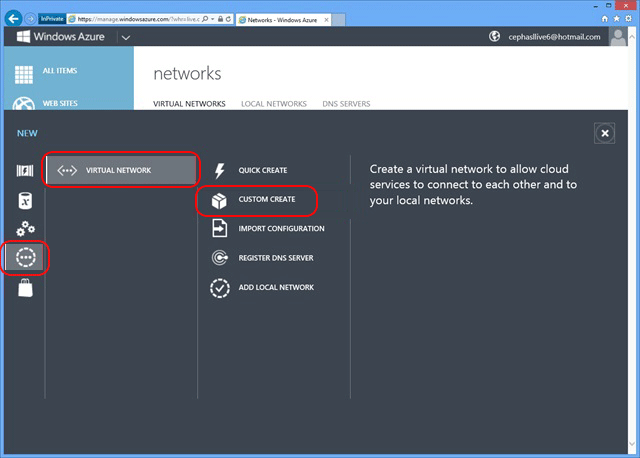
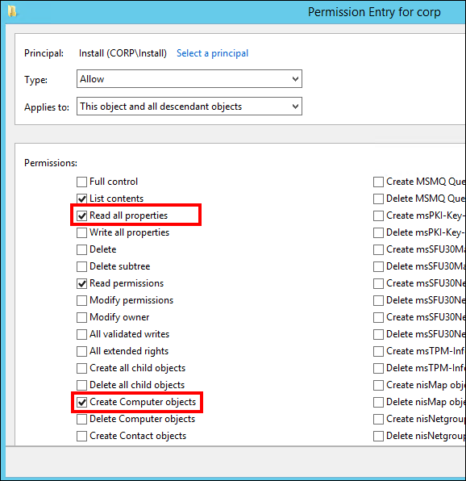
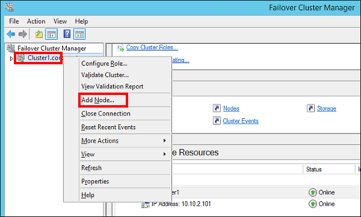
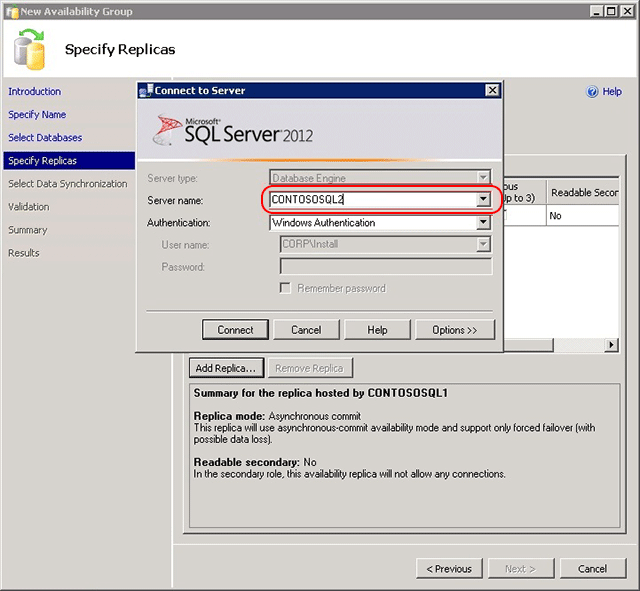
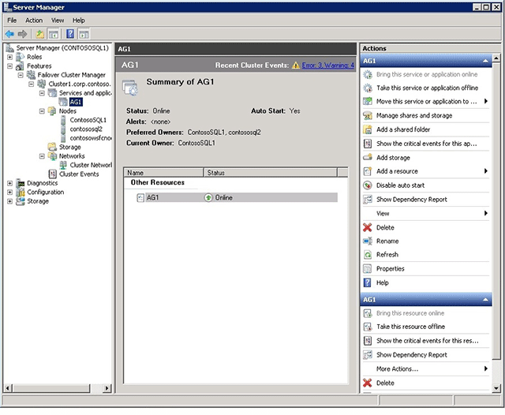

<properties
	pageTitle="Configure Always On availability group in Azure VM - Classic"
	description="Create an Always On Availability Group with Azure Virtual Machines. This tutorial primarily uses the user interface and tools rather than scripting."
	services="virtual-machines-windows"
	documentationCenter="na"
	authors="MikeRayMSFT"
	manager="jhubbard"
	editor=""
	tags="azure-service-management" />
<tags
	ms.service="virtual-machines-windows"
	ms.devlang="na"
	ms.topic="article"
	ms.tgt_pltfrm="vm-windows-sql-server"
	ms.workload="infrastructure-services"
	ms.date="06/09/2016"
	ms.author="mikeray" />

# Configure Always On availability group in Azure VM - Classic

> [AZURE.SELECTOR]
- [Resource Manager: Auto](virtual-machines-windows-portal-sql-alwayson-availability-groups.md)
- [Resource Manager: Manual](virtual-machines-windows-portal-sql-alwayson-availability-groups-manual.md)
- [Classic: UI](virtual-machines-windows-classic-portal-sql-alwayson-availability-groups.md)
- [Classic: PowerShell](virtual-machines-windows-classic-ps-sql-alwayson-availability-groups.md)

 

> [AZURE.INCLUDE [learn-about-deployment-models](../../includes/learn-about-deployment-models-classic-include.md)]

This end-to-end tutorial shows you how to implement Availability Groups using SQL Server Always On running on Azure virtual machines.

At the end of the tutorial, your SQL Server Always On solution in Azure will consist of the following elements:

- A virtual network containing multiple subnets, including a front-end and a back-end subnet

- A domain controller with an Active Directory (AD) domain

- Two SQL Server VMs deployed to the back-end subnet and joined to the AD domain

- A 3-node WSFC cluster with the Node Majority quorum model

- An availability group with two synchronous-commit replicas of an availability database

The figure below is a graphical representation of the solution.

Note that this is one possible configuration. For example, you can minimize the number of VMs for a two-replica availability group in order to save on compute hours in Azure by using the domain controller as the quorum file share witness in a 2-node WSFC cluster. This method reduces the VM count by one from the above configuration.

This tutorial assumes the following:

- You already have an Azure account.

- You already know how to provision a classic SQL Server VM from the virtual machine gallery using the GUI.

- You already have a solid understanding of Always On Availability Groups. For more information, see [Always On Availability Groups (SQL Server)](https://msdn.microsoft.com/library/hh510230.aspx).

>[AZURE.NOTE] If you are interested in using Always On Availability Groups with SharePoint, also see [Configure SQL Server 2012 Always On Availability Groups for SharePoint 2013](https://technet.microsoft.com/library/jj715261.aspx).

## Create the Virtual Network and Domain Controller Server

You begin with a new Azure trial account. Once you have finished your account setup, you should be in the home screen of the Azure classic portal.

1. Click the **New** button at the lower-left corner of the page, as shown below.

	

1. Click **Network Services**, then click **Virtual Network,** and then click **Custom Create**, as shown below.

	

1. In the **CREATE A VIRTUAL NETWORK** dialog, create a new virtual network by stepping through the pages with the settings below. 

	|Page|Settings|
|---|---|
|Virtual Network Details|**NAME = ContosoNET** **REGION = West US**|
|DNS Servers and VPN Connectivity|None|
|Virtual Network Address Spaces|Settings are shown in the screenshot below: |

1. Next, you create the VM you will use as the domain controller (DC). Click **New** again, then **Compute**, then **Virtual Machine**, and then **From Gallery**, as shown below.

	

1. In the **CREATE A VIRTUAL MACHINE** dialog, configure a new VM by stepping through the pages with the settings below. 

	|Page|Settings|
|---|---|
|Select the virtual machine operating system|Windows Server 2012 R2 Datacenter|
|Virtual machine configuration|**VERSION RELEASE DATE** = (latest) **VIRTUAL MACHINE NAME** = ContosoDC **TIER** = STANDARD **SIZE** = A2 (2 cores) **NEW USER NAME** = AzureAdmin **NEW PASSWORD** = Contoso!000 **CONFIRM** = Contoso!000|
|Virtual machine configuration|**CLOUD SERVICE** = Create a new cloud service **CLOUD SERVICE DNS NAME** = A unique cloud service name **DNS NAME** = A unique name (ex: ContosoDC123) **REGION/AFFINITY GROUP/VIRTUAL NETWORK** = ContosoNET **VIRTUAL NETWORK SUBNETS** = Back(10.10.2.0/24) **STORAGE ACCOUNT** = Use an automatically generated storage account **AVAILABILITY SET** = (None)|
|Virtual machine options|Use defaults|

Once you finish configuring the new VM, wait for the VM to be provsioned. This process takes some time to complete, and if you click to the **Virtual Machine** tab in the Azure classic portal, you can see ContosoDC cycling states from **Starting (Provisioning)** to **Stopped**, **Starting**, **Running (Provisioning)**, and finally **Running**.

The DC server is now successfully provisioned. Next, you will configure the Active Directory domain on this DC server.

## Configure the Domain Controller

In the following steps, you configure the ContosoDC machine as a domain controller for corp.contoso.com.

1. In the portal, select the **ContosoDC** machine. On the **Dashboard** tab, click **Connect** to open an RDP file for remote desktop access.

	

1. Log in with your configured administrator account (**\AzureAdmin**) and password (**Contoso!000**).

1. By default, the **Server Manager** dashboard should be displayed.

1. Click the **Add roles and features** link on the dashboard.

	

1. Select **Next** until you get to the **Server Roles** section.

1. Select the **Active Directory Domain Services** and **DNS Server** roles. When prompted, add any additional features required by these roles.

	>[AZURE.NOTE] You will get a validation warning that there is no static IP address. If you are testing the configuration, click continue. For production scenarios [use PowerShell to set the static IP address of the domain controller machine](./virtual-network/virtual-networks-reserved-private-ip.md).

	

1. Click **Next** until you reach the **Confirmation** section. Select the **Restart the destination server automatically if required** checkbox.

1. Click **Install**.

1. After the features finish installing, return to the **Server Manager** dashboard.

1. Select the new **AD DS** option on the left-hand pane.

1. Click the **More** link on the yellow warning bar.

	

1. In the **Action** column of the **All Server Task Details** dialog, click **Promote this server to a domain controller**.

1. In the **Active Directory Domain Services Configuration Wizard**, use the following values:

	|Page|Setting|
|---|---|
|Deployment Configuration|**Add a new forest** = Selected **Root domain name** = corp.contoso.com|
|Domain Controller Options|**Password** = Contoso!000 **Confirm Password** = Contoso!000|

1. Click **Next** to go through the other pages in the wizard. On the **Prerequisites Check** page, verify that you see the following message: **All prerequisite checks passed successfully**. Note that you should review any applicable warning messages, but it is possible to continue with the install.

1. Click **Install**. The **ContosoDC** virtual machine will automatically reboot.

## Configure Domain Accounts

The next steps configure the Active Directory (AD) accounts for later use.

1. Log back into the **ContosoDC** machine.

1. In **Server Manager** select **Tools** and then click **Active Directory Administrative Center**.

	

1. In the **Active Directory Administrative Center** select **corp (local)** from the left pane.

1. On the right **Tasks** pane, select **New** and then click **User**. Use the following settings:

	|Setting|Value|
|---|---|
|**First Name**|Install|
|**User SamAccountName**|Install|
|**Password**|Contoso!000|
|**Confirm password**|Contoso!000|
|**Other password options**|Selected|
|**Password never expires**|Checked|

1. Click **OK** to create the **Install** user. This account will be used to configure the failover cluster and the availability group.

1. Create two additional users with the same steps: **CORP\SQLSvc1** and **CORP\SQLSvc2**. These accounts will be used for the SQL Server instances.Next, you need to give **CORP\Install** the necessary permissions for configuring Windows Service Failover Clustering (WSFC).

1. In the **Active Directory Administrative Center**, select **corp (local)** in the left pane. Then in the right-hand **Tasks** pane, click **Properties**.

	

1. Select **Extensions**, and then click the **Advanced** button on the **Security** tab.

1. On the **Advanced Security Settings for corp** dialog. Click **Add**.

1. Click **Select a principal**. Then search for **CORP\Install**. Click **OK**.

1. Select the **Read all properties** and **Create Computer objects** permissions.

	

1. Click **OK**, and then click **OK** again. Close the corp properties window.

Now that you have finished configuring Active Directory and the user objects, you will create three SQL Server VMs and join them to this domain.

## Create the SQL Server VMs

Next, create three VMs, including a WSFC cluster node and two SQL Server VMs. To create each of the VMs, go back to the Azure classic portal, click **New**, **Compute**, **Virtual Machine**, and then **From Gallery**. Then use the templates in the following table to help you create the VMs.

|Page|VM1|VM2|VM3|
|---|---|---|---|
|Select the virtual machine operating system|**Windows Server 2012 R2 Datacenter**|**SQL Server 2014 RTM Enterprise**|**SQL Server 2014 RTM Enterprise**|
|Virtual machine configuration|**VERSION RELEASE DATE** = (latest) **VIRTUAL MACHINE NAME** = ContosoWSFCNode **TIER** = STANDARD **SIZE** = A2 (2 cores) **NEW USER NAME** = AzureAdmin **NEW PASSWORD** = Contoso!000 **CONFIRM** = Contoso!000|**VERSION RELEASE DATE** = (latest) **VIRTUAL MACHINE NAME** = ContosoSQL1 **TIER** = STANDARD **SIZE** = A3 (4 cores) **NEW USER NAME** = AzureAdmin **NEW PASSWORD** = Contoso!000 **CONFIRM** = Contoso!000|**VERSION RELEASE DATE** = (latest) **VIRTUAL MACHINE NAME** = ContosoSQL2 **TIER** = STANDARD **SIZE** = A3 (4 cores) **NEW USER NAME** = AzureAdmin **NEW PASSWORD** = Contoso!000 **CONFIRM** = Contoso!000|
|Virtual machine configuration|**CLOUD SERVICE** = Previously Created Unique Cloud Service DNS Name (ex: ContosoDC123) **REGION/AFFINITY GROUP/VIRTUAL NETWORK** = ContosoNET **VIRTUAL NETWORK SUBNETS** = Back(10.10.2.0/24) **STORAGE ACCOUNT** = Use an automatically generated storage account **AVAILABILITY SET** = Create an availability set **AVAILABILITY SET NAME** = SQLHADR|**CLOUD SERVICE** = Previously Created Unique Cloud Service DNS Name (ex: ContosoDC123) **REGION/AFFINITY GROUP/VIRTUAL NETWORK** = ContosoNET **VIRTUAL NETWORK SUBNETS** = Back(10.10.2.0/24) **STORAGE ACCOUNT** = Use an automatically generated storage account **AVAILABILITY SET** = SQLHADR (You can also configure the availability set after the machine has been created. All three machines should be assigned to the SQLHADR availability set.)|**CLOUD SERVICE** = Previously Created Unique Cloud Service DNS Name (ex: ContosoDC123) **REGION/AFFINITY GROUP/VIRTUAL NETWORK** = ContosoNET **VIRTUAL NETWORK SUBNETS** = Back(10.10.2.0/24) **STORAGE ACCOUNT** = Use an automatically generated storage account **AVAILABILITY SET** = SQLHADR (You can also configure the availability set after the machine has been created. All three machines should be assigned to the SQLHADR availability set.)|
|Virtual machine options|Use defaults|Use defaults|Use defaults|

 

>[AZURE.NOTE] The previous configuration suggests STANDARD tier virtual machines, because BASIC tier machines do not support load-balanced endpoints required to later create an Availability Group listeners. Also, the machine sizes suggested here are meant for testing Availability Groups in Azure VMs. For the best performance on production workloads, see the recommendations for SQL Server machine sizes and configuration in [Performance best practices for SQL Server in Azure Virtual Machines](virtual-machines-windows-sql-performance.md).

Once the three VMs are fully provisioned, you need to join them to the **corp.contoso.com** domain and grant CORP\Install administrative rights to the machines. To do this, use the following steps for each of the three VMs.

1. First, change the preferred DNS server address. Start by downloading each VM's remote desktop (RDP) file to your local directory by selecting the VM in the list and clicking the **Connect** button. To select a VM, click anywhere but the first cell in the row, as shown below.

	

1. Launch the RDP file you downloaded and log into the VM using your configured administrator account (**BUILTIN\AzureAdmin**) and password (**Contoso!000**).

1. Once you are logged in, you should see the **Server Manager** dashboard. Click **Local Server** in the left pane.

1. Select the **IPv4 address assigned by DHCP, IPv6 enabled** link.

1. In the **Network Connections** window, select the network icon.

	

1. On the command bar, click **Change the settings of this connection** (depending on the size of your window, you might have to click the double right arrow to see this command).

1. Select **Internet Protocol Version 4 (TCP/IPv4)** and click Properties.

1. Select Use the following DNS server addresses and specify **10.10.2.4** in **Preferred DNS server**.

1. The address **10.10.2.4** is the address assigned to a VM in the 10.10.2.0/24 subnet in an Azure virtual network, and that VM is **ContosoDC**. To verify **ContosoDC**'s IP address, use the **nslookup contosodc** in the command prompt, as shown below.

	

1. Click O**K** and then **Close** to commit the changes. You are now able to join the VM to **corp.contoso.com**.

1. Back in the **Local Server** window, click the **WORKGROUP** link.

1. In the **Computer Name** section, click **Change**.

1. Select the **Domain** check box and type **corp.contoso.com** in the text box. Click **OK**.

1. In the **Windows Security** popup dialog, specify the credentials for the default domain administrator account (**CORP\AzureAdmin**) and the password (**Contoso!000**).

1. When you see the "Welcome to the corp.contoso.com domain" message, click **OK**.

1. Click **Close**, and then click **Restart Now** in the popup dialog.

### Add the Corp\Install user as an administrator on each VM:

1. Wait until the VM is restarted, then launch the RDP file again to log into the VM using the **BUILTIN\AzureAdmin** account.

1. In **Server Manager** select **Tools**, and then click **Computer Management**.

	

1. In the **Computer Management** window, expand **Local Users and Groups**, and then select **Groups**.

1. Double-click the **Administrators** group.

1. In the **Administrators Properties** dialog, click the **Add** button.

1. Enter the user **CORP\Install**, and then click **OK**. When prompted for credentials, use the **AzureAdmin** account with the **Contoso!000** password.

1. Click **OK** to close the **Administrator Properties** dialog.

### Add the **Failover Clustering** feature to each VM.

1. In the **Server Manager** dashboard, click **Add roles and features**.

1. In the **Add Roles and Features Wizard**, click **Next** until you get to the **Features** page.

1. Select **Failover Clustering**. When prompted, add any other dependent features.

	

1. Click **Next**, and then click **Install** on the **Confirmation** page.

1. When the **Failover Clustering** feature installation is completed, click **Close**.

1. Log out of the VM.

1. Repeat the steps in this section for all three servers -- **ContosoWSFCNode**, **ContosoSQL1**, and **ContosoSQL2**.

The SQL Server VMs are now provisioned and running, but they are installed with SQL Server with default options.

## Create the WSFC Cluster

In this section, you create the WSFC cluster that will host the availability group you will create later. By now, you should have done the following to each of the three VMs you will use in the WSFC cluster:

- Fully provisioned in Azure

- Joined VM to the domain

- Added **CORP\Install** to the local Administrators group

- Added the Failover Clustering feature

All these are prerequisites on each VM before you can join it to the WSFC cluster.

Also, note that the Azure virtual network does not behave in the same way as an on-premises network. You need to create the cluster in the following order:

1. Create a single-node cluster on one of the nodes (**ContosoSQL1**).

1. Modify the cluster IP address to an unused IP address (**10.10.2.101**).

1. Bring the cluster name online.

1. Add the other nodes (**ContosoSQL2** and **ContosoWSFCNode**).

Follow the steps below to accomplish these tasks that fully configures the cluster.

1. Launch the RDP file for **ContosoSQL1** and log in using the domain account **CORP\Install**.

1. In the **Server Manager** dashboard, select **Tools**, and then click **Failover Cluster Manager**.

1. In the left pane, right-click **Failover Cluster Manager**, and then click **Create a Cluster**, as shown below.

	

1. In the Create Cluster Wizard, create a one-node cluster by stepping through the pages with the settings below:

	|Page|Settings|
|---|---|
|Before You Begin|Use defaults|
|Select Servers|Type **ContosoSQL1** in **Enter server name** and click **Add**|
|Validation Warning|Select **No. I do not require support from Microsoft for this cluster, and therefore do not want to run the validation tests. When I click Next, continue creating the cluster**.|
|Access Point for Administering the Cluster|Type **Cluster1** in **Cluster Name**|
|Confirmation|Use defaults unless you are using Storage Spaces. See the note following this table.|

	>[AZURE.WARNING] If you are using [Storage Spaces](https://technet.microsoft.com/library/hh831739), which groups multiple disks into storage pools, you must uncheck the **Add all eligible storage to the cluster** checkbox on the **Confirmation** page. If you do not uncheck this option, the virtual disks will be detached during the clustering process. As a result, they will also not appear in Disk Manager or Explorer until the storage spaces are removed from cluster and reattached using PowerShell.

1. In the left-pane, expand **Failover Cluster Manager**, and then click **Cluster1.corp.contoso.com**.

1. In the center pane, scroll down to **Cluster Core Resources** section and expand the **Name: Clutser1** details. You should see both the **Name** and the **IP Address** resources in the **Failed** state. The IP address resource cannot be brought online because the cluster is assigned the same IP address as that of the machine itself, which is a duplicate address.

1. Right-click the failed **IP Address** resource, and then click **Properties**.

	

1. Select **Static IP Address** and specify **10.10.2.101** in the Address text box. Then, click **OK**.

1. In the **Cluster Core Resources** section, right-click **Name: Cluster1** and click **Bring Online**. Then, wait until both resources are online. When the cluster name resource comes online, it updates the DC server with a new AD computer account. This AD account will be used to run the availability group clustered service later.

1. Finally, you add the remaining nodes to the cluster. In the browser tree, right-click **Cluster1.corp.contoso.com** and click **Add Node**, as shown below.

	

1. In the **Add Node Wizard**, click **Next**. In the **Select Servers** page, add **ContosoSQL2** and **ContosoWSFCNode** to the list by typing the server name in **Enter server name** and then clicking **Add**. When you are done, click **Next**.

1. In the **Validation Warning** page, click **No** (in a production scenario you should perform the validation tests). Then, click **Next**.

1. In the **Confirmation** page, click **Next** to add the nodes.

	>[AZURE.WARNING] If you are using [Storage Spaces](https://technet.microsoft.com/library/hh831739), which groups multiple disks into storage pools, you must uncheck the **Add all eligible storage to the cluster** checkbox. If you do not uncheck this option, the virtual disks will be detached during the clustering process. As a result, they will also not appear in Disk Manager or Explorer until the storage spaces are removed from cluster and reattached using PowerShell.

1. Once the nodes are added to the cluster, click **Finish**. Failover Cluster Manager should now show that your cluster has three nodes and list them in the **Nodes** container.

1. Log out of the remote desktop session.

## Prepare the SQL Server Instances for Availability Group

In this section, you will do the following on both **ContosoSQL1** and **contosoSQL2**:

- Add a login for **NT AUTHORITY\System** with a necessary permissions set to the default SQL Server instance

- Add **CORP\Install** as a sysadmin role to the default SQL Server instance

- Open the firewall for remote access of SQL Server

- Enable the Always On Availability Groups feature

- Change the SQL Server service account to **CORP\SQLSvc1** and **CORP\SQLSvc2**, respectively

These actions can be performed in any order. Nevertheless, the steps below will walk through them in order. Follow the steps for both **ContosoSQL1** and **ContosoSQL2**:

1. If you have not logged out of the remote desktop session for the VM, do so now.

1. Launch the RDP files for **ContosoSQL1** and **ContosoSQL2** and log in as **BUILTIN\AzureAdmin**.

1. First, add **NT AUTHORITY\System** to the SQL Server logins and with necessary permissions. Launch **SQL Server Management Studio**.

1. Click **Connect** to connect to the default SQL Server instance.

1. In **Object Explorer**, expand **Security**, and then expand **Logins**.

1. Right-click the **NT AUTHORITY\System** login, and click **Properties**.

1. In the **Securables** page, for the local server, select **Grant** for the following permissions and click **OK**.

	- Alter any availability group

	- Connect SQL

	- View server state

1. Next, add **CORP\Install** as a **sysadmin** role to the default SQL Server instance. In **Object Explorer**, right-click **Logins** and click **New Login**.

1. Type **CORP\Install** in **Login name**.

1. In the **Server Roles** page, select **sysadmin**. Then, click **OK**. Once the login is created, you can see it by expanding **Logins** in **Object Explorer**.

1. Next, you create a firewall rule for SQL Server. From the **Start** screen, launch **Windows Firewall with Advanced Security**.

1. In the left pane, select **Inbound Rules**. On the right pane, click **New Rule**.

1. In the **Rule Type** page, select **Program**, then click **Next**.

1. In the **Program** page, select **This program path** and type **%ProgramFiles%\Microsoft SQL Server\MSSQL12.MSSQLSERVER\MSSQL\Binn\sqlservr.exe** in the text box (if you are following these directions but using SQL Server 2012, the SQL Server directory is **MSSQL11.MSSQLSERVER**). Then click **Next**.

1. In the **Action** page, keep **Allow the connection** selected and click **Next**.

1. In the **Profile** page, accept the default settings and click **Next**.

1. In the **Name** page, specify a rule name, such as **SQL Server (Program Rule)** in the **Name** text box, then click **Finish**.

1. Next, you enable the **Always On Availability Groups** feature. From the **Start** screen, launch **SQL Server Configuration Manager**.

1. In the browser tree, click **SQL Server Services**, then right-click the **SQL Server (MSSQLSERVER)** service and click **Properties**.

1. Click the **Always On High Availability** tab, then select **Enable Always On Availability Groups**, as shown below, and then click **Apply**. Click **OK** in the pop-up dialog, and do not close the properties window yet. You will restart the SQL Server service after you change the service account.

	

1. Next, you change the SQL Server service account. Click the **Log On** tab, then type **CORP\SQLSvc1** (for **ContosoSQL1**) or **CORP\SQLSvc2** (for **ContosoSQL2**) in **Account Name**, then fill in and confirm the password, and then click **OK**.

1. In the pop-up window, click **Yes** to restart the SQL Server service. After the SQL Server service is restarted, the changes you made in the properties window are effective.

1. Log out of the VMs.

## Create the Availability Group

You are now ready to configure an availability group. Below is an outline of what you will do:

- Create a new database (**MyDB1**) on **ContosoSQL1**

- Take both a full backup and a transaction log backup of the database

- Restore the full and log backups to **ContosoSQL2** with the **NORECOVERY** option

- Create the availability group (**AG1**) with synchronous commit, automatic failover, and readable secondary replicas

### Create the MyDB1 database on ContosoSQL1:

1. If you have not already logged out of the remote desktop sessions for **ContosoSQL1** and **ContosoSQL2**, do so now.

1. Launch the RDP file for **ContosoSQL1** and log in as **CORP\Install**.

1. In **File Explorer**, under **C:\**, create a directory called **backup**. You will use this directory use to back up and restore your database.

1. Right-click the new directory, point to **Share with**, and then click **Specific people**, as shown below.

	

1. Add **CORP\SQLSvc1** and give it the **Read/Write** permission, then add **CORP\SQLSvc2** and give it the **Read** permission, as shown below, and then click **Share**. Once the file sharing process is complete, click **Done**.

	

1. Next, you create the database. From the **Start** menu, launch **SQL Server Management Studio**, then click **Connect** to connect to the default SQL Server instance.

1. In the **Object Explorer**, right-click **Databases** and click **New Database**.

1. In **Database name**, type **MyDB1**, then click **OK**.

### Take a full backup of MyDB1 and restore it on ContosoSQL2:

1. Next, you take a full backup of the database. In the **Object Explorer**, expand **Databases**, then right-click **MyDB1**, then point to **Tasks**, and then click **Back Up**.

1. In the **Source** section, keep **Backup type** set to **Full**. In the **Destination** section, click **Remove** to remove the default file path for the backup file.

1. In the **Destination** section, click **Add**.

1. In the **File name** text box, type **\\ContosoSQL1\backup\MyDB1.bak**. Then, click **OK**, and then click **OK** again to backup the database. When the backup operation completes, click **OK** again to close the dialog.

1. Next, you take a transaction log backup of the database. In the **Object Explorer**, expand **Databases**, then right-click **MyDB1**, then point to **Tasks**, and then click **Back Up**.

1. In **Backup** type, select **Transaction Log**. Keep the **Destination** file path set to the one you specified earlier and click **OK**. Once the backup operation completes, click **OK** again.

1. Next, you restore the full and transaction log backups on **ContosoSQL2**. Launch the RDP file for **ContosoSQL2** and log in as **CORP\Install**. Leave the remote desktop session for **ContosoSQL1** open.

1. From the **Start** menu, launch **SQL Server Management Studio**, then click **Connect** to connect to the default SQL Server instance.

1. In the **Object Explorer**, right-click **Databases** and click **Restore Database**.

1. In the **Source** section, select **Device**, and click the **…** button.

1. In **Select backup devices**, click **Add**.

1. In Backup file location, type \\ContosoSQL1\backup, then click Refresh, then select MyDB1.bak, then click OK, and then click OK again. You should now see the full backup and the log backup in the Backup sets to restore pane.

1. Go to the Options page, then select RESTORE WITH NORECOVERY in Recovery state, and then click OK to restore the database. Once the restore operation completes, click OK.

### Create the availability group:

1. Go back to the remote desktop session for **ContosoSQL1**. In the **Object Explorer** in SSMS, right-click **Always On High Availability** and click **New Availability Group Wizard**, as shown below.

	

1. In the **Introduction** page, click **Next**. In the **Specify Availability Group Name** page, type **AG1** in **Availability group name**, then click **Next** again.

	

1. In the **Select Databases** page, select **MyDB1** and click **Next**. The database meets the prerequisites for an availability group because you have taken at least one full backup on the intended primary replica.

	

1. In the **Specify Replicas** page, click **Add Replica**.

	

1. The **Connect to Server** dialog pops up. Type **ContosoSQL2** in **Server name**, then click **Connect**.

	

1. Back in the **Specify Replicas** page, you should now see **ContosoSQL2** listed in **Available Replicas**. Configure the replicas as shown below. When you are finished, click **Next**.

	

1. In the **Select Initial Data Synchronization** page, select **Join only** and click **Next**. You have already performed data synchronization manually when you took the full and transaction backups on **ContosoSQL1** and restored them on **ContosoSQL2**. You can instead choose not to perform the backup and restore operations on your database and select **Full** to let the New Availability Group Wizard perform data synchronization for you. However, this is not recommended for very large databases that are found in some enterprises.

	

1. In the **Validation** page, click **Next**. This page should look similar to below. There is a warning for the listener configuration because you have not configured an availability group listener. You can ignore this warning, because this tutorial does not configure a listener. To configure the listener after completing this tutorial, see [Configure an ILB listener for Always On Availability Groups in Azure](virtual-machines-windows-classic-ps-sql-int-listener.md).

	

1. In the **Summary** page, click **Finish**, then wait while the wizard configures the new availability group. In the **Progress** page, you can click **More details** to view the detailed progress. Once the wizard is finished, inspect the **Results** page to verify that the availability group is successfully created, as shown below, then click **Close** to exit the wizard.

	

1. In the **Object Explorer**, expand **Always On High Availability**, then expand **Availability Groups**. You should now see the new availability group in this container. Right-click **AG1 (Primary)** and click **Show Dashboard**.

	

1. Your **Always On Dashboard** should look similar to the one shown below. You can see the replicas, the failover mode of each replica and the synchronization state.

	

1. Return to **Server Manager**, select **Tools**, and then launch **Failover Cluster Manager**.

1. Expand **Cluster1.corp.contoso.com**, and then expand **Services and applications**. Select **Roles** and note that the **AG1** availability group role has been created. Note that AG1 does not have any IP address by which database clients can connect to the availability group, because you did not configure a listener. You can connect directly to the primary node for read-write operations and the secondary node for read-only queries.

	

>[AZURE.WARNING] Do not try to fail over the availability group from the Failover Cluster Manager. All failover operations should be performed from within **Always On Dashboard** in SSMS. For more information, see [Restrictions on Using The WSFC Failover Cluster Manager with Availability Groups](https://msdn.microsoft.com/library/ff929171.aspx).

## Next Steps
You have now successfully implemented SQL Server Always On by creating an availability group in Azure. To configure a listener for this availability group, see [Configure an ILB listener for Always On Availability Groups in Azure](virtual-machines-windows-classic-ps-sql-int-listener.md).

For other information about using SQL Server in Azure, see [SQL Server on Azure Virtual Machines](virtual-machines-windows-sql-server-iaas-overview.md).
