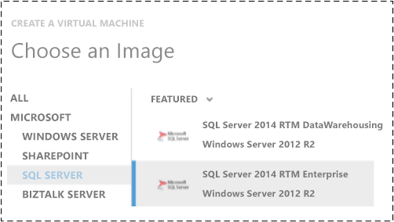
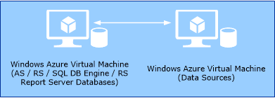
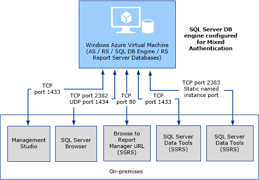

<properties
	pageTitle="SQL Server Business Intelligence | Microsoft Azure"
	description="This topic uses resources created with the classic deployment model, and describes the Business Intelligence (BI) features available for SQL Server running on Azure Virtual Machines (VMs)."
	services="virtual-machines-windows"
	documentationCenter="na"
	authors="guyinacube"
	manager="mblythe"
	editor="monicar"
	tags="azure-service-management"/>
<tags
	ms.service="virtual-machines-windows"
	ms.devlang="na"
	ms.topic="article"
	ms.tgt_pltfrm="vm-windows-sql-server"
	ms.workload="infrastructure-services"
	ms.date="05/13/2016"
	ms.author="asaxton" />

# SQL Server Business Intelligence in Azure Virtual Machines

[AZURE.INCLUDE [learn-about-deployment-models](../../includes/learn-about-deployment-models-classic-include.md)]

The Microsoft Azure Virtual Machine gallery includes images that contain SQL Server installations. The SQL Server editions supported in the gallery images are the same installation files you can install to on-premises computers and virtual machines. This topic summarizes the SQL Server Business Intelligence (BI) Features installed on the images and configuration steps required after a virtual machine is provisioned. This topic also describes supported deployment topologies for BI features and best practices.

## License Considerations

There are two ways to license SQL Server in Microsoft Azure Virtual Machines:

1. License mobility benefits that are part of Software Assurance. For more information, see [License Mobility through Software Assurance on Azure](https://azure.microsoft.com/pricing/license-mobility/).

1. Pay per hour rate of Azure Virtual Machines with SQL Server installed. See the “SQL Server” section in [Virtual Machines Pricing](https://azure.microsoft.com/pricing/details/virtual-machines/#Sql).

For more information on licensing and current rates, see [Virtual Machines Licensing FAQ](https://azure.microsoft.com/pricing/licensing-faq/%20/).

## SQL Server Images Available in Azure Virtual Machine Gallery

The Microsoft Azure Virtual Machine gallery includes several images that contain Microsoft SQL Server. The software installed on the virtual machine images varies based on the version of the operating system and the version of SQL Server. The list of images available in the Azure virtual machine gallery changes frequently.

 The following PowerShell script returns the list of Azure images that contain “SQL-Server” in the ImageName:

	# assumes you have already uploaded a management certificate to your Microsoft Azure Subscription. View the thumbprint value from the "settings" menu in Azure classic portal.

	$subscriptionID = ""    # REQUIRED: Provide your subscription ID.
	$subscriptionName = "" # REQUIRED: Provide your subscription name.
	$thumbPrint = "" # REQUIRED: Provide your certificate thumbprint.
	$certificate = Get-Item cert:\currentuser\my\$thumbPrint # REQUIRED: If your certificate is in a different store, provide it here.-Ser  store is the one specified with the -ss parameter on MakeCert

	Set-AzureSubscription -SubscriptionName $subscriptionName -Certificate $certificate -SubscriptionID $subscriptionID

	Write-Host -foregroundcolor green "List of available gallery images where imagename contains 2016"
	Write-Host -foregroundcolor green ">>>>>>>>>>>>>>>>>>>>>>>>>>>>>>>>>>>>>>>>>>>>>>>>>>>>>>>>>>>>>>>>>>"
	get-azurevmimage | where {$_.ImageName -Like "*SQL-Server-2016*"} | select imagename,category, location, label, description

	Write-Host -foregroundcolor green "List of available gallery images where imagename contains 2014"
	Write-Host -foregroundcolor green ">>>>>>>>>>>>>>>>>>>>>>>>>>>>>>>>>>>>>>>>>>>>>>>>>>>>>>>>>>>>>>>>>>"
	get-azurevmimage | where {$_.ImageName -Like "*SQL-Server-2014*"} | select imagename,category, location, label, description

For more information on editions and features supported by SQL Server, see the following:

- [SQL Server Editions](https://www.microsoft.com/server-cloud/products/sql-server-editions/#fbid=Zae0-E6r5oh)

- [Features Supported by the Editions of SQL Server 2016](https://msdn.microsoft.com/library/cc645993.aspx)

### BI Features Installed on the SQL Server Virtual Machine Gallery Images

The following table summarizes the Business Intelligence features installed on the common Microsoft Azure Virtual Machine gallery images for SQL Server”

- SQL Server 2016 RC3

- SQL Server 2014 SP1 Enterprise

- SQL Server 2014 SP1 Standard

- SQL Server 2012 SP2 Enterprise

- SQL Server 2012 SP2 Standard

|SQL Server BI Feature|Installed on the gallery image|Notes|
|---|---|---|
|**Reporting Services Native Mode**|Yes|Installed but requires configuration, including the report manager URL. See the section [Configure Reporting Services](#configure-reporting-services).|
|**Reporting Services SharePoint Mode**|No|The Microsoft Azure Virtual Machine gallery image does not include SharePoint or SharePoint installation files. 1|
|**Analysis Services Multidimensional and Data mining (OLAP)**|Yes|Installed and configured as the default Analysis Services instance|
|**Analysis Services Tabular**|No|Supported in SQL Server 2012, 2014 and 2016 images but it is not installed by default. Install another instance of Analysis Services. See the section Install other SQL Server Services and features in this topic.|
|**Analysis Services Power Pivot for SharePoint**|No|The Microsoft Azure Virtual Machine gallery image does not include SharePoint or SharePoint installation files. 1|

1 For additional information on SharePoint and Azure virtual machines, see [Microsoft Azure Architectures for SharePoint 2013](https://technet.microsoft.com/library/dn635309.aspx) and [SharePoint Deployment on Microsoft Azure Virtual Machines](https://www.microsoft.com/download/details.aspx?id=34598).

 Run the following PowerShell command to get a list of installed services that contain “SQL” in the service name.

	get-service | Where-Object{ $_.DisplayName -like '*SQL*' } | Select DisplayName, status, servicetype, dependentservices | format-Table -AutoSize

## General Recommendations and Best Practices

- The minimum recommended size for a virtual machine is **A3** when using SQL Server Enterprise Edition. The **A4** virtual machine size is recommended for SQL Server BI deployments of Analysis Services and Reporting Services.

	For information on the current VM sizes, see [Virtual Machine Sizes for Azure](virtual-machines-linux-sizes.md).

- A best practice for disk management is to store data, log, and backup files on drives other than **C**: and **D**:. For example, create data disks **E**: and **F**:.

	- The drive caching policy for the default drive **C**: is not optimal for working with data.

	- The **D**: drive is a temporary drive that is used primarily for the page file. The **D**: drive is not persisted and is not saved in blob storage. Management tasks such as a change to the virtual machine size reset the **D**: drive. It is recommended to **NOT** use the **D**: drive for database files, including tempdb.

	For more information on creating and attaching disks, see [How to Attach a Data Disk to a Virtual Machine](virtual-machines-windows-classic-attach-disk.md).

- Stop or uninstall services you do not plan to use. For example if the virtual machine is only used for Reporting Services, stop or uninstall Analysis Services and SQL Server Integration Services. The following image is an example of the services that are started by default.

	

	>[AZURE.NOTE] The SQL Server database engine is required in the supported BI scenarios. In a single server VM topology, the database engine is required to be running on the same VM.

	For more information, see the following: [Uninstall Reporting Services](https://msdn.microsoft.com/library/hh479745.aspx) and [Uninstall an Instance of Analysis Services](https://msdn.microsoft.com/library/ms143687.aspx).

- Check **Windows Update** for new ‘Important updates’. The Microsoft Azure Virtual Machine images are frequently refreshed; however important updates could become available from **Windows Update** after the VM image was last refreshed.

## Example Deployment Topologies

The following are example deployments that use Microsoft Azure Virtual Machines. The topologies in these diagrams are only some of the possible topologies you can use with SQL Server BI features and Microsoft Azure Virtual Machines.

### Single Virtual Machine

Analysis Services, Reporting Services, SQL Server Database Engine, and data sources on a single virtual machine.

### Two Virtual Machines

- Analysis Services, Reporting Services, and the SQL Server Database Engine on a single virtual machine. This deployment includes the report server databases.

- Data sources on a second VM. The second VM includes SQL Server Database Engine as a data source.

### Mixed Azure – data on Azure SQL database

- Analysis Services, Reporting Services, and the SQL Server Database Engine on a single virtual machine. This deployment includes the report server databases.

- Data source is Azure SQL database.

### Hybrid –data on-premises

- In this example deployment Analysis Services, Reporting Services, and the SQL Server Database Engine run on a single virtual machine. The virtual machine hosts the report server databases. The virtual machine is joined to an on-premises Domain through Azure Virtual Networking, or some other VPN tunneling solution.

- Data source is on-premises.

## Reporting Services Native Mode Configuration

The virtual machine gallery image for SQL Server includes Reporting Services Native mode installed, however the report server is not configured. The steps in this section configure the Reporting Services report server. For more detailed information on configuring Reporting Services Native mode, see [Install Reporting Services Native Mode Report Server (SSRS)](https://msdn.microsoft.com/library/ms143711.aspx).

>[AZURE.NOTE] For similar content that uses Windows PowerShell scripts to configure the report server, see [Use PowerShell to Create an Azure VM With a Native Mode Report Server](virtual-machines-windows-classic-ps-sql-report.md).

### Connect to the Virtual Machine and Start the Reporting Services Configuration Manager

There are two common workflows for connecting to an Azure Virtual Machine:

- To connect in the , click the name of the virtual machine and then click **Connect**. A Remote desktop connection opens and the computer name is automatically populated.

	

- Connect to the virtual machine with Windows Remote Desktop Connection. In the user interface of the remote desktop:

	1. Type the **cloud service name** as the computer name.

	1. Type colon (:) and the public port number that is configured for the TCP remote desktop endpoint.

		Myservice.cloudapp.net:63133

		For more information, see [What is a cloud service?](https://azure.microsoft.com/manage/services/cloud-services/what-is-a-cloud-service/).

**Start Reporting Services Configuration Manager.**

1. In **Windows Server 2012**:

1. From the **Start** screen, type **Reporting Services** to see a list of Apps.

1. Right-click **Reporting Services Configuration Manager** and click **Run as Administrator**.

1. In **Windows Server 2008 R2**:

1. Click **Start**, and then click **ALL Programs**.

1. Click **Microsoft SQL Server 2016**.

1. Click **Configuration Tools**.

1. Right-click **Reporting Services Configuration Manager** and click **Run as Administrator**.

Or

1. Click **Start**.

1. In the **Search programs and Files** dialog type **reporting services**. If the VM is running Windows Server 2012, type **reporting services** on the Windows Server 2012 Start screen.

1. Right-click **Reporting Services Configuration Manager** and click **Run as Administrator**.

	

### Configure Reporting Services

**Service account and web service URL:**

1. Verify the **Server Name** is the local server name and click **Connect**.

1. Note the blank **Report Server Database Name**. The database is created when the configuration completes.

1. Verify the **Report Server Status** is **Started**. If you want to verify the service in Windows Server Manager, the service is the **SQL Server Reporting Services** Windows Service.

1. Click **Service Account** and change the account as needed. If the virtual machine is used in a non-domain joined environment, the built-in **ReportServer** account is sufficient. For more information on the service account, see [Service Account](https://msdn.microsoft.com/library/ms189964.aspx).

1. Click **Web Service URL** in the Left pane.

1. Click **Apply** to configure the default values.

1. Note the **Report Server Web Service URLs**. Note, the default TCP port is 80 and is part of the URL. In a later step, you create a Microsoft Azure Virtual Machine Endpoint for the port.

1. In the **Results** pane, verify the actions completed successfully.

**Database:**

1. Click **Database** in the left pane.

1. Click **Change Database**.

1. Verify **Create a new report server database** is selected and then click Next.

1. Verify **Server Name** and click **Test Connection**.

1. If the result is **Test connection succeeded**, click **OK** and then click **Next**.

1. Note the database name is **ReportServer** and the **Report Server mode** is **Native** then click **Next**.

1. Click **Next** on the **Credentials** page.

1. Click **Next** on the **Summary** page.

1. Click **Next** on the **Progress and Finish** page.

**Web Portal URL, or Report Manager URL for 2012 and 2014:**

1. Click **Web Portal URL**, or **Report Manager URL** for 2014 and 2012, in the left pane.

1. Click **Apply**.

1. In the **Results** pane, verify the actions completed successfully.

1. Click **Exit**.

For information on report server permissions, see [Granting Permissions on a Native Mode Report Server](https://msdn.microsoft.com/library/ms156014.aspx).

### Browse to the local Report Manager

To verify the configuration, browse to report manager on the VM.

1. On the VM, start Internet Explorer with administrator privileges.

1. Browse to http://localhost/reports on the VM.

### To Connect to Remote web portal, or Report Manager for 2014 and 2012

If you want to connect to the web portal, or Report Manager for 2014 and 2012, on the virtual machine from a remote computer, create a new virtual machine TCP Endpoint. By default, the report server listens for HTTP requests on **port 80**. If you configure the report server URLs to use a different port, you must specify that port number in the following instructions.

1. Create an Endpoint for the Virtual Machine of TCP Port 80. For more information see, the [Virtual Machine Endpoints and Firewall Ports](#virtual-machine-endpoints-and-firewall-ports) section in this document.

1. Open port 80 in the virtual machine’s firewall.

1. Browse to the web portal, or report manager, using Azure Virtual Machine **DNS Name** as the server name in the URL. For example:

	**Report server**: http://uebi.cloudapp.net/reportserver
	**Web portal**: http://uebi.cloudapp.net/reports

	[Configure a Firewall for Report Server Access](https://msdn.microsoft.com/library/bb934283.aspx)

### To Create and Publish Reports to the Azure Virtual Machine

The following table summarizes some of the options available to publish existing reports from an on-premises computer to the report server hosted on the Microsoft Azure Virtual Machine:

- **Report Builder**: The virtual machine includes the click-once version of Microsoft SQL Server Report Builder for SQL 2014 and 2012. To start Report builder the first time on the virtual machine with SQL 2016:

	1. Start your browser with administrative privileges.

	1. Browse to the web portal, on the virtual machine, and select the **Download** icon in the upper right.
	
	1. Select **Report Builder**.

	For more information, see [Start Report Builder](https://msdn.microsoft.com/library/ms159221.aspx).

- **SQL Server Data Tools**: VM:  SQL Server Data Tools is installed on the virtual machine and can be used to create **Report Server Projects** and reports on the virtual machine. SQL Server Data Tools can publish the reports to the report server on the virtual machine.

- **SQL Server Data Tools: Remote**:  On your local computer, create a Reporting Services project in SQL Server Data Tools that contains Reporting Services reports. Configure the project to connect to the web service URL.

	

- Create a .VHD hard drive that contains reports and then upload and attach the drive.

	1. Create a .VHD hard drive on your local computer that contains your reports.

	1. Create and install a management certificate.

	1. Upload the VHD file to Azure using the Add-AzureVHD cmdlet [Create and upload a Windows Server VHD to Azure](virtual-machines-windows-classic-createupload-vhd.md).

	1. Attach the disk to the virtual machine.

## Install other SQL Server Services and features

To install additional SQL Server services, such as Analysis Services in tabular mode, run the SQL server setup wizard. The setup files are on the virtual machine’s local disk.

1. Click **Start** and then click **All Programs**.

1. Click **Microsoft SQL Server 2016**, **Microsoft SQL Server 2014** or **Microsoft SQL Server 2012** and then click **Configuration Tools**.

1. Click **SQL Server Installation Center**.

Or run C:\SQLServer_13.0_full\setup.exe, C:\SQLServer_12.0_full\setup.exe or C:\SQLServer_11.0_full\setup.exe

>[AZURE.NOTE] The first time you run SQL Server setup, more setup files may be downloaded and require a reboot of the virtual machine and a restart of SQL Server setup.
>
>If you need to repeatedly customize the image selected from the Microsoft Azure Virtual Machine, consider creating your own SQL Server image. Analysis Services SysPrep functionality was enabled with SQL Server 2012 SP1 CU2. For more information, see [Considerations for Installing SQL Server Using SysPrep](https://msdn.microsoft.com/library/ee210754.aspx) and [Sysprep Support for Server Roles](https://msdn.microsoft.com/windows/hardware/commercialize/manufacture/desktop/sysprep-support-for-server-roles).

### To Install Analysis Services Tabular Mode

The steps in this section **summarize** the installation of Analysis Services tabular mode. For more information, see the following:

- [Install Analysis Services in Tabular Mode](https://msdn.microsoft.com/library/hh231722.aspx)

- [Tabular Modeling (Adventure Works Tutorial)](https://msdn.microsoft.com/library/140d0b43-9455-4907-9827-16564a904268)

**To Install Analysis Services Tabular Mode:**

1. In the SQL Server installation wizard, click **Installation** in the left pane and then click **New SQL server stand-alone installation or add features to an existing installation**.

	- If you see the **Browse For Folder**, browse to c:\SQLServer_13.0_full, c:\SQLServer_12.0_full or c:\SQLServer_11.0_full and then click **Ok**.

1. Click **Next** on the product updates page.

1. On the **Installation Type** page, select **Perform a new installation of SQL Server** and click **Next**.

1. On the **Setup Role** page, click **SQL Server Features Installation**.

1. On the **Feature Selection** page, click **Analysis Services**.

1. On the **Instance Configuration** page, type a descriptive name, such as **Tabular** into **Named Instance** and **Instance Id** text boxes.

1. On the **Analysis Services Configuration** page, select **Tabular Mode**. Add the current user to the administrative permissions list.

1. Complete and close the SQL Server installation wizard.

## Analysis Services Configuration

### Remote Access to Analysis Services Server

Analysis Services server only supports windows authentication. To access Analysis Services remotely from client applications such as SQL Server Management Studio or SQL Server Data Tools, the virtual machine needs to be joined to your local domain, using Azure Virtual Networking. For more information see, [Azure Virtual Network](../virtual-network/virtual-networks-overview.md).

A **default instance** of Analysis Services listens on TCP port **2383**. Open the port in the virtual machines firewall. A clustered named instance of Analysis Services also listens on port **2383**.

For a **named instance** of Analysis Services, the SQL Server Browser service is required to manage port access. The SQL Server Browser default configuration is port **2382**.

In the virtual machines firewall, open port **2382** and create a static Analysis Services named instance port.

1. To verify ports that are already in use on the VM and what process is using the ports, run the following command with administrative privileges:

		netstat /ao

1. Use SQL Server Management Studio to create a static Analysis Services named instance port by updating 'Port' value in tabular AS instance general properties. For more information, see the “Use a fixed port for a default or named instance” in [Configure the Windows Firewall to Allow Analysis Services Access](https://msdn.microsoft.com/library/ms174937.aspx#bkmk_fixed).

1. Restart the tabular instance of the Analysis Services  service.

For more information see, the **Virtual Machine Endpoints and Firewall Ports** section in this document.

## Virtual Machine Endpoints and Firewall Ports

This section summarizes Microsoft Azure Virtual Machine Endpoints to create and ports to open in the virtual machine firewalls. The following table summarizes the **TCP** ports to create endpoints for and the ports to open in the virtual machines firewall.

- If you are using a single VM and the following two items are true, you do not need to create VM endpoints and you do not need to open the ports in the firewall on the VM.

	- You do not remotely connect to the SQL Server features on the VM. Establishing a remote desktop connection to the VM and accessing the SQL Server features locally on the VM is not considered a remote connection to the SQL Server features.

	- You do not join the VM to an on-premises domain through Azure Virtual Networking or another VPN tunneling solution.

- If the virtual machine is not joined to a domain but you want to remotely connect to the SQL Server features on VM:

	- Open the ports in the firewall on the VM.

	- Create virtual machine Endpoints for the noted ports (*).

- If the virtual machine is joined to a domain using a VPN tunnel such as Azure Virtual Networking, then the endpoints are not required. However open the ports in the firewall on the VM.

	|Port|Type|Description|
|---|---|---|
|**80**|TCP|Report server Remote access (*).|
|**1433**|TCP|SQL Server Management Studio (*).|
|**1434**|UDP|SQL Server Browser. This is needed when the VM in joined to a domain.|
|**2382**|TCP|SQL Server Browser.|
|**2383**|TCP|SQL Server Analysis Services default instance and clustered named instances.|
|**User defined**|TCP|Create a static Analysis Services named instance port for a port number you choose, and then unblock the port number in the firewall.|

For more information on creating endpoints, see the following:

- Create Endpoints:[How to Set Up Endpoints to a Virtual Machine](virtual-machines-windows-classic-setup-endpoints.md).

- SQL Server: See the “Complete Configuration steps to connect to the virtual machine Using SQL Server Management Studio” section of [Provisioning a SQL Server Virtual Machine on Azure](virtual-machines-windows-portal-sql-server-provision.md).

The following diagram illustrates the ports to open in the VM firewall to allow remote access to features and components on the VM.

## Resources

- Review the support policy for Microsoft server software used in the Azure Virtual Machine environment. The following topic summarizes support for features such as BitLocker, Failover Clustering, and Network Load Balancing. [Microsoft server software support for Azure Virtual Machines](http://support.microsoft.com/kb/2721672).

- [SQL Server on Azure Virtual Machines Overview](virtual-machines-windows-sql-server-iaas-overview.md)

- [Virtual Machines](https://azure.microsoft.com/documentation/services/virtual-machines/)

- [Provisioning a SQL Server Virtual Machine on Azure](virtual-machines-windows-portal-sql-server-provision.md)

- [How to Attach a Data Disk to a Virtual Machine](virtual-machines-windows-classic-attach-disk.md)

- [Migrating a Database to SQL Server on an Azure VM](virtual-machines-windows-migrate-sql.md)

- [Determine the Server Mode of an Analysis Services Instance](https://msdn.microsoft.com/library/gg471594.aspx)

- [Multidimensional Modeling (Adventure Works Tutorial)](https://technet.microsoft.com/library/ms170208.aspx)

- [Azure Documentation Center](https://azure.microsoft.com/documentation/)

- [Using Power BI in a Hybrid Environment](https://msdn.microsoft.com/library/dn798994.aspx)

>[AZURE.NOTE] [Submit feedback and contact information through Microsoft SQL Server Connect](https://connect.microsoft.com/SQLServer/Feedback)

### Community Content

- [Azure SQL Database Management with PowerShell](http://blogs.msdn.com/b/windowsazure/archive/2013/02/07/windows-azure-sql-database-management-with-powershell.aspx)
