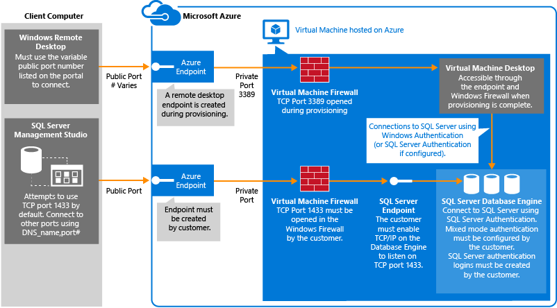

<properties
	pageTitle="Connect to a SQL Server Virtual Machine (Classic) | Microsoft Azure"
	description="Learn how to connect to SQL Server running on a Virtual Machine in Azure. This topic uses the classic deployment model. The scenarios differ depending on the networking configuration and the location of the client."
	services="virtual-machines-windows"
	documentationCenter="na"
	authors="rothja"
	manager="jhubbard"
	tags="azure-service-management"/>
<tags
	ms.service="virtual-machines-windows"
	ms.devlang="na"
	ms.topic="article"
	ms.tgt_pltfrm="vm-windows-sql-server"
	ms.workload="infrastructure-services"
	ms.date="06/23/2016"
	ms.author="jroth" />

# Connect to a SQL Server Virtual Machine on Azure (Classic Deployment)

> [AZURE.SELECTOR]
- [Resource Manager](virtual-machines-windows-sql-connect.md)
- [Classic](virtual-machines-windows-classic-sql-connect.md)

## Overview

This topic describes how to connect to your SQL Server instance running on an Azure virtual machine. It covers some [general connectivity scenarios](#connection-scenarios) and then provides [detailed steps for configuring SQL Server connectivity in an Azure VM](#steps-for-configuring-sql-server-connectivity-in-an-azure-vm).

[AZURE.INCLUDE [learn-about-deployment-models](../../includes/learn-about-deployment-models-classic-include.md)] If you are using Resource Manager VMs, see [Connect to a SQL Server Virtual Machine on Azure using Resource Manager](virtual-machines-windows-sql-connect.md).

## Connection scenarios

The way a client connects to SQL Server running on a Virtual Machine differs depending on the location of the client and the machine/networking configuration. These scenarios include:

- [Connect to SQL Server in the same cloud service](#connect-to-sql-server-in-the-same-cloud-service)
- [Connect to SQL Server over the internet](#connect-to-sql-server-over-the-internet)
- [Connect to SQL Server in the same virtual network](#connect-to-sql-server-in-the-same-virtual-network)

>[AZURE.NOTE] Before you connect with any of these methods, you must follow the [steps in this article to configure connectivity](#steps-for-configuring-sql-server-connectivity-in-an-azure-vm).

### Connect to SQL Server in the same cloud service

Multiple virtual machines can be created in the same cloud service. To understand this virtual machines scenario, see [How to connect virtual machines with a virtual network or cloud service](virtual-machines-windows-classic-connect-vms.md#connect-vms-in-a-standalone-cloud-service). This scenario is when a client on one virtual machine attempts to connect to SQL Server running on another virtual machine in the same cloud service.

In this scenario, you can connect using the VM **Name** (also shown as **Computer Name** or **hostname** in the portal). This is the name you provided for the VM during creation. For example, if you named your SQL VM **mysqlvm**, a client VM in the same cloud service could use the following connection string to connect:

	"Server=mysqlvm;Integrated Security=false;User ID=<login_name>;Password=<your_password>"

### Connect to SQL Server over the Internet

If you want to connect to your SQL Server database engine from the Internet, you must create a virtual machine endpoint for incoming TCP communication. This Azure configuration step, directs incoming TCP port traffic to a TCP port that is accessible to the virtual machine.

To connect over the internet, you must use the VM's DNS name and the VM endpoint port number (configured later in this article). To find the DNS Name, navigate to the Azure Portal, and select **Virtual machines (classic)**. Then select your virtual machine. The **DNS name** is shown in the **Overview** section.

For example, consider a classic virtual machine named **mysqlvm** with a DNS Name of **mysqlvm7777.cloudapp.net** and a VM endpoint of **57500**. Assuming properly configured connectivity, the following connection string could be used to access the virtual machine from anywhere on the internet:

	"Server=mycloudservice.cloudapp.net,57500;Integrated Security=false;User ID=<login_name>;Password=<your_password>"

Although this enables connectivity for clients over the internet, this does not imply that anyone can connect to your SQL Server. Outside clients have to the correct username and password. For additional security, don't use the well-known port 1433 for the public virtual machine endpoint. And if possible, consider adding an ACL on your endpoint to restrict traffic only to the clients you permit. For instructions on using ACLs with endpoints, see [Manage the ACL on an endpoint](virtual-machines-windows-classic-setup-endpoints.md#manage-the-acl-on-an-endpoint).

>[AZURE.NOTE] It is important to note that when you use this technique to communicate with SQL Server, all outgoing data from the Azure datacenter is subject to normal [pricing on outbound data transfers](https://azure.microsoft.com/pricing/details/data-transfers/).

### Connect to SQL Server in the same virtual network

[Virtual Network](../virtual-network/virtual-networks-overview.md) enables additional scenarios. You can connect VMs in the same virtual network, even if those VMs exist in different cloud services. And with a [site-to-site VPN](../vpn-gateway/vpn-gateway-site-to-site-create.md), you can create a hybrid architecture that connects VMs with on-premises networks and machines.

Virtual networks also enables you to join your Azure VMs to a domain. This is the only way to use Windows Authentication to SQL Server. The other connection scenarios require SQL Authentication with user names and passwords.

If you are going to configure a domain environment and Windows Authentication, you do not need to use the steps in this article to configure the public endpoint or the SQL Authentication and logins. In this scenario, you can connect to your SQL Server instance by specifying the SQL Server VM name in the connection string. The following example assumes that Windows Authentication has also been configured and that the user has been granted access to the SQL Server instance.

	"Server=mysqlvm;Integrated Security=true"

## Steps for configuring SQL Server connectivity in an Azure VM

The following steps demonstrate how to connect to the SQL Server instance over the internet using SQL Server Management Studio (SSMS). However, the same steps apply to making your SQL Server virtual machine accessible for your applications, running both on-premises and in Azure.

Before you can connect to the instance of SQL Server from another VM or the internet, you must complete the following tasks as described in the sections that follow:

- [Create a TCP endpoint for the virtual machine](#create-a-tcp-endpoint-for-the-virtual-machine)
- [Open TCP ports in the Windows firewall](#open-tcp-ports-in-the-windows-firewall-for-the-default-instance-of-the-database-engine)
- [Configure SQL Server to listen on the TCP protocol](#configure-sql-server-to-listen-on-the-tcp-protocol)
- [Configure SQL Server for mixed mode authentication](#configure-sql-server-for-mixed-mode-authentication)
- [Create SQL Server authentication logins](#create-sql-server-authentication-logins)
- [Determine the DNS name of the virtual machine](#determine-the-dns-name-of-the-virtual-machine)
- [Connect to the Database Engine from another computer](#connect-to-the-database-engine-from-another-computer)

The connection path is summarized by the following diagram:

[AZURE.INCLUDE [Connect to SQL Server in a VM Classic TCP Endpoint](../../includes/virtual-machines-sql-server-connection-steps-classic-tcp-endpoint.md)]

[AZURE.INCLUDE [Connect to SQL Server in a VM](../../includes/virtual-machines-sql-server-connection-steps.md)]

[AZURE.INCLUDE [Connect to SQL Server in a VM Classic Steps](../../includes/virtual-machines-sql-server-connection-steps-classic.md)]

## Next Steps

If you are also planning to use AlwaysOn Availability Groups for high availability and disaster recovery, you should consider implementing a listener. Database clients connect to the listener rather than directly to one of the SQL Server instances. The listener routes clients to the primary replica in the availability group. For more information, see [Configure an ILB listener for AlwaysOn Availability Groups in Azure](virtual-machines-windows-classic-ps-sql-int-listener.md).

It is important to review all of the security best practices for SQL Server running on an Azure virtual machine. For more information, see [Security Considerations for SQL Server in Azure Virtual Machines](virtual-machines-windows-sql-security.md).

[Explore the Learning Path](https://azure.microsoft.com/documentation/learning-paths/sql-azure-vm/) for SQL Server on Azure virtual machines. 

For other topics related to running SQL Server in Azure VMs, see [SQL Server on Azure Virtual Machines](virtual-machines-windows-sql-server-iaas-overview.md).
