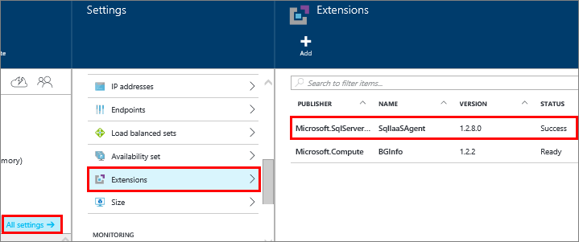
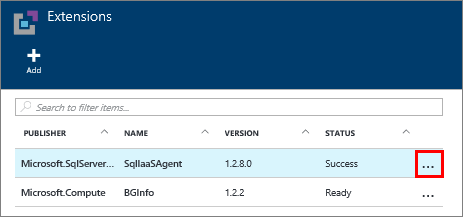

<properties
	pageTitle="SQL Server Agent Extension for SQL Server VMs (Classic) | Microsoft Azure"
	description="This topic describes how to manage the SQL Server agent extension, which automates specific SQL Server administration tasks. These include Automated Backup, Automated Patching, and Azure Key Vault Integration. This topic uses the classic deployment mode."
	services="virtual-machines-windows"
	documentationCenter=""
	authors="rothja"
	manager="jhubbard"
	editor=""
	tags="azure-service-management"/>

<tags
	ms.service="virtual-machines-windows"
	ms.devlang="na"
	ms.topic="article"
	ms.tgt_pltfrm="vm-windows-sql-server"
	ms.workload="infrastructure-services"
	ms.date="05/11/2016"
	ms.author="jroth"/>

# SQL Server Agent Extension for SQL Server VMs (Classic)

The SQL Server IaaS Agent Extension (SQLIaaSAgent) runs on Azure virtual machines to automate administration tasks. This topic provides an overview of the services supported by the extension as well as instructions for installation, status, and removal.

[AZURE.INCLUDE [learn-about-deployment-models](../../includes/learn-about-deployment-models-classic-include.md)] Resource Manager model.

## Supported services

The SQL Server IaaS Agent Extension supports the following administration tasks:

| Administration feature | Description |
|---------------------|-------------------------------|
| **SQL Automated Backup** | Automates the scheduling of backups for all databases for the default instance of SQL Server in the VM. For more information, see [Automated backup for SQL Server in Azure Virtual Machines (Classic)](virtual-machines-windows-classic-sql-automated-backup.md).|
| **SQL Automated Patching** | Configures a maintenance window during which updates to your VM can take place, so  you can avoid updates during peak times for your workload. For more information, see [Automated patching for SQL Server in Azure Virtual Machines (Classic)](virtual-machines-windows-classic-sql-automated-patching.md).|
| **Azure Key Vault Integration** | Enables you to automatically install and configure Azure Key Vault on your SQL Server VM. For more information, see [Configure Azure Key Vault Integration for SQL Server on Azure VMs (Classic)](virtual-machines-windows-classic-ps-sql-keyvault.md).|

## Prerequisites

Requirements to use the SQL Server IaaS Agent Extension on your VM:

- Azure VM Guest Agent (BGInfo extension automatically installed on new Azure VMs).
- Windows Server 2012, Windows Server 2012 R2, or later.
- SQL Server 2012, SQL Server 2014, or later.

Requirements for using Powershell cmdlets:

- Latest Azure PowerShell [available here](../powershell-install-configure.md).

## Installation

The SQL Server IaaS Agent Extension is automatically installed when you provision one of the SQL Server virtual machine gallery images.

If you create an OS-only Windows Server virtual machine, you can install the extension manually by using the **Set-AzureVMSqlServerExtension** PowerShell cmdlet. Use the command to configure one of the agent's services, such as Automated Patching. The VM installs the agent if it is not installed.

>[AZURE.NOTE] For instructions on using the **Set-AzureVMSqlServerExtension** PowerShell, see the individual topics in the [Supported services](#supported-services) section of this article.

## Status

One way to verify that the extension is installed is to view the agent status in the Azure Portal. Select **All settings** in the virtual machine blade, and then click on **Extensions**. You should see the **SQLIaaSAgent** extension listed.

You can also use the **Get-AzureVMSqlServerExtension** Azure Powershell cmdlet.

	Get-AzureVM –ServiceName "service" –Name "vmname" | Get-AzureVMSqlServerExtension

## Removal   

In the Azure Portal, you can uninstall the extension by clicking the ellipsis on the **Extensions** blade of your virtual machine properties. Then click **Delete**.

You can also use the **Remove-AzureVMSqlServerExtension** Powershell cmdlet.

	Get-AzureVM –ServiceName "service" –Name "vmname" | Remove-AzureVMSqlServerExtension | Update-AzureVM

## Next Steps

Begin using one of the services supported by the extension. For more details, see the topics referenced in the [Supported services](#supported-services) section of this article.

For more information about running SQL Server on Azure Virtual Machines, see [SQL Server on Azure Virtual Machines overview](virtual-machines-windows-sql-server-iaas-overview.md).
