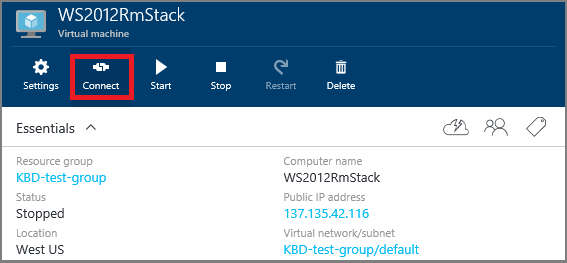

<properties
	pageTitle="Log on to a Windows Server VM | Microsoft Azure"
	description="Learn how to log on to a Windows Server VM using the Azure portal and the Resource Manager deployment model."
	services="virtual-machines-windows"
	documentationCenter=""
	authors="cynthn"
	manager="timlt"
	editor="tysonn"
	tags="azure-resource-manager"/>

<tags
	ms.service="virtual-machines-windows"
	ms.workload="infrastructure-services"
	ms.tgt_pltfrm="vm-windows"
	ms.devlang="na"
	ms.topic="get-started-article"
	ms.date="01/21/2016"
	ms.author="cynthn"/>

# How to log on to a virtual machine running Windows Server 

[AZURE.INCLUDE [learn-about-deployment-models](../../includes/learn-about-deployment-models-rm-include.md)] [classic deployment model](virtual-machines-windows-classic-connect-logon.md).

You'll use the **Connect** button in the Azure portal to start a Remote Desktop session. First you'll connect to the virtual machine, then you'll log on.

## Connect to the virtual machine

1. If you haven't already done so, sign in to the [Azure portal](https://portal.azure.com/).

2.	On the Hub menu, click **Virtual Machines**.

3.	Select the virtual machine from the list.

4. On the blade for the virtual machine, click **Connect**.

	

## Log on to the virtual machine

[AZURE.INCLUDE [virtual-machines-log-on-win-server](../../includes/virtual-machines-log-on-win-server.md)]

## Troubleshooting

If the tips about logging on don't help or aren't what you need, see [Troubleshoot Remote Desktop connections to a Windows-based Azure Virtual Machine](virtual-machines-windows-troubleshoot-rdp-connection.md). This article walks you through diagnosing and resolving common problems.
