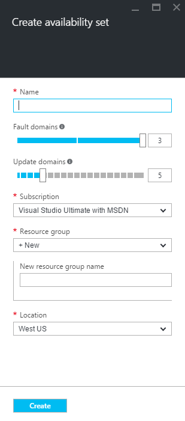
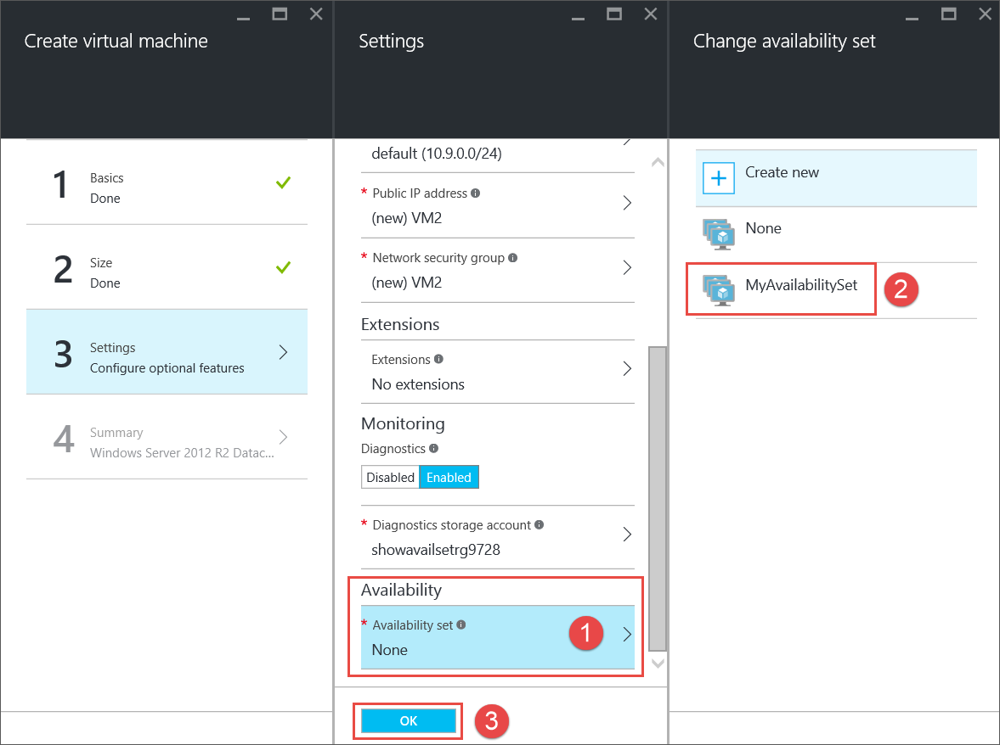

<properties
	pageTitle="Create an VM availability set | Microsoft Azure"
	description="Learn how to create an availability set for your virtual machines using Azure portal or PowerShell using the Resource Manager deployment model."
	keywords="availability set"
	services="virtual-machines-windows"
	documentationCenter=""
	authors="cynthn"
	manager="timlt"
	editor=""
	tags="azure-resource-manager"/>
<tags
	ms.service="virtual-machines-windows"
	ms.workload="infrastructure-services"
	ms.tgt_pltfrm="vm-windows"
	ms.devlang="na"
	ms.topic="article"
	ms.date="06/17/2016"
	ms.author="cynthn"/>

# Create an availability set 

When using the portal, if you want your VM to be part of an availability set, you need to create the availability set first.

For more information about creating and using availability sets, see [Manage the availability of virtual machines](virtual-machines-windows-manage-availability.md).

## Use the portal to create an availability set before creating your VMs

1. In the hub menu, click **Browse** and select **Availability sets**.

2. On the **Availability sets blade**, click **Add**.

	

3. On the **Create availability set** blade, complete the information for your set.

	

	- **Name** - the name should be 1-80 characters made up of numbers, letters, periods, underscores and dashes. The first character must be a letter or number. The last character must be a letter, number or underscore.
	- **Fault domains** - fault domains define the group of virtual machines that share a common power source and network switch. By default, the VMs  are separated across up to three fault domains and can be changed to between 1 and 3.
	- **Update domains** -  five update domains are assigned by default and this can be set to between 1 and 20. Update domains indicate groups of virtual machines and underlying physical hardware that can be rebooted at the same time. For example, if we specify five update domains, when more than five virtual machines are configured within a single Availability Set, the sixth virtual machine will be placed into the same update domain as the first virtual machine, the seventh in the same UD as the second virtual machine, and so on. The order of the reboots may not be sequential, but only one update domain will be rebooted at a time.
	- **Subscription** - select the subscription to use if you have more than one.
	- **Resource group** - select an existing resource group by clicking the arrow and selecting a resource group from the drop down. You can also create a new resource group by typing in a name. The name can contain any of the following characters: letters, numbers, periods, dashes, underscores and opening or closing parenthesis. The name cannot end in a period. All of the VMs in the availability group need to be created in the same resource group as the availability set.
	- **Location** - select a location from the drop-down.

4. When you are done entering the information, click **Create**. Once the availability group has been created, you can see it in the list after you refresh the portal.

## Use the portal to create a virtual machine and an availability set at the same time

If you are creating a new VM using the portal, you can also create a new availability set for the VM while you create the first VM in the set.

## Add a new VM to an existing availability set

For each additional VM that you create that should belong in the set, make sure that you create it in the same **resource group** and then select the existing availability set in Step 3. 

## Use PowerShell to create an availability set

This example creates an availability set in the **RMResGroup** resource group in the **West US** location. This needs to be done before you create the first VM that will be in the set.

	New-AzureRmAvailabilitySet -ResourceGroupName "RMResGroup" -Name "AvailabilitySet03" -Location "West US"
	
For more information, see [New-AzureRmAvailabilitySet](https://msdn.microsoft.com/library/mt619453.aspx).

## Troubleshooting

- When you create a VM, if the availability set you want isn't in the drop-down list in the portal you may have created it in a different resource group. If you don't know the resource group for your availability set, go to the hub menu and click Browse > Availability sets to see a list of your availability sets and which resource groups they belong to.

## Next steps

Add additional storage to your VM by adding an additional [data disk](virtual-machines-windows-attach-disk-portal.md).
