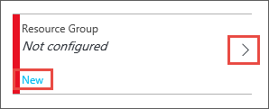

<properties
	pageTitle="Create an VM availability set | Microsoft Azure"
	description="Learn how to create an availability set for your virtual machines using Azure portal or PowerShell using the Resource Manager deployment model."
	keywords="availability set"
	services="virtual-machines-windows"
	documentationCenter=""
	authors="cynthn"
	manager="timlt"
	editor=""
	tags="azure-resource-manager"/>
<tags
	ms.service="virtual-machines-windows"
	ms.workload="infrastructure-services"
	ms.tgt_pltfrm="vm-windows"
	ms.devlang="na"
	ms.topic="article"
	ms.date="05/19/2016"
	ms.author="cynthn"/>

# Create an availability set 

When using the portal, if you want your VM to be part of an availability set, you need to create the availability set first.

For more information about creating and using availability sets, see [Manage the availability of virtual machines](virtual-machines-windows-manage-availability.md).

## Use the portal to create a virtual machine and an availability set at the same time

If you are creating a new VM using the portal, you can also create a new availability set for the VM.

## Use the portal to create an availability set before creating your VMs

1. Click **Browse** and select **Availability set**.
2. At the top of the hub, click **Add**.

	

3. **Name** should be a unique name for your availability set. The name should be 1-80 characters made up of numbers, letters, periods, underscores and dashes. The first character must be a letter or number. The last character must be a letter, number or underscore.
4. Make sure the correct subscription is chosen under **Subscription**.
5. Under **Resource Group**, click **Select existing**. 

	

6. In **Resource Group**, click the arrow to select an existing resource group or click **New** to create a new group. If you create a new resource group, the name can contain any of the following characters: letters, numbers, periods, dashes, underscores and opening or closing parenthesis. The name cannot end in a period.

	

7. Click **Create** when you are finished.
8. Once the availability group has been created, you can see it in the list after you refresh.

## Use PowerShell to create an availability set

This example creates an availability set in the **RMResGroup** resource group in the **West US** location.

	New-AzureRmAvailabilitySet -ResourceGroupName "RMResGroup" -Name "AvailabilitySet03" -Location "West US"
	
For more information, see [New-AzureRmAvailabilitySet](https://msdn.microsoft.com/library/mt619453.aspx).
