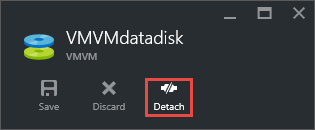

<properties
	pageTitle="Detach a data disk from a Windows VM | Microsoft Azure"
	description="Learn to detach a data disk from a virtual machine in Azure using the Resource Manager deployment model."
	services="virtual-machines-windows"
	documentationCenter=""
	authors="cynthn"
	manager="timlt"
	editor=""
	tags="azure-service-management"/>

<tags
	ms.service="virtual-machines-windows"
	ms.workload="infrastructure-services"
	ms.tgt_pltfrm="vm-windows"
	ms.devlang="na"
	ms.topic="article"
	ms.date="06/02/2016"
	ms.author="cynthn"/>

# How to detach a data disk from a Windows virtual machine

When you no longer need a data disk that's attached to a virtual machine, you can easily detach it. This removes the disk from the virtual machine, but doesn't remove it from storage. 

> [AZURE.WARNING] If you detach a disk it is not automatically deleted. If you have subscribed to Premium storage, you will continue to incur storage charges for the disk. For more information refer to [Pricing and Billing when using Premium Storage](../storage/storage-premium-storage.md#pricing-and-billing). 

If you want to use the existing data on the disk again, you can reattach it to the same virtual machine, or another one.  

## Detach a data disk using the portal

1. In the portal hub, select **Virtual Machines**.

2. Select the virtual machine that has the data disk you want to detach and then click **All settings**.

3. In the **Settings** blade, select **Disks**.

4. In the **Disks** blade, select the data disk that you would like to detach.

5. In the blade for the data disk, click **Detach**.

	

The disk remains in storage but is no longer attached to a virtual machine.

## Detach a data disk using PowerShell

In this example, the first command gets the virtual machine named **MyVM07** in the **RG11** resource group using the Get-AzureRmVM cmdlet. The command stores the virtual machine in the **$VirtualMachine** variable. 

The second command removes the data disk named DataDisk3 from the virtual machine. 

The final command updates the state of the virtual machine to complete the process of removing the data disk.

	$VirtualMachine = Get-AzureRmVM -ResourceGroupName "RG11" -Name "MyVM07" 
	Remove-AzureRmVMDataDisk -VM $VirtualMachine -Name "DataDisk3"
	Update-AzureRmVM -ResourceGroupName "RG11" -Name "MyVM07" -VM $VirtualMachine

For more information, see [Remove-AzureRmVMDataDisk](https://msdn.microsoft.com/library/mt603614.aspx)

## Next steps

If you want to reuse the data disk, you can just [attach it to another VM](virtual-machines-windows-attach-disk-portal.md)
