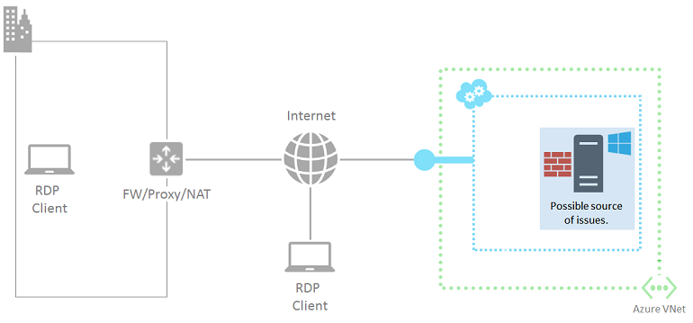

<properties
	pageTitle="Detailed troubleshooting: Cannot connect to remote desktop of VM | Microsoft Azure"
	description="Troubleshoot remote desktop errors where you cannot use remote desktop to connect to Windows virtual machines in Azure"
	services="virtual-machines-windows"
	documentationCenter=""
	authors="iainfoulds"
	manager="timlt"
	editor=""
	tags="top-support-issue,azure-service-management,azure-resource-manager"
	keywords="cannot connect to remote desktop, troubleshoot remote desktop, remote desktop cannot connect, remote desktop errors, remote desktop troubleshooting, remote desktop problems
"/>

<tags
	ms.service="virtual-machines-windows"
	ms.workload="infrastructure-services"
	ms.tgt_pltfrm="vm-windows"
	ms.devlang="na"
	ms.topic="article"
	ms.date="07/06/2016"
	ms.author="iainfou"/>

# Troubleshoot in details problems with remote desktop that cannot connect to Windows VMs in Azure

This article provides detailed troubleshooting steps to diagnose and fix complex Remote Desktop errors for Windows-based Azure virtual machines.

> [AZURE.IMPORTANT] To eliminate the more common Remote Desktop errors, make sure to read [the basic troubleshooting article for Remote Desktop](virtual-machines-windows-troubleshoot-rdp-connection.md) before proceeding.

If you get a Remote Desktop error message that does not resemble any of the specific error messages covered in [the basic Remote Desktop troubleshooting guide](virtual-machines-windows-troubleshoot-rdp-connection.md), you can follow these steps and try to figure out why the Remote Desktop (RDP) client is unable to connect to the RDP service on the Azure VM.

[AZURE.INCLUDE [learn-about-deployment-models](../../includes/learn-about-deployment-models-both-include.md)]

If you need more help at any point in this article, you can contact the Azure experts on [the MSDN Azure and the Stack Overflow forums](https://azure.microsoft.com/support/forums/). Alternatively, you can also file an Azure support incident. Go to the [Azure Support site](https://azure.microsoft.com/support/options/) and click on **Get Support**. For information about using Azure Support, read the [Microsoft Azure Support FAQ](https://azure.microsoft.com/support/faq/).

## Components of a Remote Desktop connection

These are the components involved in an RDP connection:

Before proceeding, it might help to mentally review what has changed since the last successful Remote Desktop connection to the VM. For example:

- If the public IP address of the VM or the cloud service containing the VM (also called the virtual IP address [VIP](https://en.wikipedia.org/wiki/Virtual_IP_address)) has changed, then the RDP failure could be because your DNS client cache still has the *old IP address* registered for the DNS name. Flush your DNS client cache and try connecting the VM again. Or try connecting directly with the new VIP.
- If you are using a third party application to manage your Remote Desktop connections instead of using any of the Azure portals, verify that the application configuration includes the correct TCP port for the Remote Desktop traffic. You can check this port for a classic virtual machine in the [Azure portal](https://portal.azure.com), by clicking the VM's Settings > Endpoints.

## Preliminary steps

Before proceeding to the detailed troubleshooting,

- Check the status of the virtual machine in the Azure classic portal or the Azure portal for any obvious issues
- Follow the [quick fix steps for common RDP errors in the basic troubleshooting guide](virtual-machines-windows-troubleshoot-rdp-connection.md)

Try reconnecting to the VM via Remote Desktop after these steps.

## Detailed troubleshooting

The Remote Desktop client may not be able to reach the Remote Desktop service on the Azure VM due to issues at the following sources:

- Remote Desktop client computer
- Organization intranet edge device
- Cloud service endpoint and access control list (ACL)
- Network security groups
- Windows-based Azure virtual machine

### Source 1: Remote Desktop client computer

Verify that your computer can make Remote Desktop connections to another on-premises, Windows-based computer.

If you cannot, check for the following on your computer:

- A local firewall setting that is blocking Remote Desktop traffic
- Locally installed client proxy software that is preventing Remote Desktop connections
- Locally installed network monitoring software that is preventing Remote Desktop connections
- Other types of security software that either monitor traffic or allow/disallow specific types of traffic that is preventing Remote Desktop connections

In all of these cases, temporarily disable the software and try to connect to an on-premises computer via Remote Desktop. If you can find out the actual cause this way, work with your network administrator to correct the software settings to allow Remote Desktop connections.

### Source 2: Organization intranet edge device

Verify that a computer directly connected to the Internet can make Remote Desktop connections to your Azure virtual machine.

If you do not have a computer that is directly connected to the Internet, create and test with a new Azure virtual machine in a resource group or cloud service. For more information, see [Create a virtual machine running Windows in Azure](virtual-machines-windows-hero-tutorial.md). You can delete the virtual machine and the resource group or the cloud service, after the test.

If you can create a Remote Desktop connection with a computer directly attached to the Internet, check your organization intranet edge device for:

- An internal firewall blocking HTTPS connections to the Internet
- A proxy server preventing Remote Desktop connections
- Intrusion detection or network monitoring software running on devices in your edge network that is preventing Remote Desktop connections

Work with your network administrator to correct the settings of your organization intranet edge device to allow HTTPS-based Remote Desktop connections to the Internet.

### Source 3: Cloud service endpoint and ACL

For virtual machines created using the classic deployment model, verify that another Azure virtual machine that is in the same cloud service or virtual network can make Remote Desktop connections to your Azure virtual machine.

> [AZURE.NOTE] For virtual machines created in Resource Manager, skip to [Source 4: Network Security Groups](#nsgs).

If you do not have another virtual machine in the same cloud service or virtual network, you can create a new one by using the steps in [Create a virtual machine running Windows in Azure](virtual-machines-windows-hero-tutorial.md). Delete the extra virtual machine after the test is completed.

If you can connect via Remote Desktop to a virtual machine in the same cloud service or virtual network, check for these:

- The endpoint configuration for Remote Desktop traffic on the target VM: The private TCP port of the endpoint must match the TCP port on which the VM's Remote Desktop service is listening (default is 3389).
- The ACL for the Remote Desktop traffic endpoint on the target VM: ACLs allow you to specify allowed or denied incoming traffic from the Internet based on its source IP address. Misconfigured ACLs can prevent incoming Remote Desktop traffic to the endpoint. Check your ACLs to ensure that incoming traffic from your public IP addresses of your proxy or other edge server is allowed. For more information, see [What is a Network Access Control List (ACL)?](../virtual-network/virtual-networks-acl.md).

To check if the endpoint is the source of the problem, remove the current endpoint and create a new one, choosing a random port in the range 49152–65535 for the external port number. For more information, see [How to set up endpoints to a virtual machine](virtual-machines-windows-classic-setup-endpoints.md).

### Source 4: Network Security Groups

Network Security Groups allow more granular control of allowed inbound and outbound traffic. You can create rules spanning subnets and cloud services in an Azure virtual network. Check your Network Security Group rules to ensure that Remote Desktop traffic from the Internet is allowed:

- In the Azure portal, select your VM
- Click **All settings** | **Network interfaces** and select your network interface.
- Click **All settings** | **Network security group** and select your network security group.
- Click **All settings** | **Inbound security rules** and ensure you have a rule allowing RDP on TCP port 3389.
	- If you do not have a rule, click **Add** to create a new rule. Enter **TCP** for the protocol and then **3389** for the destination port range.
	- Make sure the action is set to **Allow** and click OK to save your new inbound rule.

For more information, see [What is a Network Security Group (NSG)?](../virtual-network/virtual-networks-nsg.md).

### Source 5: Windows-based Azure virtual machine

Use the [Azure IaaS (Windows) diagnostics package](https://home.diagnostics.support.microsoft.com/SelfHelp?knowledgebaseArticleFilter=2976864) to see if the failure is due to the Azure virtual machine itself. If this diagnostics package is unable to solve the **RDP connectivity to an Azure VM (Reboot Required)** issue, follow the instructions in [this article](virtual-machines-windows-reset-rdp.md) to reset the Remote Desktop service on the virtual machine. This will:

- Enable the "Remote Desktop" Windows Firewall default rule (TCP port 3389).
- Enable Remote Desktop connections by setting the HKLM\System\CurrentControlSet\Control\Terminal Server\fDenyTSConnections registry value to 0.

Try the connection from your computer again. If you are still not able to connect via Remote Desktop, check for the following possible problems:

- The Remote Desktop service is not running on the target VM.
- The Remote Desktop service is not listening on TCP port 3389.
- Windows Firewall or another local firewall has an outbound rule that is preventing Remote Desktop traffic.
- Intrusion detection or network monitoring software running on the Azure virtual machine is preventing Remote Desktop connections.

For VMs created using the classic deployment model, you can use a remote Azure PowerShell session to the Azure virtual machine. First, you will need to install a certificate for the virtual machine's hosting cloud service. Go to [Configure Secure Remote PowerShell Access to Azure Virtual Machines](http://gallery.technet.microsoft.com/scriptcenter/Configures-Secure-Remote-b137f2fe) and download the **InstallWinRMCertAzureVM.ps1** script file to your local computer.

Next, install Azure PowerShell if you haven't already. See [How to install and configure Azure PowerShell](../powershell-install-configure.md).

Next, open an Azure PowerShell command prompt and change the current folder to the location of the **InstallWinRMCertAzureVM.ps1** script file. To run an Azure PowerShell script, you must set the correct execution policy. Run the **Get-ExecutionPolicy** command to determine your current policy level. For information about setting the appropriate level, see [Set-ExecutionPolicy](https://technet.microsoft.com/library/hh849812.aspx).

Next, fill in your Azure subscription name, the cloud service name, and your virtual machine name (removing the < and > characters), and then run these commands.

	$subscr="<Name of your Azure subscription>"
	$serviceName="<Name of the cloud service that contains the target virtual machine>"
	$vmName="<Name of the target virtual machine>"
	.\InstallWinRMCertAzureVM.ps1 -SubscriptionName $subscr -ServiceName $serviceName -Name $vmName

You can get the correct subscription name from the _SubscriptionName_ property of the display of the **Get-AzureSubscription** command. You can get the cloud service name for the virtual machine from the _ServiceName_ column of the display of the **Get-AzureVM** command.

Check if you have the new certificate, open a Certificates snap-in for the current user and look in the **Trusted Root Certification Authorities\Certificates** folder. You should see a certificate with the DNS name of your cloud service in the Issued To column (example: cloudservice4testing.cloudapp.net).

Next, initiate a remote Azure PowerShell session by using these commands.

	$uri = Get-AzureWinRMUri -ServiceName $serviceName -Name $vmName
	$creds = Get-Credential
	Enter-PSSession -ConnectionUri $uri -Credential $creds

After entering valid administrator credentials, you should see something like this as your Azure PowerShell prompt:

	[cloudservice4testing.cloudapp.net]: PS C:\Users\User1\Documents>

The first part of this prompt is your cloud service name that contains the target VM, which could be different from "cloudservice4testing.cloudapp.net". You can now issue Azure PowerShell commands for this cloud service, to investigate the additional problems mentioned above and correct the configuration.

### To manually correct the Remote Desktop Services listening TCP port

If you were unable to run the [Azure IaaS (Windows) diagnostics package](https://home.diagnostics.support.microsoft.com/SelfHelp?knowledgebaseArticleFilter=2976864) for the **RDP connectivity to an Azure VM (Reboot Required)** issue, at the remote Azure PowerShell session prompt, run this command.

	Get-ItemProperty -Path "HKLM:\System\CurrentControlSet\Control\Terminal Server\WinStations\RDP-Tcp" -Name "PortNumber"

The PortNumber property shows the current port number. If needed, change the Remote Desktop port number back to its default value (3389) by using this command.

	Set-ItemProperty -Path "HKLM:\System\CurrentControlSet\Control\Terminal Server\WinStations\RDP-Tcp" -Name "PortNumber" -Value 3389

Verify that the port has been changed to 3389 by using this command.

	Get-ItemProperty -Path "HKLM:\System\CurrentControlSet\Control\Terminal Server\WinStations\RDP-Tcp" -Name "PortNumber"

Exit the remote Azure PowerShell session by using this command.

	Exit-PSSession

Verify that the Remote Desktop endpoint for the Azure VM is also using TCP port 3398 as its internal port. Restart the Azure VM and try the Remote Desktop connection again.

## Additional resources

[Azure IaaS (Windows) diagnostics package](https://home.diagnostics.support.microsoft.com/SelfHelp?knowledgebaseArticleFilter=2976864)

[How to reset a password or the Remote Desktop service for Windows virtual machines](virtual-machines-windows-reset-rdp.md)

[How to install and configure Azure PowerShell](../powershell-install-configure.md)

[Troubleshoot Secure Shell (SSH) connections to a Linux-based Azure virtual machine](virtual-machines-linux-troubleshoot-ssh-connection.md)

[Troubleshoot access to an application running on an Azure virtual machine](virtual-machines-linux-troubleshoot-app-connection.md)
