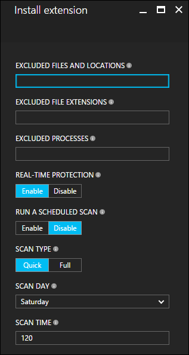

# About virtual machine extensions and features

Azure Virtual Machine extensions are small applications that provide post deployment configuration and automation task on Azure Virtual Machines. For example, if a Virtual Machine requires software to be installed, anti-virus protection, or Docker configuration, a VM extension can be used to complete these tasks. Azure VM extensions can be run using the Azure CLI, PowerShell, Resource Manage templates, and the Azure portal. Extensions can be bundled with a new virtual machine deployment, or run against any existing system.

This document provides an overview of virtual machine extensions, prerequisites for using Azure Virtual Machine extensions, and guidance on how to detect, manage, and remove virtual machine extensions. Because many VM extensions are available, each with a potentially unique configuration, this document provides generalized information. Extensions-specific details can be found in each document specific the individual extension. 

## Use cases and samples

There are many different Azure VM extensions available, each with a specific use case. Some example use cases are:

- Apply PowerShell Desired State Configurations to a virtual machine using the DSC extension for Windows. For more information, see [Azure Desired State configuration extension](virtual-machines-windows-extensions-dsc-overview.md).
- Configure monitoring of virtual machines with using the Microsoft Monitoring Agent VM extension. For more information, see [Connect Azure virtual machines to Log Analytics](../log-analytics/log-analytics-azure-vm-extension.md). 
- Configure monitoring of your Azure infrastructure with the Datadog extension. For more information, see [Datadog blog](https://www.datadoghq.com/blog/introducing-azure-monitoring-with-one-click-datadog-deployment/).
- Configure an Azure virtual machine using Chef. For more information, see [Automating Azure virtual machine deployment with Chef](virtual-machines-windows-chef-automation.md).

In addition to process specific extensions, a Custom Script extension is available for both Windows and Linux virtual machines. The Custom Script extension for Windows allows any PowerShell script to be run on a virtual machine. This is useful when designing Azure deployments that require configuration beyond what native Azure tooling can provide. For more information, see [Windows VM Custom Script extension](virtual-machines-windows-extensions-customscript.md).

To work through an example where a VM extension is used in an end to end application deployment, check out [Automating application deployments to Azure Virtual Machines](virtual-machines-windows-dotnet-core-1-landing.md).

## Prerequisites

Each virtual machine extension may have its own set of prerequisites. For instance, the Docker VM extension has a prerequisite of a supported Linux distribution. Requirements of individual extension are detailed in the extension-specific documentation. 

### Azure VM Agent
The Azure VM Agent manages interaction between an Azure Virtual Machine and the Azure Fabric Controller. The VM agent is responsible for many functional aspects of deploying and managing Azure Virtual Machines, including running VM Extensions. The Azure VM Agent is pre-installed on Azure Gallery Images, and can be installed on supported operating systems. 

For information on supported operating systems and installation instructions, see [Azure Virtual Machine Agent](virtual-machines-windows-classic-agents-and-extensions.md?toc=%2fazure%2fvirtual-machines%2fwindows%2fclassic%2ftoc.json).

## Discover VM extensions
Many different VM extensions are available for use with Azure Virtual Machines. To see a complete list, run the following command with the Azure PowerShell module.

```powershell
Get-AzureVMAvailableExtension | Select ExtensionName, Version
```

## Running VM extensions

Azure virtual machine extensions can be run on existing virtual machines, which is useful when needing to make configuration changes or recover connectivity on an already deployed VM. VM extensions can also be bundled with Azure Resource Manager template deployments. Using extension with Resource Manager templates enables Azure virtual machines to be deployed and configured without the need for post deployment intervention.

The following methods can be used to run an extension against an existing virtual machine. 

### PowerShell

Several PowerShell commands exist for running individual extensions. To see a list, run the following PowerShell commands:

```powershell
get-command Set-AzureRM*Extension* -Module AzureRM.Compute
```

Which provides output similar to the following:

```powershell
CommandType     Name                                               Version    Source
-----------     ----                                               -------    ------
Cmdlet          Set-AzureRmVMAccessExtension                       2.2.0      AzureRM.Compute
Cmdlet          Set-AzureRmVMADDomainExtension                     2.2.0      AzureRM.Compute
Cmdlet          Set-AzureRmVMAEMExtension                          2.2.0      AzureRM.Compute
Cmdlet          Set-AzureRmVMBackupExtension                       2.2.0      AzureRM.Compute
Cmdlet          Set-AzureRmVMBginfoExtension                       2.2.0      AzureRM.Compute
Cmdlet          Set-AzureRmVMChefExtension                         2.2.0      AzureRM.Compute
Cmdlet          Set-AzureRmVMCustomScriptExtension                 2.2.0      AzureRM.Compute
Cmdlet          Set-AzureRmVMDiagnosticsExtension                  2.2.0      AzureRM.Compute
Cmdlet          Set-AzureRmVMDiskEncryptionExtension               2.2.0      AzureRM.Compute
Cmdlet          Set-AzureRmVMDscExtension                          2.2.0      AzureRM.Compute
Cmdlet          Set-AzureRmVMExtension                             2.2.0      AzureRM.Compute
Cmdlet          Set-AzureRmVMSqlServerExtension                    2.2.0      AzureRM.Compute
```

The following example uses the custom script extension to download a script from a GitHub repository onto the target virtual machine, and then run the script. For more information on the VM Access Extension, see [Custom Script Extension overview](virtual-machines-windows-extensions-customscript.md).

```powershell
Set-AzureRmVMCustomScriptExtension -ResourceGroupName "myResourceGroup" `
    -VMName "myVM" -Name "myCustomScript" `
    -FileUri "https://raw.githubusercontent.com/neilpeterson/nepeters-azure-templates/master/windows-custom-script-simple/support-scripts/Create-File.ps1" `
    -Run "Create-File.ps1" -Location "West US"
```

In this example, the VM Access Extension is used to reset the administrative password of a Windows virtual machine. For more information on the VM Access Extension, see [Reset Remote Desktop service in a Windows VM](virtual-machines-windows-reset-rdp.md).

```powershell
$cred=Get-Credential

Set-AzureRmVMAccessExtension -ResourceGroupName "myResourceGroup" -VMName "myVM" -Name "myVMAccess" `
    -Location WestUS -UserName $cred.GetNetworkCredential().Username `
    -Password $cred.GetNetworkCredential().Password -typeHandlerVersion "2.0"
```

The `Set-AzureRmVMExtension` command can be used as a catch all or general command for starting any VM extension. For more information, see [Set-AzureRmVMExtension reference](https://msdn.microsoft.com/en-us/library/mt603745.aspx).


### Azure portal

VM extension can be applied to an existing virtual machine through the Azure portal. To do so, select the virtual machine – extensions – and click add. Doing so provides a list of available extensions. Select the one you want, which provides a wizard for configuration. 

The following image depicts the installation of the Microsoft Antimalware extension from the Azure portal.



### Azure Resource Manager templates

VM extensions can be added to an Azure Resource Manager template and executed with the deployment of the template. Deploying extension with a template is useful for creating fully configured Azure deployments. For example, the following JSON is taken from a Resource Manager template that deploys a set of load balanced virtual machines, an Azure SQL database, and installs a .Net Core application on each VM. The VM extension takes care of the software installation. 

The full Resource Manager template can be found [here](https://github.com/Microsoft/dotnet-core-sample-templates/tree/master/dotnet-core-music-windows). 

```json
{
    "apiVersion": "2015-06-15",
    "type": "extensions",
    "name": "config-app",
    "location": "[resourceGroup().location]",
    "dependsOn": [
    "[concat('Microsoft.Compute/virtualMachines/', variables('vmName'),copyindex())]",
    "[variables('musicstoresqlName')]"
    ],
    "tags": {
    "displayName": "config-app"
    },
    "properties": {
    "publisher": "Microsoft.Compute",
    "type": "CustomScriptExtension",
    "typeHandlerVersion": "1.4",
    "autoUpgradeMinorVersion": true,
    "settings": {
        "fileUris": [
        "https://raw.githubusercontent.com/Microsoft/dotnet-core-sample-templates/master/dotnet-core-music-windows/scripts/configure-music-app.ps1"
        ]
    },
    "protectedSettings": {
        "commandToExecute": "[concat('powershell -ExecutionPolicy Unrestricted -File configure-music-app.ps1 -user ',parameters('adminUsername'),' -password ',parameters('adminPassword'),' -sqlserver ',variables('musicstoresqlName'),'.database.windows.net')]"
    }
    }
}
```

For more information, see [Authoring Azure Resource Manager templates with Windows VM extensions](virtual-machines-windows-extensions-authoring-templates.md).

## Securing VM extension data

When running a VM extension, it may be necessary to include sensitive information such as credentials, storage account names, and storage account access keys. Many VM extensions include a protected configuration that encrypts data and only decrypts this data inside the target virtual machine. Each individual extension has a specific protected configuration schema, each will be detailed in extension-specific documentation.

The following example depicts an instance of the Custom Script extension for Windows. Notice that the command to execute includes a set of credentials. In this example, the command to execute will not be encrypted.


```json
{
    "apiVersion": "2015-06-15",
    "type": "extensions",
    "name": "config-app",
    "location": "[resourceGroup().location]",
    "dependsOn": [
    "[concat('Microsoft.Compute/virtualMachines/', variables('vmName'),copyindex())]",
    "[variables('musicstoresqlName')]"
    ],
    "tags": {
    "displayName": "config-app"
    },
    "properties": {
    "publisher": "Microsoft.Compute",
    "type": "CustomScriptExtension",
    "typeHandlerVersion": "1.4",
    "autoUpgradeMinorVersion": true,
    "settings": {
        "fileUris": [
        "https://raw.githubusercontent.com/Microsoft/dotnet-core-sample-templates/master/dotnet-core-music-windows/scripts/configure-music-app.ps1"
        ],
        "commandToExecute": "[concat('powershell -ExecutionPolicy Unrestricted -File configure-music-app.ps1 -user ',parameters('adminUsername'),' -password ',parameters('adminPassword'),' -sqlserver ',variables('musicstoresqlName'),'.database.windows.net')]"
    }
    }
}
```

Moving the command to execute property to the protected configuration secures the execution string.

```json
{
    "apiVersion": "2015-06-15",
    "type": "extensions",
    "name": "config-app",
    "location": "[resourceGroup().location]",
    "dependsOn": [
    "[concat('Microsoft.Compute/virtualMachines/', variables('vmName'),copyindex())]",
    "[variables('musicstoresqlName')]"
    ],
    "tags": {
    "displayName": "config-app"
    },
    "properties": {
    "publisher": "Microsoft.Compute",
    "type": "CustomScriptExtension",
    "typeHandlerVersion": "1.4",
    "autoUpgradeMinorVersion": true,
    "settings": {
        "fileUris": [
        "https://raw.githubusercontent.com/Microsoft/dotnet-core-sample-templates/master/dotnet-core-music-windows/scripts/configure-music-app.ps1"
        ]
    },
    "protectedSettings": {
        "commandToExecute": "[concat('powershell -ExecutionPolicy Unrestricted -File configure-music-app.ps1 -user ',parameters('adminUsername'),' -password ',parameters('adminPassword'),' -sqlserver ',variables('musicstoresqlName'),'.database.windows.net')]"
    }
    }
}
```

## Troubleshoot VM extensions

Each VM extension may have troubleshooting steps specific to the extensions. For instance, when using the Custom Script Extension, script execution details can be found locally on the virtual machine on which the extension was run. Any extension-specific troubleshooting steps are detailed in extension-specific documentation. 

The following troubleshooting steps apply to all Virtual Machine extensions.

### Viewing extension status

Once a Virtual Machine extension has been run against a virtual machine, use the following PowerShell command to return extension status. Replace example parameter names with your own values. The `Name` parameter takes the name given to the extension at execution time.

```PowerShell
Get-AzureRmVMExtension -ResourceGroupName myResourceGroup -VMName myVM -Name myExtensionName
```

The output looks similar to the following:

```json
ResourceGroupName       : myResourceGroup
VMName                  : myVM
Name                    : myExtensionName
Location                : westus
Etag                    : null
Publisher               : Microsoft.Azure.Extensions
ExtensionType           : DockerExtension
TypeHandlerVersion      : 1.0
Id                      : /subscriptions/mySubscriptionIS/resourceGroups/myResourceGroup/providers/Microsoft.Compute/virtualMachines/myVM/extensions/myExtensionName
PublicSettings          : 
ProtectedSettings       :
ProvisioningState       : Succeeded
Statuses                :
SubStatuses             :
AutoUpgradeMinorVersion : False
ForceUpdateTag          :
```

Extension execution status can also be found in the Azure portal. To view the status of an extension, select the virtual machine > extensions > select the desired extension.

### Rerunning VM extensions 

There may be cases where a virtual machine extension needs to be rerun. This can be accomplished by removing the extension, and then rerunning the extension with an execution method of your choice. To remove an extension, run the following command with the Azure PowerShell module. Replace example parameter names with your own values.

```powershell
Remove-AzureRmVMExtension -ResourceGroupName myResourceGroup -VMName myVM -Name myExtensionName
```

An extension can also be removed using the Azure portal. To do so, select a virtual machine > extensions > the desired extension > uninstall.

## Common VM extensions reference
| Extension Name | Description | More Information |
| --- | --- | --- |
| Custom Script Extension for Windows |Run scripts against an Azure Virtual Machine |[Custom Script Extension for Windows](virtual-machines-windows-extensions-customscript.md?toc=%2fazure%2fvirtual-machines%2fwindows%2ftoc.json) |
| DSC Extension for Windows |PowerShell DSC (Desired State Configuration) Extension. |[DSC Extension for Windows](virtual-machines-windows-extensions-dsc-overview.md?toc=%2fazure%2fvirtual-machines%2fwindows%2ftoc.json) |
| Azure Diagnostics Extension |Manage Azure Diagnostics |[Azure Diagnostics Extension](https://azure.microsoft.com/blog/windows-azure-virtual-machine-monitoring-with-wad-extension/) |
| Azure VM Access Extension |Manage users and credentials |[VM Access Extension for Windows](https://azure.microsoft.com/en-us/blog/using-vmaccess-extension-to-reset-login-credentials-for-linux-vm/) |
