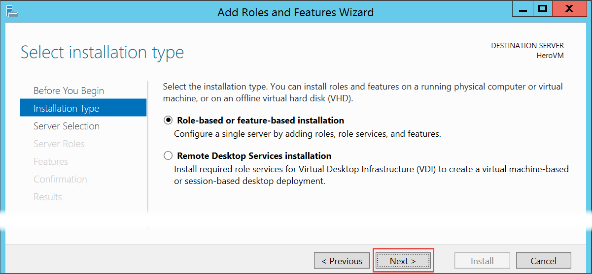
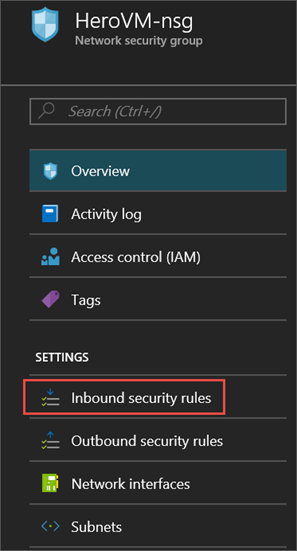

<properties
	pageTitle="Create your first Windows VM | Microsoft Azure"
	description="Learn how to create your first Windows virtual machine using the Azure portal."
	keywords="Windows virtual machine,create a virtual machine,virtual computer,setting up a virtual machine"
	services="virtual-machines-windows"
	documentationCenter=""
	authors="cynthn"
	manager="timlt"
	editor=""
	tags="azure-resource-manager"/>
<tags
	ms.service="virtual-machines-windows"
	ms.workload="infrastructure-services"
	ms.tgt_pltfrm="vm-windows"
	ms.devlang="na"
	ms.topic="hero-article"
	ms.date="08/29/2016"
	ms.author="cynthn"/>

# Create your first Windows virtual machine in the Azure portal

This tutorial shows you how easy it is to create a Windows VM in just a few minutes using the Azure portal.  

If you don't have an Azure subscription, you can create a [free account](https://azure.microsoft.com/free/) in just a couple of minutes.

Here's a [video walkthrough](https://channel9.msdn.com/Blogs/Azure-Documentation-Shorts/Create-A-Virtual-Machine-Running-Windows-In-The-Azure-Preview-Portal) of this tutorial. 

## Choose the VM image from the marketplace

We use a Windows Server 2012 R2 Datacenter image as an example, but that's just one of the many images Azure offers. Your image choices depend on your subscription. For example, desktop images may be available to [MSDN subscribers](https://azure.microsoft.com/pricing/member-offers/msdn-benefits-details/?WT.mc_id=A261C142F).

1. Sign in to the [Azure portal](https://portal.azure.com).

2. On the Hub menu, click **New** > **Virtual Machines** > **Windows Server 2012 R2 Datacenter**.

	

3. On the **Windows Server 2012 R2 Datacenter** blade, under **Select a deployment model**, verify that **Resource Manager** is selected. Click **Create**.

	

## Create the Windows virtual machine

After you select the image, you can use Azure's default settings for most of the configuration and quickly create the virtual machine.

1. On the **Basics** blade, enter a **Name** for the virtual machine. The name must be 1-15 characters long and it cannot contain special characters.

2. Enter a **User name**, and a strong **Password** that will be used to create a local account on the VM. The local account is used to log on to and manage the VM. 

	The password must be between 12-123 characters long and have at least one lower case character, one upper case character, one number, and one special character. 

3. Select an existing [Resource group](../resource-group-overview.md#resource-groups) or type the name for a new one. Type an Azure datacenter **Location** such as **West US**. 

4. When you are done, click **OK** to continue to the next section. 

	

	
5. Choose a VM [size](virtual-machines-windows-sizes.md) and then click **Select** to continue. 

	

6. On the **Settings** blade, you can change the storage and networking options. For a first virtual machine, you can generally accept the default settings. If you selected a virtual machine size that supports it, you can try out Premium Storage by selecting **Premium (SSD)** under **Disk type**. When you are done making changes, click **OK**.

	

7. Click **Summary** to review your choices. When you're done, click **OK**.

	

8. While Azure creates the virtual machine, you can track the progress under **Virtual Machines** in the hub menu. 

## Connect to the virtual machine and log on

1.	On the Hub menu, click **Virtual Machines**.

2.	Select the virtual machine from the list.

3. On the blade for the virtual machine, click **Connect**. This creates and downloads a Remote Desktop Protocol file (.rdp file) that is like a shortcut to connect to your machine. You might want to save the file to your desktop for easy access. **Open** this file to connect to your VM.

	

4. You get a warning that the .rdp is from an unknown publisher. This is normal. In the Remote Desktop window, click **Connect** to continue.

	

5. In the Windows Security window, type the username and password for the local account that you created when you created the VM. The username is entered as *vmname*&#92;*username*, then click **OK**.

	
 	
6.	You will get a warning that the certificate cannot be verified. This is normal. Click **Yes** to verify the identity of the virtual machine and finish logging on.

	

If you run in to trouble when you try to connect, see [Troubleshoot Remote Desktop connections to a Windows-based Azure Virtual Machine](virtual-machines-windows-troubleshoot-rdp-connection.md).

You can now work with the virtual machine just as you would with any other server.

## Install IIS on your VM

Now that you are logged in to the VM, we will install a server role so that you can experiment more.

1. Open **Server Manager** if it isn't already open. Click the **Start** menu and then click **Server Manager**.
2. In **Server Manager**, select **Local Server** from the left pane. 
3. In the menu, select **Manage** > **Add Roles and Features**.
4. In the Add Roles and Features Wizard, on the **Installation Type** page, choose **Role-based or feature-based installation** and then click **Next**.

	

5. Select the VM from the server pool and click **Next**.
6. On the **Server Roles** page, select **Web Server (IIS)**.

	

7. In the pop-up about adding features needed for IIS, make sure that **Include management tools** is selected and then click **Add Features**. When the pop-up closes, click **Next** in the wizard.

	

8. On the features page, click **Next**.
9. On the **Web Server Role (IIS)** page, click **Next**. 
10. On the **Role Services** page, click **Next**. 
11. On the **Confirmation** page, click **Install**. 
12. When the installation is complete, click **Close** on the wizard.

## Open port 80 

In order for your VM to accept inbound traffic over port 80, you need to add an inbound rule to the network security group. 

1. Open the [Azure portal](https://portal.azure.com).
2. Under **Virtual machines** select the VM that you created.
3. Under the virtual machines settings, select **Network interfaces** and then select the existing network interface.

	

4. In **Essentials** for the network interface, click on the **Network security group**.

	

5. In the **Essentials** blade for the NSG, you should have one existing default inbound rule for **default-allow-rdp** which allows you to log in to the VM. You will add another inbound rule to allow IIS traffic. Click **Inbound security rule**.

	

6. In **Inbound security rules**, click **Add**.

	

7. In **Inbound security rules**, click **Add**. Type **80** in the port range and make sure **Allow** is selected. When you are done, click **OK**.

	
 
For more information about NSGs, inbound and outbound rules, see [Allow external access to your VM using the Azure portal](virtual-machines-windows-nsg-quickstart-portal.md)
 
## Connect to the default IIS website

1. In the Azure portal, click **Virtual machines** and then select your VM.
2. In the **Essentials** blade, copy your **Public IP address**.

	

2. Open a browser and in the address bar, type in your public IP address like this: http://<publicIPaddress> and click **Enter** to go to that address.
3. You browser should land on the default IIS web page and the page will look something like this:

	

## Stop the VM

It is a good idea to stop the VM so you don't incur charges when you aren't actually using it. Just click the **Stop** button and then click **Yes**.

	
Just click the **Start** button to restart the VM when you are ready to use it again.

## Next steps

* You can also experiment with [attaching a data disk](virtual-machines-windows-attach-disk-portal.md) to your virtual machine. Data disks provide more storage for your virtual machine.

* You can also [create a Windows VM using Powershell](virtual-machines-windows-ps-create.md) or [create a Linux virtual machine](virtual-machines-linux-quick-create-cli.md) using the Azure CLI.
