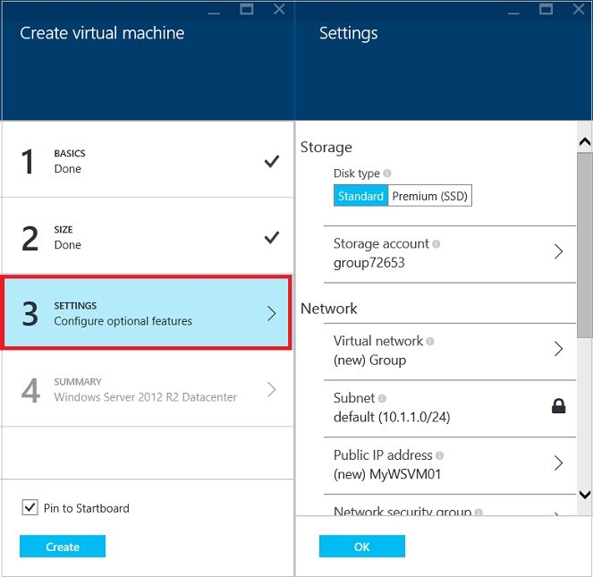
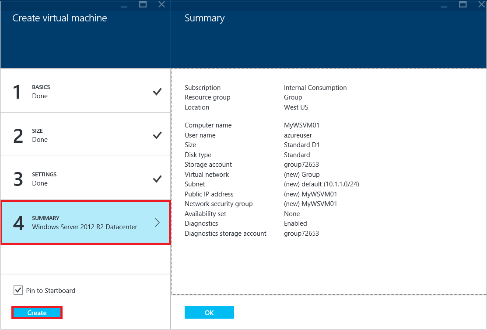

<properties
	pageTitle="Create a Windows virtual machine in the Azure portal | Microsoft Azure"
	description="Learn how to create a Windows virtual machine or virtual computer by using the Azure Marketplace in the Azure portal"
	keywords="Windows virtual machine,create a virtual machine,virtual computer,setting up a virtual machine"
	services="virtual-machines-windows"
	documentationCenter=""
	authors="cynthn"
	manager="timlt"
	editor=""
	tags="azure-resource-manager"/>
<tags
	ms.service="virtual-machines-windows"
	ms.workload="infrastructure-services"
	ms.tgt_pltfrm="vm-windows"
	ms.devlang="na"
	ms.topic="hero-article"
	ms.date="03/11/2016"
	ms.author="cynthn"/>

# Create a Windows virtual machine in the Azure portal#

> [AZURE.SELECTOR]
- [Portal](virtual-machines-windows-hero-tutorial.md)
- [PowerShell](virtual-machines-windows-create-powershell.md)
- [Template](virtual-machines-windows-ps-template.md)

This tutorial shows you how easy it is to create a Windows virtual machine in just a few minutes in the Azure portal. We'll use a Windows Server 2012 R2 Datacenter image as an example to create the virtual machine, but that's just one of the many images Azure offers. Your image choices depend on your subscription. For example, desktop images may be available to MSDN subscribers.

[AZURE.INCLUDE [free-trial-note](../../includes/free-trial-note.md)]
 

[AZURE.INCLUDE [learn-about-deployment-models](../../includes/learn-about-deployment-models-rm-include.md)] [classic deployment model](virtual-machines-windows-classic-createportal.md).

## Video walkthrough

Here's a walkthrough of this tutorial.

[AZURE.VIDEO create-a-virtual-machine-running-windows-in-the-azure-preview-portal]
 

>[AZURE.TIP] When using the portal, if you want your VM to be part of an availability set, you need to create the availability set before or during the creation of the first VM in the set. For more information about creating and using availability sets, see [Manage the availability of virtual machines](virtual-machines-windows-manage-availability.md).

## Select the Windows virtual machine image

1. Sign in to the Azure portal.

2. On the Hub menu, click **New** > **Compute** > **Windows Server 2012 R2 Datacenter**.

	

	>[AZURE.TIP] To find additional images, click **Marketplace** and then search or filter for available items.

3. On the **Windows Server 2012 R2 Datacenter** page, under **Select a deployment model**, select **Resource Manager**. Click **Create**.

	

## Create the Windows virtual machine

After you select the image, you can use Azure's default settings for most of the configuration and quickly create the virtual machine.

1. On the **Create virtual machine** blade, click **Basics**.

2. Enter a **Name** you want for the virtual machine. The name cannot contain special characters.

3. Enter administrative **User name**, and a strong **Password**. The password must be at 8-123 characters long and have at least 3 of the following: 1 lower case character, 1 upper case character, 1 number, and 1 special character. **You'll need the user name and password to log on to the virtual machine**.

4. If you have more than one subscription, specify the one for the new virtual machine, as well as a new or existing **Resource group** and an Azure datacenter **Location**.

	

	
2. Click **Size** and select an appropriate virtual machine size for your needs. Each size specifies the number of compute cores, memory, and other features, such as support for Premium Storage, which will affect the price. Azure recommends certain sizes automatically depending on the image you choose.

	

	>[AZURE.NOTE] Premium storage is available for DS-series virtual machines in certain regions. Premium storage is the best storage option for data intensive workloads such as a database. For details, see [Premium Storage: High-Performance Storage for Azure Virtual Machine Workloads](../storage/storage-premium-storage-preview-portal.md).

3. Click **Settings** to see storage and networking settings for the new virtual machine. For a first virtual machine you can generally accept the default settings. If you selected a virtual machine size that supports it, you can try out Premium Storage by selecting **Premium (SSD)** under **Disk type**.

	

6. Click **Summary** to review your configuration choices. When you're done reviewing or updating the settings, click **Create**.

	

8. While Azure creates the virtual machine, you can track the progress under **Virtual Machines** in the hub menu. 

## Log on to the Windows virtual machine

After you create the virtual machine, you'll want to log on to it so you can manage its settings and the applications that you'll run on it.

>[AZURE.NOTE] For requirements and troubleshooting tips, see [Connect to an Azure virtual machine with RDP or SSH](https://msdn.microsoft.com/library/azure/dn535788.aspx).

1. If you haven't already done so, sign in to the Azure portal.

2. Click your virtual machine on the dashboard or click on Virtual Machines and select it from the list.

3. On the virtual machine blade, click **Connect**.

	

4. Click **Open** to use the Remote Desktop Protocol file that's automatically created for the Windows Server virtual machine.

5. Click **Connect**.

6. Type the user name and password you set when you created the virtual machine, and then click **OK**.

7. Click **Yes** to verify the identity of the virtual machine.

You can now work with the virtual machine just as you would with any other server.

## Next steps

* Use Azure PowerShell and the Azure CLI to [find and select virtual machine images](virtual-machines-linux-cli-ps-findimage.md).
* Automate virtual machine and workload deployment and management using [Azure Resource Manager templates](https://azure.microsoft.com/documentation/templates/).
* You can also quickly [create a Linux virtual machine](virtual-machines-linux-quick-create-cli.md) using the Azure CLI.
