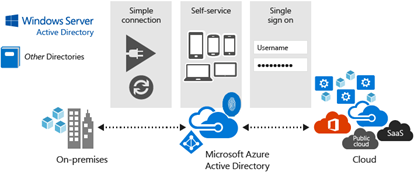

---
title: HPC Pack cluster with Azure Active Directory | Microsoft Docs
description: Learn how to integrate an HPC Pack 2016 cluster in Azure withe Azure Active Directory
services: virtual-machines-windows
documentationcenter: ''
author: dlepow
manager: timlt
editor: ''
tags: azure-resource-manager,azure-service-management,hpc-pack

ms.assetid: 78f6833c-4aa6-4b3e-be71-97201abb4721
ms.service: virtual-machines-windows
ms.devlang: na
ms.topic: article
ms.tgt_pltfrm: vm-multiple
ms.workload: big-compute
ms.date: 11/14/2016
ms.author: danlep

---
# Manage an HPC Pack cluster in Azure using Azure Active Directory
[Microsoft HPC Pack 2016](https://technet.microsoft.com/library/cc514029) supports integration with [Azure Active Directory](../active-directory/) (Azure AD) for administrators who deploy an HPC Pack cluster in Azure. Azure Active Directory (Azure AD) is a multitenant cloud-based directory and identity management service that provides single sign-on (SSO) access to cloud solutions.

>[!NOTE]HPC Pack 2016 is currently in preview.
>  

Integration of an HPC Pack cluster with Azure AD can help you achieve the following goals:

* Remove the traditional Active Directory domain controller from the HPC Pack cluster. This can help reduce the costs of maintaining the cluster if this is not necessary for your business, as well as speed up the deployment process. (This feature is not available in preview.) 
* Leverage the following benefits that are brought by Azure AD:
    *   Single sign-on  
    *   Using a local AD identity for the HPC Pack cluster in Azure.  

    

This article covers the following tasks to use Azure AD in your Azure-based HPC Pack cluster:  
* Manually integrate your HPC Pack cluster with your Azure AD tenant 
* Manage and schedule jobs in your HPC Pack cluster in Azure  
## Prerequisites
* **HPC Pack 2016 cluster deployed in Azure virtual machines** - We recommend that you use
  automated tools such as an [Azure quickstart template](https://azure.microsoft.com/documentation/templates/) or an [Azure PowerShell script](virtual-machines-windows-classic-hpcpack-cluster-powershell-script.md)
  to deploy the HPC Pack 2016 head node and cluster. You need the DNS
  name of the head node and the credentials of a cluster administrator to
  complete the steps in this article.

    

* **Client computer** - You need a Windows or Windows Server client computer that can run HPC Pack client utilities (see [system requirements](https://technet.microsoft.com/library/dn535781.aspx)). If you only want to use the HPC Pack web portal or REST API to submit jobs, you can use any client computer of your choice.
* **HPC Pack installation media** - To install the HPC Pack client utilities, the free installation package for the HPC Pack 2016 is available from the Microsoft Download Center. Make sure that you download the same version of HPC Pack that is installed on the head node VM.

## Connect the HPC Pack cluster with the AD tenant
Integrating an HPC Pack solution in Azure with Azure AD follows standard steps to integrate other applications and services. This article assumes you are familiar with basic user management in Azure AD. For more information, see the [Azure Active Directory documentation](../active-directory/). 

### Step 1: Register the HPC cluster server with your Azure AD tenant 
1. Sign in to the [Azure classic portal](https://manage.windowsazure.com).
2. Click **Active Directory** in the left menu, and then click on the desired directory in your subscription. You must have permission to access resources in the directory.  
3. Click **Users** and make sure there are user accounts already created or configured.  
4. Click **Applications** > **Add**, and then click **Add an application my organization is developing**. Enter the following information in the wizard:
    * **Name** - HPCPackClusterServer
    * **Type** - Select **Web Application and/or Web API**
    * **Sign-on URL**- The base URL for the sample, which is by default `https://hpcserver`
    * **App ID URI** - `https://<Directory_name>/<application_name>`. Replace `<Directory_name`> with the full name of your Azure AD tenant, for example, `hpclocal.onmicrosoft.com`, and replace `<application_name>` with the name you chose previously.
    
5. After the app is added, click **Configure**. Configure the following properties:
    * Select **Yes** for **Application is multi-tenant**
    * Select **Yes** for **User assignment required to access app**.
    
6. Click **Save**. When saving completes, click **Manage Manifest**. This action downloads your application’s manifest JavaScript object notation (JSON) file. Edit the downloaded manifest by locating the `appRoles` setting and adding the following application role:

```json 
"appRoles": [
    {
      "allowedMemberTypes": [
        "User",
        "Application"
      ],
      "displayName": "HpcAdminMirror",
      "id": "61e10148-16a8-432a-b86d-ef620c3e48ef",
      "isEnabled": true,
      "description": "HpcAdminMirror",
      "value": "HpcAdminMirror"
    }, 
    { 
      "allowedMemberTypes": [ 
        "User", 
        "Application" 
      ], 
      "description": "HpcUsers", 
      "displayName": "HpcUsers", 
      "id": "91e10148-16a8-432a-b86d-ef620c3e48ef", 
      "isEnabled": true, 
      "value": "HpcUsers" 
    } 
  ],
```

7. Save the file. Then click **Manage Manifest** > **Upload Manifest** in the portal. You can then upload the edited manifest.
8. Click **Users**, select a user, and then click **Assign**. Assign one of the available roles (HpcUsers or HpcAdminMirror) to the user. Repeat this step with additional users in the directory. For background information about cluster users, see [Managing Cluster Users](https://technet.microsoft.com/library/ff919335(v=ws.11).aspx).
    >[!NOTE]To manage users, we recommend using the Azure Active Directory preview blade in the [Azure portal](https://portal.azure.com).


## Step 2: Register the HPC cluster client with your Azure AD tenant 

1. Sign in to the [Azure classic portal](https://manage.windowsazure.com). 
2. Click **Active Directory** in the left menu, and then click on the desired directory in your subscription. You must have permission to access resources in the directory.  
3. Click **Applications** > **Add**, and then click **Add an application my organization is developing**. Enter the following information in the wizard:

    * **Name** - HPCPackClusterClient
    * **Type** - Select **Native Client Apllication**
    * **Redirect URI**- `http://hpcclient`

4. After the app is added, click **Configure**. Copy the **Client ID** value and save it. You need this later when configuring your application. 

5. In **Permissions to other applications**, click "Add Application." Search and add the application of HpcPackClusterServer (created in step 1). Select "Access HpcClusterServer" from the "Delegated Permissions" dropdown, and save the configuration


f you want to install the HPC Pack client utilities on your computer, download the
HPC Pack setup files (full installation) from the [Microsoft Download
Center](http://go.microsoft.com/fwlink/?LinkId=328024). When you begin the installation, choose the setup option for the **HPC Pack client utilities**.

To use the HPC Pack client tools to submit jobs to the head node VM, you also need to export a certificate from the head node and install it on the client computer. The certificate must be in .CER format.

**To export the certificate from the head node**

1. On the head node, add the Certificates snap-in to a Microsoft Management Console for the Local Computer account. For steps to add the snap-in, see [Add the Certificates Snap-in to an MMC](https://technet.microsoft.com/library/cc754431.aspx).
2. In the console tree, expand **Certificates – Local Computer** > **Personal**, and then click **Certificates**.
3. Locate the certificate that you configured for the HPC Pack web components in [Step 1: Install and configure the web components on the head node](#step-1:-install-and-configure-the-web-components-on-the-head-node) (for example, CN=&lt;*HeadNodeDnsName*&gt;.cloudapp.net).
4. Right-click the certificate, and click **All Tasks** > **Export**.
5. In the Certificate Export Wizard, click **Next**, and ensure that **No, do not export the private key** is selected.
6. Follow the remaining steps of the wizard to export the certificate in DER encoded binary X.509 (.CER) format.

**To import the certificate on the client computer**

1. Copy the certificate that you exported from the head node to a folder on the client computer.
2. On the client computer, run certmgr.msc.
3. In Certificate Manager, expand **Certificates – Current user** > **Trusted Root Certification Authorities**, right-click **Certificates**, and then click **All Tasks** > **Import**.
4. In the Certificate Import Wizard, click **Next** and follow the steps to import the certificate that you exported from the head node to the Trusted Root Certification Authorities store.

> [!TIP]
> You might see a security warning, because the certification authority on the head node isn't recognized by the client computer. For testing purposes, you can ignore this warning and complete the certificate import.
> 
> 

## Step 3: Run test jobs on the cluster
To verify your configuration, try running jobs on the cluster in Azure
from the on-premises computer. For example, you can use HPC Pack GUI tools or command-line commands to submit jobs to the cluster. You can also use a web-based portal to submit jobs.

**To run job submission commands on the client computer**

1. On a client computer where the HPC Pack client utilities are installed, start a Command Prompt.
2. Type a sample command. For example, to list all jobs on the cluster, type a command similar to one of the following, depending on the full DNS name of the head node:
   
    ```command
    job list /scheduler:https://<HeadNodeDnsName>.cloudapp.net /all
    ```
   
    or
   
    ```command
    job list /scheduler:https://<HeadNodeDnsName>.<region>.cloudapp.azure.com /all
    ```
   
   > [!TIP]
   > Use the full DNS name of the head node, not the IP address, in the scheduler URL. If you specify the IP address, an error appears similar to "The server certificate needs to either have a valid chain of trust or to be placed in the trusted root store."
   > 
   > 
3. When prompted, type the user name (in the form &lt;DomainName&gt;\\&lt;UserName&gt;) and password of the HPC cluster administrator or another cluster user that you configured. You can choose to store the credentials locally for more job operations.
   
    A list of jobs appears.

**To use HPC Job Manager on the client computer**

1. If you didn't previously store domain credentials for a cluster user when submitting a job, you can add the credentials in Credential Manager.
   
    a. In Control Panel on the client computer, start Credential Manager.
   
    b. Click **Windows Credentials** > **Add a generic credential**.
   
    c. Specify the Internet address (for example, https://&lt;HeadNodeDnsName&gt;.cloudapp.net/HpcScheduler or https://&lt;HeadNodeDnsName&gt;.&lt;region&gt;.cloudapp.azure.com/HpcScheduler), and the user name (&lt;DomainName&gt;\\&lt;UserName&gt;) and password of the cluster administrator or another cluster user that you configured.
2. On the client computer, start HPC Job Manager.
3. In the **Select Head Node** dialog box, type the URL to the head node in Azure (for example, https://&lt;HeadNodeDnsName&gt;.cloudapp.net or https://&lt;HeadNodeDnsName&gt;.&lt;region&gt;.cloudapp.azure.com).
   
    HPC Job Manager opens and shows a list of jobs on the head node.

**To use the web portal running on the head node**

1. Start a web browser on the client computer, and enter one of the following addresses, depending on the full DNS name of the head node:
   
    ```
    https://<HeadNodeDnsName>.cloudapp.net/HpcPortal
    ```
   
    or
   
    ```
    https://<HeadNodeDnsName>.<region>.cloudapp.azure.com/HpcPortal
    ```
2. In the security dialog box that appears, type the domain credentials of the HPC cluster administrator. (You can also add other cluster users in different roles. See [Managing Cluster Users](https://technet.microsoft.com/library/ff919335.aspx).)
   
    The web portal opens to the job list view.
3. To submit a sample job that returns the string “Hello World” from the cluster, click **New job** in the left-hand navigation.
4. On the **New Job** page, under **From submission pages**, click **HelloWorld**. The job submission page appears.
5. Click **Submit**. If prompted, provide the domain credentials of the HPC cluster administrator. The job is submitted, and the job ID appears on the **My Jobs** page.
6. To view the results of the job that you submitted, click the job ID, and then click **View Tasks** to view the command output (under **Output**).

## Next steps
* You can also submit jobs to the Azure cluster with the [HPC Pack REST API](http://social.technet.microsoft.com/wiki/contents/articles/7737.creating-and-submitting-jobs-by-using-the-rest-api-in-microsoft-hpc-pack-windows-hpc-server.aspx).
* If you want to submit cluster jobs from a Linux client, see the Python sample in the [HPC Pack 2012 R2 SDK and Sample Code](https://www.microsoft.com/download/details.aspx?id=41633).

<!--Image references-->
[jobsubmit]: ./media/virtual-machines-windows-hpcpack-cluster-submit-jobs/jobsubmit.png
