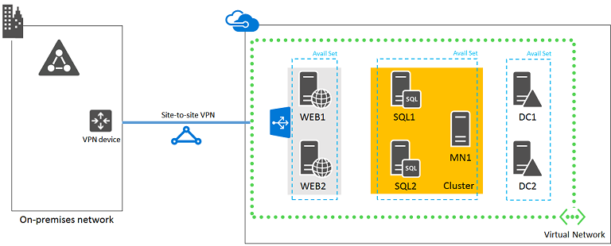

<properties 
	pageTitle="Deploy a line of business application | Microsoft Azure" 
	description="Deploy a web-based, highly-available, line of business application with SQL Server AlwaysOn Availability Groups in Azure in five phases." 
	documentationCenter=""
	services="virtual-machines-windows" 
	authors="JoeDavies-MSFT" 
	manager="timlt" 
	editor=""
	tags="azure-resource-manager"/>

<tags 
	ms.service="virtual-machines-windows" 
	ms.workload="infrastructure-services" 
	ms.tgt_pltfrm="Windows" 
	ms.devlang="na" 
	ms.topic="article" 
	ms.date="04/25/2016" 
	ms.author="josephd"/>

# Deploy a high-availability line of business application in Azure

[AZURE.INCLUDE [learn-about-deployment-models](../../includes/learn-about-deployment-models-rm-include.md)] classic deployment model.

This article contains links to the step-by-step instructions for deploying a high-availability, intranet-only, web-based line of business application with SQL Server AlwaysOn Availability Groups in Azure infrastructure services. The application is hosted on these computers:

- Two web servers
- Two database servers
- One cluster majority node server
- Two domain controllers

This is the configuration, with placeholder names for each server.

 
 
At least two machines for each role ensure high availability. All of the virtual machines are in a single Azure location (also known as a region). Each group of virtual machines for a specific role is in their own availability set. 

## Bill of materials

This baseline configuration requires the following set of Azure services and components:

- Seven virtual machines
- Four extra data disks for the domain controllers and virtual machines running SQL Server
- Three availability sets
- One cross-premises virtual network
- Two storage accounts

Here are the virtual machines and thier default sizes for this configuration.

Item | Virtual machine description | Gallery image | Default size 
--- | --- | --- | --- 
1. | First domain controller | Windows Server 2012 R2 Datacenter | D1
2. | Second domain controller | Windows Server 2012 R2 Datacenter | D1
3. | Primary database server | Microsoft SQL Server 2014 Enterprise – Windows Server 2012 R2 | D4
4. | Secondary database server | Microsoft SQL Server 2014 Enterprise – Windows Server 2012 R2 | D4
5. | Majority node for the cluster | Windows Server 2012 R2 Datacenter | D1
6. | First web server | Windows Server 2012 R2 Datacenter | D3
7. | Second web server | Windows Server 2012 R2 Datacenter | D3

To compute the estimated costs for this configuration, see the [Azure Pricing Calculator](https://azure.microsoft.com/pricing/calculator/). 

1. In **Modules**, click **Compute**, and then click **Virtual Machines** enough times to create a list of seven virtual machines.
2. For each virtual machine, select:
	- Your intended region
	- **Windows** for the type
	- **Standard** for the pricing tier
	- The default size in the previous table or your intended size for the **Instance size**

> [AZURE.NOTE] The Azure Pricing Calculator does not include the additional costs for the SQL Server license for the two virtual machines running SQL Server 2014 Enterprise. See [Virtual Machines Pricing-SQL](https://azure.microsoft.com/pricing/details/virtual-machines/#Sql) for more information.

## Phases of deployment

You deploy this configuration in the following phases:

- [Phase 1: Configure Azure](virtual-machines-windows-ps-lob-ph1.md). Create storage accounts, availability sets, and a cross-premises virtual network.
- [Phase 2: Configure domain controllers](virtual-machines-windows-ps-lob-ph2.md). Create and configure replica Active Directory Domain Services (AD DS) domain controllers.
- [Phase 3: Configure SQL Server infrastructure](virtual-machines-windows-ps-lob-ph3.md). Create and configure the virtual machines running SQL Server, create the cluster, and enable SQL Server AlwaysOn Availability Groups.
- [Phase 4: Configure web servers](virtual-machines-windows-ps-lob-ph4.md). Create and configure the two web server virtual machines.
- [Phase 5: Add the application databases to a SQL Server AlwaysOn Availability Group](virtual-machines-windows-ps-lob-ph5.md). Prepare the line of business application databases and add them to a SQL Server AlwaysOn Availability Group.

This deployment is designed to accompany the [Line of Business Applications architecture blueprint](http://msdn.microsoft.com/dn630664) and incorporate the latest recommendations.

This is a prescriptive, pre-defined architecture. Keep the following in mind:

- If you are an experienced web-based, line of business application implementer, please feel free to adapt the instructions in Phases 3 through 5 and build the application infrastructure that best suits your needs. 
- If you already have an existing Azure hybrid cloud implementation, please feel free to adapt or skip the instructions in Phases 1 and 2 to host the virtual machines for the new application on the appropriate subnet.
- All of the servers are located on a single subnet in the Azure virtual network. If you want to provide additional security equivalent to subnet isolation, you can use [Network Security Groups](../virtual-network/virtual-networks-nsg.md).

To build a dev/test environment or a proof-of-concept of this configuration, see [Set up a web-based LOB application in a hybrid cloud for testing](virtual-machines-windows-ps-hybrid-cloud-test-env-lob.md).

For additional information about designing IT workloads for Azure, see [Azure infrastructure services implementation guidelines](virtual-machines-linux-infrastructure-service-guidelines.md).

## Next step

- Start the configuration of this workload with [Phase 1](virtual-machines-windows-ps-lob-ph1.md).

