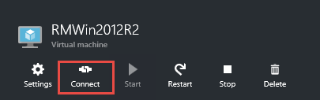
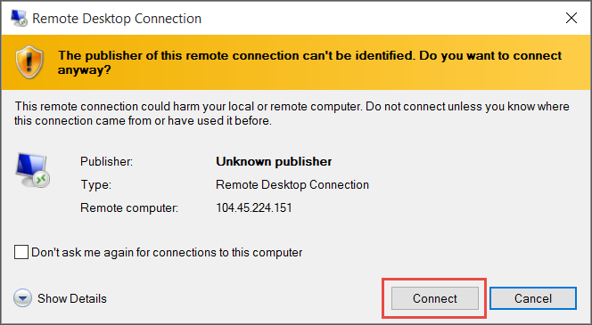
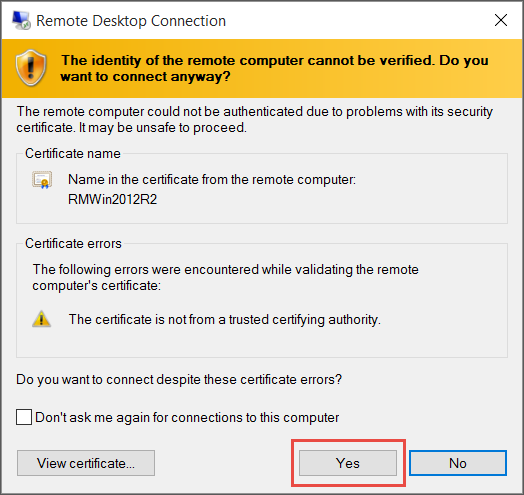

<properties
	pageTitle="Log on to a Windows VM | Microsoft Azure"
	description="Use the Azure portal to log on to a Windows virtual machine created with the Resource Manager deployment model."
	services="virtual-machines-windows"
	documentationCenter=""
	authors="cynthn"
	manager="timlt"
	editor="tysonn"
	tags="azure-resource-manager"/>

<tags
	ms.service="virtual-machines-windows"
	ms.workload="infrastructure-services"
	ms.tgt_pltfrm="vm-windows"
	ms.devlang="na"
	ms.topic="article"
	ms.date="02/03/2016"
	ms.author="cynthn"/>

# Log on to a Windows virtual machine using the Azure portal

In the Azure portal, you use the **Connect** button to start a Remote Desktop session and log on to a Windows VM.

[AZURE.INCLUDE [learn-about-deployment-models](../../includes/learn-about-deployment-models-rm-include.md)] [classic deployment model](virtual-machines-windows-classic-connect-logon.md).

## Connect to the virtual machine

1. Sign in to the Azure portal.

2. Click **Virtual Machines**, and then select the virtual machine.

3. On the command bar at the bottom of the page, click **Connect**.

	
	

4. Clicking **Connect** creates and downloads a Remote Desktop Protocol file (.rdp file). Click **Open** to use this file.

	
	
5. In the Remote Desktop window, click **Connect** to continue.

	

	
6. In the Windows Security window, type the credentials for an account on the virtual machine and then click **OK**.

 	In most cases, the credentials are the local account user name and password that you specified when you created the virtual machine. The domain is the name of the virtual machine entered as *vmname*&#92;*username*.  
	
	If the virtual machine belongs to a domain in your organization, make sure the user name includes the name of the domain in the format *Domain*&#92;*Username*. The account needs to be in the Administrators group or have been granted remote access privileges to the VM.
	
	If the virtual machine is a domain controller, type the user name and password of a domain administrator account for that domain.

7.	Click **Yes** to verify the identity of the virtual machine and finish logging on.

	

## Next steps

If you run into trouble when you try to connect, see [Troubleshoot Remote Desktop connections to a Windows-based Azure Virtual Machine](virtual-machines-windows-troubleshoot-rdp-connection.md)

