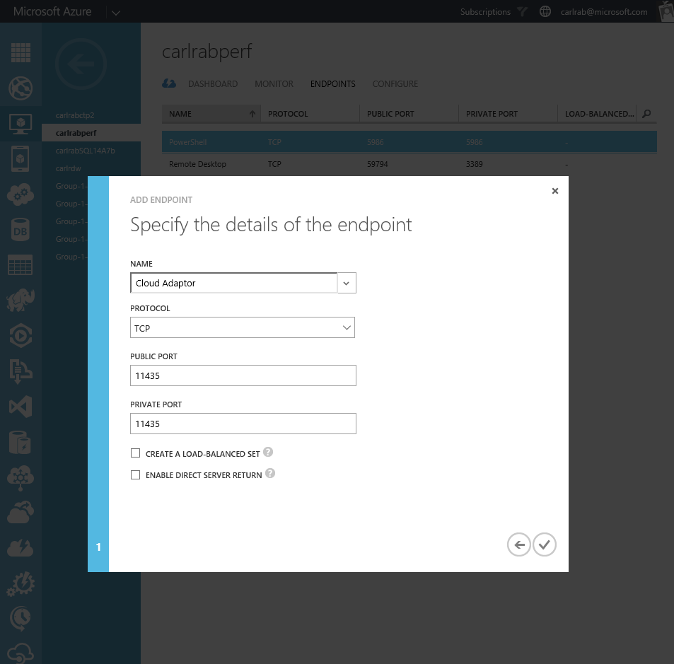
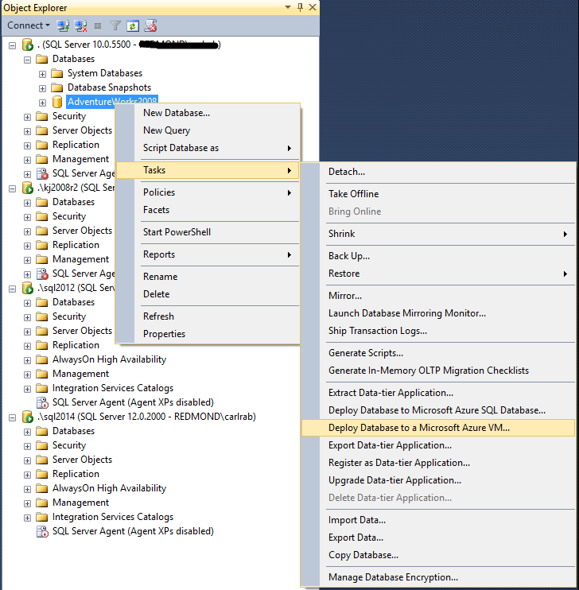

<properties
	pageTitle="Migrate a SQL Server database to SQL Server on a VM | Microsoft Azure"
	description="Learn about how to migrate an on-premises user database to SQL Server in an Azure virtual machine."
	services="virtual-machines-windows"
	documentationCenter=""
	authors="sabotta"
	manager="jhubbard"
	editor=""
	tags="azure-service-management" />
<tags
	ms.service="virtual-machines-windows"
	ms.workload="infrastructure-services"
	ms.tgt_pltfrm="vm-windows-sql-server"
	ms.devlang="na"
	ms.topic="article"
	ms.date="07/07/2016"
	ms.author="carlasab"/>

# Migrate a SQL Server database to SQL Server in an Azure VM

[AZURE.INCLUDE [learn-about-deployment-models](../../includes/learn-about-deployment-models-both-include.md)] Resource Manager model.

There are a number of methods for migrating an on-premises SQL Server user database to SQL Server in an Azure VM. This article will briefly discuss various methods, recommend the best method for various scenarios, and include a [tutorial](#azure-vm-deployment-wizard-tutorial) to guide you through the use of the **Deploy a SQL Server Database to a Microsoft Azure VM** wizard. 

The method using the **Deploy a SQL Server Database to a Microsoft Azure VM** wizard described in the [tutorial](#azure-vm-deployment-wizard-tutorial) is for only the classic deployment model. 

## What are the primary migration methods?

The primary migration methods are:

- Use the Deploy a SQL Server Database to a Microsoft Azure VM wizard
- Perform on-premises backup using compression and manually copy the backup file into the Azure virtual machine
- Perform a backup to URL and restore into the Azure virtual machine from the URL
- Detach and then copy the data and log files to Azure blob storage and then attach to SQL Server in Azure VM from URL
- Convert on-premises physical machine to Hyper-V VHD, upload to Azure Blob storage, and then deploy as new VM using uploaded VHD
- Ship hard drive using Windows Import/Export Service
- If you have an AlwaysOn deployment on-premises, use the [Add Azure Replica Wizard](virtual-machines-windows-classic-sql-onprem-availability.md) to create a replica in Azure and then failover, pointing users to the Azure database instance
- Use SQL Server [transactional replication](https://msdn.microsoft.com/library/ms151176.aspx) to configure the Azure SQL Server instance as a subscriber and then disable replication, pointing users to the Azure database instance

## Choosing your migration method

For optimum data transfer performance, migration of the database files into the Azure VM using a compressed backup file is generally the best method. This is the method that the [Deploy a SQL Server Database to a Microsoft Azure VM wizard](#azure-vm-deployment-wizard-tutorial) uses. This wizard is the recommended method for migrating an on-premises user database running on SQL Server 2005 or greater to SQL Server 2014 or greater when the compressed database backup file is less than 1 TB.

To minimize downtime during the database migration process, use either the AlwaysOn option or the transactional replication option.

If it is not possible to use the above methods, manually migrate your database. Using this method, you will generally start with a database backup followed by a copy of the the database backup into Azure and then perform a database restore. You can also copy the database files themselves into Azure and then attach them. There several methods by which you can accomplish this manual process of migrating a database into an Azure VM.

> [AZURE.NOTE] When you upgrade to SQL Server 2014 or SQL Server 2016 from older versions of SQL Server, you should consider whether changes are needed. We recommend that you address all dependencies on features not supported by the new version of SQL Server as part of your migration project. For more information on the supported editions and scenarios, see [Upgrade to SQL Server](https://msdn.microsoft.com/library/bb677622.aspx).

The following table lists each of the primary migration methods and discusses when the use of each method is most appropriate.

| Method  | Source database version  |  Destination database version | Source database backup size constraint  | Notes  |
|---|---|---|---|---|
| [Use the Deploy a SQL Server Database to a Microsoft Azure VM wizard](#azure-vm-deployment-wizard-tutorial) | SQL Server 2005 or greater | SQL Server 2014 or greater | < 1 TB  | Fastest and simplest method, use whenever possible to migrate to a new or existing SQL Server instance in an Azure virtual machine | 
| [Use the Add Azure Replica Wizard](virtual-machines-windows-classic-sql-onprem-availability.md) | SQL Server 2012 or greater | SQL Server 2012 or greater | [Azure VM storage limit](https://azure.microsoft.com/documentation/articles/azure-subscription-service-limits/) | Minimizes downtime, use when you have an AlwaysOn on-premises deployment |
| [Use SQL Server transactional replication](https://msdn.microsoft.com/library/ms151176.aspx) | SQL Server 2005 or greater | SQL Server 2005 or greater | [Azure VM storage limit](https://azure.microsoft.com/documentation/articles/azure-subscription-service-limits/) | Use when you need to minimize downtime and do not have an AlwaysOn on-premises deployment |
| [Perform on-premises backup using compression and manually copy the backup file into the Azure virtual machine](#backup-to-file-and-copy-to-vm-and-restore) | SQL Server 2005 or greater | SQL Server 2005 or greater | [Azure VM storage limit](https://azure.microsoft.com/documentation/articles/azure-subscription-service-limits/) | Use only when you cannot use the wizard, such as when the destination database version is less than SQL Server 2012 SP1 CU2 or the database backup size is larger than 1 TB (12.8 TB with SQL Server 2016) |
| [Perform a backup to URL and restore into the Azure virtual machine from the URL](#backup-to-url-and-restore) | SQL Server 2012 SP1 CU2 or greater | SQL Server 2012 SP1 CU2 or greater | < 12.8 TB for SQL Server 2016, otherwise < 1 TB | Generally using [backup to URL](https://msdn.microsoft.com/library/dn435916.aspx) is equivalent in performance to using the wizard and not quite as easy |
| [Detach and then copy the data and log files to Azure blob storage and then attach to SQL Server in Azure virtual machine from URL](#detach-and-copy-to-url-and-attach-from-url) | SQL Server 2005 or greater | SQL Server 2014 or greater | [Azure VM storage limit](https://azure.microsoft.com/documentation/articles/azure-subscription-service-limits/) | Use this method when you plan to [store these files using the Azure Blob storage service](https://msdn.microsoft.com/library/dn385720.aspx) and attach them to SQL Server running in an Azure VM, particularly with very large databases |
| [Convert on-premises machine to Hyper-V VHDs, upload to Azure Blob storage, and then deploy a new virtual machine using uploaded VHD](#convert-to-vm-and-upload-to-url-and-deploy-as-new-vm) | SQL Server 2005 or greater | SQL Server 2005 or greater | [Azure VM storage limit](https://azure.microsoft.com/documentation/articles/azure-subscription-service-limits/) | Use when [bringing your own SQL Server license](../data-management-azure-sql-database-and-sql-server-iaas/), when migrating a database that you will run on an older version of SQL Server, or when migrating system and user databases together as part of the migration of database dependent on other user databases and/or system databases. |
| [Ship hard drive using Windows Import/Export Service](#ship-hard-drive) | SQL Server 2005 or greater | SQL Server 2005 or greater | [Azure VM storage limit](https://azure.microsoft.com/documentation/articles/azure-subscription-service-limits/) | Use the [Windows Import/Export Service](../storage/storage-import-export-service.md) when manual copy method is too slow, such as with very large databases |

## Azure VM deployment wizard tutorial

Use the **Deploy a SQL Server Database to a Microsoft Azure VM** wizard in Microsoft SQL Server Management Studio to migrate a SQL Server 2005, SQL Server 2008, SQL Server 2008 R2, SQL Server 2012, SQL Server 2014, or SQL Server 2016 on-premises user database (up to 1 TB) to SQL Server 2014 or SQL Server 2016 in an Azure virtual machine. Use this wizard to migrate a user database either to an existing Azure virtual machine or to an Azure VM with SQL Server created by the wizard during the migration process. When you migrate a database to a newer version of SQL Server, the database is automatically upgraded during the process.

The method is for only the classic deployment model. 

### Get Latest Version of the Deploy a SQL Server Database to a Microsoft Azure VM wizard

Use the latest version of Microsoft SQL Server Management Studio for SQL Server to ensure that you have the latest version of the **Deploy a SQL Server Database to a Microsoft Azure VM** wizard. The latest version of this wizard incorporates the most recent updates to the Azure classic portal and supports the newest Azure VM images in the gallery (older versions of the wizard may not work). To get the latest version of Microsoft SQL Server Management Studio for SQL Server, [download it](http://go.microsoft.com/fwlink/?LinkId=616025) and install it on a client computer with connectivity to the database that you plan to migrating and to the internet.

### Configure the existing Azure virtual machine and SQL Server instance (if applicable)

If you are migrating to an existing Azure VM, the following configuration steps are required:

- Configure the Azure VM and the SQL Server instance to enable connectivity from another computer by following the steps to [connect to the SQL Server VM instance from SSMS on another computer](virtual-machines-windows-sql-connect.md). Only the SQL Server 2014 and SQL Server 2016 images in the gallery are supported if you are migrating using the wizard.
- Configure an open endpoint for the SQL Server Cloud Adapter service on the Microsoft Azure gateway with private port of 11435. This port is created as part of SQL Server 2014 or SQL Server 2016 provisioning on a Microsoft Azure VM. The Cloud Adapter also creates a Windows Firewall rule to allow its incoming TCP connections at default port 11435. This endpoint enables the wizard to utilize the Cloud Adaptor service to copy the backup files from the on-premises instance to the Azure VM. For more information, see [Cloud Adapter for SQL Server](https://msdn.microsoft.com/library/dn169301.aspx).

	

### Run the Use the Deploy a SQL Server Database to a Microsoft Azure VM wizard

1. Open Microsoft SQL Server Management Studio for Microsoft SQL Server 2016 and connect to the SQL Server instance containing the user database that you will be migrating to an Azure VM.
2. Right-click the database that you are migrating, point to Tasks and then click Deploy to a Microsoft Azure VM.

	

3. On the Introduction page, click Next.
4. On the Source Settings page, connect to the SQL Server instance containing the database that you are going to migrate to an Azure VM.
5. Specify a temporary location for the backup files. If connecting to a remote server, you must specify a network drive.

	

6. Click Next.
7. On the Microsoft Azure Sign-In page, click Sign In and sign-in to your Azure account.
8. Select the subscription that you wish to use and click Next.

	

9. On the Deployment Settings page, you can specify a new or an existing Cloud Service name and Virtual Machine name:

 - Specify a new Cloud Service Name and Virtual Machine name to create a new Cloud Service with a new Azure virtual machine using a SQL Server 2014 or SQL Server 2016 Gallery image.

     - If you specify a new Cloud Service name, specify the storage account that you will use.

     - If you specify an existing Cloud Service name, the storage account will be retrieved and entered for you.

 - Specify an existing Cloud Service name and new Virtual Machine name to create a new Azure virtual machine in an existing Cloud Service. Only specify a SQL Server 2014 or SQL Server 2016 gallery image.
 - Specify an existing Cloud Service name and Virtual Machine name to use an existing Azure virtual machine. This must an image built using a SQL Server 2014 or SQL Server 2016 gallery image.

		

10. Click Settings
  - If you specified an existing Cloud Service name and Virtual Machine name, you will be prompted to provide the user name and password.

		

	- If you specified a new Virtual Machine name, you will be prompted to select an image from the list of Gallery images and provide the following information:
	  - Image – select only SQL Server 2014 or SQL Server 2016
		- Username
		- New password
		- Confirm password
		- Location
		- Size.
 	- In addition, click to accept the self-generated certificate for this new Microsoft Azure Virtual Machine and then click OK.

	

11. Specify the target database name if different from the source database name. If the target database already exists, the system will automatically increment the database name rather than overwrite the existing database.
12. Click Next and then click Finish.

	

13. When the wizard completes, connect to your virtual machine and verify that your database has been migrated.
14. If you created a new virtual machine, configure the Azure virtual machine and the SQL Server instance by following the steps to [connect to the SQL Server VM instance from SSMS on another computer](virtual-machines-windows-sql-connect.md).

## Backup to file and copy to VM and restore

Use this method when you cannot use the Deploy a SQL Server Database to a Microsoft Azure VM wizard either because you are migrating to a version of SQL Server prior to SQL Server 2014 or your backup file is larger than 1 TB. If your backup file is larger than 1 TB, you must stripe it because the maximum size of a VM disk is 1 TB. Use the following general steps to migrate a user database using this manual method:

1.	Perform a full database backup to an on-premises location.
2.	Create or upload a virtual machine with the version of SQL Server desired.
3.	Setup connectivity based on your requirements. See [Connect to a SQL Server Virtual Machine on Azure (Resource Manager)](virtual-machines-windows-sql-connect.md).
4.	Copy your backup file(s) to your VM using remote desktop, Windows Explorer or the copy command from a command prompt.

## Backup to URL and restore

Use the [backup to URL](https://msdn.microsoft.com/library/dn435916.aspx) method when you cannot use the Deploy a SQL Server Database to a Microsoft Azure VM wizard because your backup file is larger than 1 TB and you are migrating from and to SQL Server 2016. For databases smaller than 1 TB or running a version of SQL Server prior to SQL Server 2016, use of the wizard is recommended. With SQL Server 2016, striped backup sets are supported, are recommended for performance, and required to exceed the size limits per blob. For very large databases, the use of the [Windows Import/Export Service](../storage/storage-import-export-service.md) is recommended.

## Detach and copy to URL and attach from URL

Use this method when you plan to [store these files using the Azure Blob storage service](https://msdn.microsoft.com/library/dn385720.aspx) and attach them to SQL Server running in an Azure VM, particularly with very large databases. Use the following general steps to migrate a user database using this manual method:

1.	Detach the database files from the on-premises database instance.
2.	Copy the detached database files into Azure blob storage using the [AZCopy command-line utility](../storage/storage-use-azcopy.md).
3.	Attach the database files from the Azure URL to the SQL Server instance in the Azure VM.

## Convert to VM and upload to URL and deploy as new VM

Use this method to migrate all system and user databases in an on-premises SQL Server instance to Azure virtual machine. Use the following general steps to migrate an entire SQL Server instance using this manual method:

1.	Convert physical or virtual machines to Hyper-V VHDs by using [Microsoft Virtual Machine Converter](http://technet.microsoft.com/library/dn873998.aspx).
2.	Upload VHD files to Azure Storage by using the [Add-AzureVHD cmdlet](https://msdn.microsoft.com/library/windowsazure/dn495173.aspx).
3.	Deploy a new virtual machine by using the uploaded VHD.

> [AZURE.NOTE] To migrate an entire application, consider using [Azure Site Recovery](../site-recovery/site-recovery-overview.md)].

## Ship hard drive

Use the [Windows Import/Export Service method](../storage/storage-import-export-service.md) to transfer large amounts of file data to Azure Blob storage in situations where uploading over the network is prohibitively expensive or not feasible. With this service, you send one or more hard drives containing that data to an Azure data center, where your data will be uploaded to your storage account.

## Next Steps

For more information about running SQL Server on Azure Virtual Machines, see [SQL Server on Azure Virtual Machines overview](virtual-machines-windows-sql-server-iaas-overview.md).

For instructions on creating an Azure SQL Server Virtual Machine from a captured image, see [Tips & Tricks on ‘cloning’ Azure SQL virtual machines from captured images](https://blogs.msdn.microsoft.com/psssql/2016/07/06/tips-tricks-on-cloning-azure-sql-virtual-machines-from-captured-images/) on the CSS SQL Server Engineers blog.
