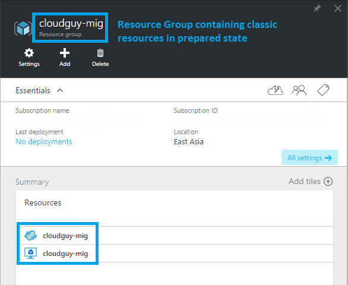
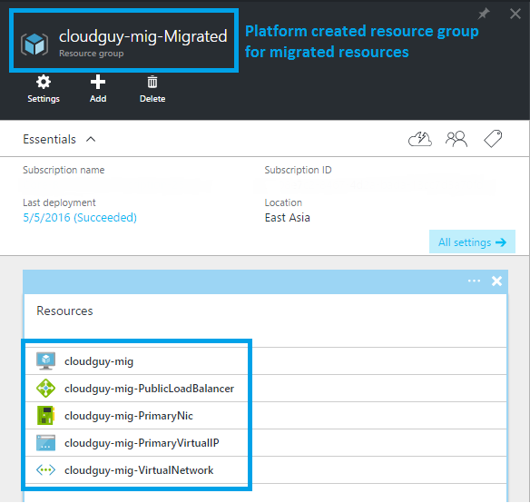

<properties
	pageTitle="Technical deep dive on platform-supported migration from classic to Azure Resource Manager | Microsoft Azure"
	description="This article does a technical deep dive on platform-supported migration of resources from classic to Azure Resource Manager"
	services="virtual-machines-windows"
	documentationCenter=""
	authors="mahthi"
	manager="drewm"
	editor=""
	tags="azure-resource-manager"/>

<tags
	ms.service="virtual-machines-windows"
	ms.workload="infrastructure-services"
	ms.tgt_pltfrm="vm-windows"
	ms.devlang="na"
	ms.topic="article"
	ms.date="05/04/2016"
	ms.author="mahthi"/>

# Technical deep dive on platform-supported migration from classic to Azure Resource Manager

In this article, we do a technical deep dive on migration at a resource and feature level to help you understand how the platform migrates resources from the classic deployment model to the Azure Resource Manager deployment model. For more information, please read the service announcement article: [Platform-supported migration of IaaS resources from classic to Azure Resource Manager](virtual-machines-windows-migration-classic-resource-manager.md).

## Detailed guidance on migration at a resource and feature level

You can find the classic and Resource Manager representations of the resources in the following table. Features and resources not listed in this table are not supported at this time.

| Classic representation                                 | Resource Manager representation                 | Detailed notes                                                                                                                                                                                                                                                                                                                                                                                                                                                    |   |   |
|--------------------------------------------------------|-------------------------------------------------|-------------------------------------------------------------------------------------------------------------------------------------------------------------------------------------------------------------------------------------------------------------------------------------------------------------------------------------------------------------------------------------------------------------------------------------------------------------------|---|---|
| Cloud service name                                     | DNS name                                        | During migration, we create a new resource group for every cloud service with the naming pattern `<cloudservicename>-migrated`. This resource group will contain all the resources. The cloud service name becomes a DNS name that is associated with the public IP address.                                                                                                                                                                                                    |   |   |
| Virtual machine                                        | Virtual machine                                 | VM-specific properties are migrated unchanged. Note that certain osProfile information, like computer name, is not stored in the classic deployment model and remains empty after migration.                                                                                                                                                                                                                                                                |   |   |
| Disk resources attached to VM                          | Implicit disks attached to VM                   | Disks are not modeled as top-level resources in the Resource Manager deployment model. They are migrated as implicit disks under the VM. At this time, we support only disks that are attached to a VM. To enable migration, Resource Manager VMs can now use classic storage accounts. This allows the disks to be easily migrated to the Resource Manager model without any updates. |   |   |
| VM extensions                                          | VM extensions                                   | All the resource extensions, except XML extensions, are migrated from the classic deployment model.                                                                                                                                                                                                                                                                                                                                                                        |   |   |
| Virtual machine certificates                           | Certificates in Azure Key Vault                 | If a cloud service contains service certificates, the platform creates a new Azure key vault per cloud service and moves the certificates into the key vault. The VMs will be updated to reference the certificates from the key vault.                                                                                                                                                                                                                               |   |   |
| WinRM configuration                                    | WinRM configuration under osProfile             | Windows Remote Management configuration is moved unchanged, as part of the migration.                                                                                                                                                                                                                                                                                                                                                                                            |   |   |
| Availability-set property                              | Availability-set resource                       | Availability-set specification was a property on the VM in the classic deployment model. Availability sets become a top-level resource as part of the migration. Note that we don't support the following configuration: multiple availability sets per cloud service, or one or more availability sets along with VMs that are not in any availability set in a cloud service.                                                                                |   |   |
| Network configuration on a VM                          | Primary network interface                       | Network configuration on a VM is represented as the primary network interface resource after migration. For VMs that are not in a virtual network, the internal IP address changes during migration.                                                                                                                                                                                                                                                            |   |   |
| Multiple network interfaces on a VM                    | Network interfaces                              | If a VM had multiple network interfaces associated with it, each network interface becomes a top-level resource as part of the migration in the Resource Manager deployment model, along with all the properties.                                                                                                                                                                                                                                                            |   |   |
| Load-balanced endpoint set                             | Load balancer                                   | In the classic deployment model, the platform assigned an implicit load balancer for every cloud service. During migration, we create a new load-balancer resource, and the load-balancing endpoint set becomes load-balancer rules.                                                                                                                                                                                                                                     |   |   |
| Inbound NAT rules                                      | Inbound NAT rules                               | Input endpoints defined on the VM are converted to inbound Network Access Translation rules under the load balancer during the migration.                                                                                                                                                                                                                                                                                                                                           |   |   |
| VIP address                              | Public IP address with DNS name                 | The virtual IP address becomes a public IP address and is associated with the load balancer.                                                                                                                                                                                                                                                                                                                                                        |   |   |
| Virtual network                                        | Virtual network                                 | The virtual network is migrated, with all its properties, to the Resource Manager deployment model. A new resource group is created with the name `-migrated`. Note the [unsupported configurations](virtual-machines-windows-migration-classic-resource-manager.md).                                                                                                                                                                                                  |   |   |
| Reserved IPs                                           | Public IP address with static allocation method  | Reserved IPs associated with the load balancer are migrated, along with the migration of the cloud service or the virtual machine. Unassociated reserved IP migration is not supported at this time.                                                                                                                                                                                                                                                           |   |   |
| Public IP address per VM                               | Public IP address with dynamic allocation method | The public IP address associated with the VM is converted as a public IP address resource, with the allocation method set to static.                                                                                                                                                                                                                                                                                                                                   |   |   |
| NSGs                                | NSGs                         | Network security groups associated with a subnet are cloned as part of the migration to the Resource Manager deployment model. Note that the NSG in the classic deployment model is not removed during the migration. However, the management-plane operations for the NSG are be blocked when the migration is in progress.                                                                                                                                                                             |   |   |
| DNS servers                                            | DNS servers                                     | DNS servers associated with a virtual network or the VM are migrated as part of the corresponding resource migration, along with all the properties.                                                                                                                                                                                                                                                                                                                    |   |   |
| UDRs                                    | UDRs                             | User-defined routes associated with a subnet are cloned as part of the migration to the Resource Manager deployment model. Note that the UDR in the classic deployment model is not removed during the migration. However, the management-plane operations for the UDR are blocked when the migration is in progress.                                                                                                                                                                             |   |   |
| IP forwarding property on a VM's network configuration | IP forwarding property on the NIC               | The IP forwarding property on a VM is converted to a property on the network interface during the migration.                                                                                                                                                                                                                                                                                                                                                           |   |   |
| Load balancer with multiple IPs                        | Load balancer with multiple public IP resources | Every public IP associated with the load balancer is converted to a public IP resource and associated with the load balancer after migration.                                                                                                                                                                                                                                                                                                       |   |   |
| Internal DNS names on the VM                           | Internal DNS names on the NIC                    | During migration, the internal DNS suffixes for the VM’s are migrated to a read only property named “InternalDomainNameSuffix” on the NIC. The suffix remains unchanged after migration and VM resolution should continue to work as previously.                                                                                                                                                                                                           |   |   |

## Illustration of a simple migration walkthrough

In the following example screenshots, you can see the representation of a cloud service with a VM (not in a virtual network) after the preparation phase.

## Next steps

Now that you understand the migration of classic IaaS resources to Resource Manager, you can start migrating resources.

- [Use PowerShell to migrate IaaS resources from classic to Azure Resource Manager](virtual-machines-windows-ps-migration-classic-resource-manager.md)
- [Use CLI to migrate IaaS resources from classic to Azure Resource Manager](virtual-machines-linux-cli-migration-classic-resource-manager.md)
- [Platform-supported migration of IaaS resources from classic to Azure Resource Manager](virtual-machines-windows-migration-classic-resource-manager.md)
- [Clone a classic virtual machine to Azure Resource Manager by using community PowerShell scripts](virtual-machines-windows-migration-scripts.md)
